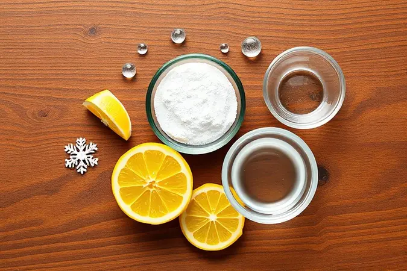
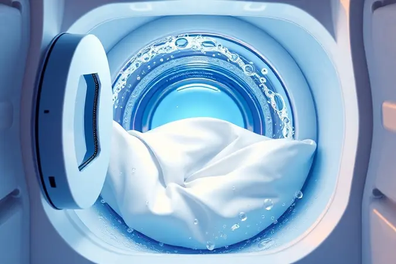
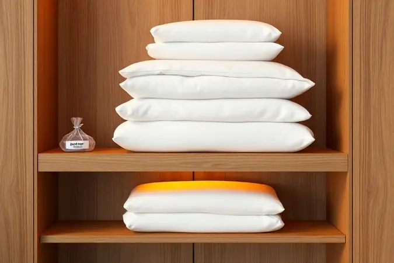

Manter a roupa de cama branca e impecável como a de um hotel parece um desafio impossível, especialmente quando o suor e o tempo começam a deixar aquelas manchas amareladas indesejadas.

Se você já tentou de tudo e seus lençóis continuam com aspecto encardido, você não está sozinho. Neste guia completo, prometemos revelar os segredos profissionais e as melhores misturas caseiras para recuperar a brancura das suas peças sem danificar as fibras.

Você vai aprender desde truques com bicarbonato até como evitar que as roupas amarelem dentro do armário.

<SummaryList products={frontmatter.top_products} />

## O que Causa o Amarelado e o Aspecto Encardido na Roupa de Cama?

Aquelas manchas amareladas que insistem em aparecer nos seus lençóis brancos têm origem em uma combinação de fatores que, felizmente, podemos controlar.

Imagine seu corpo trabalhando durante o sono: suor, óleos naturais e células mortas se acumulam lentamente nas fibras do tecido, criando um convite perfeito para o amarelado.

O que muitos não percebem é que os próprios produtos de limpeza podem ser vilões disfarçados. Detergentes em excesso ou inadequados deixam resíduos invisíveis que, com o tempo, roubam o brilho original do tecido. E aquele hábito de secar ao sol?

Embora pareça inofensivo, a exposição prolongada à luz solar direta pode, ironicamente, contribuir para o amarelamento.

A boa notícia é que entender essas causas é o primeiro passo para reverter a situação. Uma rotina inteligente de lavagem combinada com armazenamento adequado pode transformar seus lençóis de volta àquela brancura radiante que você adora.

## 5 Receitas Caseiras Infalíveis para Desencardir Lençóis Brancos

Antes de recorrer a produtos químicos agressivos, sua cozinha pode guardar as soluções mais eficazes para desencardir lençóis brancos. Essas receitas caseiras não apenas devolvem a brancura, mas também preservam a maciez que torna seus lençóis tão confortáveis.

Vamos explorar cinco métodos testados que funcionam como mágica.

### 1. A Dupla Dinâmica: Bicarbonato de Sódio e Vinagre Branco

<ProductBox 
  title={frontmatter.top_products[0].title} 
  image={frontmatter.top_products[0].image} 
  link={frontmatter.top_products[0].link} 
/>

Esta combinação é como ter um time de limpeza profissional na sua lavanderia. Comece misturando 2 colheres de sopa de bicarbonato com 1 xícara de vinagre branco para cada 5 litros de água morna.

Deixe seus lençóis mergulhados nessa solução por aproximadamente uma hora antes da lavagem normal.

O bicarbonato age como um abrasivo suave que levanta as manchas, enquanto o vinagre dissolve os resíduos de sabão e neutraliza odores indesejados. Importante: sempre use vinagre branco incolor, pois versões coloridas podem manchar ainda mais seus tecidos.

Também evite misturar essa solução com produtos à base de cloro, já que a combinação pode liberar gases desagradáveis.

Para tecidos mais delicados, faça um teste discreto em uma costura ou etiqueta antes de aplicar em toda a peça. O resultado? Lençóis que recuperam não apenas a cor, mas também aquela sensação de frescor que você ama ao deitar.

### 2. O Poder do Vinagre de Álcool no Enxágue Profundo

<ProductBox 
  title={frontmatter.top_products[1].title} 
  image={frontmatter.top_products[1].image} 
  link={frontmatter.top_products[1].link} 
/>

Se o vinagre branco já é útil no molho, imagine seu primo mais versátil, o vinagre de álcool, atuando como seu amaciante natural secreto. Adicionar uma xícara dele durante o ciclo de enxágue faz maravilhas que vão além do clareamento.

Ele possui propriedades antibacterianas naturais que eliminam odores persistentes, aqueles que parecem resistir a todas as lavagens. Mas seu verdadeiro talento está na capacidade de remover completamente os resíduos de detergente que deixam os tecidos ásperos e opacos.

Para potencializar ainda mais o efeito clareador, você pode criar uma solução pré-lavagem com partes iguais de vinagre de álcool e água morna. Aplique diretamente nas áreas mais amareladas e deixe agir por 15 minutos antes da lavagem normal.

É econômico, sustentável e transforma a rotina de lavagem em um ritual de cuidados genuínos com suas roupas de cama.

### 3. Água Oxigenada: O Segredo para Manchas de Suor e Sangue

<ProductBox 
  title={frontmatter.top_products[2].title} 
  image={frontmatter.top_products[2].image} 
  link={frontmatter.top_products[2].link} 
/>

Quando manchas específicas como suor intenso ou pequenos acidentes com sangue desafiam seus métodos habituais, a água oxigenada entra em cena como uma heroína discreta.

Opte sempre pela versão de 10 volumes, já que concentrações mais altas podem ser agressivas para as fibras do tecido.

Aplique diretamente sobre a mancha e observe a formação de espuma: esse é o sinal claro de que o produto está trabalhando para decompor as proteínas que causam a descoloração.

Para aquelas manchas de suor que parecem ter se instalado permanentemente, experimente uma mistura especial: 1 colher de sopa de detergente neutro, 2 colheres de água oxigenada e 1 colher de suco de limão fresco.

O limão potencializa o poder clareador enquanto o detergente ajuda a emulsionar as gorduras.

Diferente dos alvejantes tradicionais à base de cloro, que podem deixar um tom amarelado residual, a água oxigenada trabalha preservando a integridade das fibras, garantindo que seus lençóis permaneçam brancos e macios por muito mais tempo.

### 4. Técnica do Sabão de Coco com Exposição ao Sol (Quarar)

<ProductBox 
  title={frontmatter.top_products[3].title} 
  image={frontmatter.top_products[3].image} 
  link={frontmatter.top_products[3].link} 
/>

Às vezes, as soluções mais antigas são as que oferecem resultados mais impressionantes. A técnica do quarar combina a suavidade do sabão de coco com o poder natural da luz solar para criar um efeito clareador que parece mágico.

O sabão de coco, com suas propriedades desengordurantes naturais, limpa profundamente sem agredir as fibras mais delicadas.

É tão suave que muitos pais o escolhem para as roupas de bebê, mas seus benefícios se estendem perfeitamente aos lençóis adultos que precisam de cuidados especiais.

Depois de lavar com sabão de coco, estenda seus lençóis sob a luz solar direta. A combinação da limpeza profunda com os raios ultravioleta cria um efeito branqueador natural que também elimina odores e bactérias de forma completamente ecológica.

Apenas lembre-se: essa técnica funciona melhor em dias ensolarados, então aproveite aquela manhã luminosa para renovar suas peças favoritas.

### 5. Alvejante sem Cloro para Manchas Persistentes sem Amarelar

<ProductBox 
  title={frontmatter.top_products[4].title} 
  image={frontmatter.top_products[4].image} 
  link={frontmatter.top_products[4].link} 
/>

Quando as manchas resistem até às soluções caseiras mais criativas, os alvejantes sem cloro surgem como a alternativa profissional que você pode ter em casa.

Produtos como o Alvejante Sem Cloro Point e o Barbarex foram desenvolvidos especificamente para atacar sujeiras difíceis sem o efeito colateral do amarelamento.

A grande vantagem desses produtos está na sua capacidade de tratar manchas persistentes sem reagir com os resíduos orgânicos que causam aquela tonalidade amarelada tão frustrante.

Eles podem ser usados tanto no ciclo normal de lavagem quanto em pré-tratamentos diretos nas áreas mais comprometidas.

Para garantir os melhores resultados, sempre verifique as instruções específicas do fabricante e faça um teste discreto em uma área menos visível.

Quando usado corretamente, você terá a eficácia de um produto profissional com a segurança de saber que suas fibras preciosas estão protegidas.

## O Perigo da Água Sanitária: Por que Ela Pode Piorar o Amarelado?

Aquela garrafa de água sanitária parece uma solução óbvia para lençóis amarelados, mas aqui está o segredo que poucos conhecem: ela pode ser exatamente o que está piorando seu problema.

O cloro presente na água sanitária reage quimicamente com os resíduos de gordura, proteínas e suor acumulados nas fibras, criando compostos que intensificam o tom amarelado.

Pense nisso como tentar apagar um incêndio com gasolina. A exposição repetida ao cloro também enfraquece gradualmente as fibras do tecido, tornando seus lençóis mais frágeis e suscetíveis a rasgos prematuros.

É por isso que tantas pessoas se frustram ao ver seus esforços resultando em peças ainda mais amareladas e desgastadas.

A alternativa? Volte às receitas caseiras que mencionamos ou opte por alvejantes oxigenados específicos para tecidos.

Essas soluções trabalham com a química do seu tecido, não contra ela, garantindo que a brancura retorne sem sacrificar a durabilidade que você espera de bons lençóis.

## Passo a Passo: Como Lavar Roupa de Cama na Máquina Corretamente

Agora que você conhece os segredos para tratar manchas específicas, vamos construir uma rotina de lavagem que previne o amarelado desde o início. Tudo começa com uma separação inteligente: brancos com brancos, coloridos com coloridos.

Essa simples etapa evita transferências de cor que podem comprometer aquela brancura imaculada que você tanto busca.

Para lençóis brancos, a água fria ou morna é sua melhor aliada, preservando as fibras enquanto remove sujeiras. Já para peças coloridas, a água quente ajuda a fixar as cores e eliminar ácaros com mais eficiência.

Escolha sempre ciclos suaves e detergentes específicos para tecidos delicados, evitando sobrecarregar a máquina para que cada peça receba a atenção que merece.

## Como Desencardir Lençol Colorido sem Desbotar as Cores

Lençóis coloridos apresentam um desafio especial: como recuperar o brilho sem sacrificar as tonalidades que você escolheu com tanto cuidado? A resposta está em tratamentos direcionados que respeitam a química das fibras coloridas.

Comece com um banho de 30 minutos em água morna misturada com detergente neutro. Esse amolecimento inicial prepara as fibras para o tratamento sem agredi-las.

Durante o enxágue final, adicione uma xícara de vinagre branco, que atua como um fixador natural de cores enquanto remove resíduos que causam opacidade.

Para um reforço extra no clareamento, meia xícara de bicarbonato de sódio na lavagem regular pode fazer maravilhas sem comprometer as cores. O truque mais importante? Sempre, sempre faça um teste em uma área discreta antes de aplicar qualquer produto em todo o lençol.

Essa precaução de um minuto pode salvar suas peças favoritas de desbotamentos irreversíveis.

## Dicas de Especialista para Evitar que a Roupa Guardada Amarele no Armário

Você já limpou seus lençóis perfeitamente, só para encontrá-los amarelados meses depois no armário? Essa frustração tem solução. O segredo está em transformar seu armário em um santuário que protege, não prejudica, suas peças.

Armazene sempre em locais frescos e bem ventilados, longe da umidade que favorece o amarelamento. As capas protetoras não são apenas organizadores, são escudos contra poeira, umidade e insetos que podem danificar as fibras com o tempo.

### Melhores Organizadores de TNT para Respiração do Tecido

<ProductBox 
  title={frontmatter.top_products[6].title} 
  image={frontmatter.top_products[6].image} 
  link={frontmatter.top_products[6].link} 
/>

Entre as opções disponíveis, os organizadores de TNT (Tecido Não Tecido) se destacam por oferecer proteção sem sufocar suas peças.

Modelos com visor transparente e fechamento em zíper permitem que você localize rapidamente o que precisa sem expor todo o conteúdo à poeira.

As caixas organizadoras com tampa oferecem proteção extra contra umidade e traças, criando uma barreira física enquanto permitem alguma respiração. Já as colmeias organizadoras são perfeitas para itens menores, embora deva-se observar a durabilidade dos materiais.

O que realmente importa é escolher organizadores que equilibrem proteção com ventilação adequada. Seus lençóis precisam respirar, mesmo guardados, para manter aquela frescura que faz toda a diferença quando você finalmente os usa novamente.

## Erros Comuns que Deixam seus Lençóis Cinzentos ou Ásperos

Às vezes, o que fazemos na tentativa de cuidar melhor é exatamente o que causa os problemas.

O excesso de detergente é o primeiro pecado capital da lavanderia: mais espuma não significa mais limpeza, significa mais resíduos que se acumulam nas fibras, tornando-as ásperas e opacas.

A temperatura da água é outra armadilha comum. Embora a água quente pareça mais higiênica, para lençóis brancos ela pode danificar as fibras e acelerar o desbotamento. Opte por água morna ou fria, preservando a estrutura do tecido enquanto remove sujeiras.

E a secadora? Aquela aliada prática pode se tornar uma vilã quando usada em temperaturas muito altas. O calor extremo encolhe fibras, causa rugas permanentes e pode até amarelar tecidos com o tempo.

Sempre que possível, prefira a secagem ao ar livre ou use a secadora no modo mais suave possível.

## Perguntas Frequentes (FAQ) sobre Lavagem de Roupa de Cama

Algumas dúvidas surgem tão frequentemente que merecem respostas diretas. Com que frequência devo lavar meus lençóis? O ideal é a cada uma ou duas semanas, mas se você transpira bastante ou tem alergias, essa frequência pode aumentar para garantir seu conforto e saúde.

E a temperatura ideal da água? Embora a água quente elimine mais bactérias e ácaros, sempre consulte a etiqueta do fabricante. Muitos tecidos modernos se beneficiam mais da água morna, que limpa profundamente sem comprometer a durabilidade.

Por último, a secagem completa é não negociável. Lençóis levemente úmidos guardados no armário são convites para mofo e odores que podem arruinar meses de cuidados.

Seque sempre completamente, preferencialmente ao ar livre quando possível, para preservar aquela sensação fresca que transforma uma noite de sono comum em um verdadeiro descanso.

## Conclusão

Recuperar a brancura imaculada dos seus lençóis não é apenas uma questão de estética, é sobre resgatar aquela sensação especial de hotel que transforma o sono comum em uma experiência de luxo.

As manchas amareladas que pareciam permanentes agora têm solução, desde a simplicidade do bicarbonato com vinagre até a eficácia controlada dos alvejantes sem cloro.

O verdadeiro segredo, porém, vai além das receitas. Está na compreensão de que cada etapa, desde a separação das peças até o armazenamento final, contribui para preservar a beleza e maciez que tornam seus lençóis tão especiais.

Quando você entende por que as manchas aparecem, aprende a preveni-las naturalmente, criando uma rotina que protege seu investimento em descanso de qualidade.

Comece hoje mesmo experimentando uma das receitas caseiras. Escolha o método que melhor se adapta ao grau de amarelamento dos seus lençóis e testemunhe a transformação.

Em poucas horas, você terá de volta não apenas a cor branca radiante, mas também a confiança de saber que pode manter essa perfeição com gestos simples e eficazes.

Seu sono merece esse cuidado, e seus lençóis estão prontos para retribuir cada atenção com noites ainda mais aconchegantes.