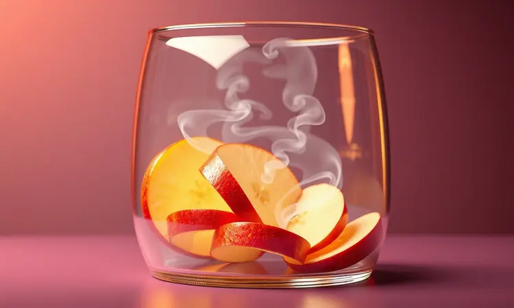
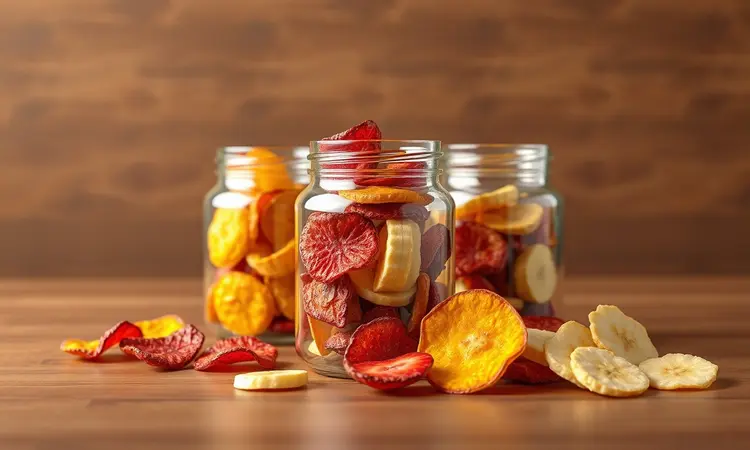
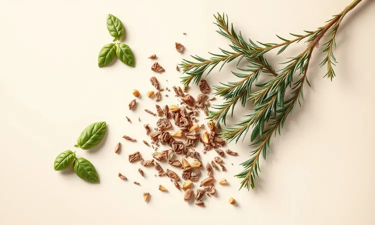

Imagine abrir seu armário e encontrar não pacotes de chips industrializados, mas suas próprias maçãs desidratadas, o tomate seco feito por você e aquele mix de ervas que você sabe exatamente como temperou. Tudo pronto para transformar qualquer refeição.

Essa é a promessa do botão 'Desidratar' da sua Air Fryer Oven, mas talvez você ainda não tenha explorado todo seu potencial.

Se você busca uma alimentação mais saudável, quer evitar o desperdício ou simplesmente ama descobrir sabores concentrados, prepare-se para uma jornada culinária que vai muito além de fritar sem óleo.

<SummaryList products={frontmatter.top_products} />

## O Que Exatamente é a Função Desidratar na Air Fryer Oven?

Pense em transformar frutas suculentas em chips crocantes, ou ervas frescas em potes de tempero que duram meses. A função desidratar trabalha com calor gentil e circulação de ar para remover apenas a umidade, preservando o que realmente importa: sabor e nutrientes.

É como fazer com que a essência de cada alimento se concentre, criando versões mais intensas e duradouras dos ingredientes que você já ama.

### A Diferença Entre Fritar sem Óleo e Desidratar

Enquanto fritar sem óleo cria aquela crocância instantânea que imita uma fritura, desidratar é uma dança mais lenta e cuidadosa. Uma técnica usa calor intenso para cozinhar rapidamente, a outra utiliza temperaturas baixas para preservar pacientemente.

Você não está cozinhando, está concentrando. O resultado não é um alimento pronto para comer imediatamente, mas sim uma forma concentrada que você pode guardar e usar por meses, intensificando sabores em cada receita futura.

## Por Que Vale a Pena Desidratar Alimentos em Casa?

Você já abriu um pacote de chips de frutas e viu aquela lista interminável de ingredientes com nomes químicos? Quando você desidrata em casa, o único nome na embalagem é o seu.

Controle total sobre o que entra na sua comida significa dizer adeus aos conservantes e aditivos e olá para snacks que nutrem de verdade.

Além do benefício óbvio da saúde, há uma economia sutil: você transforma aquelas bananas que amadureceram rápido demais em chips deliciosas, ou resgata as ervas do fim da semana antes que murchem.

E então há a personalização - que tal tomates secos com o mix exato de especiarias que sua família adora?

## Melhores Modelos de Air Fryer Oven com Função Desidratar

<ProductBox 
  title={frontmatter.top_products[0].title} 
  image={frontmatter.top_products[0].image} 
  link={frontmatter.top_products[0].link} 
/>

Para quem quer começar essa jornada com o pé direito, alguns modelos fazem a diferença. A Mondial Air Fryer Forno Oven 12L oferece precisão digital para quem gosta de exatidão.

Já o Philco Air Fryer Oven 12L PFR2200P apresenta um controle de temperatura que vai dos 30°C aos 80°C, perfeito para descobrir o ponto ideal para cada alimento.

E para quem valoriza design e durabilidade, o Oster Oven Fryer 12L 3 em 1 combina aço inox com controles intuitivos.

A verdade é que os melhores modelos oferecem uma precisão que parece exagerada no início - quem precisa desidratar por até 24 horas?

Mas quando você descobre que pode transformar carne em jerky perfeito ou criar o tomate seco mais concentrado, percebe que essa possibilidade abre portas para experimentos que você nem imaginava.

## Passo a Passo: Como Usar a Função Desidratar como um Profissional

Dominar essa função é mais sobre paciência e técnica do que sobre habilidades culinárias avançadas. Comece com ingredientes de qualidade, corte com atenção, organize com cuidado e confie no tempo certo.

### 1. O Corte: A Importância da Uniformidade (e o Uso do Mandoline)

<ProductBox 
  title={frontmatter.top_products[1].title} 
  image={frontmatter.top_products[1].image} 
  link={frontmatter.top_products[1].link} 
/>

Chips que são crocantes em algumas partes e moles em outras acontecem quando os cortes não são uniformes. Um mandoline pode ser seu melhor aliado aqui, garantindo que cada fatia de maçã ou abobrinha tenha exatamente a mesma espessura.

Isso não é apenas estética - é garantia de que toda a sua fornada ficará pronta ao mesmo tempo, perfeita e crocante. Os modelos mais seguros vêm com protetores, transformando uma operação que poderia ser arriscada em algo tranquilo e eficiente.

### 2. Preparo Prévio: O Segredo para Manter a Cor dos Alimentos

Ninguém quer batata doce desidratada que parece comida de plástico. O segredo para manter aquelas cores vibrantes está no cuidado prévio. Para vegetais como cenoura e beterraba, um rápido banho em água acidificada com limão funciona como um fixador natural.

O importante é entender que você está preservando a beleza natural dos alimentos, não apenas sua durabilidade.

### 3. Organização nas Grelhas: Otimizando o Fluxo de Ar

Imagine o ar quente da sua Air Fryer como um rio que precisa fluir livremente. Quando você amontoa os alimentos, cria barreiras que impedem essa circulação, resultando em partes úmidas e partes queimadas.

O truque é pensar em espaçamento - cada fatia precisa de seu próprio território de ar. Assim, você cria chips que são consistentemente crocantes, sem pontos moles ou queimados.

### 4. Ajuste de Tempo e Temperatura: O Guia das Baixas Temperaturas

Aqui está onde a magia realmente acontece. Enquanto fritar pode exigir 200°C, desidratar funciona na faixa dos 50°C aos 70°C. É um calor gentil que evapora a umidade sem cozinhar, preservando enzimas e nutrientes que temperaturas mais altas destruiriam.

Pense nisso como deixar seu alimento tomar sol lentamente, concentrando seu sabor essencial. O tempo varia - maçãs podem levar 6 horas, enquanto ervas precisam de apenas 2-3 horas. Sua paciência será recompensada em sabor.

## O Que Desidratar? Tabela de Tempos e Ideias Criativas

A verdadeira diversão começa quando você percebe que quase tudo pode passar pela desidratação. De frutas da estação a sobras de legumes, transformar o que você já tem em snacks duradouros se torna um jogo criativo.

### Chips de Frutas: Maçã, Banana, Manga e Morango

Comece com as frutas que você já conhece. Maçãs viram chips levemente adocicadas que são perfeitas para lanches. Bananas transformam-se em tirinhas crocantes que lembram doce. Mangas ganham uma intensidade tropical surpreendente. E morangos?

Eles se tornam joias rubi que derretem na boca com concentração de sabor. Essas não são apenas alternativas saudáveis aos doces - são novas formas de experimentar frutas que você já ama.

### Vegetais e Legumes: Tomate Seco e Chips de Abobrinha

Aqui a simplicidade é chave. Tomates cortados em rodelas, com um fio de azeite e ervas, transformam-se em explosões de umami que elevam qualquer salada ou massa.

Abobrinhas viram chips que desafiam qualquer versão de pacote - leves, crocantes e completamente personalizáveis nos temperos. E o melhor: você sabe exatamente o que está comendo.

### Proteínas: Como Fazer Beef Jerky (Carne Seca) Caseiro

Transformar carne em jerky caseiro é como descobrir um superpoder culinário. Escolha cortes magros, marine com seus temperos favoritos (experimente molho de soja, alho e um toque de mel), e deixe a Air Fryer trabalhar sua magia por 4-6 horas em temperatura baixa.

O resultado é um snack proteico sem conservantes, perfeito para viagens, trabalho ou simplesmente quando aquela fome aparece.

### Ervas e Temperos: Manjericão, Salsinha e Alecrim Sempre Prontos

Quantas vezes você comprou um pé de manjericão que estragou antes de usar tudo? A desidratação resolve isso elegantemente. Ervas frescas mantêm seu aroma e sabor quando desidratadas adequadamente, prontas para transformar um prato simples em algo especial meses depois.

É como capturar o verão em um pote.

## Como Armazenar Alimentos Desidratados para Manter a Crocância

<ProductBox 
  title={frontmatter.top_products[2].title} 
  image={frontmatter.top_products[2].image} 
  link={frontmatter.top_products[2].link} 
/>

Depois de tanto cuidado no processo, proteger seu tesouro é essencial. Recipientes herméticos são seus melhores amigos - vidro é ideal porque não guarda sabores e deixa você admirar suas criações.

Guarde em locais frescos e escuros, e considere adicionar pacotes dessecantes para aqueles itens que você quer guardar por meses.

A regra de ouro: espere o alimento esfriar completamente antes de armazenar, ou o vapor residual criará umidade que destrói toda a crocância.

## 5 Erros Comuns que Você Deve Evitar ao Desidratar Alimentos

1. Amontoar na pressa - espaço entre os alimentos não é luxo, é necessidade

2. Ignorar os tempos recomendados - cada alimento tem seu ritmo natural

3. Pular o preparo adequado - cortes irregulares são inimigos da perfeição

4. Usar temperatura errada - muito alta queima, muito baixa não desidrata

5. Armazenar ainda morno - essa umidade residual é uma traição ao seu trabalho

## Perguntas Frequentes (FAQ)

### A função desidratar consome muita energia elétrica?

Como trabalha em temperaturas mais baixas e por períodos mais longos, é natural a preocupação. A boa notícia é que as Air Fryers são mais eficientes que fornos convencionais.

Pense nisso como usar uma lâmpada de baixo consumo por mais tempo - sim, há um custo, mas considerando que você está substituindo snacks industrializados mais caros e criando alimentos que duram meses, a economia se equilibra.

### Posso usar uma Air Fryer de cesto comum para desidratar?

Sim, mas com um aviso amoroso: você precisará de mais atenção. Sem os controles específicos de temperatura baixa de alguns modelos Oven, você terá que monitorar mais de perto e possivelmente fazer ajustes manuais.

É como dirigir um carro manual quando você está acostumado ao automático - funciona, mas exige mais consciência.

### Quanto tempo dura um alimento desidratado em casa?

Quando armazenado corretamente (hermético, fresco, escuro), frutas e legumes podem durar de 6 meses a um ano. Carnes como jerky mantêm-se por 1-2 meses na geladeira.

O truque é rotular com a data - não por paranoia, mas porque assim você sabe quando chegou a hora de fazer uma nova fornada da sua criação favorita.

## Conclusão

Vale a pena investir na desidratação caseira? A resposta está na sua primeira fornada de maçãs crocantes que desaparecem em minutos, ou no pote de tomates secos que transforma seu macarrão de terça-feira em uma refeição especial.

Mais do que uma técnica culinária, é uma forma de reconectar com a comida - entender suas texturas, concentrar seus sabores, reduzir desperdícios.

Você não está apenas apertando um botão na sua Air Fryer Oven. Está aprendendo uma linguagem ancestral de preservação, adaptada para sua cozinha moderna.

Cada fruta desidratada é uma pequena vitória contra o desperdício, cada tempero caseiro é um afastamento dos industrializados, cada lanche pronto é uma declaração de autonomia alimentar.

Como qualquer habilidade nova, comece simples - uma fornada de maçãs, talvez algumas ervas. Observe como o processo funciona, como os sabores se transformam.

Logo você estará olhando para cada fruta na fruteira, cada vegetal na geladeira, não apenas como ingredientes para agora, mas como possibilidades para depois.

Sua Air Fryer Oven não é mais apenas um aparelho para fritar sem óleo - é seu portal para um mundo onde a comida pode durar, intensificar e surpreender. E tudo começa com um simples botão chamado 'Desidratar'.