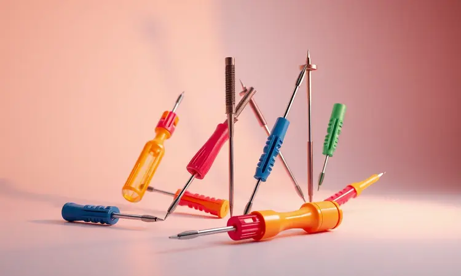
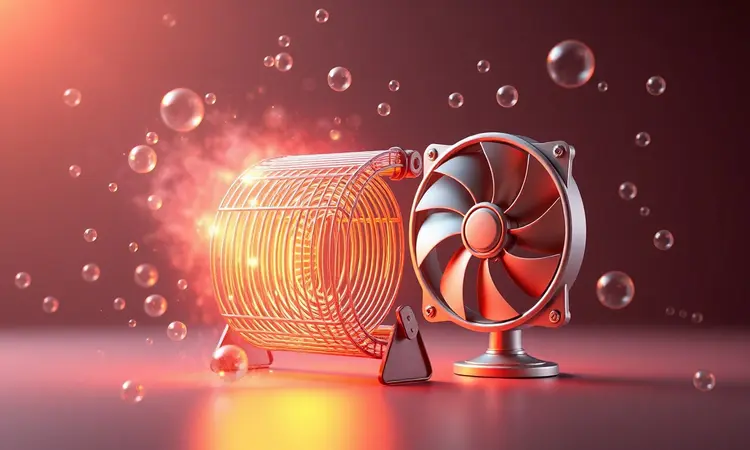

Você já percebeu que, com o tempo, sua air fryer começa a soltar fumaça ou um cheiro persistente de gordura queimada?

Limpar a cesta é fácil, mas o verdadeiro acúmulo de sujeira acontece na resistência e na ventoinha, locais que só podem ser acessados com a abertura do aparelho.

Neste guia, você aprenderá como desmontar sua air fryer com segurança, preservando as travas plásticas e garantindo que todos os componentes voltem ao lugar corretamente.

Vamos cobrir desde as ferramentas necessárias até os segredos específicos de marcas como Mondial e Philco, permitindo uma limpeza ou manutenção de nível profissional sem sair de casa.

Mas antes de começar, vamos entender por que esse trabalho interno é mais do que uma simples limpeza.

Imagine recuperar o desempenho original do seu aparelho, eliminando aquela fumaça que estraga o sabor dos alimentos e garantindo que cada refeição seja preparada de maneira saudável.

Desmontar sua air fryer periodicamente (recomendamos pelo menos uma vez por mês para quem usa diariamente) não é apenas uma questão de higiene, é um ato de cuidado com seu investimento.

Quando você nota que o aquecimento não está mais uniforme ou que o tempo de cocção aumentou, pode ser que resíduos estejam bloqueando a circulação de ar. Abrir o aparelho se torna então uma solução, não um problema.

<SummaryList products={frontmatter.top_products} />

## Segurança em primeiro lugar: O que fazer antes de abrir o aparelho

Pense neste momento como um ritual de preparação. Primeiro, desconecte o aparelho da tomada e espere ele esfriar completamente. Não subestime o calor residual, aquela sensação de segurança ao manusear peças em temperatura ambiente faz toda diferença.

Escolha uma superfície plana e estável, como sua mesa da cozinha, e organize ao redor todas as ferramentas que você vai precisar. Verifique se não há resíduos soltos que possam causar curtos ou incêndios.

Se sentir que precisa de uma proteção extra, luvas finas podem ajudar, especialmente ao lidar com bordas mais afiadas. E aqui vai o segredo que muitos ignoram: tire fotos com seu celular a cada etapa. Quando for remontar, essas imagens serão seu mapa do tesouro.

## Ferramentas essenciais para a desmontagem

Você não precisa de uma oficina profissional, mas algumas ferramentas certas transformam um trabalho árduo em uma experiência tranquila. O básico inclui chaves de fenda, uma pinça para pegar parafusos minúsculos e, dependendo do modelo, um alicate de bico fino.

O que realmente muda o jogo são as ferramentas projetadas para esse tipo de tarefa.

### Jogo de Chaves de Fenda e Philips Magnéticas

<ProductBox 
  title={frontmatter.top_products[0].title} 
  image={frontmatter.top_products[0].image} 
  link={frontmatter.top_products[0].link} 
/>

Essas serão suas melhores amigas durante todo o processo. A ponta magnética parece um detalhe, mas é ela que evita aquela cena clássica: o parafuso caindo dentro do aparelho e você passando quinze minutos tentando recuperá-lo com uma pinça.

Conjuntos de qualidade, feitos com aço Cromo Vanádio, oferecem durabilidade e precisão. Alguns até vêm com isolamento elétrico, uma camada extra de segurança quando você está trabalhando próximo à fiação interna.

Imagine a facilidade de manter o parafuso preso à ponta da chave enquanto você o posiciona exatamente no lugar certo.

### Kit de Espátulas de Nylon para abrir carcaças

<ProductBox 
  title={frontmatter.top_products[1].title} 
  image={frontmatter.top_products[1].image} 
  link={frontmatter.top_products[1].link} 
/>

Esta é a ferramenta que separa os iniciantes dos experientes. Ao tentar abrir as travas plásticas da carcaça, a tentação é usar uma chave de fenda metálica, mas é aí que surgem os riscos e danos permanentes.

As espátulas de nylon foram criadas para deslizar entre as fendas e pressionar os mecanismos de trava sem marcar o plástico. Alguns kits oferecem versões antiestáticas, perfeitas para quando você precisa acessar componentes eletrônicos sensíveis.

Pense nelas como extensões dos seus dedos, projetadas para fazer o trabalho delicado que suas unhas nunca conseguem.

## Passo a Passo Geral: Como desmontar quase qualquer modelo

Com as ferramentas em mãos, chegou a hora do verdadeiro desafio. O processo geral segue uma lógica que se aplica à maioria dos modelos, criando uma base de confiança antes de enfrentarmos as particularidades de cada marca.

### 1. Removendo os botões de controle e o painel frontal

Pare por um momento e observe o painel frontal. Em vez de vê-lo como uma peça única, visualize os botões como portas que guardam o acesso ao interior. Localize os pequenos parafusos que fixam essa estrutura.

Com a chave magnética apropriada, solte cada um com movimentos firmes mas suaves. Agora vem a parte que requer paciência: antes de puxar o painel, verifique se há conectores ou fios presos atrás dele.

Muitos modelos têm cabos curtos que ligam os botões à placa principal. Use seus dedos ou a espátula de nylon para desconectar cuidadosamente cada um. Sinta a satisfação quando o painel se soltar completamente, revelando o mundo interno que estava escondido.

### 2. Localizando e soltando os parafusos ocultos (pés e alças)

Os fabricantes adoram esconder parafusos em lugares criativos. Vire sua air fryer de cabeça para baixo e examine os pés de borracha. Muitas vezes, esses pés são na verdade tampas que você pode puxar para fora, revelando parafusos estratégicos.

As alças laterais também guardam segredos, frequentemente com pequenas peças plásticas que se encaixam sobre os parafusos. Sua pinça será útil aqui para remover essas coberturas sem danificá-las.

À medida que cada parafuso oculto é revelado, você começa a entender a inteligência do design, e o aparelho deixa de ser uma caixa misteriosa para se tornar um quebra-cabeça compreensível.

### 3. O segredo das travas plásticas: Como desencaixar sem quebrar

Este é o momento que mais causa ansiedade, mas também o mais gratificante quando feito corretamente. As travas plásticas são como abraços que mantêm a carcaça unida. A força bruta é sua inimiga, a técnica é sua aliada.

Com a espátula de nylon, insira a ponta delicadamente na fenda entre as partes da carcaça. Em vez de fazer alavanca, pressione suavemente na direção onde você imagina que o mecanismo de trava está localizado.

Muitas vezes você sentirá um pequeno "clique" quando a trava ceder. Se encontrar resistência, pare. Respire. Procure por outra trava que ainda esteja engatada. Cada trava que você solta sem danificar é uma pequena vitória que preserva a integridade do seu aparelho.

## Guia Específico: Como desmontar Air Fryer Mondial

A Mondial tem sua personalidade própria. O processo começa de maneira similar, mas com um detalhe que facilita muito: muitos modelos têm uma placa de acesso na base que se destaca após a remoção de apenas dois ou três parafusos.

Ao retirar essa placa, você encontra não apenas a ventoinha, mas também uma organização interna que parece feita para manutenção doméstica. Os componentes são dispostos de forma lógica, com espaço para suas ferramentas.

Durante a remontagem, preste atenção especial ao encaixe da bandeja coletora de gordura, que às vezes precisa de um alinhamento específico. Organizar as peças em uma toalha na ordem da desmontagem transforma o processo em uma experiência quase terapêutica.

## Dicas para modelos Philco e Britânia: O que muda?

Cada marca joga um jogo diferente. Os modelos Philco frequentemente surpreendem com um design intuitivo onde as peças parecem se encaixar por magnetismo, mas atenção: alguns usam parafusos com cabeças menos comuns.

Verifique se você tem a ponta de chave correta antes de começar. Já as Britânias tendem a apostar em sistemas de travamento mais robustos, que dão uma sensação de segurança extra, mas podem exigir um pouco mais de firmeza (não força) na abertura.

Em ambos os casos, o princípio é o mesmo: desconexão total da tomada, resfriamento completo e aquele ritual fotográfico que mencionamos. O manual do usuário, quando disponível, pode revelar dicas específicas sobre pontos de pressão ou sequências ideais de remoção.

## Limpeza Profunda: Como higienizar a resistência e a ventoinha

Agora você finalmente tem acesso àquela resistência que parecia inacessível. Diante de você está o coração do aparelho, muitas vezes coberto por uma camada de gordura carbonizada que estava roubando eficiência e alterando sabores.

Use um pano macio umedecido com detergente neutro, evitando produtos abrasivos que possam danificar o revestimento. Para a ventoinha, a pinça ajuda a remover fiapos e partículas presas entre as pás.

A sensação ao ver a resistência brilhando novamente é comparável à de trocar o filtro de um carro e sentir o motor responder melhor. Esta é a recompensa tangível do seu trabalho.

### Desengordurante de Alta Performance para Air Fryers

<ProductBox 
  title={frontmatter.top_products[2].title} 
  image={frontmatter.top_products[2].image} 
  link={frontmatter.top_products[2].link} 
/>

Para situações onde a gordura se transformou em uma camada resistente, produtos especializados podem ser aliados valiosos. A Espuma Mágica Limpa Air Fryer & Grelha, por exemplo, age penetrando e dissolvendo depósitos carbonizados sem agredir o antiaderente.

O WAP Limpa Air Fryer usa uma fórmula alcalina que quebra as moléculas de gordura em nível químico. Lembre-se que fórmulas muito agressivas podem, com o tempo, afetar alguns acabamentos.

Para uma manutenção regular, soluções naturais como vinagre branco aquecido com bicarbonato ainda oferecem resultados impressionantes. Escolha conforme a necessidade: produto específico para a limpeza pesada mensal, soluções caseiras para a manutenção semanal.

## Erros comuns que você deve evitar ao montar o aparelho novamente

A remontagem é onde a paciência é realmente testada. O erro mais comum é assumir que você se lembrá de como tudo se encaixa. Suas fotos são seu guia, ignore essa etapa e você pode acabar com peças sobrando (ou pior, faltando).

Verifique cada encaixe com cuidado, sentindo se há uma fixação firme, não forçada. Preste atenção especial à orientação da ventoinha, que em muitos modelos só funciona em uma direção específica.

E resista à tentação de apertar parafusos com força excessiva, o plástico das carcaças não perdoa torques muito altos. A montagem cuidadosa garante que seu aparelho não apenas funcione, mas funcione em silêncio, sem vibrações ou folgas.

## Quando desistir do DIY e procurar uma assistência técnica autorizada

Reconhecer seus limites é uma forma de sabedoria, não de derrota. Se durante o processo você encontra fiações expostas com isolamento danificado, componentes da placa eletrônica queimados, ou qualquer sinal de problema elétrico complexo, esta é a hora de parar.

Da mesma forma, se você sente que não tem as ferramentas adequadas para uma etapa específica (alguns modelos usam parafusos de segurança especiais), continuar pode causar mais danos.

Uma assistência técnica autorizada não é um gasto, é um investimento na segurança da sua família e na durabilidade do aparelho. Eles possuem peças de reposição, equipamentos de teste e experiência com falhas recorrentes de cada modelo.

## Perguntas Frequentes (FAQ) sobre manutenção de Air Fryers

Essas são as dúvidas que surgem quando a teoria encontra a prática:

Com que frequência devo fazer essa limpeza interna profunda?
Para uso diário, uma vez por mês. Para uso esporádico, a cada três meses. O sinal mais claro é o cheiro de gordura queimada durante o pré-aquecimento.

Posso lavar alguma parte interna com água?
Absolutamente não. Use sempre panos úmidos bem torcidos. Água dentro do compartimento elétrico é receita para curtos-circuitos.

Que produtos evito na limpeza interna?
Creme de limpeza com partículas abrasivas, palhas de aço (por mais óbvio que pareça) e produtos com cloro ativo, que podem danificar componentes plásticos e metálicos.

## Conclusão

Olhe para sua air fryer agora. Ela não é mais apenas um eletrodoméstico que frita alimentos sem óleo, é um sistema que você compreende, cujos segredos você domina.

A jornada da limpeza superficial para a manutenção profunda transforma sua relação com o objeto: de usuário passivo para cuidador ativo.

Cada parafuso descoberto, cada trava aberta sem danos, cada componente limpo e reinserido com precisão representa não apenas uma air fryer mais eficiente, mas a confiança de saber que você é capaz de cuidar do que é seu.

O cheiro de gordura queimada desaparece, o tempo de cocção volta ao normal, o aquecimento se uniformiza. Mas mais importante que esses benefícios práticos é a satisfação silenciosa que vem com a autossuficiência.

Você não precisa depender de terceiros para manter seu aparelho em perfeito estado, nem se resignar a comprar um novo quando a sujeira se acumula nos lugares inacessíveis.

Da próxima vez que sua air fryer começar a soltar aquela fumaça característica, em vez de sentir frustração, você terá um plano claro.

As ferramentas estarão à mão, os passos serão familiares, e o processo que antes parecia intimidador se tornará uma rotina de manutenção empoderadora. Pega suas chaves magnéticas, respira fundo e lembra: você já fez isso antes, e vai fazer ainda melhor agora.