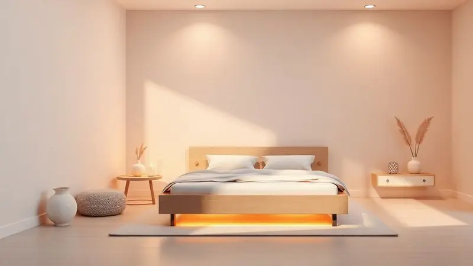
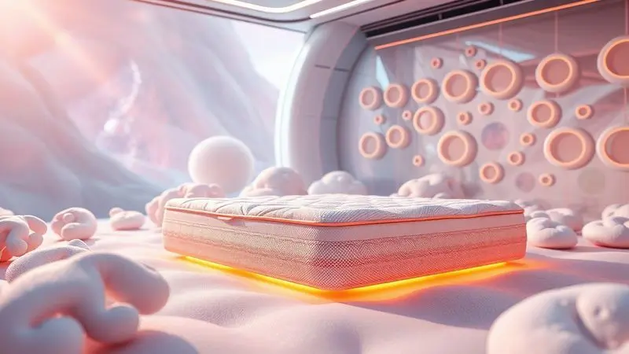

Escolher a cama certa é o primeiro passo para garantir noites de sono realmente revigorantes. Com tantas opções de tamanhos e materiais, a dúvida é inevitável: como escolher cama box sem se perder em especificações técnicas? Este guia elimina a confusão.

Vamos direto aos cinco pontos que você precisa observar, entendemos como cada tipo de cama box se comporta no seu espaço e, claro, revelamos se essa é a solução ideal para o seu estilo de vida.

## O que devo observar ao comprar uma cama box?

Para tomar a decisão certa, concentre-se nos cinco fatores que fazem toda a diferença entre um mero móvel e um refúgio para o descanso.

### Podemos citar cinco fatores essenciais na hora da compra

Imagine sua rotina: você precisa de uma cama que se adapte ao seu espaço, ao seu corpo e ao seu jeito de dormir. Comece pelo tamanho. A escolha certa define se você terá espaço para se movimentar ou se sentirá confinado.

A qualidade do material não é só sobre estética, é sobre segurança. Uma estrutura robusta em madeira maciça ou MDF de alta densidade garante estabilidade e silêncio por anos. O tipo de colchão, se de espuma, látex ou molas, molda seu conforto todas as noites.

A altura da cama parece um detalhe, mas afeta sua mobilidade ao deitar e levantar, especialmente para idosos ou quem tem dores articulares. Por último, o design. Ele deve conversar com o resto do seu quarto, criando um ambiente harmonioso onde o descanso é convidativo.

## Qual a diferença entre as camas box?

As variações vão muito além da aparência. Elas se diferenciam nas dimensões que ocupam no seu quarto, nos tipos de estrutura que suportam seu peso e nos materiais que garantem, ou não, durabilidade.

### Conheça as dimensões de cada categoria:

As medidas padrão existem para evitar surpresas. O solteiro (88x188 cm) é o clássico para dormitórios individuais ou infantis.

O casal (138x188 cm) oferece espaço suficiente para dois, enquanto a queen size (158x198 cm) traz um extra de conforto em largura e comprimento. A king size (193x203 cm) é o território do luxo, ideal para quem não quer nenhum limite durante o sono.

Escolher errado pode significar bater os pés na cabeceira ou ter uma cama que domina, e sufoca, o ambiente. Meça seu espaço, visualize a circulação de pessoas e de móveis, e então decida.

### Tipos de Cama Box

Se o seu desafio é falta de espaço, a cama box com baú é uma aliada estratégica, escondendo roupas de cama, cobertores ou malas dentro da própria estrutura.

Para quem busca praticidade extrema na limpeza, as camas elevadas deixam o aspirador passar sem obstáculos, além de facilitarem a entrada e saída. Já as camas com cabeceira embutida dispensam móveis extras e criam um visual integrado e aconchegante.

Há ainda modelos com sistemas de inclinação ajustável, para quem gosta de ler ou assistir TV na cama com total ergonomia. A escolha reflete seu dia a dia: você precisa de armazenamento, de facilidade de manutenção ou de conforto personalizado?

### Materiais e Estruturas

Aqui está o que garante que sua cama não vai ceder, ranger ou acumular umidade. Estruturas em madeira maciça, como pinus ou eucalipto, são as campeãs em resistência e vida útil, transmitindo uma sensação de solidez.

As de MDF são mais acessíveis e versáteis em acabamentos, perfeitas para quem prioriza o design dentro de um orçamento. As bases de metal, menos comuns, oferecem leveza e um visual industrial. Independente do material, a ventilação da base é não negociável.

Ela permite que o colchão respire, evitando a proliferação de ácaros e o acúmulo de umidade que acelera o desgaste. Pense nisso como a saúde do seu sono a longo prazo.

## Para quem é indicada a cama box?

Agora que você conhece os tipos e materiais, vamos ao ponto crucial: essa solução é para você? A resposta depende do que você valoriza no seu espaço de descanso.

### Entenda os prós e contras de comprar uma cama box

<CaixaProsContras>

**Prós:**

- Facilitam a organização com espaço extra de armazenamento em baús

- Oferecem suporte firme e uniforme para qualquer tipo de colchão

- Variedade de estilos e tamanhos para qualquer decoração

- Montagem geralmente simples e descomplicada

**Contras:**

- Modelos de baú podem ser mais pesados e difíceis de mover

- A qualidade do colchão precisa ser avaliada separadamente

- Não suprem a necessidade de cabeceiras muito elaboradas sem peças adicionais

- A renovação do visual do quarto pode exigir a troca da cama inteira, não apenas do colchão

</CaixaProsContras>

A cama box é o companheiro perfeito para quem vive em apartamentos compactos ou deseja um visual clean e contemporâneo no quarto. Ela elimina a necessidade de uma cama ".

Ela elimina a necessidade de uma cama com estrutura complexa e múltiplas peças, concentrando a funcionalidade em um único móvel.

Se você prioriza praticidade na montagem, facilidade de limpeza e um suporte confiável para o colchão, provavelmente encontrou sua solução ideal.

Já para quem busca mobiliário com forte apelo decorativo ou costuma mudar os móveis de lugar com frequência, talvez outros modelos ofereçam mais flexibilidade.

Reflita sobre sua rotina: você se vê arrastando móveis para reorganizar a casa ou prefere uma solução fixa, funcional e sem complicações?

## Escolhendo o Colchão Ideal

A base é importante, mas é o colchão que abraça seu corpo todas as noites. A combinação perfeita entre cama box e colchão transforma horas de sono em verdadeira recuperação física. Vamos às escolhas definitivas.

### Molas Ensacadas ou Espuma

Esta decisão define o tempero do seu sono. As molas ensacadas são como uma equipe de apoio: cada mola trabalha independentemente, contornando as curvas do seu corpo sem perturbar quem está ao lado.

Elas são a escolha de casais que desejam isolamento de movimento supremo e uma ventilação que mantém o frescor. A espuma, especialmente a Memory Foam, oferece um abraço terapêutico.

Ela cede com seu calor corporal, aliviando pontos de pressão nos ombros e quadris de forma quase mágica. Enquanto as molas proporcionam um suporte ativo e ventilado, a espuma entrega um alívio passivo e acolhedor. Qual sensação acalma mais a sua mente na hora de dormir?

### Importância da Densidade e Tecnologias de Colchões

A densidade é o segredo da longevidade. Um número alto, geralmente acima de 30kg/m³ para espumas, não indica apenas que o colchão é pesado. Indica que ele tem menos ar e mais matéria-prima, ou seja, vai manter a forma e o suporte por muito mais tempo, sem afundar.

É o que garante que sua coluna permanecerá alinhada ano após ano. As tecnologias agregam o conforto de hoje: camadas de gel que dissipam calor, fibras inteligentes que regulam a umidade e revestimentos com propriedades antiácaros.

Investir num colchão com boa densidade e tecnologias adequadas é investir numa ferramenta diária de recuperação muscular e mental.

### Colchão Separado ou Conjugado

Aqui a escolha é sobre individualidade versus harmonia. O colchão conjugado (dois em um) é a simplicidade em pessoa: uma peça única que evita qualquer fissura ou degrau indesejado no meio da cama.

Ideal para quem dorme sozinho ou para casais que compartilham o mesmo gosto por firmeza. Já o colchão separado (duas peças) é a solução democrática.

Ele permite que cada lado da cama tenha uma firmeza diferente, uma tecnologia específica, atendendo a quem tem dor lombar de um lado e prefere mais maciez do outro. É a garantia de que ninguém precisa ceder no próprio conforto em nome de dormir junto.

Qual opção celebra melhor a sua individualidade dentro da relação, seja com você mesmo ou com seu parceiro?

## Conclusão

Escolher a cama box ideal percorre um caminho que vai muito além das medidas e dos materiais. É sobre entender como você vive, como você descansa e o que seu corpo precisa para se recuperar todas as noites.

Cada decisão, do tamanho da base ao tipo de colchão, constrói um ecossistema pessoal de sono. A cama box moderna, com sua praticidade e versatilidade, se revela uma aliada poderosa para espaços inteligentes e estilos de vida contemporâneos.

Ela é menos um móvel e mais uma ferramenta para um descanso de qualidade. Agora que você tem o mapa completo em mãos, feche os olhos por um momento. Imagine a cama perfeita no seu quarto. Como ela apoia seu corpo? Qual sensação de bem-estar ela proporciona?

Use essas respostas como bússola para sua escolha final.