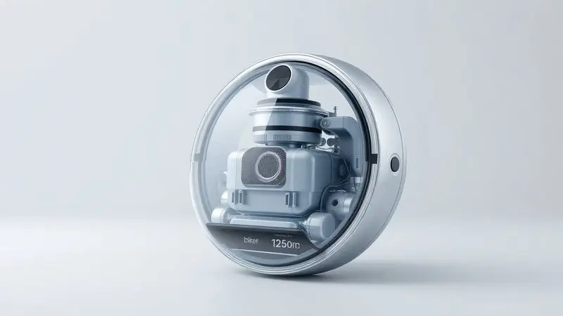
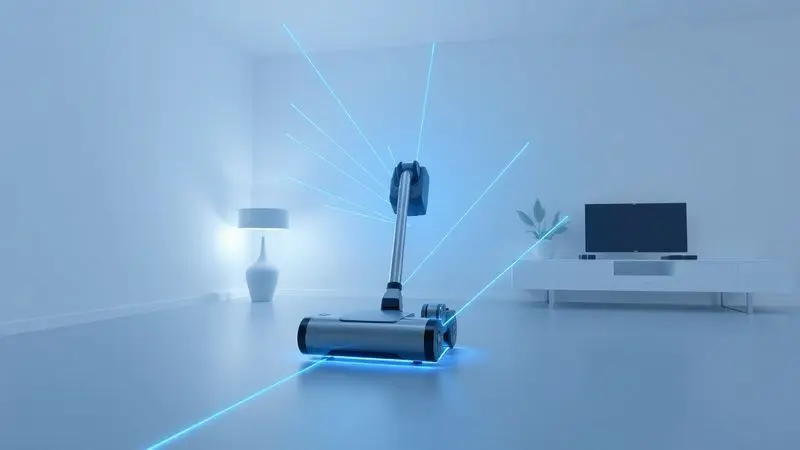
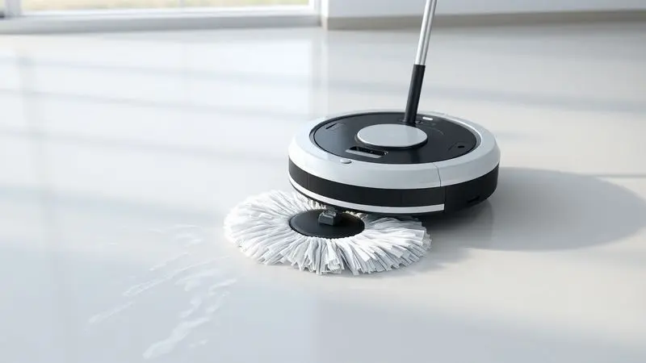

Imagine sair de casa pela manhã sabendo que, quando voltar, o chão estará impecável sem que você precise sequer pensar nisso. Essa é a promessa que conquistou milhões de lares: um pequeno robô que transforma horas de limpeza em minutos de configuração.

Mas entre tantas opções no mercado, como garantir que você não vai levar para casa apenas um caro brinquedo que fica preso nos tapetes ou ignora os cantos mais sujos?

Foi pensando nessa escolha que preparamos este guia.

Ao final, você vai entender exatamente quais números no papel se traduzem em benefícios reais para sua rotina, desde a potência necessária para os pelos do seu pet até a inteligência que evita que o aparelho caia da escada.

Vamos além das especificações técnicas para mostrar o que cada função significa no seu dia a dia.

<SummaryList products={frontmatter.top_products} />

## O que é e Como Realmente Funciona um Robô Aspirador?

Pense nele como um assistente pessoal de limpeza que funciona enquanto você faz outras coisas. Equipado com sensores que enxergam o ambiente, o robô cria um mapa mental da sua casa, identificando onde estão as paredes, os móveis e até os objetos deixados no chão.

Conforme se movimenta, suas escovas rotativas soltam a sujeira e uma poderosa sucção a captura, armazenando tudo em um reservatório interno.

A mágica está na autonomia: você programa os horários pelo aplicativo no celular e ele assume o trabalho. Chega em casa cansado do trabalho e encontra os pisos limpos, sem precisar arrastar o aspirador tradicional pelos cômodos.

Alguns modelos mais avançados até se comunicam com assistentes de voz, respondendo a comandos como 'Alexa, limpe a sala'.

## As Principais Vantagens de Ter um Assistente de Limpeza Robótico na Rotina

O maior presente que um robô aspirador oferece não está na tecnologia, mas no tempo que ele devolve para você.

Enquanto ele percorre a casa coletando poeira, você pode finalizar aquele relatório do trabalho, assistir um episódio da sua série favorita ou simplesmente descansar no sofá sem culpa.

Para famílias com crianças ou pets, essa praticidade se multiplica. Os pequenos derramaram farelos no chão? Programe uma limpeza rápida. O gato soltou pelos pelo sofá? O robô passa por baixo dos móveis onde sua vassoura nunca alcançaria.

E com a programação por horários, sua casa mantém uma limpeza constante sem que você precise lembrar de ligar o aparelho.

Outra vantagem silenciosa é a consistência. Enquanto nós humanos tendemos a pular cantos ou deixar para depois, o robô segue seu programa religiosamente.

O resultado é uma acumulação menor de sujeira ao longo do tempo, o que significa menos trabalho nas faxinas pesadas de fim de semana.

## Guia de Compra: Critérios Essenciais para não Errar na Escolha

Antes de se perder em [dezenas de modelos](/robo-aspirador-jets-platinum-e-bom/), concentre-se nestes quatro pilares que realmente definem sua experiência. Eles são a diferença entre um robô que apenas passa pelo chão e um que realmente limpa sua casa.

### 1. Potência de Sucção (Pa) e Eficiência em Diferentes Pisos

Os números em Pascal (Pa) podem parecer técnicos demais, mas pense neles como a 'força do sopro' do seu robô. Em carpetes grossos ou tapetes felpudos, onde a sujeira se esconde profundamente, você precisa de pelo menos 3000Pa para garantir uma limpeza eficiente.

Para quem tem pets, esse número sobe para 4000Pa ou mais, já que os pelos se agarram às fibras com teimosia.

Em pisos lisos como porcelanato ou madeira, potências menores já funcionam bem, mas modelos versáteis ajustam automaticamente a sucção conforme a superfície.

A verdadeira prova acontece na transição: um bom robô aumenta a potência ao detectar um tapete e a reduz ao voltar para o piso frio, economizando bateria sem comprometer a limpeza.

### 2. Navegação e Mapeamento: Sensores Infravermelhos vs. Tecnologia LIDAR (Laser)

Imagine dois tipos de motoristas: um que dirige com os olhos vendados, tocando nas coisas para saber onde estão, e outro que tem um mapa 3D completo do caminho. Os sensores infravermelhos são como o primeiro motorista, funcionais, mas limitados.

Eles evitam quedas e batem menos nos móveis, mas podem deixar áreas não aspiradas em ambientes complexos.

A [tecnologia LIDAR](/como-funciona-o-mapeamento-do-robo-aspirador/), por outro lado, é o GPS da limpeza. Um laser gira no topo do robô, escaneando a sala 360 graus e criando um mapa preciso que fica salvo na memória. O resultado?

Rotas sistemáticas em formato de zigue-zague que cobrem cada centímetro, menos colisões e a possibilidade de definir 'áreas proibidas' no aplicativo (como o canto onde seu cachorro deixa os brinquedos).

### 3. Autonomia da Bateria e a Importância do Retorno Automático à Base

Nada mais frustrante que encontrar seu robô 'morto' no meio da sala, com metade da casa ainda suja. A autonomia ideal depende do tamanho do seu imóvel: para apartamentos de até 70m², 90 minutos são suficientes.

Casas maiores, especialmente com vários cômodos, exigem 120 minutos ou mais.

Mas a duração da bateria é apenas metade da equação. A função de retorno automático completa o ciclo: quando a carga está baixa, o robô interrompe a limpeza, localiza sua base pelo sinal e vai recarregar sozinho.

Após algumas horas, ele retoma exatamente de onde parou, como se nunca tivesse saído. É a garantia de que, mesmo em residências espaçosas, cada canto será coberto.

### 4. Altura do Robô e Design: Ele Entra Debaixo dos seus Móveis?

Aqui está um detalhe que muitos negligenciam até levar o aparelho para casa. Aquele sofá baixo da sala ou a cama box do quarto podem se tornar zonas de exclusão se o robô for muito alto.

A medida segura são 9cm ou menos de altura, assim ele desliza sob a maioria dos móveis comuns.

O formato também importa. Modelos circulares são clássicos e se movem bem, mas podem deixar cantos quadrados menos limpos. Algumas marcas inovaram com designs em 'D' (arredondados na frente e retos atrás) que alcançam melhor os rodapés.

Observe também as escovas laterais: elas devem se estender além do corpo do robô para varrer a sujeira dos cantos para o caminho central.

## Função Passa Pano (Mop): Higienização Real ou Apenas Perfumaria?

Ver um robô deixando um rastro de água limpa atrás de si parece a evolução final da limpeza, mas é importante ajustar as expectativas.

A função mop funciona como uma manutenção diária, ideal para remover aquela poeira fina que se deposita nos pisos entre uma aspiração e outra.

O pano umedecido arrasta partículas superficiais e deixa um leve brilho, perfeito para quando você espera visitas e quer a casa com cara de 'arrumada na hora'.

Porém, não espere que ele substitua uma esfregada tradicional. Manchas secas de comida, respingos de gordura na cozinha ou pisos realmente sujos exigem pressão e produtos de limpeza que os robôs atuais não oferecem.

Pense no mop como o equivalente a passar um pano úmido rapidamente, não como uma lavagem profunda. Se sua prioridade é sanitização completa, modelos com tanques de água separados e panos vibradores oferecem resultados mais satisfatórios.

## Melhores Soluções para Necessidades Específicas

Cada casa tem suas particularidades, e a beleza dos robôs modernos está em atender essas diferenças. Em vez de soluções genéricas, você encontra modelos especializados que entendem seus desafios específicos.

### O Melhor Robô Aspirador para Quem Tem Pets (Escovas Anti-emaranhamento)

<ProductBox 
  title={frontmatter.top_products[0].title} 
  image={frontmatter.top_products[0].image} 
  link={frontmatter.top_products[0].link} 
/>

Se você divide a casa com gatos ou cachorros, sabe que os pelos são um inimigo diário. Eles se entrelaçam nas escovas convencionais, exigindo minutos de desenrolar após cada uso.

É aí que as escovas anti-emaranhamento fazem a diferença: seu design especial impede que os fios se enrolam, direcionando-os direto para o reservatório.

Modelos como o Teendow D20S Max+ e o ABIR K30 levam essa vantagem além, com sucções entre 6000Pa e 6500Pa que arrancam até os pelos mais grudados dos carpetes.

A combinação perfeita para donos de pets inclui ainda filtros laváveis (porque os pelos entopem rápido) e sensores que detectam os 'presentes' indesejados que alguns animais deixam no chão.

Quanto ao aprendizado do aparelho, sim, modelos com mapeamento LiDAR e autoesvaziamento têm mais configurações. Mas pense nisso como aprender a usar um smartphone avançado: depois das primeiras vezes, tudo flui naturalmente.

E a recompensa é não precisar esvaziar o reservatório cheio de pelos por semanas.

### Modelos Ideais para Alérgicos: O Papel do Filtro HEPA

<ProductBox 
  title={frontmatter.top_products[1].title} 
  image={frontmatter.top_products[1].image} 
  link={frontmatter.top_products[1].link} 
/>

Para quem espirra só de pensar em poeira, o filtro HEPA não é um luxo, é uma necessidade médica. Esses filtros capturam 99,99% das partículas microscópicas que flutuam no ar, incluindo ácaros, pólen e esporos de mofo que os filtros comuns deixam passar.

Quando o robô aspira, ele não está apenas removendo a sujeira visível, está purificando o ar que você respira.

O Samsung Jet Bot AI+ e o Roborock S8 Plus são exemplos que unem essa filtragem avançada com potência suficiente para levantar a poeira das fibras dos tapetes.

Já o Xiaomi Vacuum-Mop 2 Pro adiciona a função de mop para fixar a poeira que tenta se levantar, enquanto o [Philco Pas08c](/aspirador-robo-philco-pas08c-e-bom/) oferece essa proteção em um pacote mais acessível.

A configuração inicial pode demandar alguns minutos a mais, ajustando no aplicativo as áreas que precisam de atenção extra (como o quarto do alérgico). Mas uma vez programado, ele trabalha silenciosamente como um purificador de ar que também limpa o chão.

## Top Modelos Recomendados por Categoria

Depois de entender o que cada especificação significa para sua rotina, chegou a hora de conhecer os protagonistas. Separamos três modelos que representam diferentes perfis de usuário, desde quem busca economia até quem quer a última palavra em tecnologia.

### Wap Robot W300: O Melhor Custo-Benefício de Entrada

<ProductBox 
  title={frontmatter.top_products[2].title} 
  image={frontmatter.top_products[2].image} 
  link={frontmatter.top_products[2].link} 
/>

Para quem está dando os primeiros passos no mundo da limpeza robótica, [o W300](/robo-aspirador-w300-e-bom/) oferece o essencial sem complicações.

Sua bateria de 1h15 parece modesta, mas é mais que suficiente para apartamentos compactos, e o retorno automático à base garante que ele sempre complete o ciclo.

Os cinco modos de limpeza são o diferencial: do modo espiral para áreas concentradas de sujeira ao modo bordas que dedica atenção extra aos rodapés.

O filtro HEPA incluso é uma surpresa agradável nesta faixa de preço, retendo alérgenos que modelos básicos normalmente devolvem ao ar.

Sim, seus 74dB de ruído são perceptíveis (equivalente a um aspirador de pó tradicional em potência baixa), mas programe-o para limpar quando você não estiver em casa e esse ponto deixa de ser relevante.

Para quem quer experimentar a conveniência sem investir alto, é a porta de entrada ideal.

### Xiaomi Robot Vacuum S20+: Tecnologia e Inteligência em Mapeamento

<ProductBox 
  title={frontmatter.top_products[3].title} 
  image={frontmatter.top_products[3].image} 
  link={frontmatter.top_products[3].link} 
/>

Aqui a inteligência realmente faz diferença. O mapeamento a laser LDS do [S20+](/robo-aspirador-xiaomi-s20-e-bom/) não apenas cria mapas, mas os analisa para otimizar rotas.

Ele aprende que na terça-feira você tem reuniões online e evita a sala nesse horário, ou que o canto da cozinha acumula mais migalhas após o jantar.

Com 6000Pa de sucção, ele lida com tapetes médios e os pelos de animais com tranquilidade, enquanto os panos rotativos do mop dão conta da poeira diária nos pisos lisos.

A bateria de 170 minutos é generosa, permitindo limpar apartamentos grandes ou casas de dois andares (com a base transportada entre eles) em uma única carga.

O controle pelo aplicativo Xiaomi Home é intuitivo, mostrando em tempo real por onde o robô passou e onde ainda falta limpar. E para os momentos de preguiça, basta dizer 'Alexa, pedir para o robô limpar a cozinha'.

### Samsung Jet Bot AI+: O Topo de Linha com Inteligência Artificial

<ProductBox 
  title={frontmatter.top_products[4].title} 
  image={frontmatter.top_products[4].image} 
  link={frontmatter.top_products[4].link} 
/>

Este é para quem não aceita meio-termo. O Jet Bot AI+ enxerga o ambiente com câmeras que identificam não apenas obstáculos, mas o tipo de obstáculo: ele sabe diferenciar um fio de um brinquedo, contornando o primeiro e aspirando em volta do segundo.

Em pisos duros, seus 95,8% de eficiência na remoção de detritos são impressionantes.

A estação de autoesvaziamento é seu maior trunfo prático: por até 60 dias você não precisa tocar no reservatório de sujeira. O robô retorna à base, esvazia sozinho o coletor e volta a trabalhar, tudo sem intervenção humana.

A ressalva fica para carpetes grossos, onde a performance com pelos maiores pode decepcionar pelo preço cobrado.

Mas se sua casa tem predominantemente pisos lisos e você valoriza a automatização completa, o investimento se justifica pela tranquilidade de ter um sistema que quase pensa por si mesmo.

## Dicas de Ouro: Manutenção e Longevidade do Aparelho

Um robô aspirador bem cuidado pode durar cinco anos ou mais, tornando-se realmente um investimento. Comece pela rotina semanal: [limpe as escovas principais](/como-limpar-o-robo-aspirador/) e laterais, removendo fios de cabelo e pelos que sempre escapam do sistema anti-emaranhamento.

O filtro HEPA deve ser batido suavemente contra uma lixeira a cada 15 dias e lavado (se for lavável) mensalmente, mas sempre secando completamente antes de recolocá-lo.

Mensalmente, vire o robô e verifique as rodas, pequenos objetos como brincos ou botões podem se alojar ali, comprometendo a mobilidade.

Os sensores inferiores (que detectam degraus) e os laterais (que evitam colisões) merecem uma passagem de pano seco para remover a poeira que interfere na precisão.

A base de carregamento também precisa de atenção: mantenha-a em área livre, sem tapetes por perto que possam enrolar nas rodas, e limpe os contatos metálicos ocasionalmente com um pano levemente umedecido em álcool.

Seguindo esse ritual rápido, seu assistente robótico mantém o desempenho do primeiro dia por anos.

## Erros Comuns ao Comprar um Robô Aspirador (e como evitá-los)

O erro mais frequente é comprar pelo preço sem considerar o layout da casa.

Aquele [modelo barato](/aspirador-robo-agratto-e-bom/) com sensores básicos pode funcionar bem no apartamento vazio do youtuber, mas na sua sala com sofá, mesa de centro, plantas e brinquedos espalhados, ele passa mais tempo tentando se desvencilhar do que limpando.

Outra armadilha é ignorar a capacidade do reservatório. Em lares com pets ou crianças pequenas, um coletor de 300ml enche em duas sessões, exigindo que você o esvazie constantemente. Prefira modelos com pelo menos 400ml ou, melhor ainda, com estação de autoesvaziamento.

Por fim, desconfie de avaliações genéricas. Busque opiniões de pessoas com casas similares à sua, se você tem tapetes persas, leia avaliações de quem também os tem. Se sua casa tem muitos degraus entre cômodos, veja como diferentes modelos lidam com transições.

A experiência real de quem vive situações parecidas com as suas vale mais que qualquer teste de laboratório.

## Conclusão

Investir em um robô aspirador é, acima de tudo, investir em tempo, aquele recurso que nunca sobra na rotina moderna.

O retorno não vem apenas em pisos limpos, mas nas horas que você recupera para o que realmente importa: aquela série atrasada, o jantar com a família sem pressa, ou simplesmente alguns minutos extras de descanso.

Claro, ele não substitui a faxina profunda ocasional, especialmente nos cantos altos e móveis. Mas para a manutenção diária que consome tanto da nossa energia, representa uma revolução silenciosa.

Imagine acordar sabendo que a poeira que se acumulou durante a noite já foi removida, ou chegar do mercado sem precisar aspirar as migalhas que caíram no caminho.

A escolha certa depende do seu estilo de vida: se você tem pets, priorize a potência e as escovas anti-emaranhamento; se sofre de alergias, não abra mão do filtro HEPA; se valoriza conveniência absoluta, considere os modelos com autoesvaziamento.

Qualquer que seja sua necessidade, há um robô que se encaixa nela, transformando uma tarefa repetitiva em um hábito automático que funciona nos bastidores da sua vida.

O futuro da limpeza não está em trabalhar mais, mas em trabalhar menos, e deixar que a tecnologia assuma a parte maçante, enquanto você aproveita o tempo conquistado.

## FAQ: Perguntas Frequentes sobre Robôs Aspiradores

Funcionam em todos os tipos de piso? Sim, mas com ressalvas. Em pisos lisos (porcelanato, madeira, laminado) têm excelente desempenho. Em carpetes, dependem da potência de sucção, acima de 3000Pa para tapetes finos, 4000Pa ou mais para os felpudos.

Em tapetes com franjas muito longas, alguns modelos podem se enrolar.

Quanto tempo dura a bateria?
A média varia de 60 a 180 minutos, dependendo do modelo e do modo de limpeza selecionado. No modo silencioso ou para manutenção diária, a duração é maior; no modo turbo para tapetes ou áreas muito sujas, consome mais rápido.

Realmente lidam com pelos de animais? Os modelos dedicados sim, especialmente os com escovas anti-emaranhamento e sucção acima de 4000Pa.

Eles coletam a maior parte dos pelos soltos, mas pelos muito compridos ou emaranhados ainda podem exigir intervenção ocasional nas escovas.

Preciso preparar a casa antes de ele limpar? Recomenda-se retirar do chão fios soltos, meias, brinquedos pequenos e outros objetos que possam ser engolidos ou enroscar nas rodas.

Alguns modelos mais avançados contornam esses obstáculos, mas a prevenção ainda é a melhor prática.

Posso usá-lo quando não estou em casa? Sim, a maioria dos modelos permite programação por horário no aplicativo. Programe para limpar enquanto você trabalha ou faz compras, e volte para encontrar a casa limpa.

Apenas certifique-se de que não há objetos perigosos no chão antes de sair.

Quanto tempo dura um robô aspirador?
Com manutenção adequada (limpeza regular das escovas e filtros), a vida útil média é de 3 a 5 anos. As baterias podem perder capacidade após 2-3 anos, mas muitas marcas oferecem reposição.