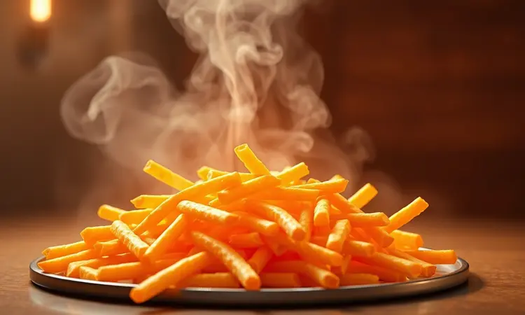

É aquela cena comum: você abre a geladeira, vê as sobras daquele jantar especial que ficaram guardadas e sente um misto de esperança e desconfiança. Será que vai conseguir resgatar o sabor e a textura originais?

Se você já viveu a decepção de tirar comida murcha ou aquosa do micro-ondas, tenho uma notícia que vai mudar sua relação com as sobras.

A airfryer é capaz de transformar esse momento de dúvida em uma experiência quase mágica, onde alimentos amanhecidos renascem crocantes e saborosos como se tivessem acabado de sair do forno.

Vamos além da pergunta básica e mergulhar em como essa revolução acontece. E o melhor: você pode fazer isso sem culpa, economizando gás e recuperando aquela sensação de comida recém-preparada que tanto nos faz feliz.

<SummaryList products={frontmatter.top_products} />

## Afinal, pode esquentar comida na airfryer?

Imagine só: você coloca aquelas batatas fritas de ontem que perderam a graça, ajusta alguns minutos, e quando abre a airfryer, elas estão exatamente como na primeira vez. Essa não é uma promessa vazia.

A magia está no ar quente que circula com intensidade, envolvendo cada pedacinho de comida e restaurando sua vitalidade.

Diferente do micro-ondas que cozinha de dentro para fora deixando tudo mole, a airfryer trabalha de fora para dentro, criando uma camada crocante enquanto mantém o interior suculento.

Controle total é a palavra-chave aqui. Você decide exatamente quanto tempo e a que temperatura cada alimento precisa, personalizando o resultado como um chef profissional.

Desde a pizza da noite anterior até aquele frango assado especial, tudo volta à vida sem perder suas características originais.

## Por que a airfryer é melhor que o micro-ondas para reaquecer?

Pense na última vez que esquentou um empanado no micro-ondas. A casca ficou borrachuda, o recheio superaquecido e a experiência foi mais um compromisso do que um prazer. Agora pense no contrário: a airfryer não apenas aquece, mas rehabilita a comida.

O segredo está no mecanismo de circulação. Enquanto o micro-ondas usa ondas que aquecem as moléculas de água de forma desigual, a airfryer distribui calor uniformemente.

É como colocar o alimento em um forno de convecção miniaturizado, onde cada lado recebe atenção igual. Essa uniformidade garante que o exterior fique crocante enquanto o interior permanece úmido e saboroso.

A versatilidade também faz diferença. Em uma única airfryer você pode requentar diferentes tipos de alimento ao mesmo tempo, organizando-os em camadas ou usando acessórios estratégicos.

Nada daquela cena de esquentar um prato por vez e ver a comida da família esfriando enquanto espera sua vez.

## Quais recipientes e vasilhas podem ir na airfryer?

Aqui está um ponto que muitas pessoas deixam de explorar por medo. A boa notícia é que sua criatividade não precisa ser limitada. Metal, vidro, cerâmica e silicone resistentes a altas temperaturas são seus aliados.

A única restrição real são os plásticos comuns que derretem e podem liberar substâncias indesejadas na sua comida.

Mas há um acessório que merece atenção especial pela revolução que causa na praticidade.

### Melhores acessórios: Forma de silicone para airfryer

<ProductBox 
  title={frontmatter.top_products[0].title} 
  image={frontmatter.top_products[0].image} 
  link={frontmatter.top_products[0].link} 
/>

Imagine conseguir desenformar um bolo ou deslizar salgados da airfryer sem deixar metade grudada no fundo. As formas de silicone transformam essa cena de frustração em gesto simples.

Além da antiaderência natural que protege sua comida, a limpeza se resume a passar uma esponja - sem aquela luta com restos queimados nos cantos.

Elas são mais do que apenas práticas: são versáteis. Use a mesma forma para fazer mini-quiches no café da manhã e brownies na sobremesa.

Sim, o silicone conduz calor de forma diferente, então talvez você precise ajustar alguns minutos a menos ou alguns graus a mais, mas é um ajuste rápido que logo se torna intuitivo.

Essa é a beleza da airfryer: ela permite que você reaproveite não apenas a comida, mas também sua energia criativa na cozinha.

## Guia de Tempos e Temperaturas por Tipo de Alimento

Cada alimento tem sua personalidade, e a airfryer respeita isso.

Carnes precisam de um abraço mais quente e demorado (por volta de 180°C por 15-20 minutos) para recuperar sua suculência, enquanto os legumes preferem um carinho mais suave (160°C por 10-15 minutos) para manter sua frescura.

Esse ajuste fino é o que separa um requentamento comum de uma ressurreição culinária.

Mas alguns alimentos merecem atenção especial por suas características únicas.

### Como esquentar arroz na airfryer sem ressecar

O arroz é traiçoeiro: esfria rápido e resseca fácil. Mas com a airfryer, você domina essa equação.

Coloque o arroz em um recipiente adequado, adicione uma colher de sopa de água para criar um ambiente úmido, tampe levemente para o vapor circular sem escapar, e programe 160°C por 5 a 10 minutos.

O resultado é um arroz que parece acabado de fazer, grão a grão solto e quentinho.

### O segredo da pizza amanhecida crocante

Pizza do dia seguinte já foi sinônimo de massa borrachuda. Até agora. Pré-aqueça a airfryer a 180°C, coloque as fatias sem sobrepor, e deixe o ar quente trabalhar por 5 a 7 minutos.

A massa recupera sua firmeza, o queijo borbulha sem queimar, e você redescobre o amor pela pizza que achava perdido.

### Batata frita e empanados: devolvendo a textura original

Aqui está o teste definitivo. Aqueça a airfryer a 200°C por 3 minutos, espalhe as batatas ou empanados em uma única camada, e deixe por 5 a 8 minutos.

A crocância ressurge, o interior esquenta uniformemente, e você quase esquece que não estão saindo da fritadeira pela primeira vez.

### Carnes e bifes: como aquecer sem endurecer

Esta é a arte do requentamento gourmet. A 180°C, cubra a carne com papel alumínio pelos primeiros minutos (isso cria uma câmara de vapor que mantém a suculência), depois retire para dourar.

Em 5 a 10 minutos, você tem um bife que mantém seu sabor original como se o cozinheiro tivesse cronometrado sua chegada.

## Dicas de Especialista para um resultado perfeito

Dois gestos simples fazem diferença abismal: pré-aqueça por 3 a 5 minutos (isso cria o ambiente ideal desde o primeiro segundo) e nunca sobrecarregue a cesta (cada alimento precisa de espaço para o ar circular livremente).

São detalhes que transformam bons resultados em experiências memoráveis.

E há um truque secreto que os chefes usam para dar aquele toque final.

### Use um pulverizador de azeite para brilho e sabor

<ProductBox 
  title={frontmatter.top_products[1].title} 
  image={frontmatter.top_products[1].image} 
  link={frontmatter.top_products[1].link} 
/>

Um borrifo fino e uniforme de azeite antes do aquecimento faz milagres. O alimento ganha um brilho apetitoso, a crocância se intensifica, e você evita aquela sensação oleosa que às vezes acontece quando pingamos óleo diretamente.

Existem pulverizadores de vidro ou aço que não acumulam odores e permitem dosar com precisão.

Sim, eles exigem uma limpeza rápida após o uso, mas a recompensa é uma comida que parece saída de um restaurante especializado. Eles são o acessório silencioso que eleva qualquer requentamento da categoria 'prático' para 'prazeroso'.

## O que NÃO esquentar na airfryer: Evite esses erros

A airfryer é poderosa, mas não é infalível. Massas frescas tendem a secar demais, perdendo a maciez que as caracteriza.

Pratos com muito molho, como lasanhas ou curries, podem queimar por fora enquanto o centro permanece frio - aqui, o micro-ondas ainda tem vantagem para aquecimento mais profundo e rápido.

Alimentos que já foram empanados e fritos antes do armazenamento também apresentam desafio: a umidade do recheio pode deixar a casquinha encharcada. Conhecer essas limitações não é uma fraqueza, mas sabedoria culinária.

## Perguntas Frequentes (FAQ)

Na prática, o que mais importa é entender o básico do funcionamento. Temperaturas entre 160°C e 180°C funcionam para a maioria dos alimentos, com tempos variando conforme a quantidade e densidade.

### Quanto tempo leva para esquentar comida na airfryer?

Entre 5 e 15 minutos é o intervalo comum. Pizzas e frituras ficam perfeitas em 5 a 8 minutos, enquanto pratos mais pesados como lasanhas podem exigir até 15 minutos. A dica dourada: quando possível, verifique a temperatura interna com um termômetro.

75°C é o ponto ideal para a maioria dos alimentos cozidos.

### Preciso preaquecer a airfryer para requentar?

Não é obrigatório, mas é como aquecer os músculos antes do exercício: prepara o equipamento para o melhor desempenho.

Alguns minutos de pré-aquecimento garantem que o alimento comece a receber calor intenso desde o primeiro segundo, resultando em crocância mais uniforme e eficiência energética.

## Conclusão

A airfryer não é apenas mais um eletrodoméstico na sua cozinha. Ela é uma aliada que transforma o reaproveitamento de alimentos de uma obrigação econômica em uma experiência gastronômica.

Cada vez que você resgata a crocância de uma batata frita ou a suculência de um bife, está não apenas evitando desperdício, mas recuperando momentos de prazer que pareciam perdidos.

Ela oferece uma combinação rara: praticidade que se encaixa no ritmo acelerado do dia a dia, economia que faz diferença no final do mês, e resultados que satisfazem o paladar mais exigente. A redução no uso de óleo é um bônus que faz bem à saúde sem comprometer o sabor.

O verdadeiro poder da airfryer para requentar comida vai além da técnica. Está na capacidade de devolver a alegria àquelas sobras que antes eram apenas uma alternativa. Está em transformar 'aquecer o jantar de ontem' em 'redescobrir um prato delicioso'.

Experimente estas dimas, ajuste conforme seu gosto pessoal, e descubra como sua relação com as sobras nunca mais será a mesma.