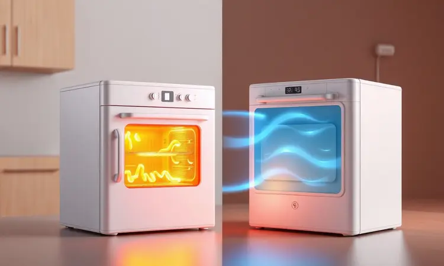
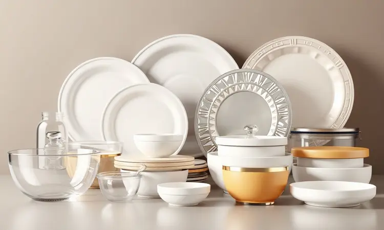
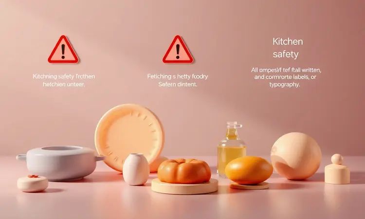

Você já fechou a tampa do micro-ondas esperando um milagre, só para descobrir que sua pizza favorita virou uma massa borrachuda e sem graça? A frustração de perder a textura perfeita de uma refeição é quase um rito de passagem na vida adulta.

Mas e se eu te disser que a solução para esse problema está logo ali, na sua bancada, disfarçada de fritadeira elétrica?

A Airfryer é muito mais do que uma máquina de fazer batata frita saudável. Ela é a ferramenta secreta para resgatar suas sobras e devolver a elas a dignidade de um prato recém-preparado.

Neste guia, você vai descobrir não só o passo a passo, mas a filosofia por trás de reaquecer comida de um jeito que preserva (e às vezes até melhora) o sabor e a crocância. Prepare-se para se despedir das refeições murchas.

<SummaryList products={frontmatter.top_products} />

## Afinal, pode esquentar comida na Airfryer?

Não só pode, como essa é uma das funções mais subestimadas e gratificantes do aparelho.

Enquanto o micro-ondas cozinha os alimentos de dentro para fora com ondas de calor, muitas vezes deixando-os úmidos e sem textura, a Airfryer trabalha com um princípio diferente: a circulação de ar quente intensa.

Pense nesse ar como milhões de mãozinhas invisíveis que abraçam uniformemente cada pedacinho da sua comida. Elas removem o excesso de umidade da superfície (o que devolve a crocância) enquanto aquecem o interior de forma constante. O resultado?

Aquele frango de ontem recupera a casca dourada, as batatas fritas acordam crocantes e a pizza parece ter saído do forno do restaurante. A magia acontece normalmente entre 160°C e 180°C, em poucos minutos.

## Airfryer vs. Micro-ondas: Qual a melhor opção para reaquecer?

A resposta certa depende do que você valoriza mais naquele momento: velocidade ou experiência.

O micro-ondas é o corredor de 100 metros rasos do reaquecimento. Ele é imbatível em urgências. Precisa esquentar um copo de leite ou um prato de sopa em 60 segundos? Não há discussão.

Sua praticidade é inquestionável para líquidos ou alimentos onde a textura é secundária.

A Airfryer, por outro lado, é a maratona que vale a pena pela vista. Ela não tem pressa. Leva alguns minutos a mais, mas o que ela entrega é uma transformação completa. Ela não apenas aquece, ela *revitaliza*.

É a escolha para quando você quer honrar a refeição, seja uma porção de frituras que perderam o brilho, um bife que merece permanecer suculento ou um pão que precisa recuperar a casca crocante.

Escolha o micro-ondas para a fome que não pode esperar. Escolha a Airfryer para o paladar que não aceita menos.

## Quais recipientes podem ser usados para esquentar comida na Airfryer?

Aqui está um dos segredos para o sucesso. A Airfryer gera um calor intenso e concentrado, então o material do seu recipiente não é um detalhe, é uma questão de segurança e resultado.

A regra de ouro é simples: metal, vidro resistente ao calor e silicone alimentar são os heróis permitidos. Plásticos comuns, mesmo os que você usa no micro-ondas, são os vilões proibidos.

Eles podem derreter, deformar ou, pior, liberar substâncias indesejadas na sua comida sob temperaturas altas.

### Vidro refratário, cerâmica e alumínio: O que é seguro?

Dentro do hall dos materiais aprovados, cada um tem sua personalidade.

O vidro refratário é o aluno exemplar. Suporta altas temperaturas sem pestanejar, não reage com os alimentos e permite que você veja o que está acontecendo lá dentro. É uma escolha segura e elegante.

A cerâmica pode ser uma grande aliada, mas peça para ver seu histórico. Ela precisa ser especificamente formulada para forno (geralmente indicado no fundo do recipiente). Cerâmicas decorativas ou de baixa qualidade podem rachar com o choque térmico.

O alumínio é o atleta flexível e eficiente. Conduz calor muito bem, garantindo um aquecimento uniforme. Porém, evite as peças muito fininhas e frágeis, que podem entortar com o calor intenso da Airfryer. Forminhas de alumínio robustas funcionam perfeitamente.

### Por que evitar o plástico a todo custo?

Vamos além da Airfryer por um momento. O plástico, especialmente quando aquecido, é uma caixa-Preta química. Muitos tipos contêm compostos como o BPA ou ftalatos que podem migrar para os alimentos. Você não vê, não sente o gosto, mas está lá.

Quando a Airfryer trabalha a 180°C, você está criando o cenário ideal para essa migração indesejada.

Trocar o plástico por vidro, aço inox ou silicone não é apenas uma precaução para sua saúde no longo prazo. É também um presente para o planeta, reduzindo o consumo de materiais que levam séculos para desaparecer.

É uma decisão que aquece a comida sem esquentar o planeta.

### Formas de silicone para Airfryer: Praticidade no dia a dia

<ProductBox 
  title={frontmatter.top_products[0].title} 
  image={frontmatter.top_products[0].image} 
  link={frontmatter.top_products[0].link} 
/>

Se você está cansado de raspar resíduos grudados do cesto da Airfryer, as formas de silicone são sua nova melhor amiga. Elas são a ponte entre a praticidade e os resultados perfeitos.

Feitas de silicone alimentar de alta resistência, elas aguentam o tranco do calor, são naturalmente antiaderentes (adeus, comida colada) e sua flexibilidade torna a hora de desenformar um verdadeiro prazer.

Quer fazer mini bolos, esquentar porções individuais de lasanha ou garantir que o queijo derretido não escorra? A forma de silicone é a resposta.

Além de pouparem sua paciência na limpeza, elas protegem o revestimento do cesto da sua Airfryer, prolongando a vida útil do aparelho.

Só lembre de verificar se o tamanho da forma é compatível com o diâmetro do seu modelo, permitindo que o ar circular livremente por todos os lados.

## Guia Prático: Tempo e Temperatura ideal para cada alimento

Com o recipiente seguro escolhido, chegamos ao coração da operação: a combinação mágica de tempo e temperatura. Não é uma ciência exata, mas uma arte guiada por alguns princípios.

Em geral, pense assim: alimentos mais densos e proteicos (carnes) gostam de um calor mais brando e constante (por volta de 180°C) por um pouco mais de tempo (15-20 min) para esquentar por completo sem ressecar.

Já vegetais e frituras, que buscam a crocância, se dão melhor com um golpe de calor mais alto e rápido (200°C por 10-15 min).

Abaixo, os detalhes para seus protagonistas principais.

### Como esquentar pizza na Airfryer e devolver a crocância

A pizza é o teste definitivo para qualquer método de reaquecimento. Na Airfryer, ela encontra sua redenção.

Coloque a fatia diretamente no cesto ou sobre uma grelha. A chave é não amontoar. Deixe o ar circular livremente. Pré-aqueça o aparelho a 180°C por 3 minutos, depois coloque a pizza por mais 3 a 5 minutos.

O que acontece é mágica pura. O ar quente derrete suavemente o queijo, aquece o recheio e, ao mesmo tempo, trabalha na massa. Ele evapora a umidade que a deixou emborrachada no micro-ondas, restaurando a crocância da borda.

Você fecha os olhos e poderia jurar que foi a primeira fatia da noite.

### Carnes, frangos e bifes: Dicas para não ressecar

O grande medo ao reaquecer carne é transformar um bife suculento em uma sola de sapato. A Airfryer, com suas configurações precisas, é sua aliada nessa missão.

O segredo está na umidade. Para cortes grossos ou peitos de frango, uma camada folgada de papel alumínio por cima nos primeiros minutos cria um efeito de 'cozimento a vapor' dentro do aparelho, garantindo que o calor penetre sem secar a superfície.

Retire o papel nos últimos 2-3 minutos para dourar.

Uma borrifada de caldo de carne, azeite ou até mesmo da própria marinada usada no dia anterior pode reidratar a superfície e adicionar uma camada extra de sabor. Lembre-se: a carne já está cozida, você só precisa aquecê-la com carinho.

### Frituras e salgados: O segredo da textura perfeita

Batata frita, pastel, bolinho de bacalhau. Estes são os alimentos que mais sofrem no micro-ondas, ficando moles e oleosos. Na Airfryer, eles renascem.

Espalhe-os bem na cesta, em uma única camada. Isso é não negociável. O ar precisa atingir toda a superfície de cada unidade para evaporar a umidade e reativar a crocância. Não há necessidade de óleo extra, pois eles já o possuem.

O pré-aquecimento é um trunfo aqui, pois coloca os alimentos imediatamente em contato com o calor intenso.

Em poucos minutos, a gordura excedente é derretida e drenada, e a casca volta a estalar entre os dentes. É o milagre do 'frito-sem-fritura', duas vezes.

### Arroz, feijão e acompanhamentos: Como manter a umidade

Aqui, a estratégia é inversa à das frituras. Queremos evitar que sequem. A solução é recriar um ambiente úmido.

Coloque o arroz ou feijão em um recipiente próprio (vidro ou silicone são ideais). Adicione uma colher de sopa de água ou caldo por porção e tampe levemente com papel alumínio, mas sem vedar completamente.

Isso criará um vapor suave que envolve os grãos, reaquecendo-os sem tirar sua maciez.

Ajuste para 160°C e deixe por 5 a 10 minutos. O resultado é um acompanhamento quente, soltinho e tão gostoso quanto feito na hora.

## Como esquentar marmita congelada na Airfryer com segurança

A marmita congelada é o salva-vidas dos dias corridos. E a Airfryer pode ser a maneira mais saborosa de resgatá-la do freezer.

Primeiro, transvase a comida do recipiente de congelamento (geralmente plástico) para uma vasilha segura para a Airfryer. Programe 180°C por 15 a 20 minutos. A grande dica é interromper o processo na metade do tempo, dar uma boa mexida ou virar os pedaços maiores.

Isso garante que o calor do ar circulante atinja todos os cantos de forma uniforme, descongelando e aquecendo ao mesmo tempo, sem deixar pedaços gelados no centro. Faça o teste do garfo: espete no centro do alimento para sentir se está quente por dentro.

Segurança e sabor em um só passo.

## Papel Manteiga e Forros de Papel: Facilitando a limpeza

<ProductBox 
  title={frontmatter.top_products[1].title} 
  image={frontmatter.top_products[1].image} 
  link={frontmatter.top_products[1].link} 
/>

Para quem prioriza a limpeza rápida, os forros de papel são uma tentação compreensível. Eles funcionam como uma barreira entre a comida e o cesto, pegando migalhas e respingos de gordura.

Porém, é preciso atenção. Use apenas papel manteiga específico para altas temperaturas ou, idealmente, os forros redondos feitos sob medida para Airfryers. Eles possuem perfurações que não atrapalham a vital circulação do ar.

Papel comum pode queimar e soltar fumaça, especialmente se não estiver coberto por alimento.

Uma reflexão: cada forro descartável é mais um item indo para o lixo. Se a praticidade é sua meta, considere investir em um tapete reutilizável de silicone.

Ele cumpre a mesma função protetora, pode ser lavado centenas de vezes e, no longo prazo, é mais econômico e ecológico.

## 5 Erros comuns que você comete ao reaquecer comida na fritadeira

Dominar a arte é também conhecer os deslizes que podem sabotar seu prato.

1.  **Ignorar o pré-aquecimento:** Colocar a comida em uma Airfryer fria é como entrar em uma piscina gelada aos poucos. O aquecimento fica desigual. Três minutinhos de pré-aquecimento fazem toda a diferença para uma crocância instantânea.

2.  **Lotar a cesta:** A ânsia de esquentar tudo de uma vez é o inimigo do ar circulante. A comida fica 'cozinhando no vapor' dela mesma, ficando úmida e sem textura. Use camadas únicas.

3.  **Chutar a temperatura:** Mandar um bife a 200°C é pedir para ele ressecar. Cada alimento tem sua preferência térmica. Respeite-a.

4.  **Esquecer de mexer:** Principalmente com porções maiores ou alimentos irregulares, uma pausa para virar ou agitar na metade do tempo garante que todos os lados recebam o carinho do ar quente.

5.  **Subestimar o recipiente:** Usar um pote plástico ou uma forma de papelão é um risco à segurança e ao resultado. O material errado pode derreter, queimar ou simplesmente não conduzir calor direito.

## Perguntas Frequentes (FAQ)

### Preciso pré-aquecer a Airfryer para esquentar a comida?

Pré-aquecer não é uma regra escrita em pedra, mas é o atalho para resultados consistentemente melhores.

Aquele início a pleno vapor garante que a comida seja recebida por uma rajada de calor imediata, que sela a superfície e inicia o processo de crocância desde o primeiro segundo.

Para alimentos que já estão prontos e só precisam de um 'upgrade' de textura, esses 3 a 5 minutos iniciais são o melhor investimento do seu tempo.

### Qual a melhor Airfryer para quem cozinha grandes quantidades?

<ProductBox 
  title={frontmatter.top_products[2].title} 
  image={frontmatter.top_products[2].image} 
  link={frontmatter.top_products[2].link} 
/>

Se sua cozinha é comandada por preparos em larga escala, o tamanho do cesto vira prioridade número um. Procure modelos com capacidade a partir de 5 litros.

Opções como a Philips Walita AI551/08, com seus generosos 12 litros, oferecem espaço de sobra e funções pré-programadas que facilitam a vida. A Philco PFR2200P, também de 12 litros, vem com um design moderno e a versatilidade da função 4 em 1.

Para quem realmente não brinca em serviço, o Oster French Door, com capacidade de forno (42 litros), permite preparar refeições completas para a família toda de uma só vez.

A contrapartida é o espaço na bancada que esses gigantes consomem.

Mas se a sua rotina exige eficiência e volume, ter a liberdade de esquentar uma travessa inteira de lasanha ou várias porções de proteína simultaneamente pode transformar completamente sua relação com as sobras e o meal prep.

## Conclusão

Reaquecer comida deixou de ser um ato de necessidade para se tornar uma oportunidade de resgate. A Airfryer, com sua tecnologia precisa de ar circulante, não apenas aquece, mas ressignifica suas sobras.

Ela devolve a crocância que o micro-ondas roubou, mantém a suculência que o forno convencional muitas vezes evapora e faz isso com uma praticidade que se integra perfeitamente ao dia a dia.

Mais do que seguir tempos e temperaturas, você agora entende a lógica por trás de cada escolha: o recipiente certo como escudo, a temperatura correta como linguagem, o espaço na cesta como respeito ao processo. Você não está apenas esquentando o jantar de ontem.

Está dando a ele uma segunda chance de brilhar.

Então, da próxima vez que olhar para aquela pizza ou aquele frango assado na geladeira, veja potencial, não sobra. Ligue sua Airfryer, ajuste a temperatura com confiança e prepare-se para redescobrir o prazer de uma refeição requentada como nunca antes. Bom apetite!