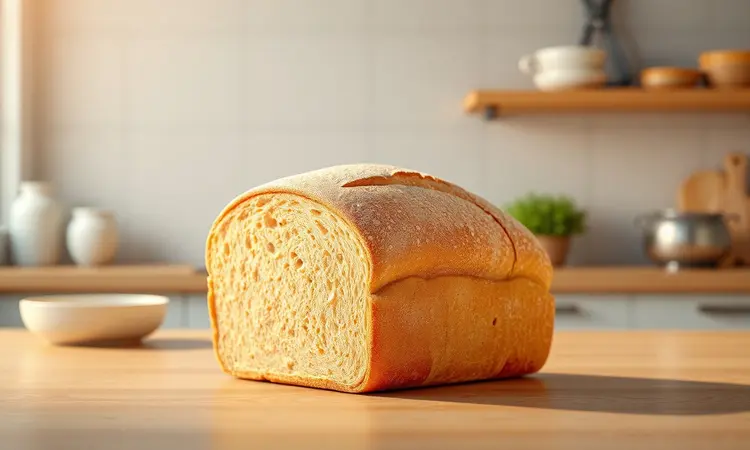
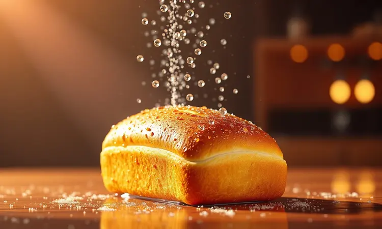
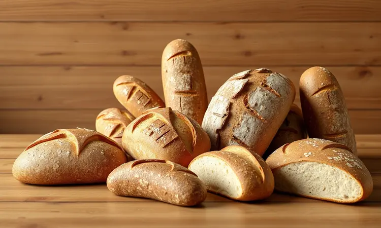
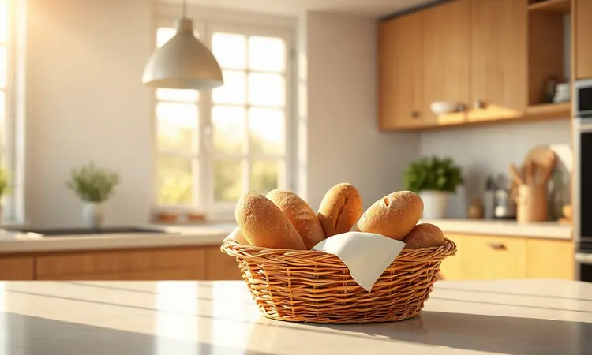

Você já passou pela frustração de querer um pãozinho francês quentinho no café da manhã, mas só encontrar pães duros e "dormidos" na cozinha?

A boa notícia é que você não precisa jogá-los fora ou se contentar com uma textura desagradável: com a técnica certa na airfryer, é possível devolver a crocância e o frescor de padaria em menos de 5 minutos.

Neste guia definitivo, você aprenderá o segredo infalível da umidade, os ajustes de temperatura para cada tipo de pão e como evitar os erros comuns que deixam a massa borrachuda.

<SummaryList products={frontmatter.top_products} />

## Por que o pão fica duro? Entenda o processo de ressecamento

Imagine isso: você compra um pão fresco pela manhã, guarda na cozinha, e horas depois ele parece uma pedra. O que acontece? A água que dá vida à massa simplesmente evapora para o ar, deixando a textura densa e sem graça.

Esse fenômeno tem até nome científico: retrogradação do amido. Mas não pense que seu pão está condenado. Essa mesma água que escapou pode ser a chave para trazer tudo de volta, como você vai descobrir agora.

## O Grande Segredo para Recuperar Pão na Airfryer: O Truque da Água

Agora vem a mágica. A solução para o pão duro está no elemento mais simples da sua cozinha: a água. Quando você borrifa algumas gotas sobre a casca antes de colocar na airfryer, acontece algo mágico durante o aquecimento.

A água se transforma em vapor dentro da massa, suavizando o interior enquanto a crosta ganha aquela textura que parece ter saído agora mesmo do forno da padaria. Parece simples, e é. Mas este é justamente o movimento que transforma decepção em satisfação instantânea.

## Passo a Passo: Como Esquentar Pão Francês na Airfryer com Perfeição

Vamos colocar a mão na massa (ou melhor, na airfryer). Primeiro: pré-aqueça a 180°C. Enquanto o aparelho esquenta, retire os pães e dê aquele borrifo sutil de água na casca. A regra é simples: quanto mais ressecado o pão, mais gotas ele precisa.

Coloque na cesta com espaço entre eles, garantindo que o ar quente circule por todos os lados. Em 3 a 5 minutos, você vai ouvir aquele estalar característico da crosta perfeita. Essa é a música do sucesso: seu pão voltou à vida.

## Tempo e Temperatura: Tabela Rápida para Diferentes Tipos de Pães

Aqui está seu guia de referência rápida. Guarde essas combinações:

*   **Pão francês:** 160°C por 5-7 minutos para um equilíbrio perfeito entre crocância e maciez

*   **Pão de forma:** 180°C por 4-6 minutos para aquele sanduíche quentinho ideal

*   **Pães artesanais:** 170°C por 6-8 minutos para respeitar a massa mais densa

Lembre-se: essas são direções, não leis. O olho é seu melhor aliado. Quando o aroma encher a cozinha e a cor estiver dourada, é hora de tirar.

## Melhores Modelos de Airfryer para Resultados Crocantes

<ProductBox 
  title={frontmatter.top_products[0].title} 
  image={frontmatter.top_products[0].image} 
  link={frontmatter.top_products[0].link} 
/>

Se você está pensando em investir em uma airfryer, algumas opções se destacam. A Philips Walita é como o maestro da crocância, com modelos como a Viva Ri9217 que funcionam quase em silêncio.

Para quem quer começar sem gastar muito, a Electrolux EAF10 oferece custo-benefício que impressiona. E se espaço for limitado, a Cadence Pratic com seus 3L é perfeita para casais ou pequenas porções.

É verdade que modelos menores como a Cadence têm capacidade limitada, mas essa mesma característica as torna ágeis e fáceis de guardar. O importante é que qualquer uma delas realizará o milagre de transformar pão dormido em pão fresquinho.

## Quais tipos de pães podem ser recuperados na fritadeira elétrica?

Após dominar a técnica básica, você pode expandir seu repertório. A airfryer é democrática: funciona maravilhas com baguetes, ciabattas, pães integrais e até aqueles pães artesanais que você compra na feira.

Cada um responde de forma única ao calor, mas todos saem revigorados.

### Pão francês e pão de sal: O clássico de padaria

Essa dupla é o coração das padarias brasileiras. Quando recuperados na airfryer, eles recriam a experiência completa: aquele estalo ao morder, o aroma que invade a cozinha, o miolo que ainda mantém sua maciez.

É o tipo de transformação que faz você quase acreditar em mágica.

### Pães rústicos, italianos e de fermentação natural

Esses são os pães com personalidade. Crostas espessas, sabores profundos das farinhas integrais e da fermentação lenta. Quando dormem, perdem parte do seu carisma. Mas na airfryer, a crosta recupera sua textura de pedra, enquanto o interior volta a respirar.

O resultado é um pão que parece ter sido assado especialmente para aquele momento.

### Pão de forma e pães integrais: Cuidados especiais

Aqui a regra é gentileza. Esses pães são mais sensíveis e podem secar rápido demais. Armazene-os sempre em embalagens fechadas, e se for congelar, faça por fatias para facilitar.

Na hora do resgate na airfryer, fique atento: temperatura média e tempo mais curto garantem que fiquem crocantes sem virar torradas.

## Pode colocar pão congelado direto na Airfryer? Veja como fazer

Sim, e essa é uma das maiores vantagens! Esqueça o descongelamento lento. Tire o pão direto do freezer, ajuste para 160°C, e em 5-7 minutos você tem um milagre culinário.

O calor intenso e seco da airfryer atravessa o estado congelado e entrega um pão quente, crocante e macio, como se tivesse sido feito na hora. É a solução perfeita para quando a fome bate e a paciência para esperar não.

## 4 Erros comuns que deixam o pão borrachudo ou queimado

Vamos evitar desilusões. Primeiro erro: pular o pré-aquecimento. Sem temperatura uniforme, o pão cozinha de forma desigual. Segundo: exagerar na água. Mais borrifadas não significa melhor resultado, apenas um interior borrachudo. Terceiro: temperatura alta demais.

O exterior queima enquanto o interior permanece frio. Quarto: lotar a cesta. Sem espaço para o ar circular, você tem pão cozido no vapor, não crocante no calor seco. Evite esses quatro pecados e seu pão será perfeito.

## O Acessório Indispensável: Borrifador de Água para Culinária

<ProductBox 
  title={frontmatter.top_products[1].title} 
  image={frontmatter.top_products[1].image} 
  link={frontmatter.top_products[1].link} 
/>

Esse pequeno utensílio é o coprotagonista dessa história. Um borrifador de vidro se torna seu melhor aliado, distribuindo as gotas de água com precisão cirúrgica sobre a casca do pão.

Não retém odores, não reage com alimentos e transforma um gesto simples em técnica profissional. Há modelos em plástico e aço, mas o de vidro tem a elegância de quem sabe que está fazendo diferença.

## Como identificar se o pão está apenas duro ou realmente estragado?

Antes de qualquer operação de resgate, faça um diagnóstico rápido. Olhe: manchas esverdeadas ou esbranquiçadas significam mofo, descarte imediato. Cheire: aroma azedo ou rançoso é sinal de deterioração.

Se o pão está apenas duro, sem cheiro estranho nem aparência suspeita, ele é um candidato perfeito para a airfryer. Essa triagem rápida evita desperdícios e garante segurança.

## Dicas de Ouro: Como armazenar o pão para que ele dure mais tempo

A melhor maneira de reviver um pão é evitar que ele adormeça. Guarde em saco de papel para manter a crocância, ou em recipiente fechado para preservar a maciez. Para quantidades maiores, congele já fatiado: assim você resgata apenas o necessário. A geladeira?

Use como último recurso, pois ela tende a deixar o pão borrachudo. A regra de ouro é simples: pense no pão como algo vivo que precisa respirar, mas não secar.

## Conclusão

Transformar pão duro em pão crocante vai além de uma simples técnica culinária. É sobre resgatar memórias de padaria, evitar desperdício e encontrar soluções elegantes para problemas cotidianos.

Com a airfryer e o segredo da água borrifada, você tem o poder de reescrever o destino de qualquer pão que parecia condenado.

O próximo passo é seu: escolha aquele pão dormido na sua cozinha, ligue a airfryer e redescubra como é bom morder algo que parece ter acabado de sair do forno. Sua próxima xícara de café merece essa companhia perfeita.