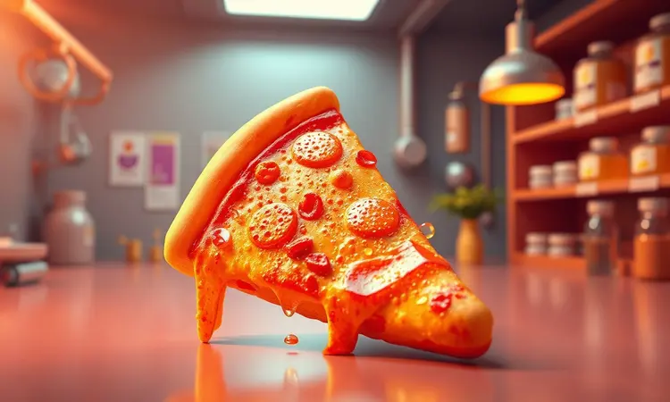
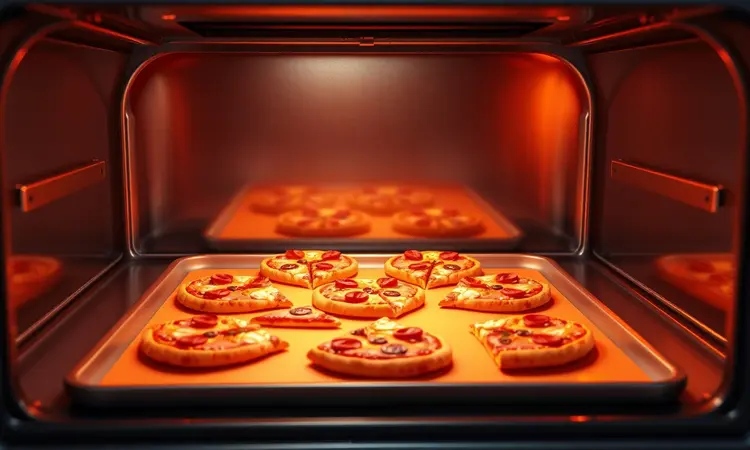
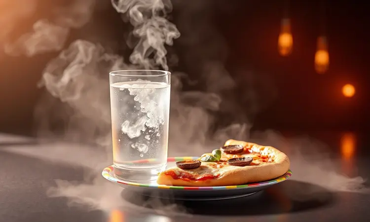
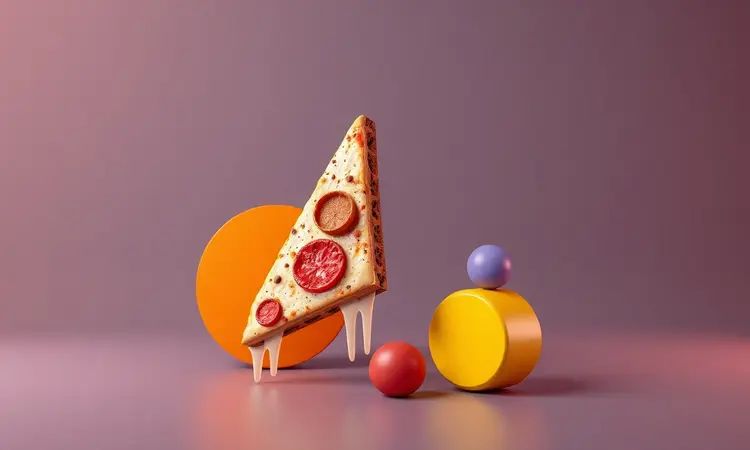

Imagine chegar em casa após um longo dia, abrir a geladeira com aquela expectativa por uma fatia da pizza de ontem, e deparar-se com uma massa murcha, que perdeu toda a crocância. Sabemos exatamente como é essa decepção, e aqui vamos transformá-la.

Este não é apenas mais um guia sobre como esquentar pizza: é o seu manual para recuperar não só o calor, mas a alegria daquela primeira mordida.

Você descobrirá métodos que vão da urgência do micro-ondas à sofisticação da frigideira, além de segredos que chefes guardam a sete chaves.

<SummaryList products={frontmatter.top_products} />

## Por que a pizza fica murcha no dia seguinte? (A Ciência por Trás)

O problema começa quando você fecha a caixa ainda quente. O vapor que sobe dos ingredientes encontra a tampa fria, se transforma em gotículas e cai direto na massa, deixando-a encharcada.

É como tomar banho com a roupa: a crosta perde sua textura característica e absorve toda essa umidade. Além disso, o queijo continua liberando gordura lentamente, que também contribui para aquela sensação borrachenta.

Entender isso é o primeiro passo para evitar o problema, e para saber como revertê-lo de forma eficiente.

## Como armazenar a pizza corretamente para preservar a textura

Resista à tentação de guardar a pizza imediatamente. Deixe-a respirar por alguns minutos na bancada até que atinja a temperatura ambiente. Enquanto isso, prepare um abrigo mais adequado do que a caixa de papelão original.

Embrulhe cada fatia individualmente em papel alumínio, criando uma barreira contra o ar sem sufocá-la completamente. Se preferir organização, arrange-as em uma assadeira e cubra com plástico filme, garantindo que não haja contato direto entre as fatias.

Para quem planeja um estoque estratégico, o congelador é seu aliado: apenas lembre-se de embrulhar bem para evitar que o frio resseque os sabores.

## Quanto tempo a pizza pode ficar fora da geladeira com segurança?

Aqui vale a regra das duas horas, ou melhor, uma, se o termômetro passar dos 32°C. Depois desse período, o risco cresce exponencialmente.

Bactérias adoram a combinação de carboidrato, proteína e temperatura ambiente, então aquela fatia que ficou na mesa durante o filme pode se transformar em um problema. O sistema é simples: quanto mais rápido você refrigerar, mais seguro será consumir depois.

E se a dúvida bater, lembre-se de que sempre é melhor congelar do que arriscar.

## 1. Na Frigideira: O Método Favorito dos Chefs para Crocância Máxima

<ProductBox 
  title={frontmatter.top_products[0].title} 
  image={frontmatter.top_products[0].image} 
  link={frontmatter.top_products[0].link} 
/>

É sábado à tarde, você tem tempo e quer transformar aquela fatia esquecida em uma experiência gourmet. Aqueça uma frigideira antiaderente em fogo médio e coloque a pizza diretamente, sem óleo.

Aguarde cerca de três minutos até ouvir aquele som característico de crocância. Aqui está o segredo: adicione algumas gotas de água na lateral da frigideira e tampe rapidamente. O vapor criado derrete o queijo de maneira uniforme enquanto mantém a base sequinha.

O resultado? Uma crosta que lembra forno a lenha e um recheio que parece acabado de preparar.

## 2. Na Airfryer: Praticidade e Resultado de Forno à Lenha em Minutos

<ProductBox 
  title={frontmatter.top_products[1].title} 
  image={frontmatter.top_products[1].image} 
  link={frontmatter.top_products[1].link} 
/>

Para quem busca equilíbrio entre velocidade e qualidade, a airfryer é a resposta. Pré-aqueça a 180°C por apenas três minutos, depois distribua as fatias em uma única camada, sem sobreposições.

O ar circulante age como um mini-forno profissional, garantindo que todos os lados recebam calor igualmente. Em cinco minutos, você tem uma pizza com aquela textura artesanal que parecia perdida.

Uma gota de água sobre a massa antes de fechar a cesta faz milagres, mantendo a suculência sem comprometer a crocância.

## 3. No Forno Convencional: A Melhor Opção para Várias Fatias de uma Vez

Quando a fome é coletiva e você precisa reaquecer três, quatro ou cinco fatias de uma vez, o forno tradicional ainda é imbatível. Pré-aqueça a 190°C e posicione as fatias diretamente na grade do forno (com uma assadeira embaixo para eventuais respingos).

Esse método permite que o calor envolva a pizza por todos os lados, restaurando tanto a base quanto as bordas à sua glória original. Em cerca de 12 minutos, você serve uma refeição que ninguém diria ser sobra.

## 4. No Micro-ondas: O Truque do Copo d'Água para Não Deixar a Massa Elástica

São 22h, você acabou de chegar em casa e a fome é urgente. O micro-ondas parece a única opção, mas sabemos o risco: aquela massa borrachenta que desanima qualquer um. A solução está em um copo de água comum.

Coloque-o ao lado da pizza no micro-ondas e aqueça por um minuto. A água absorve parte das micro-ondas e libera vapor, que mantém a umidade equilibrada na massa.

Não será tão crocante quanto os outros métodos, mas garantirá uma experiência digna quando o tempo é seu maior inimigo.

## 5. Como Esquentar Pizza Congelada sem Ressecar o Recheio

A pizza congelada tem um desafio extra: como derreter o queijo sem secar todo o recheio? Ignore as instruções da embalagem e vá direto para o forno convencional a 180°C, posicionando a pizza na grade média.

Esse espaço permite que o calor circule por baixo, crocantizando a massa, enquanto o ar quente aquece os ingredientes por cima sem ressecá-los.

Se preferir agilidade, use uma frigideira com tampa em fogo baixo e adicione uma colher de água para criar uma câmara de vapor caseira.

## Dicas de Especialista: Como 'Revitalizar' o Sabor da Pizza Amanhecida

<ProductBox 
  title={frontmatter.top_products[2].title} 
  image={frontmatter.top_products[2].image} 
  link={frontmatter.top_products[2].link} 
/>

Às vezes a pizza não precisa apenas de calor, precisa de um upgrade. Experimente adicionar uma pitada de orégano fresco ou flocos de pimenta calabresa antes de reaquecer. Uma fina camada de azeite nas bordas transforma a massa em algo especial.

Se o queijo parece ter perdido personalidade, um pouco de parmesão ralado na última minute faz toda a diferença. E para os mais ousados: uma base leve de molho de tomate caseiro pode reviver até a fatia mais cansada.

## Erros Comuns que Você Deve Evitar ao Requentar Pizza

O maior equívoco é tratar todos os métodos como iguais. Micro-ondas sem o copo d'água é garantia de decepção. Frigideira em fogo alto queima a base antes do queijo derreter. Cobrir completamente a pizza durante o aquecimento cria um efeito sauna que destrói a crocância.

E o mais sutil: ignorar que cada pizza é única. Massa fina precisa de menos tempo; recheio generoso exige paciência. Conhecer sua fatia é tão importante quanto conhecer seu aparelho.

## Perguntas Frequentes (FAQ) sobre Pizza Amanhecida

'Posso realmente comer pizza de três dias atrás?' Sim, desde que tenha passado mais tempo na geladeira do que na mesa. 'Qual método não decepciona nunca?' A frigideira com truque do vapor é o campeão de consistência.

'E se eu só tiver micro-ondas?' O copo d'água é sua salvação, mas considere investir em uma airfryer pequena, que muda completamente o jogo. 'Congelar estraga o sabor?' Pelo contrário: feito corretamente, preserva a experiência quase como nova.

## Conclusão

Reaquecer pizza deixou de ser uma simples etapa pós-sobra para se tornar uma arte de resgate culinário.

Cada método que exploramos, da urgência do micro-ondas à cerimônia da frigideira, oferece não apenas calor, mas a possibilidade de surpreender-se novamente com um sabor que você pensava ter perdido.

Lembre-se: a melhor fatia não é necessariamente a primeira, mas aquela que você soube reviver com inteligência e um pouco de cuidado. Na próxima vez que abrir a geladeira e encontrar aquela pizza esquecida, você não verá um restante, mas uma oportunidade.

Uma oportunidade de transformar o comum em especial, o amanhecido em redescoberto. E talvez, quem sabe, até preferir a versão requentada à original.