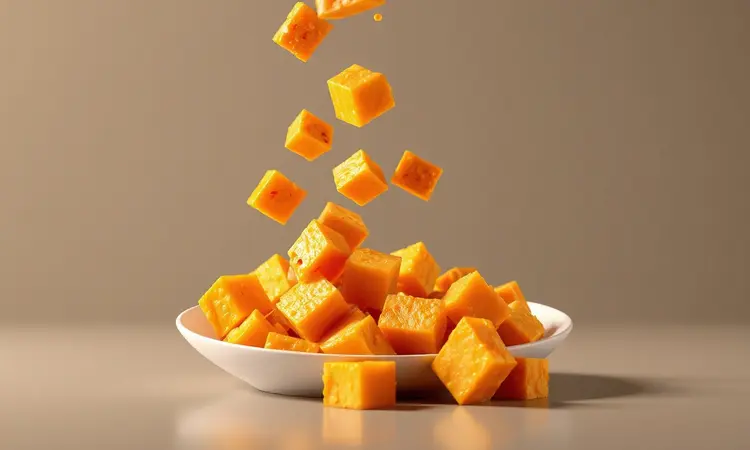
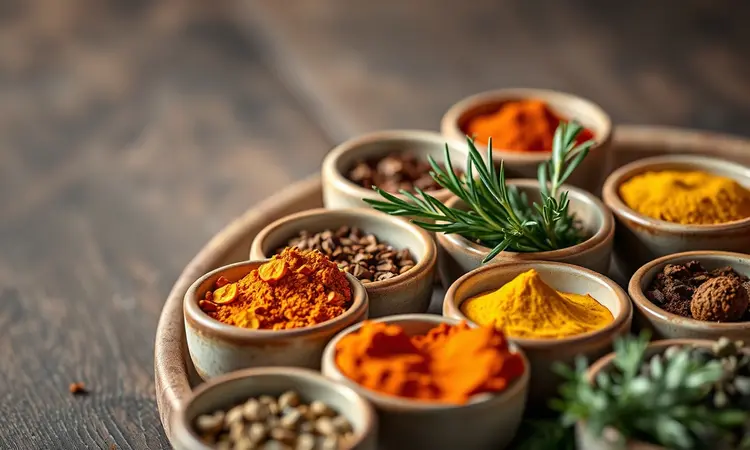
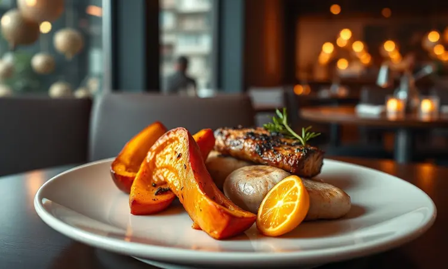

Você já tentou fazer abóbora assada no forno e desistiu por conta do tempo demorado ou porque ela ficou murcha? Muita gente compartilha dessa frustração, mas a boa notícia é que a fritadeira elétrica transforma completamente essa experiência.

Neste guia, vou te mostrar como preparar uma abóbora na Airfryer que fica incrivelmente macia por dentro e douradinha por fora, usando menos tempo do que uma série no streaming.

Vamos descobrir juntos desde o melhor tipo de abóbora até truques de chef para temperar e facilitar o corte, transformando um desafio culinário em um momento prazeroso.

<SummaryList products={frontmatter.top_products} />

## Por que preparar abóbora assada na Airfryer?

Imagine aquela onda de calor que envolve cada pedaço da abóbora, criando uma crosta irresistível enquanto preserva toda a maciez interior.

É exatamente isso que a Airfryer faz ao utilizar a circulação intensa de ar quente, oferecendo uma textura crocante por fora e macia por dentro, como o assado tradicional, só que em uma fração do tempo. O melhor?

Você precisa de praticamente nenhum óleo, tornando o prato mais saudável e leve. Para quem busca praticidade sem abrir mão do sabor, essa é uma alternativa perfeita como acompanhamento ou até mesmo como um lanche nutritivo que vai surpreender sua família.

Se você está começando agora, modelos como a Philco PFR2200 pela versatilidade, a Mondial AF-30-DI para quem tem espaço limitado, ou a Electrolux Grand Efficient 4L como meio-termo ideal, garantem que você tenha o equipamento certo para essa jornada.

O segredo está em como você aproveita essa tecnologia simples para transformar ingredientes básicos em experiências memoráveis.

## Qual a melhor abóbora para assar: Cabotiá, Moranga ou Menina?

Escolher a abóbora certa é como selecionar o personagem principal de uma história. Cada tipo traz uma personalidade única para o seu prato.

A Cabotiá encanta com seu sabor adocicado e textura que praticamente derrete na boca, perfeita para quem busca um toque mais delicado e reconfortante.

Já a Moranga se impõe com sua polpa firme, mantendo a estrutura mesmo após o cozimento, ideal para quem gosta de pedaços que mantêm a identidade no prato.

E a Menina, menos comum mas não menos especial, surpreende com seu sabor delicado que conversa bem com temperos mais ousados. Todas elas revelam seu melhor lado na Airfryer, mas a escolha final depende do que sua memória afetiva deseja reviver ou criar.

## Ingredientes básicos para uma abóbora irresistível

A simplicidade aqui é uma arte. Para transformar sua abóbora em uma pequena obra-prima, você precisa apenas de abóbora (a japonesa é minha favorita, mas use o que tiver), azeite de oliva de boa qualidade, sal e pimenta a gosto. Parece pouco?

Esses quatro elementos, quando combinados com cuidado, criam uma alquimia de sabores que dispensa complicações.

O azeite não só ajuda na crocância, como carrega os temperos até o coração da abóbora, enquanto o sal realça todos os sabores naturais que vão se revelar durante o cozimento.

## Passo a Passo: Como fazer abóbora na Airfryer (Receita Base)

Vamos ao que interessa. Comece descascando sua abóbora e cortando-a em pedaços uniformes, não muito grandes nem muito pequenos. Imagine cubos que cabem confortavelmente na sua mão.

Em uma tigela, misture os pedaços com azeite e sal, massageando bem para que cada pedacinho receba seu carinho. Pré-aqueça sua Airfryer a 200°C, a temperatura que transforma simples pedaços em pequenas obras-primas douradas.

Arrume a abóbora no cesto, sem sobrepor muito, e deixe por cerca de 15 a 20 minutos. Na metade do tempo, dê uma mexida gentil para garantir que todos os lados recebam o mesmo carinho do ar quente. Esse ritual simples esconde o segredo da crocância perfeita.

### Truque de mestre: Como amolecer a casca da abóbora para cortar sem esforço

A casca dura da abóbora já fez muitos cozinheiros desistirem antes mesmo de começar. Mas existe um truque tão simples quanto eficaz.

Perfure a casca em vários pontos com um garfo, coloque a abóbora inteira em um prato e leve ao micro-ondas por 3 a 5 minutos em potência alta. O que acontece? O calor amolece a casca o suficiente para que sua faca deslize sem esforço, como manteiga.

Depois desse banho de calor, usando uma faca bem afiada, você consegue fazer os cortes desejados sem aquela luta épica que costuma terminar com a abóbora escorregando da bancada. É ganhar tempo e evitar frustrações antes mesmo de começar a receita de verdade.

### Utensílios recomendados: Facas de Chef para cortes precisos

<ProductBox 
  title={frontmatter.top_products[1].title} 
  image={frontmatter.top_products[1].image} 
  link={frontmatter.top_products[1].link} 
/>

Uma boa faca não é apenas uma ferramenta, é uma extensão da sua mão. Para quem quer cortar com precisão e segurança, investir em uma faca de chef de qualidade faz toda diferença.

A linha Century da Tramontina oferece durabilidade e afiação que resistem ao tempo, enquanto as Wüsthof, embora mais caras, são como jóias que facilitam qualquer trabalho na cozinha.

Para um equilíbrio perfeito entre custo e benefício, as facas de 8 polegadas da Mundial cumprem seu papel com excelência.

O que importa mesmo é o cabo ergonômico que se adapta à sua mão, transformando o corte de abóbora de uma tarefa árdua em um movimento fluido e prazeroso.

## Tempo e temperatura ideais: O segredo da crocância

Aqui está a ciência por trás da magia. A temperatura de 200°C não é um número aleatório: é o ponto onde a umidade interna da abóbora cria vapor enquanto o exterior começa seu processo de caramelização.

Os 15 a 20 minutos são o tempo necessário para que essa dança entre maciez interna e crocância externa aconteça na medida certa. Quando você mexe os pedaços na metade do tempo, está garantindo que todos tenham a mesma oportunidade de brilhar.

E sim, a potência do seu modelo influencia: aparelhos mais potentes podem requerer 1-2 minutos a menos, enquanto os mais simples podem pedir um pouco mais de paciência. Aprender a "ouvir" seu equipamento faz parte da jornada.

## 3 Variações de Temperos para elevar o nível do prato

Agora vamos brincar de alquimista na cozinha. Os temperos são a personalidade da sua abóbora, e cada combinação conta uma história diferente. Imagine o aroma que vai tomar sua cozinha quando você experimentar essas três possibilidades.

### 1. Clássica com Tomilho e Alho (Estilo Rita Lobo)

Esta é para os tradicionalistas que acreditam que algumas combinações são atemporais. Cubos uniformes de abóbora recebem um banho de azeite, sal, pimenta, alho picado generosamente e folhas frescas de tomilho.

Na Airfryer a 200°C por 15 a 20 minutos, acontece a mágica: o alho carameliza levemente, o tomilho libera seus óleos essenciais e a abóbora absorve todos esses sabores enquanto desenvolve sua crosta dourada.

O resultado é um acompanhamento que conversa com praticamente qualquer prato principal, do frango mais simples ao assado mais elaborado.

### 2. Versão Fit: Páprica Defumada e Cúrcuma

Para quem busca sabor e benefícios em cada garfada. A páprica defumada não só empresta seu aroma irresistível de churrasco, como traz antioxidantes para a festa. A cúrcuma, além de sua cor vibrante, oferece propriedades anti-inflamatórias que seu corpo agradece.

Misture essas especiarias com azeite e envolva bem cada pedaço de abóbora antes de levá-la à Airfryer. O que você ganha?

Pedaços que são uma festa para os olhos e para o paladar, com crocância perfeita por fora e uma maciez interior que carrega a complexidade desses temperos especiais.

### 3. Agridoce: Mel e Alecrim

Esta combinação é para os românticos da cozinha. O mel, com sua doçura natural, e o alecrim, com seu perfume terroso, criam uma dança de sabores que surpreende a cada mordida.

Aplique a mistura generosamente na abóbora e observe como o calor da Airfryer carameliza o mel, formando uma crosta brilhante e levemente crocante enquanto o alecrim infunde seu aroma em cada fibra.

É a opção perfeita para quando você quer transformar um simples acompanhamento no protagonista da refeição, seja como prato principal leve ou como a estrela de uma mesa de petiscos.

## Sugestões de Cardápio: O que servir com abóbora assada?

A abóbora assada é como aquele amigo que se dá bem com todo mundo. Para uma refeição leve e nutritiva, combine com quinoa temperada com limão e salsinha: os grãos levemente crocantes contrastam perfeitamente com a maciez da abóbora.

Uma salada fresca com rúcula, nozes e queijo feta em cubos traz a crocância e o salgado que equilibram o doce natural do legume.

Se a fome pede mais substância, pedaços de frango grelhado marinado com as mesmas ervas da abóbora, ou tofu temperado com shoyu e gengibre, criam uma harmonia de proteínas e vegetais.

E nunca subestime o poder de um molho: iogurte natural com hortelã picada ou tahine com suco de limão adicionam a cremosidade final que fecha qualquer refeição com chave de ouro.

## Como saber se a abóbora está pronta e no ponto certo?

Existe um teste simples que nunca falha: pegue um garfo e espete o pedaço mais grosso de abóbora. Se ele deslizar suavemente, como se estivesse encontrando manteiga macia, está perfeita.

Observe também a cor: as bordas devem estar douradas e levemente caramelizadas, sinal de que a reação de Maillard (aquela que cria os sabores complexos) aconteceu.

O tempo pode variar entre 15 e 25 minutos dependendo da espessura dos pedaços e da potência da sua Airfryer, mas seus olhos e o teste do garfo são guias mais confiáveis que qualquer timer.

Quando chegar nesse ponto, você saberá: é a textura macia por dentro e crocante por fora que justifica todo o processo.

## Dicas de conservação e como reaproveitar as sobras

Se sobrar (o que é raro, mas acontece), armazene a abóbora em um recipiente hermético na geladeira, onde ela se mantém perfeita por 3 a 5 dias. As sobras são matéria-prima para novas criações.

Transforme-as em uma sopa cremosa batendo com caldo de legumes e um toque de creme de leite. Purê de abóbora vira base para molhos ou acompanhamento elegante. Pedaços frios surpreendem em saladas ou como recheio de omeletes.

E aquela abóbora que perdeu um pouco da crocância? Dê nova vida na Airfryer por 3-4 minutos para recuperar a textura. Criatividade na cozinha também significa saber dar novos propósitos ao que já está pronto.

## Conclusão

Preparar abóbora na Airfrayer vai muito além de seguir uma receita: é sobre ressignificar seu relacionamento com a cozinha. O que antes era um desafio demorado e frustrante se transforma em um ritual de 20 minutos que entrega resultados consistentes e deliciosos.

Você não está apenas cozinhando um legume, está dominando uma técnica que libera tempo, reduz esforço e amplia possibilidades. Cada pedaço dourado que sai da Airfryer carrega a promessa de que cozinhar pode ser simples, saudável e profundamente satisfatório.

Comece com a receita base, ouse com as variações de tempero e descubra como esse método pode se estender a outros vegetais.

Sua próxima abóbora assada não será apenas mais uma acompanhamento, será uma declaração de que a praticidade e o sabor podem, sim, andar de mãos dadas na sua cozinha.

Agora é sua vez: escolha sua abóbora, acenda sua Airfryer e escreva sua própria história de sucesso culinário.