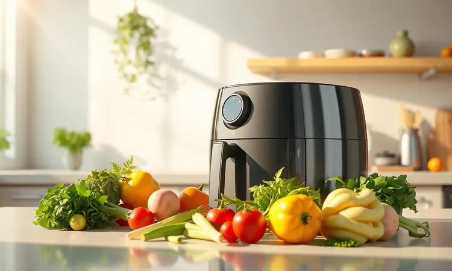
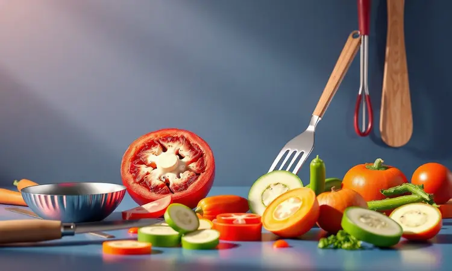

Você quer um acompanhamento saudável, rápido e delicioso, mas tem medo que a abobrinha fique murcha, sem graça ou amargar na fritadeira elétrica? Você não está sozinho. A abobrinha é um dos vegetais mais versáteis, mas exige técnica para atingir a textura perfeita.

Neste guia definitivo, eu vou te mostrar como fazer abobrinha na airfryer de 5 formas diferentes, garantindo aquela crocância irresistível e um sabor de dar água na boca.

Prepare-se para aprender desde os chips sequinhos até versões recheadas e empanadas, além de descobrir os truques de mestre que os chefs usam para nunca errar o ponto.

<SummaryList products={frontmatter.top_products} />

## Por que preparar Abobrinha na Airfryer é a melhor escolha saudável?

Imagine transformar um simples vegetal em algo que parece ter sido frito, mas sem aquele peso na consciência depois. É isso que a airfryer faz com a abobrinha.

Todo aquele ar quente circulante trabalha mágica, criando uma crocância que você normalmente só conseguiria mergulhando em óleo. O resultado?

Você reduz drasticamente as calorias e gorduras, enquanto mantém intactos todos os nutrientes que fazem da abobrinha uma escolha inteligente. Ela é rica em fibras que saciam, vitaminas que nutrem e tem uma versatilidade incrível.

Mais do que um método de cozimento, é uma forma de redescobrir legumes, provando que saudável e saboroso podem caminhar juntos sem concessões.

## O segredo para a abobrinha não ficar murcha e nem amargar na Airfryer

E se eu te disser que a diferença entre uma abobrinha murcha e outra perfeita está em um simples ritual de 30 minutos? Tudo começa quando você corta os pedaços de forma uniforme. Depois, mergulhe-os em água com sal e espere.

Esse tempo não é perdido, é o momento em que a abobrinha libera sua umidade excessiva e aquele sabor amargo que pode estragar qualquer prato. Quando você retira esses pedaços e os seca bem, está preparando o palco para o milagre acontecer.

Cada fatia está pronta para receber o calor da airfryer de forma homogênea, garantindo crocância de ponta a ponta e o sabor puro do vegetal.

### Fatiador Mandoline: A ferramenta para chips com espessura perfeita

<ProductBox 
  title={frontmatter.top_products[0].title} 
  image={frontmatter.top_products[0].image} 
  link={frontmatter.top_products[0].link} 
/>

Falando em uniformidade, aqui está o seu aliado secreto. O mandoline não é apenas uma ferramenta. É o garantidor daquela experiência sensorial perfeita onde cada chip tem exatamente a mesma espessura. Não precisa ser um modelo caríssimo.

Existem opções em aço inoxidável que, embora representem um pequeno investimento, transformam completamente sua relação com vegetais. Pense nisso: quando todas as fatias são idênticas, todas recebem a mesma quantidade de calor ao mesmo tempo.

O resultado são chips que ficam igualmente crocantes, sem aqueles pedaços que queimam enquanto outros ainda estão moles. É a precisão que transforma um simples aperitivo em uma experiência gourmet.

## Receita 1: Abobrinha na Airfryer simples com ervas finas e alho

Vamos começar pelo básico que encanta. Pegue sua abobrinha já cortada em rodelas ou palitos e imagine transformar esses pedaços simples em algo que vai roubar a cena na mesa.

Em uma tigela, misture azeite, sal, pimenta a gosto e o segredo: um mix de ervas finas que libera aroma ao calor. Orégano, tomilho e aquele alho picado que sussurra "caseiro".

Coloque tudo na cesta em uma única camada, ajuste para 200°C e deixe a mágica acontecer por 12 a 15 minutos. Não se esqueça de mexer na metade do tempo.

O que sai não é apenas abobrinha, é a memória de um almoço de domingo, seja como acompanhamento ou aquele lanche que você sente orgulho de comer.

## Receita 2: Chips de abobrinha crocantes e low carb (Passo a passo)

Agora vamos ao que muitos consideram impossível: chips de vegetal realmente crocantes sem fritura. Com seu mandoline em mãos, transforme a abobrinha em fatias tão finas que quase dão para ver através. Tempere com sal e especiarias, depois espalhe-as na airfryer a 180°C.

Quinze minutos depois, virando na metade do tempo, você terá em mãos não apenas um aperitivo, mas a prova concreta de que comer bem não tem que ser sem graça. São crocantes, leves e têm aquele sabor concentrado que faz você querer mais.

Perfeitos para aquela tarde de filme quando batatas fritas parecem pesadas demais.

### Pulverizador de Azeite: O segredo para a crocância sem excesso de gordura

<ProductBox 
  title={frontmatter.top_products[1].title} 
  image={frontmatter.top_products[1].image} 
  link={frontmatter.top_products[1].link} 
/>

Você já percebeu como às vezes o azeite se acumula em alguns pedaços e quase desaparece em outros? É aí que esse pequeno herói entra em cena.

Um bom pulverizador de azeite não é apenas um utensílio, é sua garantia de que cada fatia de abobrinha receberá exatamente a quantidade necessária para ficar crocante, sem o excesso que pesa. Imagine uma névoa fina de sabor cobrindo uniformemente seus chips.

A versatilidade é outro trunfo. Use com vinagres ou sucos cítricos para criar perfis de sabor únicos. Escolha modelos de vidro que distribuam melhor o líquido e transforme esse acessório em seu maior aliado na busca pela crocância perfeita sem culpa.

## Receita 3: Abobrinha empanada na airfryer (Sem fritura e muito sabor)

Quem disse que empanado tem que ser pesado e gorduroso? Vamos reinventar esse conceito. Corte sua abobrinha em rodelas ou tiras e prepare uma mistura de farinhas que é puro sabor.

Farinha de trigo, farinha de rosca, sal, pimenta e seus temperos favoritos criam uma camada que vai surpreender. Passe cada pedaço na mistura até ficar bem coberto, coloque na airfryer pré-aquecida e ajuste para 200°C.

Nos próximos 10 a 15 minutos, virando na metade, você vai testemunhar a transformação: dourado perfeito por fora, macio e suculento por dentro. O que sai da cesta não parece, não cheira nem tem a textura de comida saudável.

Parece indulgência pura, mas você sabe a verdade.

## Receita 4: Abobrinha recheada com queijo e bacon na airfryer

Para dias que pedem algo especial, vamos elevar o nível. Corte as abobrinhas ao meio e retire um pouco do miolo, criando pequenos barquinhos esperando por um recheio que é pura felicidade.

Misture queijo (imagine muçarela ou cheddar derretendo) com pedaços de bacon pré-cozidos e seus temperos favoritos. Preencha cada metade com essa combinação que promete sabor.

A 180°C, em 10 a 15 minutos, a magica acontece: as abobrinhas ficam macias, o queijo forma uma camada dourada e o bacon libera seu aroma inconfundível.

Sirva quente e observe como esse prato simples se torna o centro das atenções, perfeito como aperitivo ou acompanhamento que transforma uma refeição comum em celebração.

## Receita 5: Sticks de abobrinha (Palitinhos crocantes para petiscar)

Às vezes, o que queremos são aqueles petiscos que podemos pegar com as mãos, perfeitos para compartilhar. Os sticks de abobrinha nasceram para esse momento. Corte a abobrinha em tiras longas e finas, como palitos esperando por sua transformação.

Passe-os por farinha de trigo, depois por ovo batido e finalmente por uma mistura de farinha de rosca com temperos que você escolhe. Sal, pimenta, alho em pó.

Doze minutos a 200°C, virando na metade, e eles saem crocantes por fora, macios por dentro, prontos para serem mergulhados em seus molhos favoritos. São a prova de que lanches podem ser práticos, saborosos e te fazerem sentir bem ao mesmo tempo.

## Melhores acessórios para facilitar o preparo e a limpeza da sua Airfryer

<ProductBox 
  title={frontmatter.top_products[2].title} 
  image={frontmatter.top_products[2].image} 
  link={frontmatter.top_products[2].link} 
/>

Cozinhar deveria ser prazeroso, não uma batalha contra a sujeira. É por isso que alguns acessórios não são apenas úteis, são transformadores. Formas de silicone ou antiaderentes são como ter um assistente na cozinha.

Elas protegem sua cesta, facilitam a limpeza e abrem um mundo de possibilidades, desde bolos até tortas que você nem imaginava possível fazer na airfryer. Grelhas metálicas permitem que você cozinhe camadas diferentes de alimentos simultaneamente, otimizando seu tempo.

Forros de papel descartável são o segredo para preparos com molhos, evitando aquela limpeza difícil depois. Um pincel de silicone distribui temperos e óleos com precisão, enquanto pegadores de silicone te protegem do calor sem riscar sua cesta.

Antes de comprar, verifique a compatibilidade com seu modelo. Esses itens não são gastos, são investimentos em praticidade que fazem você querer usar sua airfryer todos os dias.

## Erros comuns que você deve evitar ao cozinhar abobrinha na fritadeira

Todo aprendizado tem seus tropeços, mas você pode evitá-los. Primeiro, respeite a secagem da abobrinha. Se ela entra na airfryer molhada, sai mole. Segundo, a espessura importa. Fatias muito finas queimam antes de ficarem crocantes.

Terceiro, nunca subestime o poder do tempero. Sal e ervas não são opcionais, são o que transforma vegetal em prato. Quarto, e isso é crucial, não sobrecarregue a cesta. Ar precisa circular.

Quando você cozinha em pequenas porções, cada pedaço recebe calor uniforme, garantindo aquela crocância que faz você sorrir ao morder.

## Dicas extras de temperos e combinações de cardápio

Agora que você domina as técnicas, vamos falar de personalidade. Alho em pó, cebola desidratada e pimenta-do-reino são sua base para qualquer preparo. Alecrim fresco ou seco acrescenta notas aromáticas que elevam o prato.

Nos últimos minutos de cozimento, queijo parmesão ralado cria uma crosta dourada que é puro êxtese.

Combine sua abobrinha com outros legumes, criando um arco-íris de cores e sabores na sua mesa. Cenoura e pimentão trazem doçura e frescor naturais. Para finalizar, imagine um molho à base de iogurte e ervas que refresca e equilibra toda a crocância.

São essas combinações que transformam uma refeição em memória, provando que comer bem é uma forma de arte acessível a todos.

## Perguntas Frequentes (FAQ) sobre Abobrinha na Airfryer

Surgem dúvidas? Vamos esclarecer as principais. A abobrinha precisa de pré-cozimento? Absolutamente não. Corte, tempere e vá direto para a airfryer. O tempo varia entre 10 e 15 minutos, dependendo da espessura.

Uma dica valiosa: a quantidade na cesta influencia diretamente o resultado. Menos é mais. Espaço significa ar circulando, e ar circulando significa crocância perfeita.

## Conclusão

O que começou como um medo de abobrinha murcha se transformou em um arsenal de possibilidades. Você agora tem em mãos não apenas receitas, mas técnicas que garantem sucesso sempre.

Da simplicidade das ervas finas à indulgência do empanado sem culpa, cada variação prova que saudável e delicioso não são opostos, são complementos perfeitos.

As ferramentas certas, como o mandoline e o pulverizador, não são luxos, são seus aliados na busca pela textura perfeita. Lembre-se dos erros comuns que você agora sabe evitar e das combinações de sabores que podem transformar qualquer dia comum.

Sua airfryer não é apenas um eletrodoméstico, é seu portal para redescobrir vegetais com alegria e criatividade. Que tal escolher uma receita para experimentar hoje? Sua próxima refeição crocante e saborosa está esperando por você.