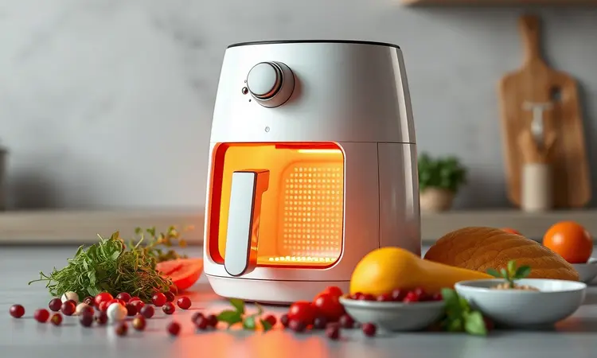
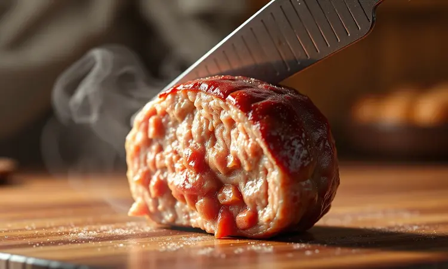
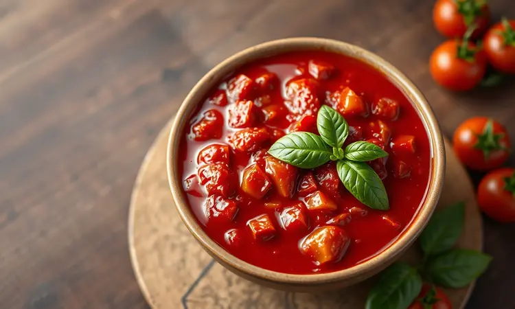

Imagine aquela sexta-feira corrida: você chega em casa cansado, mas quer algo mais especial que comida congelada. As crianças estão famintas e você mal tem tempo para cozinhar. É nesse momento que preparar almôndegas na Airfryer se torna seu superpoder culinário.

Crocantes por fora, suculentas por dentro, sem a bagunça do óleo espirrando pela cozinha e prontas em menos tempo que uma chamada de delivery.

Este guia vai transformar essa receita clássica em sua aliada secreta, com dicas que vão de como fazer a mistura perfeita até o jeito certo de cozinhar as congeladas direto da embalagem.

<SummaryList products={frontmatter.top_products} />

## Por que a Airfryer é a melhor aliada para preparar almôndegas?

O segredo está na tecnologia que parece feita sob medida para esse prato.

Enquanto na frigideira você precisa virar cada almôndega com cuidado para não queimar um lado, a Airfryer envolve todas elas em ar quente, garantindo uma crocância uniforme que parece saída de um restaurante italiano.

Sem óleo significa mais saúde (e menos cheiro na cozinha), mas também uma limpeza que leva segundos. E o melhor: em apenas 15 minutos, você tem um jantar completo pronto, sem precisar ficar vigiando a panela.

É a praticidade que você sempre quis, com o sabor que todos vão elogiar.

## Receita de Almôndega Caseira Suculenta na Airfryer

Vamos direto ao que interessa. Esta receita é sua base para almôndegas que derretem na boca, mantendo toda a umidade mesmo com o calor intenso da fritadeira. Guarde este passo a passo, pois você vai querer repeti-lo toda semana.

### Ingredientes e Tempero Especial para Carne Moída

500g de carne moída bovina (o segredo da suculência está na gordura, então prefira cortes como paleta ou peito)
Meia cebola picada fininha
2 dentes de alho amassados (ou mais, se você é daqueles que acredita que nunca é demais)
Um bom punhado de salsinha fresca picada
1 colher de sopa de molho inglês
Uma pitada generosa de pimenta-do-reino
Sal a gosto

A mágica acontece quando você mistura tudo com as mãos. Sim, livre-se da colher e sinta a textura da carne se transformando em uma massa homogênea e ligeiramente pegajosa. É esse contato direto que garante que os temperos se distribuam por igual.

### Passo a Passo: Preparo e Modelagem Perfeita

Com as mãos levemente úmidas (para evitar que a carne grude), pegue porções do tamanho de uma noz e vá formando bolinhas compactas. Não aperte demais, ou elas ficarão duras. O tamanho ideal? Algo entre uma cereja e uma bola de golf, para que cozinhem por igual.

Pré-aqueça a Airfryer a 200°C por 5 minutos. Enquanto isso, organize as almôndegas na cesta, deixando espaço entre elas para que o ar circule livremente. 10 a 12 minutos geralmente são suficientes, mas dê uma olhada na metade do tempo e vire-as com cuidado.

Quando estiverem douradas e firmes por fora, estão prontas.

## Almôndegas Congeladas na Airfryer: Tempo e Temperatura Ideal

Aqui está o verdadeiro atalho para os dias de correria. Esqueça descongelar. Pegue as almôndegas congeladas direto do freezer e coloque-as na cesta já pré-aquecida a 200°C. O segredo é não amontoar, deixando cada uma com seu espaço.

Em 12 a 15 minutos (dependendo do tamanho), você terá almôndegas crocantes por fora e completamente aquecidas no centro. Como saber se estão prontas? Corte uma ao meio. Se o interior estiver quente e uniforme, é só servir.

Essa técnica salva jantares de última hora e mantém toda a praticidade que você busca.

## O Segredo da Suculência: Como evitar que a carne fique seca?

Nada mais frustrante que uma almôndega que parece uma bolinha de borracha. Para evitar essa cilada, três dicas fazem toda diferença:

1. Escolha carne com gordura. Pode parecer contra intuitivo para quem busca saúde, mas é essa gordura que derrete durante o cozimento, banhando a carne por dentro e mantendo-a úmida.

2. Cebola ralada é sua melhor amiga. Além de sabor, ela libera umidade que é absorvida pela carne. O mesmo vale para um fio de azeite na mistura.

3. Respeite o tempo. A tentação de deixar mais tempo para "ficar mais crocante" pode secar o interior. Confie no tempo sugerido e faça o teste do corte.

## Sugestões de Molhos Práticos para Acompanhar

Almôndegas são versáteis. Podem ser o centro do prato com um macarrão, servidas como petisco ou até em sanduíches. Mas um bom molho eleva qualquer apresentação. Veja duas opções que preparamos em minutos.

### Molho de Iogurte com Ervas Frescas

Leve, cremoso e com aquele frescor que corta a gordura da carne. Misture um pote de iogurte natural (sem sabor) com salsa, cebolinha e manjericão picados finamente. Um fio de azeite, suco de meio limão e sal e pimenta a gosto. Mexa e sirva gelado.

É a combinação perfeita para quem busca algo leve mas cheio de personalidade.

### Molho de Tomate Rústico Express

Para noites que pedem conforto. Em uma panela, refogue cebola e alho em azeite até perfumar a cozinha. Adicione tomates pelados picados (ou frescos, se tiver), uma pitada de sal, pimenta e folhas de manjericão.

Deixe cozinhar em fogo baixo por 15 minutos, amassando os tomates com um garfo para uma textura caseira. Esse molho envolve as almôndegas em um abraço quente que lembra jantares de família.

## Melhores Opções de Airfryer para Receitas de Carne

<ProductBox 
  title={frontmatter.top_products[0].title} 
  image={frontmatter.top_products[0].image} 
  link={frontmatter.top_products[0].link} 
/>

Se você está pensando em investir em uma ou quer otimizar a que já tem, alguns modelos se destacam para receitas de carne:

*   **WAP Barbecue FW00962**: Com tecnologia que reduz a fumaça e acessórios específicos para grelhados, é ideal para quem quer aquele sabor de churrasco em casa.

*   **Mondial AFN-40**: Equilíbrio perfeito entre capacidade e potência, garantindo almôndegas suculentas em grandes quantidades.

*   **Oster OFRT780**: O espeto giratório é um diferencial para quem gosta de variedade, perfeito para assados maiores.

*   **Electrolux Air Fryer Oven EAF90**: Versatilidade em 5 funções, incluindo rotisserie para inovações além das almôndegas.

Lembre-se: modelos com capacidade maior permitem preparar porções generosas de uma vez, ideal para famílias ou para congelar.

## Acessórios Úteis: Papel Antiaderente e Forros de Silicone para Facilitar a Limpeza

<ProductBox 
  title={frontmatter.top_products[1].title} 
  image={frontmatter.top_products[1].image} 
  link={frontmatter.top_products[1].link} 
/>

O pós-preparo pode ser rápido e indolor. Dois acessórios mudam o jogo:

Papel antiaderente perfurado: Descarte a preocupação de almôndegas grudadas na cesta. Coloque uma folha no fundo (certifique-se de que tem furos para circulação de ar) e, depois de pronto, jogue fora. Limpeza instantânea.

Forros de silicone reutilizáveis: Sustentabilidade e praticidade. São laváveis na máquina, duram anos e mantêm a suculência das almôndegas. A única ressalva: podem reduzir levemente a crocância, mas ajustando o tempo em 1-2 minutos a mais, você compensa.

A escolha depende do seu estilo. Quer zero esforço na limpeza? Papel. Prefere reduzir desperdício? Silicone.

## Perguntas Frequentes sobre Almôndegas na Airfryer (FAQ)

Posso colocar almôndegas congeladas direto na Airfryer?
Sim, e é exatamente essa a vantagem. Não precisa descongelar. Apenas aumente o tempo em 2-3 minutos em relação às frescas.

Elas ficam realmente crocantes sem óleo?
A circulação de ar quente intenso cria uma camada externa dourada e crocante, enquanto o interior mantém a umidade. É diferente da fritura (menos gordurosa), mas igualmente satisfatória.

Posso fazer a massa e congelar antes de cozinhar?
Perfeito! Modele as almôndegas, coloque em uma assadeira forrada com papel manteiga, congele por 2 horas e então transfira para um saco plástico. Assim você tem almôndegas caseiras prontas para qualquer emergência.

Quantas almôndegas cabem de uma vez?
Depende do tamanho do seu modelo. A regra é: nunca amontoar. Se precisar de muitas, faça em lotes. É melhor esperar alguns minutos extras do que ter almôndegas cozidas de forma irregular.

## Conclusão

Preparar almôndegas na Airfryer não é apenas uma técnica culinária, é uma libertação da cozinha tradicional. É sobre conseguir aquele sabor caseiro que aquece a alma, mas sem o trabalho que costumava acompanhá-lo.

Em 15 minutos, você transforma ingredientes simples em uma refeição que parece ter levado horas. Desde a mistura perfeita até o molho que completa o prato, cada etapa foi pensada para encaixar na sua rotina, não atrapalhá-la.

As almôndegas crocantes, suculentas e cheias de sabor estão a apenas um pré-aquecimento de distância. Que tal experimentar nesta noite? Sua Airfryer e seu paladar agradecem.