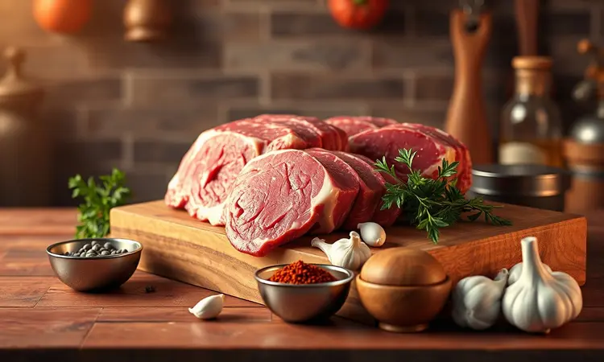
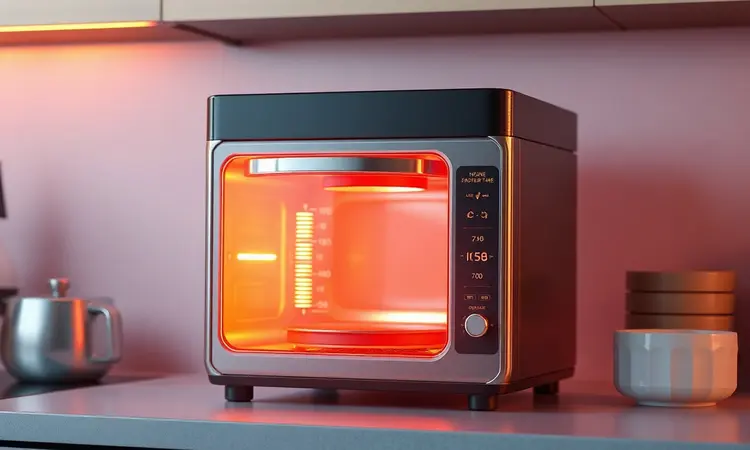
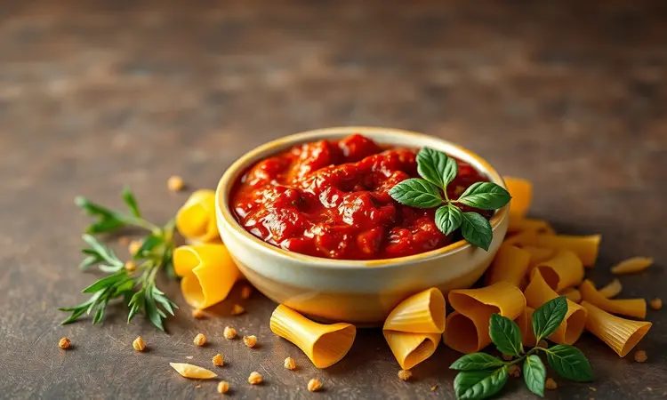

Você adora almôndegas, mas evita fazer em casa por causa da sujeira da fritura ou do tempo excessivo no forno convencional? Se você concorda que praticidade na cozinha é essencial, a air fryer é sua maior aliada.

Prometo que, com este guia, você vai aprender a preparar almôndegas extremamente suculentas, rápidas e muito mais saudáveis. Vamos explorar desde a escolha da carne ideal até o tempo exato para não deixar a carne ressecar, garantindo um resultado de chef na sua mesa.

<SummaryList products={frontmatter.top_products} />

## Por que fazer almôndegas na Air Fryer é a melhor opção?

Imagine ter aquele crocante perfeito por fora e o interior macio e suculento que derrete na boca, tudo isso sem precisar encarar uma panela cheia de óleo quente.

É exatamente essa experiência que a air fryer oferece: ela circula ar quente em alta velocidade, criando uma camada dourada deliciosa enquanto mantém os sucos naturais da carne presos dentro. O melhor? Você consegue isso em minutos, não em horas.

Aquece rapidamente, cozinha uniformemente e, por usar pouquíssimo óleo, transforma até as receitas mais indulgentes em opções que você pode saborear sem culpa. É praticidade que entrega sabor, não apenas velocidade.

## A Melhor Air Fryer para Receitas Rápidas

<ProductBox 
  title={frontmatter.top_products[0].title} 
  image={frontmatter.top_products[0].image} 
  link={frontmatter.top_products[0].link} 
/>

Para acertar na escolha, pense na sua rotina. Para porções menores e praticidade no dia a dia, o Mondial AFN-40 de 4 litros com 1500W é acessível e fácil de limpar, perfeito para quem cozinha para uma ou duas pessoas.

Se sua família é maior ou você gosta de preparar quantidades generosas de uma vez, o Mondial Grand Family Inox com 5 litros e 1900W oferece cozimento ainda mais rápido e a segurança de um timer que desliga automaticamente.

Quem busca versatilidade máxima vai adorar a Philco PFR2200, que funciona como air fryer, forno e desidratador em um único aparelho de 12 litros, ideal para experimentos culinários.

Já a Philips Walita Série 1000 XL combina tecnologia avançada com eficiência profissional para quem não abre mão da qualidade em grandes quantidades. Escolha com base no seu espaço e nas suas ambições culinárias.

## Escolhendo a Carne: O Segredo da Suculência

Aqui está o primeiro segredo: a gordura é sua amiga. Carne moída bovina pura oferece sabor robusto e textura firme, perfeita para quem gosta de consistência.

Para um resultado ainda mais suculento, misture bovina com suína: a gordura do porco vai derreter durante o cozimento, mantendo cada mordida úmida e saborosa. Prefere algo mais leve?

A carne de frango funciona maravilhosamente, especialmente quando você adiciona um toque extra de sabor com temperos generosos. Independente da sua escolha, lembre-se: carne com alguma gordura (cerca de 15 a 20%) é o que garante aquela textura que não desaponta.

## Ingredientes para a Almôndega Caseira Perfeita

Agora vamos dar vida à sua escolha de carne.

Para aproximadamente 500g de carne moída, você precisará de um ovo (liga perfeita), meia xícara de pão ralado (que absorve os sucos e mantém a suculência), e os aromáticos essenciais: uma cebola pequena picada e dois dentes de alho amassados.

É aqui que a personalização começa. Sal e pimenta são a base, mas um toque de orégano ou salsinha seca transforma o sabor comum em algo memorável. Quer um segredo extra?

Uma colher de sopa de molho de soja ou Worcestershire adiciona umami, essa profundidade de sabor que faz você pensar 'uau, isso é caseiro?'

## Passo a Passo: Como Preparar e Modelar

Misture todos os ingredientes em uma tigela grande com as mãos limpas. Sim, com as mãos: é a melhor forma de sentir se a textura está uniforme sem misturar demais (o que pode deixar as almôndegas duras).

Em seguida, modele bolinhas do tamanho de uma noz, pressionando firmemente para que mantenham o formato durante o cozimento.

Se você busca praticidade extra e tamanhos perfeitamente iguais (garantindo que todas cozinhem no mesmo tempo), uma colher dosadora de sorvete em aço inoxidável é um investimento que vale cada centavo.

Ela não apenas acelera o processo, mas também minimiza o contato direto com os alimentos, mantendo tudo mais higiênico. O mecanismo ejetor facilita liberar cada almôndega perfeitamente formada.

## Tempo e Temperatura Ideal na Air Fryer

Aqui está a ciência que elimina o chute. Pré-aqueça sua air fryer a 200°C por 5 minutos. Para almôndegas do tamanho de uma noz, 10 a 12 minutos são suficientes. O segredo? Vire-as cuidadosamente na metade do tempo.

Essa simples ação garante que todos os lados fiquem igualmente dourados e crocantes, enquanto o interior cozinha de forma uniforme, reter os sucos.

Você saberá que estão prontas quando estiverem com a cor dourada perfeita por fora e, ao cortar uma, o interior não estiver rosado. É consistência garantida, toda vez.

## 5 Dicas de Ouro para as Almôndegas não Ficarem Secas

1. Abuse dos aromáticos: cebola ralada (não apenas picada) libera umidade durante o cozimento.

2. Não compacte demais: bolinhas muito apertadas cozinham como pedras.

3. Use um pulverizador de azeite: uma leve névoa antes de cozinhar garante o dourado perfeito com quantidade mínima de gordura. Esses utensílios são versáteis para saladas e outras preparações, oferecendo controle total sobre o consumo de óleo.

4. Descanse antes de servir: espere 2-3 minutos depois de tirar da air fryer para os sucos se redistribuírem.

5. Quando em dúvida, subestime o tempo: você sempre pode colocar por mais 1-2 minutos, mas não pode 'descozinhar'.

## Variações Incríveis: Almôndegas Recheadas e Versão Fit

Que tal uma surpresa no centro? Insira um pequeno cubo de queijo muçarela ou um pedaço de queijo minas antes de fechar cada bolinha. Na air fryer, o queijo derrete criando um núcleo cremoso que contrasta perfeitamente com o exterior crocante.

Para uma versão fit, substitua a carne por grão-de-bico cozido e amassado ou lentilhas. Adicione ervas frescas como hortelã ou coentro, e especiarias como cominho e páprica defumada para um perfil de sabor vibrante.

São as mesmas almôndegas que você ama, reinventadas para qualquer momento ou preferência alimentar.

## Como Fazer Almôndega Congelada na Air Fryer (Direto do Freezer)

Esta é a magia da praticidade real. Pré-aqueça a 180°C por 5 minutos. Coloque as almôndegas congeladas diretamente na cesta, com espaço entre elas para o ar circular. Cozinhe por 15 a 20 minutos, virando na metade do tempo.

Elas estarão prontas quando douradas e aquecidas por dentro. Para facilitar ainda mais a limpeza depois dessa conveniência toda, considere usar forros de papel descartáveis específicos para air fryer.

Eles suportam altas temperaturas e criam uma barreira que torna a limpeza uma questão de segundos, embora em algumas receitas muito úmidas possam grudar levemente.

## Melhores Molhos e Acompanhamentos

As almôndegas são estrelas que brilham ainda mais com o elenco certo. Para molhos, experimente um chimichurri fresco (salsa, orégano, alho, vinagre e azeite) que corta a riqueza da carne, ou um molho barbecue caseiro para um toque defumado e adocicado.

Para acompanhamentos, batatas fritas na própria air fryer (sim, você pode fazer tudo no mesmo aparelho) ou uma salada verde crocante com tomates cereja e cebola roxa oferecem equilíbrio perfeito.

Sirva em um pão italiano aquecido para o sanduíche definitivo, ou sobre um macarrão al dente para um conforto reconfortante.

## Perguntas Frequentes (FAQ)

Posso congelar as almôndegas antes de cozinhar? Absolutamente. Modele as bolinhas, coloque em uma assadeira forrada com papel manteiga, leve ao freezer até ficarem firmes, então transfira para um saco freezer.

Cozinhe direto do congelado, adicionando 3-5 minutos extras ao tempo.

E se não tiver pão ralado? Farinha de rosca funciona igualmente bem. Em emergências, migalhas de biscoito água e sal ou mesmo aveia em flocos finos podem salvar sua receita.

Como evitar que grudem na cesta? Além do forro descartável, uma leve borrifada de óleo na cesta antes de pré-aquecer faz milagres.

## Conclusão

O que começou como um desejo por almôndegas caseiras sem o trabalho sujo da fritura se transforma, com a air fryer, em uma realidade deliciosamente simples.

Você não está apenas aprendendo a controlar temperaturas e tempos, está dominando a arte de criar refeições que nutrem tanto o corpo quanto a rotina.

As almôndegas crocantes por fora e suculentas por dentro são apenas o começo: cada receita bem-sucedida aumenta sua confiança na cozinha e cria memórias saborosas ao redor da mesa. A praticidade que você buscava agora tem o sabor da realização pessoal.

Então, o que você está esperando? Sua air fryer e essa receita estão prontas para transformar seu próximo jantar em uma celebração do que é bom, rápido e, acima de tudo, feito por você.