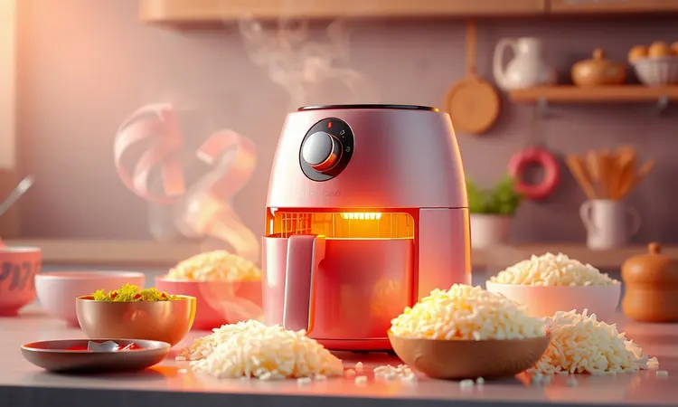

Já pensou em fazer aquele arroz de forno delicioso, mas desanimou só de pensar em ligar o forno convencional por longos minutos para uma porção pequena?

A boa notícia é que sua fritadeira elétrica pode fazer todo o trabalho pesado de forma muito mais rápida, econômica e sem perder a cremosidade.

Neste guia, você vai descobrir como preparar um arroz de forno irresistível, com queijo derretido e aquele gratinado de chef, tudo feito na Air Fryer. Vamos transformar suas sobras de arroz em um banquete completo em poucos passos!

<SummaryList products={frontmatter.top_products} />

## Por que Fazer Arroz de Forno na Air Fryer?

Imagine sair da rotina do arroz simples e entregar à mesa um prato que parece ter saído de um restaurante gourmet, mas feito em sua própria cozinha em menos de 20 minutos.

A Air Fryer não só acelera o processo, como transforma a experiência: aquele queijo que gratinaria em 30 minutos no forno convencional fica perfeito e crocante em poucos minutos.

A crosta dourada que se forma é tão convidativa que você vai querer fotografar antes de servir.

### Melhores Modelos de Fritadeira Elétrica para Receitas de Forno

<ProductBox 
  title={frontmatter.top_products[0].title} 
  image={frontmatter.top_products[0].image} 
  link={frontmatter.top_products[0].link} 
/>

Escolher a Air Fryer certa é como encontrar o parceiro perfeito na cozinha. Você quer algo que entenda sua rotina e entregue resultados consistentes toda vez.

A Philips Walita, por exemplo, é renomada por suas fritadeiras como a Airfryer XL Digital, com capacidade de 6,2 litros e potência de até 2000W. É ideal para quando você quer preparar uma refeição especial para toda a família sem precisar fazer duas levas.

A Mondial também é uma excelente escolha, com a Mega Family (8L), perfeita para famílias grandes ou para quem adora receber amigos. Seu espaço generoso significa que você pode preparar o arroz de forno e ainda assar legumes ao redor, tudo de uma vez.

A Electrolux, com modelos como a EAF10 e a EAF90, oferece funcionalidades que vão além de fritar. Pense nela como sua assistente multifuncional na cozinha. Já a Britânia se destaca pela grande capacidade de 12 litros em seu modelo BFR.

Sim, ela ocupa mais espaço na bancada, mas compensa quando você vê o sorriso de todos à mesa, satisfeitos com uma refeição feita com amor e praticidade.

## Quais Recipientes são Seguros para Usar na Air Fryer?

Você já teve aquela sensação de dúvida na hora de escolher o recipiente certo? A tranquilidade de saber que seu prato está sendo preparado com segurança faz toda diferença.

Na Air Fryer, você pode usar recipientes de metal, vidro resistente ao calor e silicone com toda confiança.

### Formas e Refratários Recomendados

<ProductBox 
  title={frontmatter.top_products[1].title} 
  image={frontmatter.top_products[1].image} 
  link={frontmatter.top_products[1].link} 
/>

O segredo para um arroz de forno que fica perfeito está no recipiente que você escolhe. O vidro temperado é seu melhor aliado para gratinados. Ele distribui o calor de maneira uniforme, garantindo que cada pedacinho fique igualmente dourado.

Além disso, ver o queijo borbulhando através do vidro transparente é um espetáculo à parte.

As formas de silicone são a escolha ideal para quem valoriza praticidade. Elas são tão flexíveis que você literalmente vira o recipiente e o arroz sai inteiro, perfeito para servir. E o melhor: a maioria é lavável na lava-louças, economizando seu tempo precioso.

Para um toque profissional, o aço inoxidável proporciona um cozimento tão uniforme que parece mágica. Já o papel alumínio pode ser seu salvador em situações de emergência, desde que você o prenda bem ao redor da forma.

Lembre-se apenas de evitar plásticos que podem liberar substâncias indesejadas durante o cozimento. Escolha com sabedoria e seu arroz de forno será sempre um sucesso.

## Receita de Arroz de Forno Clássico na Air Fryer

Chegou a hora de colocar a mão na massa (ou melhor, no arroz). Esta receita é tão simples que você vai se perguntar por que não começou antes. Em menos de 30 minutos, você terá na mesa um prato que parece ter levado horas para preparar.

### Ingredientes Necessários

Para 4 pessoas que vão pedir bis:

- 2 xícaras de arroz cozido (aquela sobra perfeita da refeição anterior)

- 1 xícara de peito de frango desfiado (ou presunto, se preferir)

- 1/2 xícara de ervilhas e 1/2 xícara de milho (para colorir e nutrir)

- 1 cebola picada e 2 dentes de alho amassados (a base do sabor)

- Sal, pimenta e ervas a gosto (faça à sua maneira)

- 1 xícara de requeijão ou creme de leite (a cremosidade que faz a diferença)

- Queijo ralado generosamente (porque quanto mais, melhor)

### Passo a Passo: Do Preparo ao Gratinado

Comece misturando todos os ingredientes em uma tigela grande. Sinta a textura do arroz se encontrando com os legumes, o frango e o creme. É nesse momento que a magia começa. Transfira essa mistura para a forma de vidro temperado ou silicone que você escolheu.

Agora vem a parte que todos amam: cubra com uma camada generosa de queijo ralado. Não seja tímido.

Leve à Air Fryer pré-aquecida a 180°C por 15-20 minutos. Esse é o tempo que leva para o milagre acontecer: o queijo derrete, forma uma crosta dourada perfumada, e os sabores se fundem em perfeita harmonia.

Quando você abrir a Air Fryer e sentir aquele aroma convidativo, saberá que acertou em cheio.

## Variações Deliciosas para Inovar no Cardápio

A beleza do arroz de forno na Air Fryer está na sua versatilidade. Você pode transformar a mesma base em três experiências completamente diferentes, cada uma com sua personalidade.

### 1. Arroz à Grega na Air Fryer

Leve o Mediterrâneo para sua mesa com esta versão colorida e vibrante. Após cozinhar o arroz normalmente, misture cenoura em cubos pequenos, ervilhas frescas e pimentões vermelhos e amarelos picados. Adicione um fio de azeite extra virgem e orégano.

O resultado na Air Fryer é surpreendente: o arroz fica soltinho por dentro, com uma leve crocância por fora que contrasta perfeitamente com a suculência dos legumes. Sirva como prato principal acompanhado de uma salada fresca e sinta-se nas ilhas gregas.

### 2. Arroz de Forno Cremoso com Requeijão e Frango

Para aqueles dias em que você busca conforto em forma de comida, esta é a opção perfeita. Refogue pedaços de frango temperados até ficarem dourados e suculentos.

Misture ao arroz já cozido, adicione requeijão até atingir a cremosidade dos seus sonhos e finalize com queijo ralado.

Na Air Fryer, essa combinação se transforma em um abraço quentinho: o frango mantém sua suculência, o requeijão cria uma textura aveludada e o queijo forma aquela crosta que todo mundo disputa. É a receita que transforma um dia comum em especial.

### 3. Opção Vegetariana com Legumes e Mix de Queijos

Refogue cebola, pimentão e abobrinha até atingirem aquele ponto macio, mas ainda crocante.

Misture esses legumes ao arroz cozido e adicione uma generosa porção de queijos: muçarela para derreter lindamente, parmesão para dar sabor e um toque de gorgonzola para os mais ousados. Temper com alecrim fresco e tomilho.

Na Air Fryer, os queijos se fundem criando camadas de sabor, enquanto os legumes mantêm sua textura e cor vibrante. É um prato que prova que comer vegetariano pode ser uma experiência gourmet.

## Dicas de Especialista para o Arroz Não Ficar Seco

Nada pior que um arroz de forno seco, não é? Para garantir que o seu fique sempre cremoso e perfeito, adicione um caldo de legumes ou um pouco de leite à mistura.

Isso cria uma umidade que se transforma em vapor dentro da Air Fryer, cozinhando o arroz por dentro enquanto gratinha por fora.

Evite cozinhar o arroz completamente antes de misturá-lo. Ele continuará cozinhando na Air Fryer, então deixe-o um pouco mais al dente. Nos primeiros 10 minutos, cubra o prato com papel alumínio para reter a umidade, depois remova para o queijo gratinar.

E o toque final: verifique a textura alguns minutos antes do tempo terminar. Se parecer seco, adicione uma colher de sopa de água ou caldo nas bordas. Seu paladar agradecerá.

## Utensílios que Facilitam a Limpeza Pós-Preparo

<ProductBox 
  title={frontmatter.top_products[2].title} 
  image={frontmatter.top_products[2].image} 
  link={frontmatter.top_products[2].link} 
/>

Você acabou de servir um arroz de forno que arrancou elogios de todos. Agora vem a parte que ninguém gosta: a limpeza. Mas não precisa ser um martírio. Os forros de papel descartáveis são seus melhores amigos.

Eles capturam aqueles respingos de queijo derretido e migalhas douradas, permitindo que você simplesmente descarte o papel e lave a cesta rapidamente.

As formas de silicone são outra maravilha. Além de antiaderentes, muitas vão direto para a lava-louças. Imagine terminar de jantar e em vez de ficar esfregando panelas, você simplesmente coloca tudo na máquina e vai curtir a sobremesa com sua família.

Para a limpeza externa, panos de microfibra são perfeitos. Eles removem gordura sem deixar marcas. E lembre-se: trate sua Air Fryer com carinho. Evite esponjas abrasivas que podem arranhar o revestimento.

Com esses cuidados simples, seu aparelho continuará funcionando perfeitamente por anos, sempre pronto para transformar ingredientes simples em memórias saborosas.

## Perguntas Frequentes (FAQ)

### Posso usar arroz cru na Air Fryer?

Pense na Air Fryer como a especialista em finalizar pratos, não em cozinhar ingredientes crus que precisam de líquido. O arroz precisa daquela dança com a água para liberar seu amido e ficar macio. Cozinhe-o normalmente primeiro, seja no fogão ou na panela elétrica.

Depois, quando estiver no ponto perfeito, use a Air Fryer para dar aquele toque mágico: gratinar o queijo, dourar a superfície e unir todos os sabores. Dessa forma, você garante a textura que faz todos pedirem a receita.

### Quanto tempo leva para gratinar o queijo?

A transformação do queijo de um bloco ralado para uma cobertura dourada e perfumada leva geralmente de 5 a 10 minutos a 180°C. Mas aqui está o segredo: não conte apenas o tempo, observe. Cada Air Fryer tem sua personalidade, e a quantidade de queijo influencia.

Quando você começar a sentir aquele aroma irresistível de queijo assado e ver pequenas bolhas douradas se formando na superfície, é sinal de que a mágica aconteceu.

Esse momento, quando o queijo está derretido por dentro e crocante por fora, é quando você sabe que criou algo especial.

## Conclusão

Lembra daquela sensação inicial de desânimo ao pensar em ligar o forno tradicional? Agora você tem nas mãos o poder de transformar essa experiência. A Air Fryer não é apenas um eletrodoméstico, é seu aliado na criação de momentos especiais sem o trabalho pesado.

Em menos tempo do que levaria para pré-aquecer um forno convencional, você pode estar servindo um arroz de forno com queijo derretido, legumes suculentos e uma crosta dourada que arranca suspiros.

O que começou como uma forma de reaproveitar sobras de arroz se transformou numa jornada culinária. Você descobriu como escolher os ingredientes certos, os recipientes ideais e as temperaturas perfeitas.

Aprendeu que a praticidade não precisa sacrificar o sabor, e que uma refeição feita com carinho pode unir a família ao redor da mesa.

Hoje você tem não apenas uma receita, mas um repertório. Desde o clássico irresistível até as variações que impressionam convidados. Cada vez que sua Air Fryer aquecer, você estará criando mais do que comida: estará criando memórias.

Então, que tal colocar a mão na massa? Seu próximo arroz de forno perfeito está a apenas alguns ingredientes e 20 minutos de distância. A mesa está esperando.