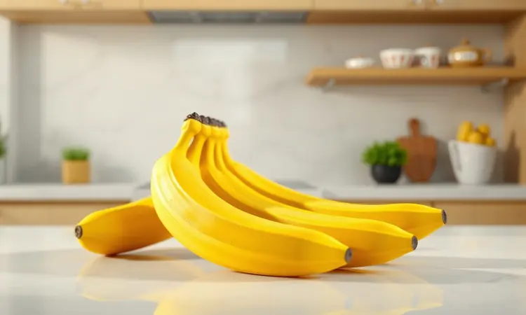
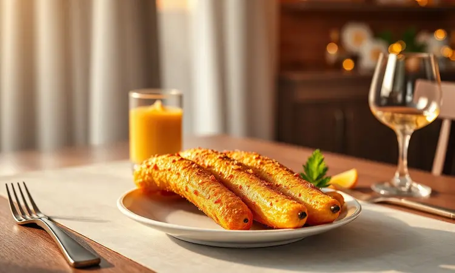

Você adora aquela banana frita de churrascaria, mas fica com receio da gordura e da bagunça do óleo quente na cozinha? Fazer banana à milanesa na air fryer é a descoberta que vai transformar seu desejo por um lanche crocante em uma experiência leve e prática.

Imagine conseguir aquela casquinha dourada e o interior macio e doce sem usar uma única gota de óleo para fritar.

Neste guia, você vai dominar o passo a passo do empanamento perfeito e descobrir exatamente qual variedade de fruta vai entregar o resultado digno de um chef.

<SummaryList products={frontmatter.top_products} />

## Por que a banana à milanesa na air fryer é a melhor opção?

A resposta está na combinação mágica entre textura e praticidade. A air fryer consegue replicar aquela crocância sequinha que você conhece das frituras tradicionais, mas usando uma fração mínima do óleo.

O resultado é um prato que satisfaz seu paladar sem pesar na consciência. E a praticidade é outro trunfo, preparar essa delícia leve minutos, não horas.

Serve como lanche da tarde, sobremesa especial ou acompanhamento criativo, sempre pronto para impressionar seus convidados com ingredientes simples que provavelmente já estão na sua despensa.

## Qual a melhor banana para fazer à milanesa? (Nanica, Prata ou Terra)

Cada tipo de banana oferece uma experiência única para seu paladar. A banana nanica é a escolha clássica, com sua doçura marcante e polpa macia que cria um contraste perfeito com a crocância externa.

Se você prefere algo com mais personalidade, a banana prata traz um sabor mais sutil e uma textura firme que se mantém bem durante o preparo.

Já a banana terra, menos doce e com gosto mais terroso, funciona maravilhosamente bem para quem quer um toque salgado na receita. No fim, a melhor banana é aquela que faz seus olhos brilharem ao pensar no resultado final.

## Ingredientes Necessários para a Casquinha Perfeita

A simplicidade é o segredo aqui.

Você só precisa de bananas maduras (que entregam a doçura natural e a maciez ideal após o cozimento), farinha de trigo para criar a base, ovos batidos para dar liga e aquela aderência perfeita, e farinha de pão ou de rosca para a camada final de crocância.

Uma pitada de sal equilibra os sabores e, se quiser um toque especial, uma pitadinha de canela em pó transforma o prato em algo verdadeiramente memorável. Com tão pouco, você está a poucos passos de criar uma iguaria que parece saída de uma cozinha profissional.

## Utensílios Essenciais: A Escolha da Air Fryer Ideal

<ProductBox 
  title={frontmatter.top_products[0].title} 
  image={frontmatter.top_products[0].image} 
  link={frontmatter.top_products[0].link} 
/>

Falando em equipamentos, a escolha da air fryer faz toda diferença na textura final.

Modelos como a Philips Walita RI9252/91 (1400W, 4,1 litros) são ideais para casais ou famílias pequenas, com controles intuitivos e tecnologia de circulação de ar que garantem um dourado uniforme em todos os alimentos.

Sim, o investimento inicial pode ser um pouco mais alto, mas a durabilidade e a eficiência compensam a longo prazo.

Outra excelente opção é a Electrolux EAF30, também com 1400W e capacidade de 4 litros, conhecida por sua facilidade de uso e desempenho consistente.

Um detalhe a observar é que alguns modelos podem ser um pouco mais barulhentos durante o funcionamento, mas isso não afeta em nada a qualidade do cozimento. Ambas entregam exatamente o que você busca, praticidade sem abrir mão do resultado perfeito.

### O segredo do Panko para uma crocância extra

<ProductBox 
  title={frontmatter.top_products[1].title} 
  image={frontmatter.top_products[1].image} 
  link={frontmatter.top_products[1].link} 
/>

Se você quer levar sua banana à milanesa para outro patamar, o panko é o ingrediente secreto. Essa farinha de rosca japonesa tem migalhas grandes e arejadas que criam uma casquinha leve, quase como se você estivesse em uma churrascaria premium.

A grande vantagem é que ele absorve muito menos gordura durante o cozimento, deixando seu prato mais sequinho e com aquela textura crocante que faz você fechar os olhos a cada mordida.

Encontrar panko pode exigir uma visita a lojas especializadas ou uma rápida pesquisa online, mas a transformação que ele traz às suas receitas justifica completamente o esforço.

### Utensílios de auxílio: Pincel e Pinças de Silicone

<ProductBox 
  title={frontmatter.top_products[2].title} 
  image={frontmatter.top_products[2].image} 
  link={frontmatter.top_products[2].link} 
/>

Esses dois aliados tornam todo o processo mais fluido e profissional. O pincel de silicone é perfeito para aplicar óleo ou temperos de forma uniforme, garantindo que sua camada de empanamento fique perfeita sem grudar.

Ele resiste tranquilamente às altas temperaturas da air fryer e é tão fácil de limpar que você vai querer usá-lo em todas as receitas.

Já as pinças de silicone protegem o revestimento antiaderente do seu aparelho enquanto permitem manusear as bananas com precisão cirúrgica.

Sim, podem custar um pouco mais do que versões em plástico, mas a durabilidade e a segurança que oferecem (além de não riscarem sua air fryer) fazem delas um investimento inteligente para qualquer cozinha que preze pela qualidade dos preparos.

## Passo a Passo: Como preparar a banana à milanesa na Air Fryer

O processo é tão simples que você vai se perguntar por que não começou antes. Basicamente, corte suas bananas, passe na sequência ovo-farinha de rosca e leve para a air fryer pré-aquecida por cerca de 10 minutos a 180°C.

Mas os detalhes é que fazem a mágica acontecer, e é neles que vamos mergulhar agora.

### 1. Preparação e Corte da Fruta

Comece escolhendo bananas maduras, mas ainda firmes, aquelas que não estão prestes a virar uma papa. Corte-as ao meio ou em rodelas de aproximadamente 1 cm de espessura, essa medida garante que o interior fique macio enquanto o exterior atinge a crocância perfeita.

Agora você tem a base pronta para começar o ritual do empanamento que vai transformar essas simples fatias em uma experiência gourmet.

### 2. A Técnica do Empanamento Triplo (Farinha, Ovo e Panko)

Esse é o método que separa o amador do especialista. Primeiro, uma camada leve de farinha cria uma superfície aderente perfeita. Em seguida, o banho no ovo batido adiciona umidade e sabor, preparando o terreno para a estrela do show, o panko.

Essa combinação em três etapas não apenas enriquece o sabor, mas produz um resultado visualmente deslumbrante, com uma crosta que parece saída de um livro de receitas de chef.

### 3. Tempo e Temperatura: O Ajuste Perfeito na Fritadeira

Aqui está o ponto onde a ciência encontra a arte culinária. Pré-aqueça sua air fryer a 180°C, essa temperatura é a chave para ativar o processo de douramento sem queimar.

Coloque as bananas empanadas e cozinhe por 10 a 12 minutos, virando-as cuidadosamente na metade do tempo para garantir que todos os lados atinjam aquele dourado uniforme que sinaliza perfeição.

Nas primeiras vezes, fique de olho, cada aparelho tem sua personalidade, mas logo você vai conhecer a sua como a palma da sua mão.

## 5 Dicas de Especialista para uma Crocância de Churrascaria

Quer aquele nível profissional que faz todos perguntarem qual seu segredo? Primeiro, escolha bananas com o ponto ideal de maturação, nem verdes demais, nem passadas. Segundo, capriche na camada inicial de farinha de trigo, ela é a fundação da crosta.

Terceiro, tempere sua farinha de rosca com um toque pessoal, uma pitada de algo especial. Quarto, nunca pule o pré-aquecimento da air fryer, ele é crucial para um cozimento uniforme.

Quinto, um leve spray de óleo (bem leve) intensifica a crocância sem transformar seu lanche saudável em algo pesado. Com essas cinco chaves, suas bananas vão rivalizar com as das melhores churrascarias.

## Variação Saudável: Banana à Milanesa sem Trigo (Gluten-Free)

Para quem busca uma versão ainda mais leve ou precisa evitar glúten, a adaptação é surpreendentemente simples. Substitua a farinha de trigo por farinha de aveia ou farinha de amêndoas, alternativas naturalmente sem glúten que trazem seu próprio charme nutricional.

Essas opções são ricas em fibras e nutrientes, transformando seu lanche crocante em um aliado da alimentação balanceada. O método permanece idêntico, passe as rodelas de banana no ovo batido e depois na farinha escolhida antes de levar à air fryer.

O resultado é uma sobremesa que você pode saborear sem nenhum peso na consciência, só prazer.

## Acompanhamentos: Com o que servir sua banana frita?

A versatilidade deste prato é um de seus maiores trunfos.

Para uma experiência clássica, nada combina melhor do que uma bola de sorvete de creme ou chocolate derretendo sobre a banana ainda quente, criando aquele contraste entre temperatura e textura que é pura felicidade.

Se prefere algo mais elaborado, um fio de chocolate quente realça todos os sabores. Para momentos mais leves, uma salada de frutas refrescante equilibra perfeitamente a doçura.

E nunca subestime o poder de um simples polvilho de canela em pó, aquele toque brasileiro que transforma o comum em especial com quase nenhum esforço.

## Perguntas Frequentes (FAQ)

Algumas dúvidas sempre surgem quando nos aventuramos em uma nova receita. Vamos esclarecer as mais comuns para que você possa preparar suas bananas com total confiança.

### Posso usar banana muito madura?

Absolutamente sim, na verdade, bananas muito maduras trazem uma doçura natural intensa que pode elevar seu prato a outro nível. O segredo está na firmeza, se a fruta ainda mantém alguma estrutura mesmo com a casca escura, ela é perfeita para o empanamento.

Essa é inclusive uma maneira fantástica de evitar desperdícios, transformando bananas que estariam destinadas ao lixo em um lanche crocante e delicioso que ninguém vai acreditar que veio de frutas "quase passadas".

### Como evitar que a banana grude no cesto?

Essa é a preocupação de todo iniciante na air fryer, e a solução é mais simples do que parece. Primeiro, use um spray ou pincel para aplicar uma camada bem fina de óleo vegetal no cesto antes de colocar as bananas.

Segundo, capriche no empanamento uniforme, uma cobertura completa cria uma barreira natural contra a aderência.

Terceiro, nunca sobrecarregue o cesto, deixe espaço entre as bananas para que o ar quente circule livremente, garantindo não apenas que não grudem, mas também que fiquem crocantes por igual em todos os lados.

### Dá para congelar depois de pronta?

Sim, e essa é uma das grandes vantagens práticas desta receita. Depois que suas bananas estiverem prontas e completamente esfriadas, você pode armazená-las no freezer em recipientes próprios ou sacos de congelamento.

A dica de ouro é separar as bananas com papel manteiga se estiver fazendo uma grande quantidade, assim elas não grudam umas nas outras. Quando a vontade bater, basta colocá-las direto na air fryer por alguns minutos para reaquecer e recuperar toda a crocância original.

Praticidade pura para ter um lanche gourmet sempre à mão.

## Conclusão

Fazer banana à milanesa na air fryer é muito mais do que seguir uma receita, é redescobrir um clássico com um olhar novo.

Você troca a gordura excessiva pela crocância inteligente, a bagunça do óleo pela praticidade de um aparelho que simplifica sua vida na cozinha, e a dúvida sobre o resultado pela certeza de que vai impressionar a si mesmo e a todos à sua mesa.

Desde a escolha da banana perfeita até o toque final do empanamento triplo com panko, cada etapa é uma oportunidade de criar algo especial com ingredientes simples.

Experimente, ajuste aos seus gostos, compartilhe com quem você ama e descubra como essa versão contemporânea de um clássico pode se tornar um dos seus preparos favoritos.

Sua próxima banana à milanesa não será apenas um lanche, será uma celebração do sabor feito com cuidado e inteligência.