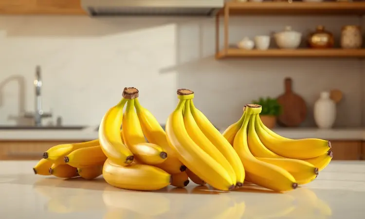
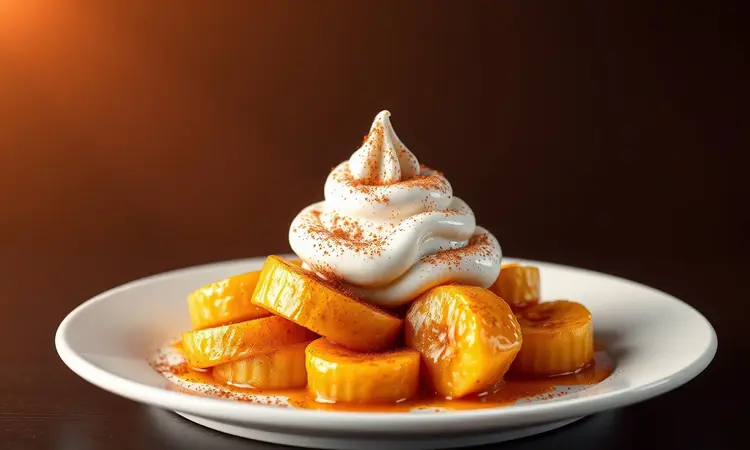
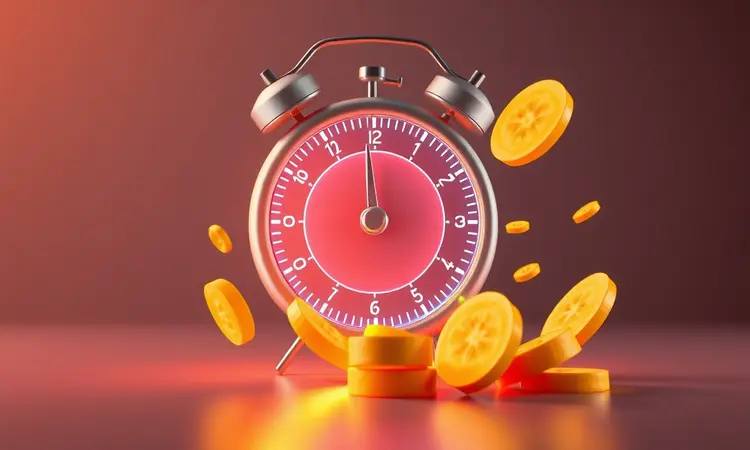
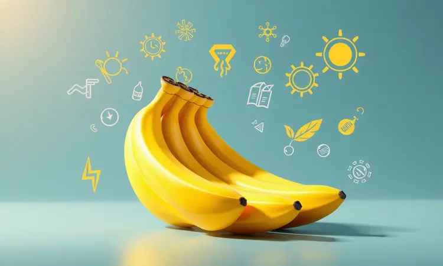

Você já teve aquela vontade incontrolável de doce no meio da tarde, mas olhou para a cozinha e pensou 'vai sujar tudo'? Ou pior, tentou fazer banana na air fryer e acabou com uma bagunça grudenta no fundo da cesta?

Pois aqui está sua redenção gourmet: esse jeito irresistível de transformar ingredientes simples em um banquete que sai da air fryer pronto para fotos do Instagram.

<SummaryList products={frontmatter.top_products} />

## Por que preparar Banana na Air Fryer é a melhor escolha?

Imaginar que você pode ter uma sobremesa digna de restaurante em menos tempo do que leva para pedir um delivery já é motivo suficiente para experimentar.

Mas o verdadeiro tesouro está na transformação que acontece dentro daquela cesta: a fruta ganha uma personalidade dupla, crocante por fora, como se tivesse sido frita, mas mantendo aquela maciez cremosa por dentro que derrete na boca.

Tudo isso sem precisar de óleo, sem sujeira pesada no fogão, e com a praticidade de quem tem coisas mais importantes para fazer do que ficar vigiando forno. É como ter um chef particular dedicado apenas a realizar seus desejos doces mais secretos.

## Qual o melhor tipo de banana para cada receita?

Agora que você entendeu o poder transformador da air fryer, vamos acertar o ingrediente principal. Pensar em banana como uma só fruta é como achar que todos os vinhos são iguais.

Cada variedade tem sua personalidade única, e escolher a certa faz toda diferença entre um petisco esquecível e uma lembrança que pede repetição.

Para criar chips que desafiam qualquer pacote industrial na crocância, a banana-nanica é sua aliada. Ela desidrata com uma textura que estala na boca e uma doçura que dispensa açúcar.

Já quando o plano é assar e servir como acompanhamento elegante, as bananas-prata mantêm a postura, não amolecem demais, não perdem a forma, garantindo apresentação impecável.

E para momentos de indulgência total, onde você quer aquela caramelização profunda que quase se confunde com doce de leite, as bananas-da-terra são sua escolha final.

É sobre entender que a fruta certa no momento certo transforma o simples em extraordinário.

## Receita Base: Banana Assada na Air Fryer (Estilo Rita Lobo)

<ProductBox 
  title={frontmatter.top_products[0].title} 
  image={frontmatter.top_products[0].image} 
  link={frontmatter.top_products[0].link} 
/>

Vamos começar pela elegância minimalista que conquistou até os paladares mais exigentes. Esta receita segue a filosofia de Rita Lobo, onde menos é mais, e cada ingrediente tem uma razão de existir.

### Ingredientes necessários para o preparo clássico

A magia começa com simplicidade: duas bananas-prata no ponto perfeito de maturação (nem verdes demais, nem passadas), um fio generoso de manteiga derretida (ou azeite, para versão vegana), canela em pó daquela que você guarda para ocasiões especiais, e uma pitada de açúcar mascavo, não para adoçar, mas para criar aquela caramelo crocante que contrasta com a polpa macia.

Pode incluir uma gota de essência de baunilha se quiser um perfume extra, mas saiba que mesmo na versão mais básica, o resultado já será digno de aplausos.

### Passo a passo para uma banana dourada e macia

Primeiro, acorde sua air fryer para o trabalho: pré-aqueça a 180°C por 5 minutos.

Enquanto isso, corte as bananas ao meio no sentido do comprimento, deixar a casca é o segredo que Rita Lobo ensina, uma barreira natural que mantém a umidade presa e intensifica todos os sabores.

Pincele cada metade com manteiga derretida, como se estivesse preparando uma tela para uma obra de arte. Polvilhe a mistura de canela e açúcar mascavo, sem medo de ser feliz.

Agora, arrume as bananas na cesta com a parte cortada para cima, como pequenas canoas esperando para navegar em mares de sabor.

Deixe cozinhar por 15 minutos.

A primeira metade do tempo é para a banana se aquecer por dentro, a segunda é onde a transformação acontece: o açúcar carameliza, a canela libera seu perfume, e a manteiga cria aquela crosta dourada que pede para ser quebrada com uma colher.

Se virar na metade do tempo, garante uniformidade perfeita.

O resultado é uma dualidade fascinante: por baixo da casca que se abre fácil, uma polpa tão macia que quase não precisa mastigar, envolvida pela caramelo crocante que se forma nas bordas. É rusticidade gourmet em estado puro.

## Variações Irresistíveis: Do Petisco à Sobremesa Gourmet

Agora que você domina o básico, chegou a hora de explorar territórios mais ousados. A mesma fruta, a mesma air fryer, mas resultados tão diferentes que parecem vindos de universos paralelos da gastronomia.

### Chips de Banana Fit: O segredo da crocância perfeita

<ProductBox 
  title={frontmatter.top_products[1].title} 
  image={frontmatter.top_products[1].image} 
  link={frontmatter.top_products[1].link} 
/>

Aqui está o lanche que vai fazer você esquecer qualquer pacote de salgadinho. O segredo está na paciência com os cortes: pegue bananas maduras porém firmes e corte em rodelas tão finas que quase transparentes.

Se tiver uma mandoline, é hora de tirá-la do fundo da gaveta, mas uma faca bem afiada e mão firme também funcionam.

Um truque de mestre: passe as fatias em suco de limão rápido antes de levar à air fryer. Não é só para evitar o escurecimento, mas para adicionar uma acidez sutil que equilibra a doçura da fruta.

Espalhe as rodelas em camada única na cesta, sobreposição é inimiga da crocância. Programe 160°C por 12 a 18 minutos, virando na metade.

A mágica não acontece enquanto estão quentes, sim, o momento de verdadeira satisfação vem quando esfriam completamente e atingem aquele crocante que estala entre os dentes. Guarde em pote hermético e tenha o lanche perfeito para três dias de pura felicidade.

### Banana "Frita" sem óleo para o acompanhamento do almoço

Transformar o almoço de terça-feira em uma experiência de restaurante é mais fácil do que parece. Corte bananas-prata em rodelas grossas, tempere com uma pitada de sal marinho (sim, sal!) e azeite.

A air fryer a 200°C por 10 minutos faz o trabalho que antes exigia frigideira e muito óleo.

O resultado acompanha arroz e feijão com uma sofisticação inesperada, ou vira a sobremesa que resolve o almoço sem precisar de mais preparos. É praticidade que não pede desculpas pelo sabor.

### Sobremesa Rápida: Banana com Canela, Mel e Chocolate

<ProductBox 
  title={frontmatter.top_products[2].title} 
  image={frontmatter.top_products[2].image} 
  link={frontmatter.top_products[2].link} 
/>

Para quando a vontade de doce bate forte e o tempo é escasso, esta é sua resposta. Pegue bananas maduras e corte ao meio no sentido do comprimento.

Misture mel e canela até formar uma pasta perfumada, espalhe sobre as bananas e finalize com pedacinhos de chocolate meio amargo, o contraste com a doçura da fruta é revelador.

Oito minutos a 180°C são suficientes para o chocolate derreter lentamente, o mel caramelizar levemente e a banana ficar naquele ponto ideal entre firme e macia. Sirva ainda morna com uma bola de sorvete de creme, ou iogurte natural para versão mais leve.

É a prova de que gourmet não precisa de horas na cozinha.

## Dicas de Ouro para a Banana não Grudar na Cesta

<ProductBox 
  title={frontmatter.top_products[3].title} 
  image={frontmatter.top_products[3].image} 
  link={frontmatter.top_products[3].link} 
/>

Lembra da frustração de tentar descolar restos de comida da cesta da air fryer? Aqui está seu kit de sobrevivência antiaderente.

Primeiro, invista em papel manteiga específico para air fryer, aqueles com furinhos que permitem a circulação do ar enquanto protegem o fundo. Se estiver sem papel, um leve borrifo de azeite na cesta fria cria uma barreira eficiente.

O tamanho das peças importa: fatias muito pequenas têm mais superfície para grudar, pedaços muito grandes podem liberar mais líquido. Encontre o equilíbrio. E nunca sobrecarregue a cesta, cozinhe em lotes menores, seu futuro eu agradecerá na hora da limpeza.

Virar na metade do tempo não é só opcional, é obrigatório para cozimento uniforme e para evitar pontos de contato prolongado com a superfície.

E o ritual final que muitos ignoram: limpe a cesta logo após usar, enquanto ainda está morna. Resíduos secos são os verdadeiros vilões da aderência.

## Tempo e Temperatura Ideal: Como não errar o ponto

Dominar a air fryer é como aprender a dançar com a temperatura. Para bananas, 180°C é sua zona de conforto, quente o suficiente para caramelizar açúcares, mas não tanto que queime antes de cozinhar por dentro.

Os 10 a 15 minutos são apenas uma referência, seu verdadeiro guia deve ser seus sentidos.

Nos primeiros 5 minutos, a banana se aquece e começa a liberar seus açúcares naturais. Entre 5 e 10 minutos, a transformação acontece: o exterior começa a dourar, a textura muda.

A partir de 10 minutos, é território da crocância, mas atenção, alguns segundos a mais podem levar de dourado perfeito para queimado.

A canela ou açúcar mascavo adicionados antes do cozimento não são apenas temperos, são seus aliados visuais: quando começam a caramelizar, você sabe que está no ponto ideal. E sempre, sempre, vire na metade do tempo.

É o movimento que garante que todos os lados recebam o mesmo carinho do ar quente.

## Benefícios nutricionais da banana no dia a dia

Além de toda essa experiência sensorial, você está fazendo um favor ao seu corpo.

A banana é aquele amigo nutricional que sempre aparece na hora certa: rica em potássio, o mineral que mantém sua pressão arterial em equilíbrio e ajuda seus músculos a funcionarem sem cãibras rebeldes.

As fibras presentes trabalham silenciosamente no seu sistema digestivo, promovendo aquela sensação de saciedade que evita beliscadas incontroláveis entre refeições.

E quando você adiciona canela, não está apenas perfumando o prato, está aproveitando suas propriedades anti-inflamatórias naturais. O chocolate meio amargo, por sua vez, traz antioxidantes que combatem os radicais livres.

É a prova de que cuidar da saúde pode ser uma experiência deliciosa, não uma obrigação sem graça.

## Perguntas Frequentes (FAQ)

Antes de finalizarmos, vamos esclarecer aquelas dúvidas que sempre surgem no meio do processo, aquelas que você pensa 'será que posso?'.

### Posso colocar a banana com casca na Air Fryer?

Absolutamente sim, e em muitos casos, esta é a técnica preferida dos especialistas. A casca funciona como uma embalagem natural a vapor, mantendo toda a umidade e sabor presos dentro da fruta. Escolha bananas maduras, lave bem a casca, e coloque inteiras na cesta.

Em 10 a 15 minutos a 180°C, você terá uma banana tão macia que quase se dissolve ao abrir a casca. É o método mais puro, onde a fruta fala por si só, sem distrações.

### Qual a diferença entre fazer na Air Fryer e no micro-ondas?

Pense no micro-ondas como o transporte rápido que chega ao destino, mas sem ver a paisagem. Aquece rápido, mas o resultado é uma banana cozida demais, às vezes encharcada, sem personalidade.

A air fryer, por outro lado, é a viagem panorâmica: o ar circulante cria condições perfeitas para a reação de Maillard, aquele processo químico responsável pelos sabores complexos e texturas atraentes dos alimentos assados ou fritos.

É a diferença entre apenas aquecer e realmente cozinhar, entre nutrir o corpo e alimentar a alma gastronômica.

## Conclusão

Quando você começa a explorar o universo da banana na air fryer, percebe que não está apenas preparando um lanche rápido. Está dominando uma arte acessível que transforma ingredientes simples em experiências memoráveis.

Desde a escolha certa da fruta até o momento exato de retirar da cesta, cada decisão soma na construção de um resultado que surpreende pelos sentidos.

O que era apenas uma alternativa prática para matar a vontade de doce se revela um portal para a criatividade na cozinha: a mesma banana que vira chips crocante de manhã se transforma em sobremesa gourmet à noite, sempre com a praticidade que a vida moderna exige.

Então, da próxima vez que a fome bater ou o desejo por algo doce surgir, lembre-se: sua air fryer não é apenas um eletrodoméstico, é seu sócio na criação de momentos saborosos. Experimente uma das receitas, ajuste ao seu gosto, compartilhe com quem você ama.

Porque comida boa, acima de tudo, é sobre criar memórias, e agora você tem todas as ferramentas para fazer as suas.