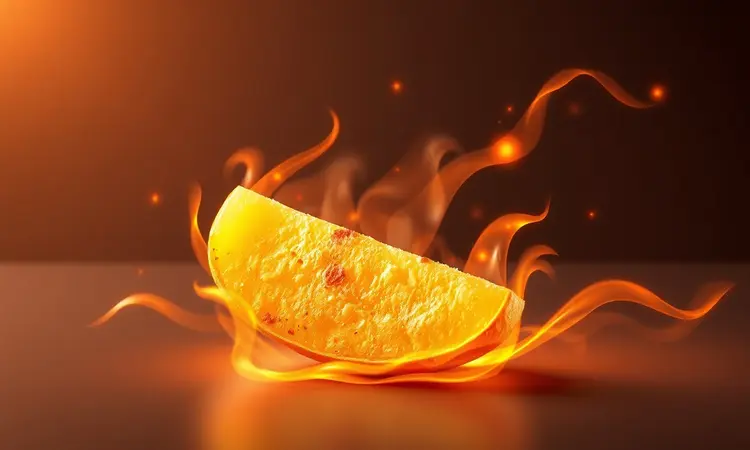
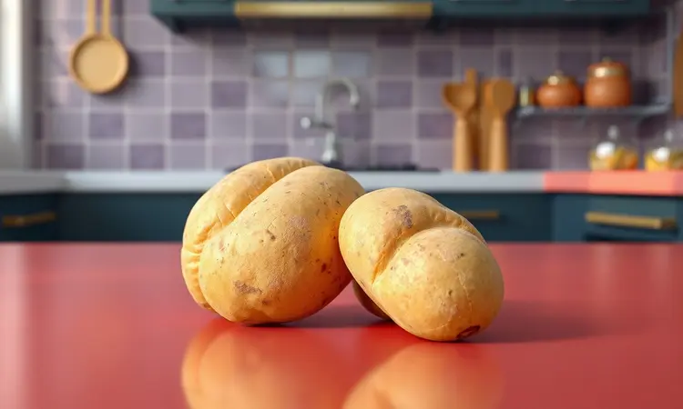
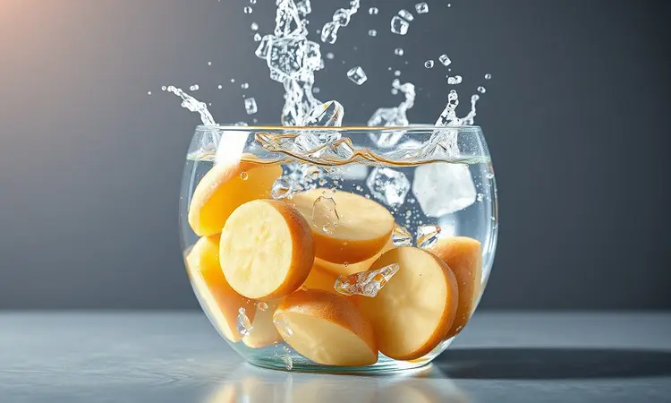
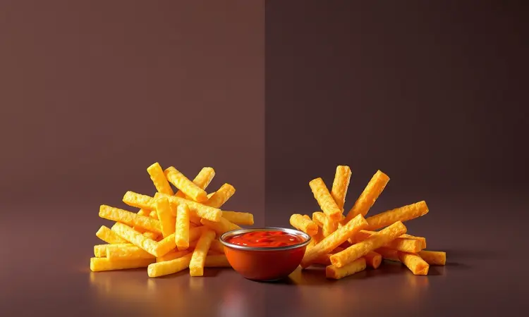

Já aconteceu com você de abrir a air fryer cheio de expectativa, só para encontrar batatas murchas, sem graça ou queimadinhas só nas pontas? Eu passei por isso inúmeras vezes antes de descobrir que o problema nunca foi a air fryer.

A máquina entrega crocância, sim, mas exige que a gente entenda sua linguagem.

Aqui, vou revelar cada um dos segredos que transformaram minhas batatas de uma decepção em orgulho culinário, usando técnicas que chefs profissionais aplicam justamente para vencer a ciência da crocância. Prepare-se para nunca mais olhar para sua air fryer com dúvidas.

<SummaryList products={frontmatter.top_products} />

## Por que sua Batata na Air Fryer não fica crocante? (A Ciência por trás)

Imagine tentar fritar uma esponja molhada. O resultado seria mole, certo? Com a batata acontece algo similar. O grande vilão da crocância é a umidade interna que, presa na batata, vira vapor durante o cozimento e deixa tudo embabado.

A solução começa muito antes da air fryer ser ligada, na escolha certa da matéria-prima e na preparação paciente. Mas relaxe, porque cada etapa desse processo tem um propósito claro, que vamos desvendar juntos.

## Escolhendo a Batata Certa: Asterix vs. Batata Inglesa

Pense na batata como a protagonista da sua receita, cada tipo com seu papel. A Asterix é a atriz premiada para quem busca o crocante definitivo, sua textura firme e baixo teor de açúcar garantem uma cor dourada uniforme sem risco de queimar fácil.

Já a batata inglesa, mais comum nas prateleiras, aceita bem o desafio, mas pede um pouco mais de atenção no preparo para não ficar muito mole. A escolha aqui não é sobre certo ou errado, mas sobre qual sabor e textura fazem seus olhos brilharem mais.

Depois de escolher sua estrela, chegou a hora dos coadjuvantes perfeitos, aqueles utensílios que transformam o trabalho braçal em um processo quase terapêutico.

## Utensílios que Facilitam sua Vida na Cozinha

Descascadores afiados, cortadores que não desafiam suas juntas e espátulas que não arranham sua air fryer não são luxo, são investimento em resultados consistentes. E dois itens em específico são os heróis secretos da batata crocante.

### Fatiador Mandoline para Chips Perfeitos

<ProductBox 
  title={frontmatter.top_products[0].title} 
  image={frontmatter.top_products[0].image} 
  link={frontmatter.top_products[0].link} 
/>

Quer chips que parecem saídos de uma boutique de snacks? Um fatiador mandoline é seu novo melhor amigo. A beleza está na uniformidade, lâmina após lâmina na mesma espessura, garantindo que cada pedaço doure no mesmo ritmo.

Procure modelos com protetor de mão, aquela pontinha de segurança que evita sustos, e lâminas de aço inoxidável que mantêm o fio do corte por anos.

No início, pode parecer um instrumento complexo, mas depois de algumas rodadas, você se perguntará como viveu tanto tempo cortando batatas na mão.

### Pulverizador de Azeite (Oil Sprayer)

<ProductBox 
  title={frontmatter.top_products[1].title} 
  image={frontmatter.top_products[1].image} 
  link={frontmatter.top_products[1].link} 
/>

A grande sacada do pulverizador não é só economizar óleo, é dar a cada batata um banho de névoa fina e uniforme, sem poças ou áreas secas. Essa cobertura leve é o que cria aquela casca dourada e crocante, sem deixar a sensação gordurosa na boca.

Dê preferência aos modelos em vidro, que não guardam cheiros de outros temperos e são fáceis de limpar, garantindo que cada uso seja como o primeiro.

Com os personagens do elenco definidos, vamos ao roteiro que transforma ingredientes crus em protagonistas crocantes.

## Ingredientes e Temperos para Elevar o Sabor

Aqui, menos costuma ser mais. Comece com batatas de qualidade, bem lavadas e cortadas. Para o tempero, sal marinho e pimenta-do-reino moída na hora formam a base clássica e infalível.

Para um toque que faz os convidados perguntarem 'o que você colocou nisso?', experimente um leve polvilhar de alho em pó ou páprica defumada. Misture tudo com as mãos, sentindo os temperos se incorporarem, antes daquela névoa sutil de azeite do seu pulverizador.

## O Passo a Passo Infalível: O Método da Água Gelada

Este é o divisor de águas entre a batata aceitável e a batata inesquecível. O método da água gelada não é um passo extra, é o segredo para remover o amido que insiste em deixar tudo mole.

Depois de cortadas, suas batatas vão tomar um banho relaxante em água gelada por pelo menos meia hora. Esse tempo não é de espera, é de transformação.

### 1. Higienização e Corte Uniforme

Lave bem as batatas, esfregando para tirar toda a terra. O corte não é sobre estética, é sobre justiça térmica. Palitos com cerca de 1 cm de espessura garantem que todos cozinhem no mesmo ritmo, sem aquela ponta queimada enquanto o centro ainda está cru.

Use seu fatiador mandoline para chips ou uma faca afiada e confiante para os palitos.

### 2. O Segredo do Molho: Removendo o Excesso de Amado

Aqui está a magia. Após o corte, mergulhe as batatas na água gelada e observe a água ficar opaca, esse é o amido saindo de cena. Esse amido é como uma cola que prende a umidade, então, ao removê-lo, você está libertando a batata para ficar crocante.

Trinta minutos são suficientes para esse processo de purificação.

### 3. Secagem Absoluta: O Passo que Muitos Pulpam

Este é o momento de verdade. Após a água gelada, escorra bem e envolva as batatas em um pano de prato limpo ou papel toalha. Aperte com carinho, mas com firmeza. Você quer sentir que tirou toda a umidade superficial.

Batatas secas são batatas que sibilam ao encontrar o ar quente, não que cozinham no vapor próprios.

### 4. Pré-aquecimento e Tempo de Cozimento

Nunca coloque as batatas em uma air fryer fria. Pré-aqueça por 5 minutos a 200°C, é como aquecer a chapa antes de grelhar um bife. Para palitos de 1 cm, 18 a 20 minutos geralmente é o ponto ideal, mas sua melhor ferramenta são os olhos.

Na metade do tempo, dê uma boa sacudida na cesta para que todos os lados recebam aquele abraço quente igualmente.

Claro, toda técnica precisa do palco certo para brilhar. A escolha da air fryer faz diferença no resultado final.

## Melhores Modelos de Air Fryer para Frituras Uniformes

<ProductBox 
  title={frontmatter.top_products[2].title} 
  image={frontmatter.top_products[2].image} 
  link={frontmatter.top_products[2].link} 
/>

Alguns modelos são feitos sob medida para a missão crocante. O Cosori CP158-AF tem um sistema inteligente que espalha o calor como um abraço uniforme, garantindo que não haja cantos frios.

A Xiaomi Dual Zone é a opção premium para quem não abre mão de perfeição, com sua circulação de 360º que trata cada batata como única.

A Philips Walita, com a tecnologia Rapid Air, é uma veterana confiável, enquanto a Cecotec Bombastik impressiona pela potência que acelera o processo. E para cozinhas mais compactas, o Aigostar Cube aquece rápido e entrega resultado surpreendente.

Com a técnica e o equipamento dominados, que tal explorar além do palito clássico?

## Variações Deliciosas: Batata Chips vs. Batata Palito

A air fryer é um brinquedo culinário. Para uma reunião descontraída, chips fininhos e temperados com alecrim e sal marinho são irresistíveis. Já para o jantar em família, os palitos robustos, macios por dentro e dourados por fora, nunca falham.

Ambas as versões nascem do mesmo princípio, atenção aos detalhes. A diferença está apenas no ajuste do seu fatiador e no tempo de cozimento, mais curto para os chips.

Antes de partir para a prática, conheça os deslizes mais comuns para você evitá-los com elegância.

## 5 Erros Comuns que Deixam a Batata Murcha

1. Pular a secagem. A umidade é inimiga número um. Batatas molhadas viram batatas cozidas no vapor, nunca fritas.

2. Lotar a cesta. O ar precisa circular livremente, como uma dança. Sem espaço, as batatas suam umas nas outras.

3. Temperatura tímida. Menos de 180°C não consegue selar a superfície rápido o suficiente, permitindo que a umidade escape.

4. Esquecer do óleo. Mesmo que seja um borrifo sutil, ele é o condutor de calor que cria a casca dourada.

5. Deixar de mexer. Aquela sacudida no meio do caminho é o que garante que todos os lados tenham seu momento de glória.

Essas dúvidas costumam surgir quando as mãos já estão na massa, então vamos esclarecê-las agora.

## Perguntas Frequentes (FAQ)

### Preciso usar óleo na batata da Air Fryer?

Tecnicamente, não. A air fryer funciona por circulação de ar quente.

Mas aquele fio de azeite ou uma névoa do borrifador faz algo mágico, conduz calor de forma mais eficiente e cria uma reação química (a famosa reação de Maillard) que resulta no sabor e cor dourada que associamos à batata frita perfeita.

É a diferença entre algo assado e algo que lembra uma fritura.

### Como evitar que as batatas grudem no cesto?

Dois aliados são fundamentais, secagem completa e um leve untar do cesto com azeite antes de colocar as batatas. A umidade gruda, o óleo cria uma barreira.

E nunca subestime o poder de não sobrecarregar, batatas com espaço não competem por atenção e não grudam umas nas outras.

### Posso fazer batata congelada com esse método?

Com certeza, e é uma salvação para dias corridos. A diferença é que elas já vêm pré-cozidas e congeladas, então o tempo pode ser um pouco menor. Coloque-as congeladas mesmo, sem descongelar, e fique de olho.

O resultado é surpreendentemente crocante e muito mais saudável que a versão de frigideira.

## Conclusão

Dominar a batata frita na air fryer é sobre entender que você não está apenas cozinhando, está aplicando ciência simples para um prazer complexo.

Desde a escolha da batata que promete firmeza até o borrifo final de azeite que garante o dourado, cada etapa tem um propósito.

O que começa como um conjunto de instruções técnicas se transforma, nas suas mãos, em um ritual que entrega muito mais que um acompanhamento, entrega a satisfação de ter vencido a batata murcha.

Agora, com todas as cartas na mesa, sua próxima fornada será a prova de que crocância perfeita não é sorte, é método. Sua air fryer e suas papilas gustativas agradecem.