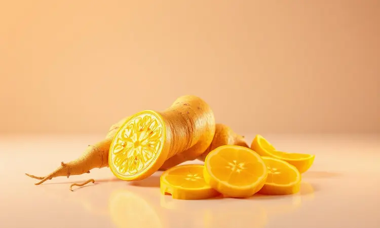
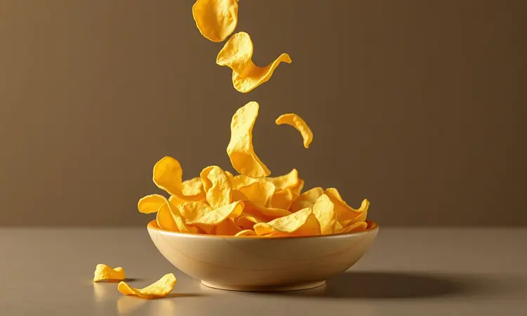
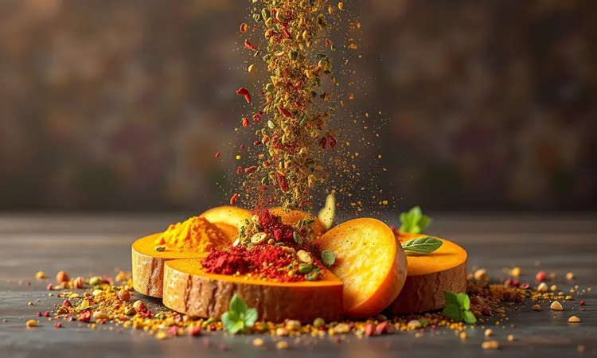

Imagine a cena: você sai ansioso para experimentar seus chips caseiros de batata baroa, abre a airfryer e... murchos ou, pior, queimados em segundos. A frustração é real quando um ingrediente tão saboroso e versátil não atinge a textura ideal que você imaginou.

Se você busca aquela crocância dourada, sequinha e absolutamente irresistível, respire fundo - você está prestes a dominar completamente a mandioquinha (ou batata salsa) na fritadeira sem óleo.

Vamos revelar todos os segredos, do corte perfeito ao tempo exato, para transformar esse legume simples no astro das suas refeições.

<SummaryList products={frontmatter.top_products} />

## Por que a Mandioquinha (Batata Baroa) é Perfeita para a Airfryer?

Há algo quase mágico na forma como a mandioquinha responde ao calor seco da airfryer. Por ser naturalmente adocicada e cremosa, ela se transforma com uma facilidade que parece feita sob medida para o aparelho.

Em vez de apenas listar características técnicas, pense na experiência: chips que estalam entre os dentes com doçura suave, ou pedaços rústicos que ficam dourados por fora enquanto mantêm um interior macio e aveludado.

E o melhor? Tudo isso acontece com uma fração do óleo que você usaria na fritura tradicional. Você não está apenas preparando um acompanhamento - está criando uma versão mais saudável de um prazer culpado, sem abrir mão do sabor que ama.

## Melhores Modelos de Airfryer para Receitas Crocantes

<ProductBox 
  title={frontmatter.top_products[0].title} 
  image={frontmatter.top_products[0].image} 
  link={frontmatter.top_products[0].link} 
/>

Claro, os resultados dependem também do seu equipamento. Para quem leva a sério a missão de fazer batata baroa perfeita (e outras delícias crocantes), alguns modelos se destacam por transformar expectativas em realidade.

A Air Fryer Mondial 5L oferece aquele equilíbrio ideal entre espaço interno e qualidade de cozimento, perfeita para preparar porções generosas para a família toda sem fazer várias levas.

Se você quer mais versatilidade, o Oster 10 Function Air Fryer Oven é como ter um assistente pessoal na cozinha, com múltiplas funções que prometem (e entregam) crocância com menos óleo.

Mas se busca o topo da tecnologia, a Philips Walita Airfryer XL 6,2L utiliza o sistema Rapid Air para criar uma circulação que parece abraçar cada pedaço de comida com calor uniforme. O resultado?

Alimentos que não apenas ficam crocantes, mas desenvolvem sabores mais profundos e complexos.

E não se preocupe se você é iniciante nesse universo - mesmo os modelos mais avançados foram pensados para serem intuitivos. A curva de aprendizado é suave, e a recompensa é imediata.

## Como Escolher e Preparar a Batata Baroa para Assar

Agora que você entende por que a mandioquinha e a airfryer formam uma parceria tão especial, vamos ao passo fundamental: a preparação. Tudo começa na escolha certa.

Procure tubérculos firmes ao toque, como se estivessem prontos para se transformar. Evite aqueles com manchas ou cortes, e prefira cores uniformes em tons de amarelo ou laranja - um sinal visual de qualidade.

Na hora de preparar, a decisão é sua: descascar para uma textura mais lisa, ou manter a casca para preservar nutrientes e adicionar rusticidade. Lave bem para remover qualquer vestígio de terra, depois corte em palitos ou rodelas conforme sua preferência.

O momento do tempero é onde a magia começa a acontecer. Um fio de azeite, sal e suas especiarias favoritas não apenas adicionam sabor, mas criam a base para a crocância que você busca.

Espalhe os pedaços na cesta com cuidado, garantindo espaço para o ar circular - esse simples detalhe faz toda a diferença entre chips perfeitos e uma decepção.

## Receita de Chips de Batata Baroa na Airfryer (Passo a Passo)

Vamos transformar teoria em prática com uma receita que parece simples, mas esconde segredos que fazem toda a diferença.

Comece cortando a batata em fatias finas - pense na espessura de uma moeda. Esse é o ponto ideal para garantir que fiquem crocantes sem queimar nas bordas.

Tempere com uma pitada generosa de sal e um fio de azeite, massageando suavemente para que cada fatia receba sua atenção.

Pré-aqueça sua airfryer a 180°C por 3 minutos. Essa etapa parece pequena, mas é crucial para que as fatias comecem a cozinhar imediatamente ao entrar, criando aquela crocância instantânea.

Espalhe as fatias em uma única camada - sem sobreposições - e programe para 15-20 minutos.

Aqui está o segredo que muitos ignoram: na metade do tempo, abra delicadamente e mexa os chips. Não é apenas virar, é dar uma sacudidinha gentil que permite que cada fatia encontre seu lugar ideal no fluxo de ar quente.

Quando terminar o tempo, você terá chips dourados, levemente curvados nas bordas, prontos para estalar entre os dentes.

### Utensílio Essencial: Fatiador para Chips Perfeitos

<ProductBox 
  title={frontmatter.top_products[1].title} 
  image={frontmatter.top_products[1].image} 
  link={frontmatter.top_products[1].link} 
/>

Se você quer levar a consistência a outro nível, um fatiador é seu melhor investimento. Não se trata apenas de praticidade, mas da garantia matemática de que cada fatia terá exatamente a mesma espessura.

Modelos como o MandoChef da Tupperware oferecem lâminas ajustáveis que se adaptam ao seu humor - mais finas para chips quase translúcidos, ou mais grossas para uma textura mais substancial. Cada ajuste muda completamente a experiência final.

Para um toque especial, fatiadores manuais com lâminas onduladas criam chips que não apenas são deliciosos, mas também bonitos o suficiente para impressionar convidados.

Os elétricos são para quem valoriza tempo e precisão acima de tudo - sim, ocupam mais espaço, mas quando você precisa preparar uma grande quantidade rapidamente, essa conveniência se paga.

## Batata Baroa Rústica na Airfryer: Macia por Dentro e Dourada por Fora

Se chips são a versão delicada e crocante, as rústicas são a expressão máxima do conforto gastronômico. Imagine pedaços generosos que revelam, ao primeiro mordida, um interior tão macio que quase derrete, envolto por uma casca dourada com textura que ressoa satisfação.

É aquele acompanhamento que transforma um jantar simples em uma refeição memorável, perfeito para dias em que você quer algo especial sem horas na cozinha.

### Dica de Especialista: O Papel do Azeite na Crocância

<ProductBox 
  title={frontmatter.top_products[2].title} 
  image={frontmatter.top_products[2].image} 
  link={frontmatter.top_products[2].link} 
/>

Vamos falar francamente sobre o azeite, porque ele é muito mais que um simples ingrediente - é o arquiteto da crocância.

Uma colher de chá de azeite de oliva extra virgem não apenas cobre as fatias, mas cria uma microcamada que conduz calor de forma uniforme, transformando amido em textura.

Pense nele como o condutor de uma orquestra: em quantidade certa, harmoniza todos os elementos; em excesso, vira uma bagunça encharcada. A magia está na moderação - apenas o suficiente para que cada pedaço brilhe levemente ao ser temperado.

Se você prefere controle absoluto, sprays de azeite são como pincéis de artista: permitem cobertura perfeita sem o risco de exagero.

O resultado é o mesmo - crocância que faz você fechar os olhos de prazer - mas com a consciência tranquila de quem sabe exatamente o que está fazendo.

## 5 Segredos para a Mandioquinha Não Queimar na Fritadeira

Depois de tantas dicas, vamos condensar o conhecimento em cinco pilares que garantem sucesso toda vez que você usar sua airfryer:

1. **Corte uniforme é não negociável**: Pedaços do mesmo tamanho cozinham no mesmo ritmo. Nada de misturar fatias finas com cubos grossos - essa é a receita para desastre.

2. **Respeite o espaço pessoal de cada pedaço**: Sobrecarregar a cesta é como colocar muita gente num elevador - ninguém se mexe direito. O ar precisa circular livremente para trabalhar sua mágica.

3. **O azeite é seu aliado, não seu inimigo**: Use a quantidade certa para criar crocância, não para fritar. A airfryer faz o trabalho pesado do calor, o azeite apenas direciona.

4. **Temperatura inteligente**: 180°C é o ponto ideal - quente o suficiente para dourar, mas paciente o bastante para não queimar antes de cozinhar por dentro.

5. **Mexa com carinho na metade do caminho**: Não é apenas virar, é reposicionar. Dê a cada pedaço a chance de encontrar seu lugar perfeito no fluxo de ar.

## Temperos Criativos: Vá Além do Sal e Pimenta

Agora que dominamos a técnica, vamos brincar com sabor. A batata baroa é uma tela em branco esperando por cores vibrantes de temperos.

Alho em pó e ervas finas criam uma base aromática que perfuma a cozinha antes mesmo de terminar o cozimento. Paprika - doce para suavidade, picante para aventura - adiciona camadas de personalidade.

Cominho traz aquela profundidade terrosa que conversa perfeitamente com a doçura natural da mandioquinha.

E aqui está uma combinação surpreendente: uma pitada de açúcar mascavo. Parece contra intuitivo, mas quando carameliza levemente na superfície, cria um contraste doce-sal que faz cada mordida ser uma descoberta.

Não tenha medo de experimentar. A melhor combinação é aquela que faz você sorrir ao primeiro pedaço.

## Tempo e Temperatura: Guia de Referência Rápida

Vamos consolidar os números mágicos para você consultar rapidamente:

Para chips perfeitos: Pré-aqueça a 180°C, cozinhe por 15-20 minutos, mexendo cuidadosamente na metade do tempo. O sinal visual são bordas levemente curvadas e cor dourada uniforme.

Para rústicas de conforto: Aumente para 200°C e reserve 25-30 minutos. Você sabe que está pronto quando a casca está dourada e crocante, mas ao pressionar levemente com um garfo, o interior cede com maciez aveludada.

Lembre-se: esses são pontos de partida, não leis imutáveis. Sua airfryer tem personalidade própria - observe, ajuste e anote o que funciona melhor para você.

## Perguntas Frequentes (FAQ)

É natural que algumas dúvidas surjam durante o processo. Vamos abordar as mais comuns como se estivéssemos conversando na cozinha:

### Precisa cozinhar a batata baroa antes de colocar na airfryer?

A beleza da airfryer está na simplicidade: não, não precisa cozinhar antes. Corte, tempere e vá direto para o aparelho.

A tecnologia de ar quente circulante é projetada para lidar com alimentos crus, criando aquela crocância característica que faz todos perguntarem "como você fez isso?"

Se você prefere um sabor mais suave ou uma textura especialmente macia por dentro, um pré-cozimento leve pode ajudar. Mas para a maioria das receitas - especialmente chips - ir direto da tábua para a airfryer é o caminho para a perfeição.

### Por que a minha batata baroa ficou murcha?

Ah, a frustração dos chips murchos. Geralmente, dois culpados estão por trás desse problema:

Primeiro, umidade excessiva. Se as fatias não forem bem secas após lavar (use papel toalha ou um pano limpo), a água superficial cria vapor que impede a crocância. Pense nisso como tentar fritar algo molhado - simplesmente não funciona.

Segundo, temperatura muito baixa. Se sua airfryer não atinge ou mantém a temperatura ideal, as batatas "suam" em vez de dourar. A solução? Sempre pré-aqueça e verifique se está usando a temperatura recomendada para sua receita.

Um terceiro fator secreto: cortes muito grossos. Fatias muito espessas não conseguem secar completamente por dentro antes que as bordas queimem, resultando naquele desagradável contraste entre exterior duro e interior borrachudo.

## Conclusão

Dominar a batata baroa na airfryer é muito mais que seguir uma receita - é entender a dança entre calor, tempo e técnica que transforma um ingrediente humilde em uma experiência gastronômica.

Você não está apenas preparando chips ou rústicas; está cultivando confiança na cozinha, descobrindo que a perfeição está nos detalhes que pareciam insignificantes.

Lembre-se que cada airfryer tem sua personalidade, cada batata baroa traz sua doçura única, e cada paladar merece sua combinação perfeita de temperos. Os segredos que compartilhamos hoje são seu ponto de partida, não seu destino final.

Agora é sua vez. Escolha suas mandioquinhas favoritas, selecione os temperos que fazem seu coração feliz, e coloque em prática. A primeira leva pode não ser perfeita - e tudo bem.

Cada tentativa é um passo mais perto de criar aquele acompanhamento que faz todos pedirem a receita. A cozinha está esperando, e a airfryer está pronta para transformar sua próxima refeição em algo extraordinário.