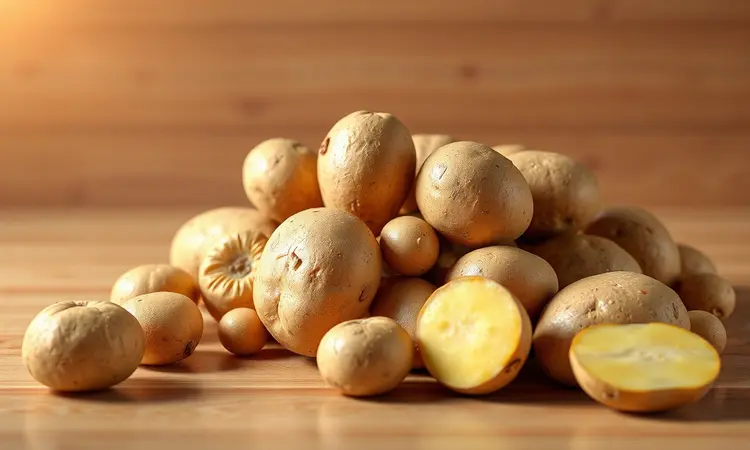
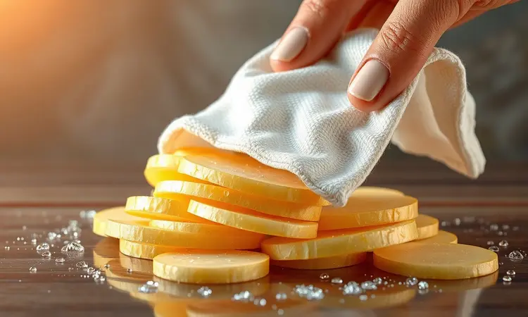
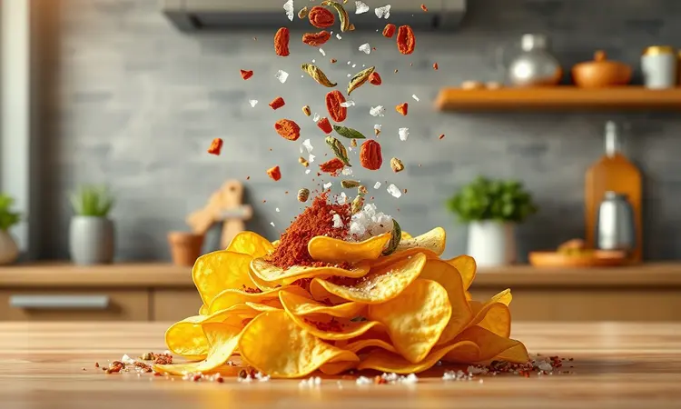
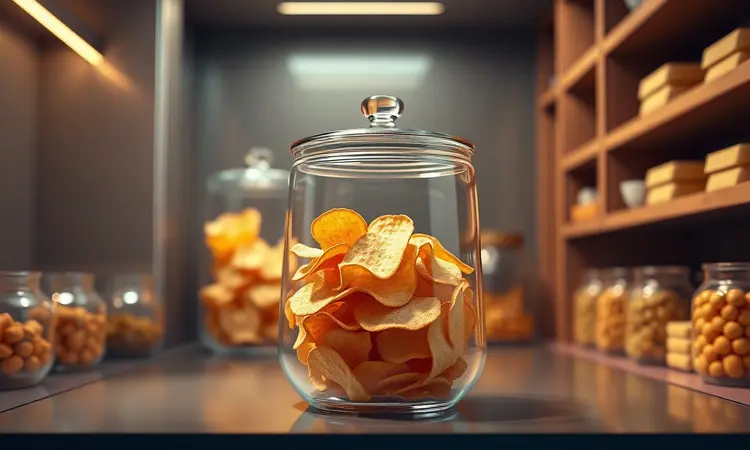

Você já tentou fazer batata chips na airfryer e elas acabaram ficando moles, grudadas ou queimadas nas bordas? Você não está sozinho. Embora pareça simples, alcançar aquela textura de pacote sem usar litros de óleo exige técnica.

Neste guia completo, eu vou te ensinar o passo a passo definitivo, desde a escolha da batata certa até o truque da água gelada, garantindo que você prepare o petisco mais crocante e saudável que já saiu da sua cozinha.

<SummaryList products={frontmatter.top_products} />

## Por que fazer Batata Chips na Airfryer é a melhor escolha?

Imagine aquele desejo por um snack no meio da tarde, mas sem o peso na consciência de ter fritado tudo em óleo. É exatamente essa liberdade que a airfryer oferece ao criar chips usando apenas ar quente.

Ela transforma gordura em crocância, entregando o mesmo prazer de pacote com uma fração das calorias.

Mas vai além da saúde: é praticidade pura. Enquanto você prepara outras coisas na cozinha, suas batatas estão ficando douradas em minutos, não em horas. E o melhor? Sem aquela sensação pegajosa nas mãos depois de fritar ou aquele cheiro que impregna na roupa.

## O Segredo Começa na Escolha: Qual a Melhor Batata para Chips?

Pense na batata como a base de qualquer prato incrível. Algumas variedades são feitas para virar purê, outras para assar inteiras. Para chips, você precisa daquelas que escondem segredos de crocância em sua estrutura interna.

As Ágata e Asterix são verdadeiras campeãs nesse quesito. Seu alto teor de amido age como um agente de textura, criando aquela casca dourada que estala entre os dentes.

Se você busca algo diferente, a batata-doce oferece um sabor adocicado que combina perfeitamente com temperos apimentados.

Independente da sua escolha, lembre-se: uniformidade no corte é o que garante que cada pedacinho cozinhe no mesmo ritmo. Nada de algumas fatias queimadas enquanto outras ainda estão murchas.

## Utensílios Indispensáveis para um Resultado Profissional

Você pode ter a melhor airfryer do mundo e a batata perfeita, mas sem as ferramentas certas, o resultado não será consistente. Felizmente, você não precisa de uma cozinha de restaurante. Apenas três itens fazem toda diferença.

### Fatiador de Legumes (Mandoline): O Segredo das Fatias Uniformes

<ProductBox 
  title={frontmatter.top_products[0].title} 
  image={frontmatter.top_products[0].image} 
  link={frontmatter.top_products[0].link} 
/>

Aqui está a verdade que ninguém conta: tentar cortar batatas manualmente em fatias de 2mm é uma receita para frustração. As mãos cansam, as fatias ficam desiguais e você sempre corre o risco de cortar um dedo.

Um mandoline como o Slicer 2.0 resolve isso em segundos. Suas lâminas de aço inoxidável deslizam como se estivessem cortando manteiga, criando fileiras perfeitas de batatas prontas para se transformarem em chips.

Os ajustes de espessura permitem que você experimente desde chips quase transparentes até versões mais robustas.

Sim, a limpeza pode exigir um pouco mais de cuidado com as partes removíveis, mas quando você vê aquela pilha simétrica de fatias, percebe que cada segundo vale a pena.

### A Melhor Airfryer para Petiscos Crocantes

<ProductBox 
  title={frontmatter.top_products[1].title} 
  image={frontmatter.top_products[1].image} 
  link={frontmatter.top_products[1].link} 
/>

Agora vamos ao coração da operação. Certos modelos entendem que fazer chips não é apenas sobre cozinhar, mas sobre criar textura.

A Electrolux Family Efficient Rita Lobo funciona como um assistente pessoal na cozinha. Com suas receitas pré-programadas, ela quase adivinha o que você precisa e sua capacidade de 5 litros é ideal para uma sessão de snacks em família.

Já a Philips Walita Série 1000 XL usa sua tecnologia Rapid Air como um escudo contra a umidade. O ar circula em 360 graus, garantindo que cada molécula de água seja expulsa, deixando para trás apenas pura crocância.

Para quem precisa de espaço, a Philco Air Fryer PFR2200P oferece 12 litros, perfeita para fazer chips para uma festa ou congelar para a semana toda. E se você é do time que ama controle, a Xiaomi Mi Smart Air Fryer transforma seu celular em um controle remoto gourmet.

Independente da sua escolha, lembre-se: não entupa o cesto. O ar precisa de espaço para trabalhar sua mágica.

## Preparo Passo a Passo: A Técnica da Tripla Secagem

Esta é a parte onde muitos desistem, mas é exatamente aqui que a mágica acontece. A tripla secagem não é um exagero, é a garantia de que cada chip será uma explosão de crocância.

### 1. O Corte Perfeito: Espessura é tudo

Pense na espessura como a personalidade do seu chip. Entre 2 a 4 milímetros, você encontra um universo de possibilidades. Fatias de 2mm são como papel de arroz crocante, estalando com o mínimo de pressão.

Já as de 4mm oferecem uma experiência mais substancial, com um interior que ainda mantém um toque de maciez sob a casca dourada.

Usando o mandoline, você consegue essa uniformidade que faz toda diferença na airfryer. Todas as fatias cozinham no mesmo ritmo, transformando-se juntas em perfeição dourada.

### 2. Choque Térmico e Remoção de Amido: Por que usar água gelada?

Aqui está um segredo de chefs: o amido é tanto amigo quanto inimigo. Em excesso, ele cria uma película grudenta que impede a crocância. A água gelada age como um resete.

Quando você mergulha as fatias, acontece algo quase mágico. O frio contrai as células da batata, expulsando o amido em excesso.

Mas vai além: essa hidratação controlada prepara a batata para o calor intenso, criando uma estrutura que vai se expandir em crocância, não em murchidão.

### 3. Secagem Absoluta: O passo que você não pode pular

Esta é a linha entre chips crocantes e chips que decepcionam. Cada gota de água que sobra vai virar vapor na airfryer, e vapor é o inimigo número um da crocância.

Após a água gelada, enxágue as fatias rapidamente. Depois, abrace-as com um pano de prato limpo ou papel toalha. Pressione com carinho, sentindo a umidade sendo absorvida. Você quer batatas que sussurrem "estou pronta", não que rangem de molhadas.

Esses segundos extras de secagem são o investimento que retorna em cada mordida estalante.

## Receita de Batata Chips na Airfryer: Simples e Rápida

Agora que a base está perfeita, vamos ao ritual que transforma batatas simples em vício crocante.

### Ingredientes e Proporções Ideal

Comece com uma batata média por pessoa. Parece pouco, mas quando fatiada finamente, se expande em uma tigela generosa. Para cada batata, você precisa apenas de uma colher de chá de azeite de oliva e uma pitada de sal marinho.

O segredo está na distribuição: massageie o azeite sobre cada fatia com as mãos, como se estivesse dando atenção individual a cada futuro chip. O azeite não é só sabor, é o condutor de calor que vai criar aquela casca dourada.

### Tempo e Temperatura: O Ajuste Fino para não Queimar

Pense na airfryer como um forno com superpoderes. Comece a 180°C e programe 15 minutos. Mas não vá embora da cozinha.

Na marca dos 7 minutos, abra e dê uma sacudida gentil no cesto. Você não está só virando, está garantindo que cada fatia receba seu momento de glória na corrente de ar quente. Continue observando nos últimos minutos, pois chips perfeitos podem queimar em 60 segundos.

## 5 Dicas de Especialista para Evitar que a Batata fique Mole

1. Escolha batatas firmes como Asterix ou Yukon Gold. Sua textura natural resiste à murchidão.

2. Corte uniforme significa cozimento uniforme. Fatias de diferentes tamanhos cozinham em tempos diferentes.

3. Secagem completa é não negociável. Umidade residual = chips moles.

4. Adicione temperos secos depois de pronto. Sal e especiarias antes podem puxar umidade para fora.

5. Espaço é amigo. Um cesto lotado cria vapor, e vapor é o assassino da crocância.

## Variações de Sabor: Temperos Criativos para suas Chips

Agora vem a diversão. Seu chip pode ser qualquer coisa que sua imaginação desejar.

Que tal um mix de páprica defumada e alho em pó que lembra churrasco de domingo? Ou queijo parmesão ralado na hora com ervas finas, criando um sabor que compete com qualquer aperitivo de restaurante?

Para os corações aventureiros, pimenta caiena misturada com um toque de açúcar mascavo cria um equilíbrio doce-picante que vicia. Ou curry em pó com coco ralado para uma viagem aos sabores do sul da Ásia.

Cada tempero conta uma história diferente. Qual será a sua?

## Como Armazenar para Manter o 'Croc' por Mais Tempo

Você conseguiu. Criou chips tão crocantes que até fazem barulho ao serem pegos. Agora, como fazer esse momento durar?

O inimigo é sempre o mesmo: umidade. Por isso, espere até que cada chip esteja completamente frio antes de guardar. Calor gera condensação mesmo no recipiente mais fechado.

Escolha um pote hermético de vidro ou plástico de qualidade. Coloque em um armário escuro, longe do fogão ou de janelas. Em boas condições, seus chips podem manter a crocância por até 5 dias, prontos para salvar qualquer desejo repentino.

## Perguntas Frequentes (FAQ)

### Preciso untar o cesto da Airfryer?

Na maioria dos casos, não. As próprias batatas com seu leve banho de azeite já previnem que grudem. Porém, se você notar que ficam sempre presas em um ponto específico, um spray antiaderente rápido resolve sem prejudicar a crocância.

### Posso fazer com batata-doce ou mandioquinha?

Absolutamente! A batata-doce traz aquele sorriso adocicado que combina perfeitamente com canela ou pimenta. Já a mandioquinha tem uma cremosidade natural que se transforma em uma crocância diferente, quase amanteigada.

Acompanhe de perto o tempo, pois elas podem cozinhar um pouco mais rápido.

### Por que minhas batatas voam dentro da Airfryer?

Isso acontece quando há muita umidade se transformando em vapor rapidamente. A pressão empurra as fatias leves. A solução é dupla: secagem mais completa antes de cozinhar e não sobrecarregar o cesto. Espaço significa que o vapor escapa sem criar turbulência.

## Conclusão

Fazer batata chips na airfryer deixa de ser apenas uma receita e se transforma em uma pequena revolução na sua cozinha. É sobre recuperar o prazer de um snack favorito sem o peso das frituras, sobre a satisfação de criar algo incrível com suas próprias mãos.

Desde a escolha da batata certa até o momento em que você fecha o pote hermético, cada passo é um ato de cuidado que retorna em crocância. Você não está só fazendo chips, está dominando uma técnica que pode ser adaptada a dezenas de vegetais e temperos.

A próxima vez que a vontade de algo crocante aparecer, você saberá exatamente o que fazer. Com uma batata, um fio de azeite e alguns minutos, tem em suas mãos o poder de criar não apenas um petisco, mas um momento de puro prazer. Então, que tal começar hoje?

Sua airfryer está esperando para transformar batatas simples em lembranças crocantes.