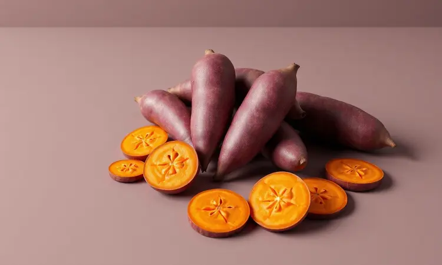
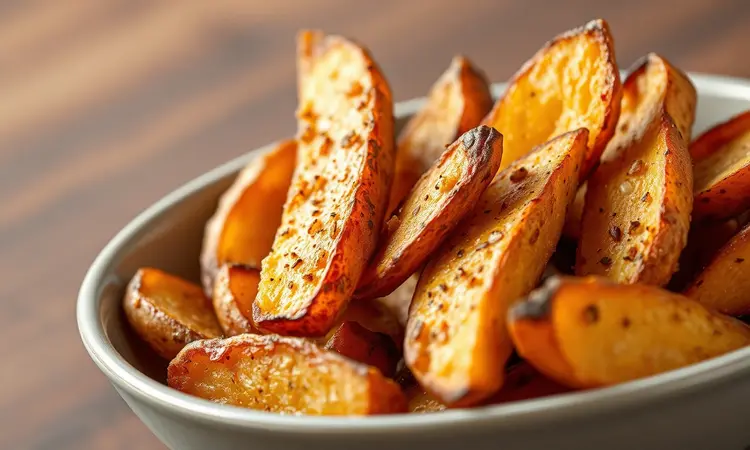
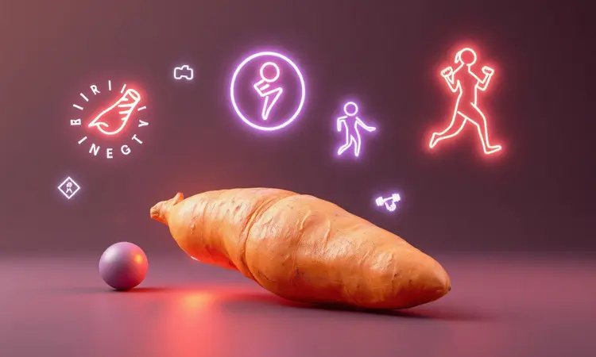

Você já tentou fazer batata-doce na airfryer e ela acabou ficando murcha ou queimada por fora e crua por dentro? É frustrante querer um acompanhamento saudável e rápido, mas não conseguir a textura perfeita.

Se você busca praticidade sem abrir mão do sabor e da crocância, este guia foi feito para você.

Neste artigo, vou te mostrar o passo a passo definitivo, desde a escolha da batata até os segredos de temperatura que os chefs usam para garantir resultados profissionais em poucos minutos.

<SummaryList products={frontmatter.top_products} />

## Batata-doce na Airfryer: Por que essa é a melhor forma de preparo?

Imagine conseguir aquela crocância irresistível por fora e maciez cremosa por dentro usando apenas uma pequena quantidade de óleo. A airfryer transforma esse desejo em realidade, mantendo todo o sabor autêntico da batata-doce enquanto preserva seus nutrientes.

E o maior benefício emocional? Você libera tempo. Em comparação ao forno convencional, o cozimento é consideravelmente mais rápido, perfeito para quem tem uma rotina agitada mas não quer sacrificar a qualidade da alimentação.

Essa combinação de eficiência e resultado gourmet faz da airfryer seu aliado secreto na cozinha.

## Como escolher a melhor variedade de batata-doce para fritar sem óleo

A escolha da variedade define não apenas o sabor, mas também a experiência visual do seu prato. As três opções mais comuns oferecem características distintas:

A batata-doce roxa traz um sabor adocicado marcante e uma textura macia que quase parece um creme. A laranja, rica em betacaroteno, proporciona um sabor levemente mais suave, mas com uma crocância que agrada especialmente quem busca equilíbrio.

A branca oferece uma opção menos doce, quase neutra, perfeita para receitas onde você quer que outros temperos se destacem.

Independente da escolha, procure batatas firmes e sem manchas. Essa frescor garante que, ao fritar sem óleo, você obtenha a máxima qualidade possível.

## Utensílios essenciais para uma batata-doce perfeita

<ProductBox 
  title={frontmatter.top_products[0].title} 
  image={frontmatter.top_products[0].image} 
  link={frontmatter.top_products[0].link} 
/>

Com os utensílios certos, você transforma o preparo de batata-doce em um processo fluido e quase intuitivo.

Uma faca afiada ou mandoline é fundamental para cortes uniformes, garantindo que todas as fatias ou palitos cozinhem simultaneamente, sem partes que ficam cruas ou queimadas.

Após o corte, o papel toalha entra como seu melhor amigo para a crocância. Secar bem as fatias elimina a umidade que sabotaria o resultado final. Uma tigela simples facilita a mistura com temperos e azeite antes de levar à airfryer.

Se você quer um controle preciso sobre a quantidade de óleo, um pincil de silicone aplica uma camada fina e uniforme, maximizando a crocância sem excessos.

Acessórios como cestos perfurados não são obrigatórios, mas podem otimizar a circulação do ar e tornar a limpeza ainda mais prática.

### O segredo do corte: Rodelas, Chips ou Rústica?

<ProductBox 
  title={frontmatter.top_products[1].title} 
  image={frontmatter.top_products[1].image} 
  link={frontmatter.top_products[1].link} 
/>

O tipo de corte define completamente a experiência que você vai criar. Cada formato oferece uma textura e tempo de preparo específico.

As chips, cortadas em fatias extremamente finas, são o snack saudável definitivo. Quando bem secas e temperadas com azeite e sal, elas ficam crocantes como as versões industrializadas, mas com toda a naturalidade da batata-doce.

O tempo de cozimento é rápido, entre 10 a 15 minutos, mas exigem atenção para não queimar.

As rodelas, com espessura de aproximadamente 1 cm, oferecem um equilíbrio perfeito: macias e cremosas por dentro, com uma leve crocância nas bordas. Levam um pouco mais de tempo, entre 10 a 20 minutos.

Os cortes rústicos, em palitos, são a opção mais versátil para acompanhar refeições principais. Com cerca de 20 a 25 minutos de cozimento, eles desenvolvem uma crocância uniforme e um sabor que aceita bem temperos mais robustos.

Experimentar diferentes cortes é como ter múltiplas receitas usando o mesmo ingrediente principal.

## Guia Passo a Passo: Como fazer Batata-doce na Airfryer

Este passo a passo vai garantir que você nunca mais tenha resultados inconsistentes. Cada etapa foi pensada para eliminar as frustrações e maximizar o prazer de preparar.

### Passo 1: Preparação e o truque da secagem para máxima crocância

Comece descascando e cortando suas batatas-doces no formato escolhido. Um enxágue rápido em água fria remove o excesso de amido, um detalhe que muitos ignoram mas que faz diferença na textura final.

O momento crucial? A secagem. Use um pano limpo ou papel toalha para eliminar toda a umidade superficial. Essa etapa é a chave para transformar batatas potencialmente murchas em pedaços crocantes que impressionam.

A água residual cria vapor durante o cozimento, sabotando a crocância que você deseja.

### Passo 2: Temperos que transformam o sabor (do salgado ao agridoce)

Os temperos elevam a batata-doce de um simples acompanhamento para uma experiência gastronômica. Para uma versão salgada clássica, combine sal, pimenta-do-reino e alho em pó. Essa tríade cria um sabor robusto que complementa qualquer prato principal.

Se você busca algo que contrasta com o naturalmente adocicado da batata, experimente canela e um pouco de açúcar mascavo para um agridoce suave. Para aventuras mais exóticas, curry ou páprica defumada introduzem complexidade e profundidade.

A regra é simples: comece com pequenas quantidades, misture bem e ajuste conforme seu paladar. Cada combinação pode criar uma memória gustativa única.

### Passo 3: Tempo e Temperatura ideais para cada tipo de corte

A precisão no tempo e temperatura adapta-se ao formato escolhido. Para cubos, 200°C por 15 a 20 minutos garante que todas as faces fiquem douradas uniformemente.

Rodelas, sendo mais finas, requerem a mesma temperatura mas menos tempo: 12 a 15 minutos normalmente são suficientes. A monitoragem visual é importante aqui.

Palitos rústicos precisam de um pouco mais de atenção: 18 a 22 minutos em 200°C, com uma virada na metade do processo para garantir que todos os lados desenvolvem a mesma crocância.

A consistência vem dessa combinação entre formato, temperatura e tempo.

## Variações Irresistíveis: Chips, Rústica e em Cubos

Depois de dominar o método básico, essas variações expandem seu repertório e oferecem soluções para diferentes momentos.

### Batata-doce Chips: O snack saudável definitivo

Imagine substituir os snacks industrializados por chips que são naturalmente ricos em fibras, vitaminas e minerais. Na airfryer, essa transformação é rápida e garante a crocância que você espera de um chip perfeito.

O tempero é seu campo de criação: páprica para um sabor terroso, alho em pó para um toque robusto, ou uma pitada de chili para quem gosta de intensidade. Sem aditivos químicos, você controla tudo que entra no seu snack.

### Batata-doce Rústica: Macia por dentro e dourada por fora

Para essa variação, escolha batatas de tamanhos similares. Isso garante que todos os pedaços terminam o cozimento simultaneamente, sem alguns ficarem perfeitos enquanto outros ainda estão cruas.

Corte em palitos ou rodelas, tempere com azeite, sal e suas especiarias preferidas. Pré-aquecer a airfryer a 200°C e cozinhar por 20-25 minutos (virando na metade) produz o resultado ideal: interior macio e cremoso, exterior dourado e com textura agradável.

## Erros comuns que você deve evitar ao usar a Airfryer

Conhecer os erros mais frequentes é como ter um mapa que evita frustrações. O excesso de alimento na cesta é o principal: quando você sobrecarrega, a circulação do ar quente é bloqueada, criando cozimento desigual onde algumas partes ficam perfeitas e outras não.

Pré-aquecer o aparelho parece um detalhe pequeno, mas afeta diretamente o tempo de preparo e a textura final. É como dar um impulso inicial ao processo.

Secar bem os alimentos antes de cozinhar elimina a umidade que sabotaria a crocância. E lembre-se, líquidos em excesso criam vapor dentro da airfryer, resultando em alimentos murchos.

Evitar esses deslizes transforma tentativas em resultados consistentemente deliciosos.

## Benefícios da batata-doce para quem treina e busca saúde

Para quem treina, a batata-doce oferece carboidratos complexos que liberam energia sustentada, perfeita para atividades físicas intensas. As fibras presentes não apenas ajudam na digestão, mas também promovem saciedade, evitando aquela sensação de fome constante.

Os antioxidantes e vitaminas, especialmente a vitamina A, contribuem para saúde ocular e fortalecimento do sistema imunológico. Incluir batata-doce na alimentação significa cuidar do desempenho físico enquanto nutre o corpo com elementos essenciais.

## Dicas de armazenamento: Como reaquecer sem perder a textura

Armazenar bem é garantir que você pode aproveitar suas batatas-doces mesmo depois. Use um recipiente hermético e deixe as batatas esfriar completamente antes de fechar, prevenindo a acumulação de umidade que deixaria tudo mole.

Para reaquecer, a airfryer é sua melhor opção para restaurar a crocância. Pré-aqueça a 180°C e aqueça por 3-5 minutos. Essa técnica simples faz com que elas pareçam quase recém-preparadas.

## Perguntas Frequentes sobre Batata-doce na Airfryer (FAQ)

Uma das dúvidas mais comuns é sobre tempo de cozimento. Geralmente, 20 a 30 minutos em 180°C funciona bem, mas a espessura dos pedaços pode ajustar esse tempo.

Pré-aquecer não é obrigatório, mas é uma prática que aprimora a crocância final, especialmente para formatos mais finos como chips.

A quantidade na cesta influencia diretamente: evite sobrecarregar para garantir circulação uniforme do ar. E nunca subestime os temperos, eles transformam o sabor básico em algo personalizado.

## Conclusão

Dominar a batata-doce na airfryer é mais que aprender uma técnica, é adquirir uma habilidade que transforma sua relação com alimentação saudável e prática.

Você passa da frustração de resultados inconsistentes para a confiança de criar acompanhamentos gourmet mesmo quando o tempo está apertado.

Cada detalhe, desde a escolha da variedade até o corte preciso e a secagem meticulosa, contribui para aquela experiência final: batatas douradas, crocantes por fora e macias por dentro, que fazem qualquer refeição se tornar especial.

Os temperos oferecem um campo infinito de criatividade, permitindo que cada preparo seja único.

E quando você evita os erros comuns e aplica as dicas de armazenamento, essa habilidade se torna parte sustentável da sua rotina. Agora você tem não apenas um método, mas um conjunto de técnicas que garantem resultados profissionais em sua própria cozinha.

Experimente, ajuste conforme seu paladar, e descubra como essa simples transformação pode elevar suas refeições diárias. A batata-doce na airfryer espera para ser seu próximo sucesso gastronômico.