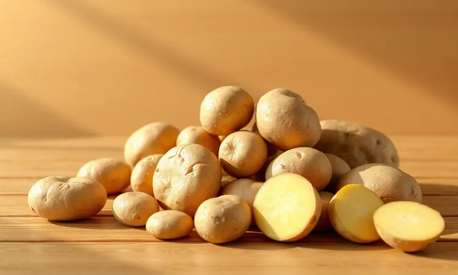
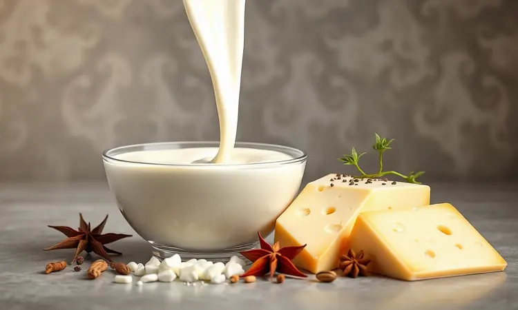
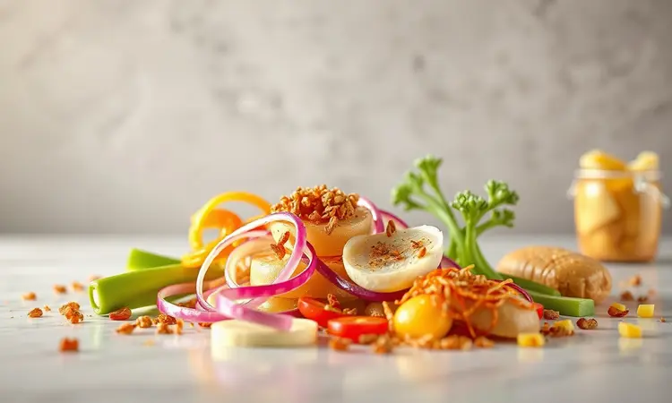

Você adora o conforto de uma batata gratinada, mas detesta ter que esperar quase uma hora no forno convencional? Você não está sozinho.

Muitas pessoas tentam adaptar essa receita clássica para a fritadeira elétrica, mas acabam com batatas cruas por dentro ou um queijo queimado e sem sabor.

Neste guia, eu vou te mostrar que é possível, sim, conseguir aquela cremosidade irresistível e o dourado perfeito em metade do tempo.

Você vai aprender desde a escolha da batata certa até os segredos para o molho não talhar, garantindo um prato digno de restaurante no conforto da sua cozinha.

<SummaryList products={frontmatter.top_products} />

## Por que fazer Batata Gratinada na Airfryer?

Imagine conseguir aquela crocância dourada que faz qualquer prato parecer saído de um restaurante francês, mas sem a ansiedade de ficar vigiando o forno por uma hora inteira. É exatamente essa magia que a Airfryer oferece.

Ela não apenas corta o tempo pela metade, mas transforma o processo em algo quase despreocupado.

A circulação inteligente de ar quente faz mais do que cozinhar rápido: ela cria uma douradinha uniforme e consistente, como se cada fatia de batata recebesse atenção individual.

Enquanto isso, por baixo daquela capa perfeita de queijo, as batatas ficam macias da maneira certa, sem aquelas pontas cruas que estragam a experiência.

E o melhor? Você pode esquecer a limpeza trabalhosa do forno convencional. Uma única cestinha lavável e você está pronto para a próxima aventura culinária. É praticidade que não cobra pedágio no sabor.

## A Escolha da Batata: Asterix ou Monalisa?

A batata certa pode transformar seu gratinado de bom para inesquecível. E aqui não se trata apenas de formato ou tamanho, mas da personalidade de cada variedade.

A Asterix é aquela amiga confiável e firme. Com baixo teor de umidade, ela mantém sua estrutura mesmo sob o calor intenso da Airfryer, resultando em camadas bem definidas e uma crocância que resiste até a faca mais afiada.

Se você sonha com aquele "crunch" satisfatório a cada garfada, ela é sua escolha.

Já a Monalisa é pura cremosidade. Mais suave e com textura aveludada, ela praticamente derrete na boca, abraçando o molho como se fossem velhos amigos se reencontrando. Sua natureza mais úmida cria uma experiência sensorial diferente, onde a maciez é a protagonista.

A decisão final? Depende do abraço que você quer dar aos seus convidados: o firme e estruturado da Asterix, ou o aconchegante e derretido da Monalisa.

## Ingredientes para uma Cremosidade Inigualável

Agora que você já escolheu sua protagonista, vamos aos coadjuvantes que vão elevar seu prato ao estrelato. Os ingredientes certos não são apenas uma lista, são uma orquestra onde cada elemento tem seu momento de brilho.

Comece com batatas frescas e firmes. Passe a mão nelas antes de comprar: elas devem ser firmes, sem pontos moles ou brotos. Essa firmeza inicial é o alicerce da textura perfeita.

O creme de leite é o maestro dessa sinfonia. Escolha um de boa qualidade, com pelo menos 20% de gordura. Essa gordura não é apenas sabor, é a garantia de que seu molho vai ficar sedoso, nunca talhado ou aquoso.

O queijo é onde a magia acontece. Um mix inteligente entre mozzarella (para aquele fio que estica até a mesa) e parmesão (para a profundidade de sabor que fica na memória) cria camadas de sabor que se revezam a cada mordida.

Por fim, os temperos. Sal e pimenta-do-reino recém moída são o básico não negociável. Mas a verdadeira revolução vem da noz-moscada: uma pitada apenas, como um segredo sussurrado que todos percebem mas ninguém identifica imediatamente.

## Utensílios que Facilitam a sua Vida na Cozinha

Para garantir que tudo saia perfeito sem transformar sua cozinha em campo de batalha, alguns utensílios podem ser seus melhores aliados. Não são muitos, mas os certos fazem toda diferença.

### Fatiador de Legumes (Mandoline) para fatias uniformes

<ProductBox 
  title={frontmatter.top_products[0].title} 
  image={frontmatter.top_products[0].image} 
  link={frontmatter.top_products[0].link} 
/>

Consistência é o nome do jogo no gratinado perfeito. Fatias com a mesma espessura não são apenas uma questão estética, são o segredo para que todas cozinhem no mesmo ritmo. Enquanto o centro ainda está firme, as bordas já não estarão queimando.

Um bom mandoline transforma minutos de trabalho tedioso em segundos de precisão cirúrgica. Procure modelos com sistema de segurança que proteja seus dedos, porque a última coisa que você quer é temperar seu gratinado com algo além de amor.

As lâminas intercambiáveis são um bônus delicioso. Aquela mesma batata que hoje vira fatias perfeitas para o gratinado, amanhã pode se transformar em palitos crocantes para acompanhar um hambúrguer.

### Travessas de Cerâmica ou Vidro que cabem na Airfryer

<ProductBox 
  title={frontmatter.top_products[1].title} 
  image={frontmatter.top_products[1].image} 
  link={frontmatter.top_products[1].link} 
/>

O recipiente certo é como o palco perfeito para sua estrela culinária. Ele precisa resistir ao calor intenso sem rachar, distribuir o calor de maneira uniforme, e claro, caber dentro da Airfryer sem tocar nas resistências.

Vidro temperado ou borossilicato são suas melhores apostas. Além de suportarem altas temperaturas, eles permitem que você veja a magia acontecer: o queijo borbulhando, as bordas dourando, a transformação em tempo real.

Cerâmica refratária também funciona, mas exige um olhar mais atento. Certifique-se de que é realmente refratária, não apenas decorativa. A última coisa que você quer é ouvir aquele "crack" no meio do cozimento.

Evite plásticos a qualquer custo. Nenhum sabor vale um risco à saúde.

## Passo a Passo: Como Fazer Batata Gratinada na Airfryer

Agora chegamos ao momento onde teoria vira prática, e ingredientes se transformam em memória afetiva. Siga esses passos como quem segue um mapa do tesouro: cada etapa te leva mais perto do ouro culinário.

### 1. Higienização e o Corte Perfeito

Lave cada batata como se estivesse preparando uma joia para brilhar. Água corrente, esfrega suave com as mãos, secagem cuidadosa com um pano limpo. Esse ritual inicial remove não apenas terra, mas qualquer resquício do caminho até sua cozinha.

O corte é onde a precisão vira poesia. Fatias de 0,5 cm são a espessura ideal: finas o suficiente para cozinhar rápido na Airfryer, mas grossas o suficiente para manter personalidade. Use o mandoline com confiança, mas com respeito pela lâmina.

### 2. Preparando o Molho: Creme de Leite vs. Béchamel

Aqui está uma das decisões mais pessoais da sua jornada culinária.

O creme de leite é o caminho rápido e seguro. Rico, sedoso, com uma doçura natural que abraça as batatas sem dominá-las. É a opção para quando o tempo é curto mas o padrão não pode cair.

Já o molho béchamel é para os dias de romance culinário. Leite, manteiga e farinha dançando na panela até criarem algo maior que a soma das partes. É mais trabalho? Sem dúvida. Mas o sabor complexo, quase intelectual, que ele cria vale cada minuto extra.

Não há resposta errada, apenas diferentes tipos de amor.

### 3. Montagem Estratégica para Cozimento Uniforme

Pense nas camadas como os andares de um edifício perfeito: cada um precisa de atenção individual para o conjunto ficar magnífico.

Comece com uma fina camada do molho escolhido no fundo da travessa. Isso evita que as primeiras fatias grudem e queimem. Sobre ela, disponha as fatias de batata como se fossem telhas, levemente sobrepostas.

Regue com mais molho, polvilhe com queijo, repita. A magia está na paciência: não tenha pressa de chegar ao topo. Três ou quatro camadas bem montadas valem mais que seis apressadas e desorganizadas.

A última camada deve ser especialmente generosa em queijo. Ela será a capa dourada que todos verão primeiro.

### 4. Tempo e Temperatura: O Segredo do Gratinado

Pré-aqueça sua Airfryer a 180°C. Essa temperatura é o ponto mágico onde a mágica acontece: quente o suficiente para criar a crosta dourada, mas controlada o suficiente para não queimar antes do interior cozinhar.

Insira a travessa com cuidado, garantindo que haja espaço para o ar circular por todos os lados. O tempo varia entre 25 e 30 minutos, mas seu verdadeiro guia são seus olhos e nariz.

Nos primeiros 20 minutos, a transformação é silenciosa. Depois, começam os sinais: primeiro o aroma do queijo derretendo, depois pequenas bolhas no molho, finalmente aquele dourado perfeito que parece pintado a óleo.

Não resista à tentação de espiar uma vez, só para ver a magia acontecer.

## 5 Erros Comuns (E como evitá-los para a batata não ficar crua)

Mesmo com as melhores intenções, alguns deslizes podem separar você da batata gratinada perfeita. Conhecê-los é a melhor forma de evitá-los.

O primeiro e mais comum é ignorar a espessura das fatias. Muito grossas e o centro fica cru enquanto as bordas queimam. Muito finas e viram uma pasta sem personalidade. A régua é simples: 0,5 cm.

Temperatura errada é o segundo pecado. Abaixo de 170°C, seu gratinado fica murcho e pálido. Acima de 190°C, o queijo queima antes das batatas cozinharem. Fique no ponto doce dos 180°C.

Esquecer de temperar entre as camadas é um erro silencioso mas fatal. O sal não deve ser apenas um toque final, mas uma conversa contínua durante toda a montagem.

Sobre lotar a Airfryer é pedir por desastre. Sem espaço para o ar circular, você cria microclimas: algumas partes cozinham, outras vaporizam, nenhuma fica perfeita.

Por fim, a impaciência de abrir antes da hora. Cada abertura baixa a temperatura e interrompe o processo. Confie no tempo, ele quase sempre está certo.

## Variações Gourmet: Bacon, Alho-Poró e Mix de Queijos

Depois de dominar o clássico, que tal adicionar sua assinatura pessoal? Essas variações não são apenas adições, são reinvenções.

O bacon, quando bem preparado, não é apenas gordura e sal. É umidade defumada que penetra cada camada, criando pequenas explosões de sabor entre a cremosidade das batatas. Frite bem antes de adicionar, para que fique crocante mesmo após o gratinado.

O alho-poró é a elegância em forma vegetal. Refogue-o lentamente até ficar macio e translúcido, quase doce. Quando adicionado entre as camadas, ele cria camadas de sabor que se revelam gradualmente.

O mix de queijos é onde você pode realmente brincar. Experimente adicionar um pouco de queijo gorgonzola para um toque picante, ou gruyère para uma complexidade francesa autêntica.

## Com o que combina? Melhores acompanhamentos para sua batata

Uma batata gratinada perfeita merece companhia à altura. Ela é tão versátil que pode ir do jantar romântico ao almoço de domingo sem perder a majestade.

Para refeições leves, ela se curva perante uma salada verde fresca. A acidez do vinagrete corta a cremosidade, criando equilíbrio perfeito. Imagine folhas crocantes de alface, tomates cereja e uma vinagrete de mostarda dijon.

Quando o objetivo é conforto total, carnes assadas são parceiros naturais. Um frango assado com alecrim e limão, ou costelinha de porco com mel e mostarda. A gordura da carne encontra a cremosidade do gratinado em um aperto de mãos perfeito.

Para os amantes do mar, peixes grelhados de carne firme, como salmão ou atum, criam contraste interessante. A leveza do peixe ilumina a riqueza da batata.

## Dicas de Conservação: Como Reaquecer sem Perder a Textura

A boa notícia é que sua batata gratinada pode viver além do primeiro jantar. A má notícia é que muitos a estragam na hora de reaquecer.

Para conservar, espere esfriar completamente antes de cobrir. O vapor preso é o maior inimigo da textura. Guarde em recipiente hermético na geladeira até por três dias.

Na hora de reaquecer, a Airfryer é sua melhor amiga. 160°C por 5 a 10 minutos restauram a crocância do topo sem secar o interior. Se usar forno, cubra com papel alumínio para proteger o queijo, removendo nos últimos minutos para recuperar o dourado.

O micro-ondas é a última opção. Ele esquenta, sim, mas transforma a crocância em borracha. Reserve apenas para emergências verdadeiras.

## Perguntas Frequentes sobre Batata na Airfryer (FAQ)

Preciso pré-cozinhar as batatas? Não é obrigatório, especialmente se suas fatias tiverem a espessura certa (0,5 cm).

Mas se você é do time "melhor prevenir", uma rápida passagem de 2 minutos em água fervente pode garantir a maciez interna sem comprometer o tempo no forno.

Minha Airfryer é pequena, como adaptar?
Use uma travessa menor ou diminua a receita pela metade. O importante é manter espaço para circulação do ar. Não tente fazer uma receita grande em um aparelho pequeno, isso só leva à frustração.

Posso congelar a batata gratinada pronta?
Pode, mas com expectativas ajustadas. O congelamento altera um pouco a textura do creme de leite. Se for congelar, prefira a versão com molho béchamel, que resiste melhor às mudanças de temperatura.

Qual queijo derrete melhor sem ficar oleoso?
Mozzarella de búfala é a rainha do derretimento perfeito. Ela fica cremosa, estica lindamente, e não libera aquela gordura que separa e fica boiando. Combinada com parmesão para sabor, é a dupla imbatível.

Por que meu queijo queima antes das batatas cozinharem?
Temperatura muito alta. Tente começar a 170°C por 20 minutos, depois aumente para 180°C apenas nos últimos 5-10 minutos para dourar. Proteja o topo com papel alumínio se notar que está dourando rápido demais.

## Conclusão

Uma batata gratinada perfeita na Airfryer não é apenas uma receita, é uma declaração de amor à simplicidade bem executada. Ela prova que a sofisticação não precisa de horas no forno ou ingredientes impossíveis de encontrar.

Tudo que você precisa está aqui: batatas frescas, um bom queijo, temperos básicos, e a coragem de tentar.

Lembre-se que cada etapa tem sua importância. A escolha da batata define a personalidade do prato. A espessura das fatias garante o cozimento uniforme. O molho certo transforma ingredientes em experiência.

E a temperatura precisa é a chave que abre a porta do dourado perfeito.

Agora é sua vez. Reúna seus ingredientes, escolha sua travessa favorita, e prepare-se para surpreender a si mesmo e a quem você ama.

A única coisa melhor que o aroma dessa batata gratinada saindo da Airfryer é a expressão de satisfição completa depois da primeira garfada.

Vai encarar o desafio? Sua Airfryer está esperando para transformar essas batatas simples em uma memória que vai repetir-se em muitos jantares por vir. Bom apetite!