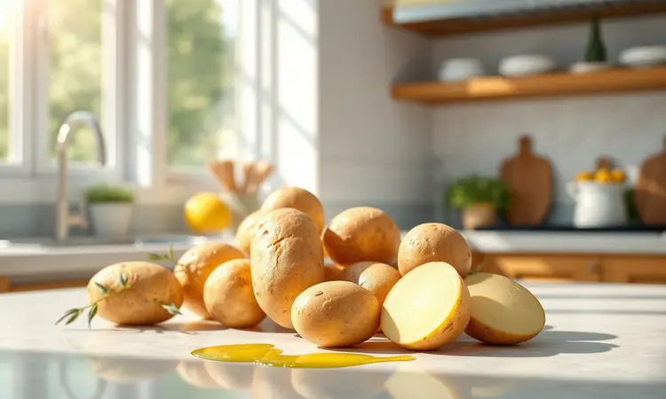
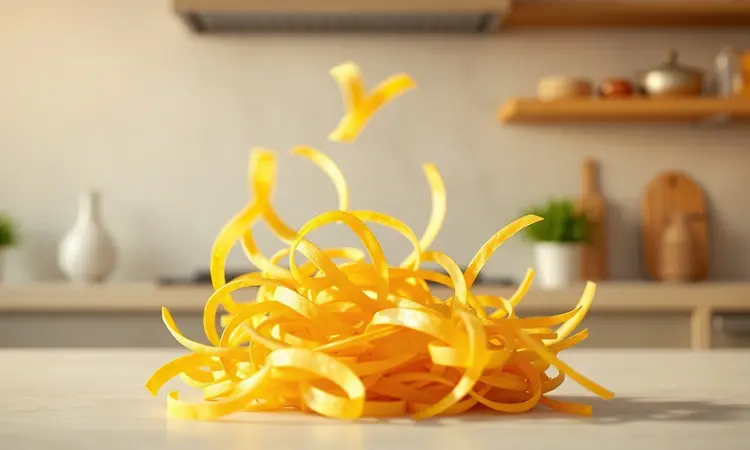
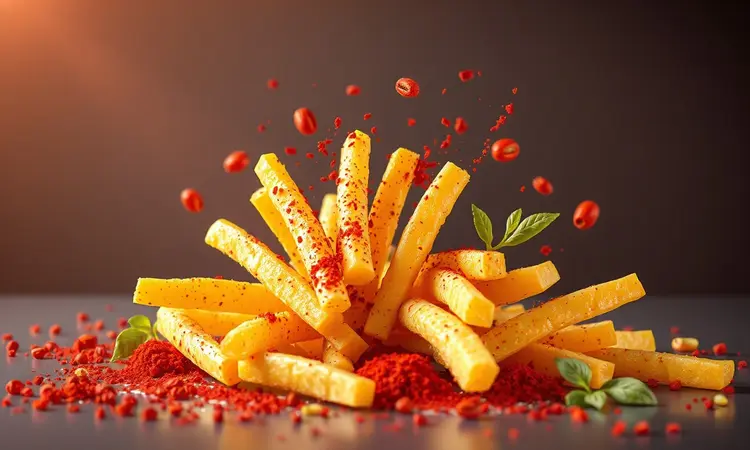
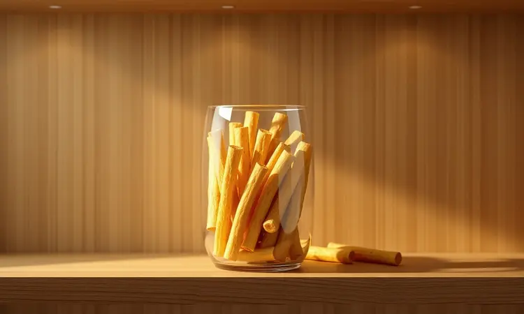

Imagina aquele salpicão ou estrogonofe que parece estar pedindo um toque crocante para ficar perfeito, mas toda vez que você pega a batata palha do supermercado, vem aquele peso na consciência ao ler a lista de ingredientes.

O que você nem imagina é que existe um caminho mais gostoso: fazer sua própria versão em casa, com crocância que vai surpreender até você e um sabor tão verdadeiro quanto o orgulho de ter feito com suas próprias mãos.

Neste guia, vamos desvendar como transformar uma simples batata em fios dourados e leves usando só o ar quente da sua air fryer, com todas as dicas para evitar as famosas batatas que grudam ou desidratam.

<SummaryList products={frontmatter.top_products} />

## Por que fazer Batata Palha na Air Fryer em vez de comprar pronta?

Pense na última vez que você abriu um pacote de batata palha e sentiu aquele cheiro artificial. Agora compare com a sensação de abrir a air fryer e ser recebido pelo aroma quente de batata recém-assada, temperada exatamente como você gosta.

Essa é a experiência completa: você troca gordura industrializada por apenas uma leve névoa de azeite, conservantes por frescor, e o sabor padrão pela sua própria assinatura de temperos.

Mais do que economia, é sobre reconectar com o prazer de comer algo realmente bom para você.

### Os benefícios da versão caseira para a sua saúde

Você já parou para pensar que quando você mesmo prepara a comida, você se torna o curador dos seus ingredientes?

Aqui você escolhe qual batata vai usar, se vai ser orgânica ou da feirinha, quanta ou quase nenhuma gordura vai acrescentar, e se os temperos serão apenas sal e aquela pimenta que você amou na última viagem.

Dá para fazer uma versão sem óleo algum, só com o calor do ar, ou adicionar especiarias que transformam um acompanhamento em um prato principal. Cada tirinha que sai crocante da sua air fryer carrega o sabor da sua intenção, não de uma fórmula química.

## Equipamentos necessários para o resultado perfeito

<ProductBox 
  title={frontmatter.top_products[0].title} 
  image={frontmatter.top_products[0].image} 
  link={frontmatter.top_products[0].link} 
/>

Vamos começar com o básico que você provavelmente já tem: sua air fryer, uma tigela para misturar e secar, e um pano de prato limpo ou papel toalha.

O verdadeiro segredo para transformar batatas em 'palha' está em um único instrumento: o ralador ou fatiador que vai criar tiras finas e uniformes. Se a ideia de fatiar manualmente te assusta, existem opções simples que não exigem habilidades de chef.

E sim, dá para fazer com uma faca bem afiada e paciência, mas a uniformidade do corte é o que garante que todas as tirinhas fiquem prontas ao mesmo tempo, sem aquelas que queimam enquanto outras ainda estão moles.

### A importância do fatiador mandoline para fios uniformes

<ProductBox 
  title={frontmatter.top_products[1].title} 
  image={frontmatter.top_products[1].image} 
  link={frontmatter.top_products[1].link} 
/>

Se você já tentou cortar batata em tirinhas finas com uma faca comum, sabe como é frustrante quando umas ficam grossas e outras quase transparentes. É exatamente essa inconsistência que manda a crocância perfeita para o espaço.

Um bom fatiador ou mandoline resolve isso de uma vez por todas, criando fatias tão iguais que parecem ter saído de uma linha de produção, só que na sua cozinha.

Os modelos atuais vêm com protetores de segurança que tornam o processo tão seguro quanto cortar com uma faca, mas com a precisão de quem faz isso há anos.

É um daqueles investimentos que vai além da batata palha: imagine cenouras em julienne para saladas, abobrinhas para gratinar, ou até maçãs fininhas para uma sobremesa.

A uniformidade não é só estética, é a garantia de que cada pedaço vai assar no mesmo ritmo, entregando aquela crocância perfeita em toda a bandeja.

## Qual é a melhor batata para fazer batata palha?

Vamos aos detalhes da matéria-prima: batatas ricas em amido são suas melhores amigas aqui. Por quê? Porque o amido é o que vai criar aquela camada externa crocante enquanto o interior fica macio e areado.

As campeãs são a batata Asterix e a russet (aquela mais comum, de casca mais grossa).

Elas têm a quantidade perfeita de amido para garantir que, após o processo de remoção do excesso (que vamos te ensinar), o que sobrar seja justamente o que vai criar a textura dos seus sonhos.

Se você só tem a batata comum aí na sua cozinha, não se preocupe, ela também funciona. O segredo está no próximo passo, não apenas na variedade.

## Lista de Ingredientes Simples e Naturais

A beleza desta receita está na sua simplicidade: batatas, um fio de azeite (ou nada, se quiser testar sem óleo), sal e a criatividade dos seus temperos favoritos. É aqui que você brinca: que tal uma pitada de páprica defumada para lembrar um churrasco?

Ou alecrim fresco picado para um aroma que vai invadir sua casa? Alho em pó, cebola desidratada, orégano, salsinha... Cada combinação cria uma experiência diferente. Você está no comando, longe dos sabores padronizados das prateleiras.

## Passo a Passo: Como fazer Batata Palha na Air Fryer Sequinha

Agora vamos à mágica prática. O processo tem alguns segredos simples que fazem toda a diferença entre uma batata palha ok e aquela que faz todo mundo pedir a receita.

### 1. O corte e a lavagem (Removendo o amino)

Depois de cortar suas batatas em tirinhas finas e uniformes (lembra do nosso fatiador?), elas vão direto para uma tigela com água gelada. Este não é apenas um banho rápido: deixe-as mergulhadas por pelo menos 30 minutos.

Enquanto isso acontece, você vai ver a água ficando turva - isso é o amino saindo da batata. Esse amino é o que, se ficar, vai fazer suas batatas grudarem umas nas outras e ficarem com aquela textura grudenta ao invés de crocante.

É como dar um banho de purificação para que só o melhor da batata chegue ao forno.

### 2. O segredo da secagem absoluta

Após o banho, vem um passo que muitos pulam e depois se arrependem: a secagem perfeita. Pegue cada punhado de batatas e esprema com as mãos sobre a pia, depois estenda sobre um pano de prato limpo ou várias camadas de papel toalha. Enrole e pressione suavemente.

Você quer eliminar cada gota de água, porque água é o inimigo número um do crocante na air fryer. O ar quente assa, não frita, então qualquer umidade extra vai criar vapor que deixa as batatas moles.

Parece excesso de cuidado, mas é esse detalhe que separa o 'bom' do 'incrível'.

### 3. Temperando e pré-aquecendo a Air Fryer

Com as batatas completamente secas, é hora de brincar com os sabores. Em uma tigela grande, misture as tirinhas com seus temperos escolhidos e aquele fio de azeite (se estiver usando).

Enquanto você faz isso, ligue sua air fryer a 200°C e deixe aquecer por pelo menos 5 minutos. Esse pré-aquecimento é crucial porque cria um ambiente de calor instantâneo que sela as batatas assim que elas entram, começando o processo de crocância imediatamente.

Pense nisso como aquecer a chapa antes de colocar o pão para tostar.

### 4. Tempo e Temperatura: O ponto ideal de crocância

Aqui está o mapa da mina: 200°C por 15 a 20 minutos, mexendo delicadamente a cada 5 minutos. Por que mexer? Porque o ar circula melhor em torno de cada tirinha quando elas mudam de posição, garantindo que todas recebam o mesmo calor dourador.

Aos 15 minutos, experimente uma. Está crocante por fora mas ainda com um toque macio? Perfeito, é assim mesmo. Prefere mais sequinha? Deixe por mais 2 ou 3 minutos, sempre supervisionando.

Sua air fryer pode ser ligeiramente diferente da minha, então confie nos seus olhos e no teste de uma tirinha, não apenas no temporizador.

## Dicas de Especialista para a Batata não grudar no cesto

Você já viu aquelas fotos lindas de batata palha soltinha e depois tentou fazer e tudo grudou formando um bloco só?

Isso quase sempre acontece por três motivos: batatas não estavam totalmente secas (voltamos ao passo 2), o cesto estava superlotado, ou faltou aquele leve toque de óleo para criar uma barreira.

A solução é simples: trabalhe em lotes menores do que você acha necessário, garantindo espaço para o ar circular entre as tirinhas. Se mesmo assim algumas grudarem, não se desespere.

Desliga a air fryer, espera esfriar um minuto, e com uma espátula de silicone, solte delicadamente. Elas vão terminar de assar perfeitas.

## Variações de Sabores: Ervas, Páprica e muito mais

Agora que você domina a técnica básica, o mundo é seu playground de sabores. Que tal uma versão mediterrânea com alecrim fresco e raspas de limão siciliano? Ou uma apimentada com páprica defumada e um toque de cayenne?

Para as crianças (e adultos que são crianças no coração), experimente sal, um pouco de queijo parmesão ralado na hora e orégano. A batata doce também entra nessa dança e fica divina com canela e uma pitada de noz-moscada.

Cada combinação transforma o mesmo ingrediente básico em uma experiência completamente nova.

## Como armazenar para manter a batata crocante por mais tempo

Fez mais do que precisa para aquela refeição? Perfeito, porque batata palha caseira bem armazenada mantém a crocância por dias. O segredo é afastá-la completamente da umidade.

Assim que esfriar totalmente, transfira para um pote de vidro com tampa hermética (aqueles que fazem aquele 'ploc' quando fecham). Armazene em um armário escuro e fresco, nunca na geladeira, porque o frio do refrigerador traz umidade que amolece tudo.

Se depois de alguns dias você notar que perdeu um pouco do crocante, basta dar uma rápida passadinha de 2-3 minutos na air fryer para reviver a magia.

## Perguntas Frequentes (FAQ) sobre Batata Palha Caseira

### Pode fazer com batata doce?

Absolutamente sim, e fica uma delícia!

A batata-doce tem naturalmente mais açúcar e menos amido, então o resultado é um crocante um pouco diferente, mais caramelizado nas bordas e com aquele sabor levemente adocicado que combina perfeitamente com canela ou especiarias defumadas.

O processo é exatamente o mesmo: corte, remoção do excesso de amido (sim, ela tem um pouco), secagem completa e assadura. Só fique atento porque ela pode queimar um pouco mais rápido devido ao açúcar, então reduza a temperatura para 180°C e cheque a cada 4 minutos.

### Quanto tempo dura na despensa?

Guardada no pote de vidro hermético, em local fresco e escuro, sua batata palha caseira fica crocante e gostosa por até uma semana.

Passando disso, ela ainda está segura para comer por mais algumas semanas, mas vai perdendo gradualmente a crocância perfeita que você conquistou. Por isso, minha recomendação é fazer quantidades menores com mais frequência, aproveitando sempre o frescor máximo.

É tão rápido fazer um novo lote que vale mais a pena do que armazenar por muito tempo.

## Conclusão

Lembra daquela sensação de abrir o pacote industrializado e sentir que faltava algo?

Agora você tem nas mãos o poder de criar exatamente o oposto: um acompanhamento que começa com sua escolha consciente dos ingredientes, passa pelo cuidado artesanal do preparo, e termina na mesa com a recompensa de cada mordida crocante.

Não se trata apenas de substituir uma batata palha por outra, mas de transformar um momento cotidiano em uma pequena celebração do que significa comer bem e com prazer.

Da próxima vez que preparar seu estrogonofe ou salpicão favorito, em vez de abrir um pacote, você vai abrir sua air fryer e encontrar não apenas batatas crocantes, mas a satisfação genuína de ter criado algo delicioso do zero.

É isso que torna cada refeição especial: quando o sabor carrega também a história do carinho posto no preparo. Então, pegue suas batatas, ligue sua air fryer, e descubra como algo tão simples pode elevar tanto o nível da sua alegria na cozinha.