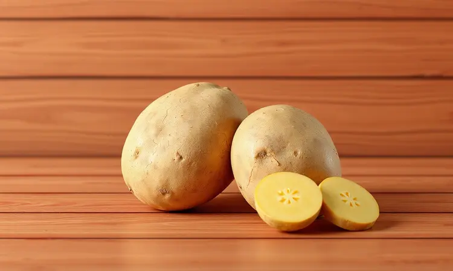
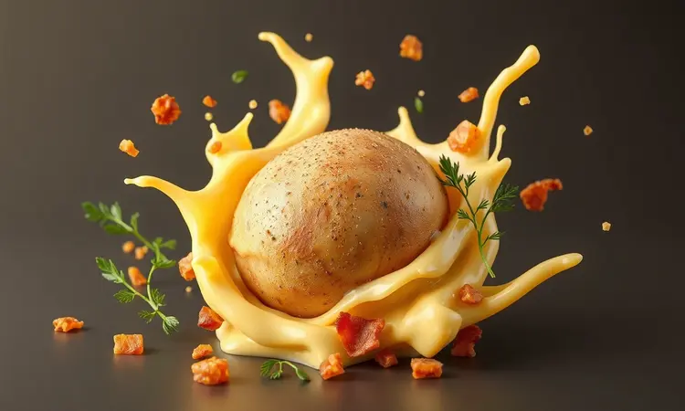
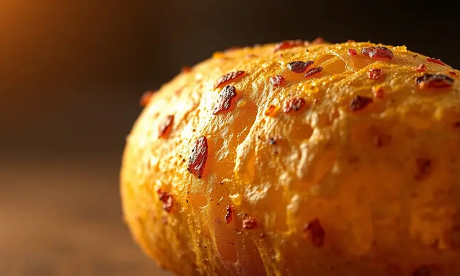
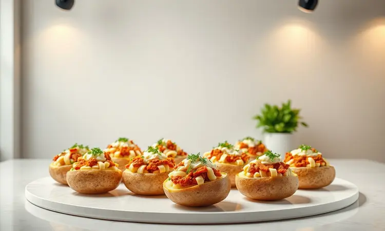

Imagine aquele sabor caseiro de batata recheada, mas sem passar horas esperando o forno esquentar. E, claro, sem aquela frustração de a casca não ficar tão crocante quanto deveria.

Se esse dilema soa familiar, você está prestes a descobrir como a fritadeira elétrica pode se tornar sua maior aliada na cozinha, transformando uma receita que parece trabalhosa em algo prático, saudável e surpreendentemente gostoso.

Prepare-se para aprender não apenas o passo a passo, mas os segredos que vão fazer seus convidados pensarem que você contratou um chef.

<SummaryList products={frontmatter.top_products} />

## Por que preparar Batata Recheada na Air Fryer é a melhor opção?

O segredo está na combinação perfeita entre rapidez e textura. Enquanto um forno convencional leva tempo para esquentar e assar uniformemente, a Air Fryer circula ar quente intensamente ao redor da batata.

O resultado é uma casca que fica irresistivelmente crocante, quase como uma batata frita, mas com muito menos óleo. E o interior? Fica macio o suficiente para desmanchar na boca, pronto para abraçar qualquer recheio que você imaginar.

Você ganha praticidade sem abrir mão do sabor autêntico de um prato assado, e ainda tem a liberdade de experimentar desde recheios clássicos até criações vegetarianas ou gourmet, tudo em uma fração do tempo.

## Escolhendo a batata ideal: Asterix ou Monalisa?

Essa escolha faz toda a diferença no resultado final. Pense na batata Asterix como a opção mais confiável para quem busca uma casca que realmente estale ao morder, com uma polpa firme que não desmorona mesmo cheia de recheio.

Sua textura é perfeita para quem valoriza aquele contraste entre crocante e cremoso.

Já a Monalisa é mais versátil e tem um sabor suave que absorve bem os temperos, mas atenção: por ser um pouco mais macia, pode não manter a mesma estrutura se você exagerar no recheio.

A decisão final depende do que você prioriza: a Asterix para a crocância garantida, ou a Monalisa se você prefere uma batata que praticamente derrete na boca.

## Utensílios e Equipamentos que Facilitam sua Vida

Ter as ferramentas certas transforma o preparo de um trabalho em um prazer. Comece com o básico: uma boa faca para cortar e uma colher para rechear. Um pincel de cozinha pode ser seu melhor amigo para pincelar azeite na casca, garantindo aquele dourado perfeito.

Mas três itens especificamente vão elevar seu jogo para outro nível.

### Fritadeira Elétrica Air Fryer de Alta Capacidade

<ProductBox 
  title={frontmatter.top_products[0].title} 
  image={frontmatter.top_products[0].image} 
  link={frontmatter.top_products[0].link} 
/>

Se você costuma cozinhar para a família ou receber amigos, invista em um modelo de alta capacidade.

Aquela ansiedade de ter que fazer várias levas desaparece quando você encontra uma Air Fryer de 5 a 6 litros para famílias menores, ou até 12 litros para quem gosta de preparar porções generosas de uma só vez.

Um detalhe que muitos ignoram mas que faz toda a diferença: a potência. Modelos entre 1500W e 1800W oferecem energia suficiente para aquela crocância de restaurante que tanto desejamos.

Sim, podem consumir um pouco mais de energia, mas pense no tempo que você economiza e na qualidade do resultado.

Recursos adicionais, como funções pré-programadas e painéis digitais, transformam o processo em algo intuitivo, como se você tivesse um assistente na cozinha.

### Papel Alumínio de Alta Resistência para Cozimento

<ProductBox 
  title={frontmatter.top_products[1].title} 
  image={frontmatter.top_products[1].image} 
  link={frontmatter.top_products[1].link} 
/>

Esqueça aqueles papéis finos que rasgam ao primeiro contato. O papel alumínio reforçado, com espessura de 30 mícrons, é como um escudo para suas batatas: protege sem sufocar, permitindo que os aromas se desenvolvem enquanto mantém a umidade ideal.

Marcas como Wyda, com suas versões "Extra Forte", tornam o manuseio muito mais tranquilo.

Aqui vai um truque profissional: nunca vede completamente com o papel. Deixe uma pequena abertura para permitir a circulação de vapor, garantindo que sua batata cozinhe uniformemente por dentro enquanto a casca fica perfeita por fora.

E atenção com alimentos ácidos, que podem alterar o sabor se tiverem contato direto prolongado com o alumínio. É um investimento que se paga pela praticidade e pelos resultados.

### Pinça de Cozinha com Ponta de Silicone

<ProductBox 
  title={frontmatter.top_products[2].title} 
  image={frontmatter.top_products[2].image} 
  link={frontmatter.top_products[2].link} 
/>

Manusear batatas quentes diretamente com as mãos é uma receita para queimaduras.

A pinça com ponta de silicone resolve isso elegantemente: permite que você vire as batatas na metade do cozimento sem riscar o antiaderente da sua Air Fryer, e o silicone aguenta temperaturas de até 230°C com segurança.

Além da proteção térmica, as pinças mais longas dão um bom alcance, enquanto as mais curtas são mais fáceis de guardar em gavetas menores. A maioria é lavável na máquina, o que significa que você ganha funcionalidade sem ganhar trabalho extra na limpeza.

É daqueles utensílios que, uma vez que você experimenta, se pergunta como vivia sem.

## Receita de Batata Recheada na Air Fryer (Passo a Passo)

Vamos à parte prática, onde a mágica realmente acontece. O processo é mais simples do que parece: fure a batata para permitir que o vapor escape durante o cozimento, pré-aqueça a Air Fryer, e prepare-se para cerca de 30-40 minutos de transformação.

O resultado final é uma casca que estala ao toque do garfo, e um recheio quentinho que pode ser personalizado infinitamente.

### Ingredientes para a Base Perfeita

Comece com batatas médias e de formato uniforme, como as russet, conhecidas por sua textura fofa por dentro e casca que fica crocante como ninguém. O azeite de oliva não é apenas para untar; ele é o segredo para realçar a crocância da casca.

Sal e pimenta do reino são essenciais, mas não tenha medo de ousar: alho em pó, ervas secas como alecrim ou tomilho, ou até uma pitada de páprica defumada podem elevar o sabor a outro patamar.

E claro, reserve seus ingredientes favoritos para o recheio: queijos que derretem bem, carnes desfiadas, legumes cozidos. A beleza desta receita é que a base perfeita serve como tela para sua criatividade.

### Modo de Preparo: Do Pré-aquecimento ao Dourado Final

Primeiro, aqueça sua Air Fryer a 200°C por cerca de 5 minutos. Enquanto isso, lave bem as batatas e faça vários furinhos com um garfo por toda a superfície: isso evita que elas "explodam" durante o cozimento, permitindo que o vapor escape suavemente.

Coloque as batatas na cesta sem amontoar, garantindo que o ar circule livremente ao redor de cada uma. Programe para 30 a 40 minutos, dependendo do tamanho das batatas.

Na metade do tempo, vire-as cuidadosamente com uma pinça para garantir que dourem igualmente por todos os lados.

Aqui está o momento crucial: retire uma batata e faça o teste do garfo. Se ele entrar e sair suavemente, estão prontas.

Deixe esfriar o suficiente para manipular, corte ao meio com cuidado, retire um pouco da polpa (que pode ser incorporada ao recheio) e preencha com sua criação. Volte à Air Fryer por mais 5-10 minutos apenas para aquecer o recheio e finalizar a casca.

## 5 Sugestões de Recheios Irresistíveis para Variar o Cardápio

A verdadeira magia da batata recheada está na variedade infinita de recheios. Pense nela como um receptáculo pronto para receber suas combinações favoritas, desde o clássico reconfortante até ousadias gourmet.

Aqui estão cinco caminhos para explorar, cada um com sua personalidade única.

### Clássica: Bacon Crocante com Requeijão e Cebolinha

Esta é a combinação que transcende gerações. Imagine o sabor defumado do bacon bem crocante se misturando à cremosidade do requeijão, tudo equilibrado pela cebolinha fresca.

Depois de cozidas as batatas, misture parte da polpa com o requeijão e o bacon, recheie generosamente e finalize na Air Fryer por alguns minutos. O resultado é puro conforto em forma de comida, perfeito para aqueles dias em que você precisa de um abraço no estômago.

### Gourmet: Frango Desfiado com Cream Cheese e Milho

Para ocasiões especiais ou quando você quer impressionar sem muito trabalho, esta combinação é imbatível.

O frango desfiado e bem temperado ganha uma textura sedosa quando misturado ao cream cheese, e os grãos de milho adicionam toques doces que surpreendem a cada garfada.

É sofisticado o suficiente para um jantar a dois, mas ainda assim reconfortante como uma refeição caseira.

### Fit: Brócolis com Queijo Branco e Alho

Quem disse que saudável não pode ser deliciosamente viciante? Os brócolis cozidos no vapor mantêm sua cor vibrante e textura crocante, o alho refogado perfuma tudo com seu aroma inconfundível, e o queijo branco derretido cria uma cremosidade leve que não pesa.

É a prova de que você pode cuidar da saúde sem abrir mão do prazer de comer bem.

### Sofisticada: Estrogonofe de Carne com Batata Palha

Esta é para os momentos em que você quer transformar uma simples batata em um evento gastronômico. O estrogonofe de carne, com seu molho cremoso e cogumelos, encontra na batata recheada um parceiro perfeito. E a batata palha por cima?

Não é apenas enfeite: oferece aquele contraste de texturas que os chefs adoram, crocante contra cremoso, em cada garfada.

### Vegetariana: Mix de Queijos com Tomate Seco

Uma celebração de sabores mediterrâneos dentro da sua batata. Combine queijos com personalidades diferentes: a muçarela para derreter, o parmesão para o sabor intenso, a ricota para a cremosidade suave.

O tomate seco, com seu doce concentrado e toque ácido, corta a gordura dos queijos de forma brilhante. Com algumas ervas frescas como orégano ou manjericão, você tem uma refeição vegetariana que satisfaz até os mais carnívoros.

## Dicas de Especialista: O Segredo da Casca Crocante

A casca perfeita não é um acidente; é uma conquista. Comece escolhendo batatas com pele fina, como as Asterix, e lave-as bem. O passo mais negligenciado? Secá-las completamente antes de cozinhar. A água residual é inimiga da crocância.

Pincele azeite generosamente por toda a superfície, não apenas para untar, mas para criar uma barreira que ajuda na formação da casquinha dourada. E não economize no sal, que além de temperar, ajuda a desidratar levemente a superfície, contribuindo para a textura final.

Os furos com o garfo são essenciais, mas não poucos: faça vários, por toda a batata. E cozinhe em temperatura alta (200°C a 220°C) para que o processo de caramelização aconteça rápido o suficiente para criar crocância sem secar o interior.

## Como Fazer Batata Recheada para Vender e Lucrar

Se você descobriu que tem talento para essa receita, por que não transformá-la em oportunidade? A Air Fryer é sua aliada não apenas na qualidade, mas na eficiência: permite preparar várias porções simultaneamente, com resultados consistentes a cada lote.

Comece definindo seu diferencial: será a variedade de recheios criativos? A crocância incomparável da casca? Ou a apresentação cuidadosa?

Ofereça pelo menos três opções fixas (uma clássica, uma gourmet, uma vegetariana) e uma surpresa semanal para manter os clientes curiosos.

Invista em embalagens que mantenham a crocância durante o transporte, e considere kits completos com um mix de salada simples para acompanhar.

O segredo do sucesso está na consistência: quando seus clientes sabem que sempre vão receber exatamente a mesma qualidade, eles se tornam fiéis.

## Perguntas Frequentes (FAQ)

Às vezes, as dúvidas mais simples são as que mais nos impedem de experimentar. Vamos esclarecer as principais para que você possa cozinhar com confiança.

### Precisa cozinhar a batata na água antes da Air Fryer?

Depende completamente do resultado que você busca. Se o tempo é seu maior aliado e você quer acelerar o processo, um pré-cozimento rápido em água pode ajudar a reduzir o tempo na Air Fryer em cerca de 10 minutos.

Mas se você prioriza aquela casca intensamente crocante e saborosa que só vem de ser assada por completo no ar quente, vá direto para a Air Fryer. A segunda opção dá mais trabalho ao aparelho, mas recompensa com sabor e textura superiores.

### Quanto tempo a batata demora para assar de verdade?

Pense na batata média como seu ponto de referência: entre 30 e 40 minutos a 200°C. Batatas pequenas podem estar prontas em 25 minutos, enquanto as verdadeiras gigantes podem pedir 45 a 50 minutos.

O truque não é seguir o tempo cegamente, mas fazer o teste do garfo a partir dos 25 minutos. Quando ele desliza para dentro e para fora sem resistência, você encontrou o ponto ideal.

E não se esqueça de virar na metade do tempo para garantir que todos os lados recebam igual atenção do ar quente.

### Pode comer a casca da batata recheada?

Não apenas pode como deve. A casca é onde se concentram nutrientes valiosos, como fibras e potássio, e quando preparada na Air Fryer, ela se transforma na parte mais saborosa e texturizada do prato.

Lave bem para remover qualquer sujeira, seque completamente, e prepare-se para descobrir que aquela parte que muitas vezes descartamos pode ser a verdadeira estrela da receita.

Crocante, levemente salgada e com sabor concentrado, é como a batata frita mais gourmet que você já experimentou.

## Conclusão

O que começou como uma solução para quem não tem paciência para esperar o forno se transformou em uma descoberta culinária completa. A batata recheada na Air Fryer é mais do que uma receita conveniente; é um convite para reimaginar um clássico com novos olhos.

Você ganha não apenas tempo na cozinha, mas também controle total sobre a textura, a crocância e a saúde do prato.

Cada etapa, desde a escolha da batata certa até o momento em que você serve sua criação, se torna uma experiência mais consciente e satisfatória. E o melhor de tudo: essa não é uma receita que você faz uma vez e esquece.

É um método que adapta à sua rotina, aos ingredientes que tem em casa, aos sabores que ama. Seja para um jantar rápido em família, para impressionar convidados ou até para começar um pequeno negócio, você agora tem nas mãos o conhecimento para fazer acontecer.

Então, da próxima vez que pensar em batata recheada, lembre-se que a praticidade e o sabor de restaurante estão a um pré-aquecimento de distância. O forno pode esperar; sua próxima criação deliciosa não.