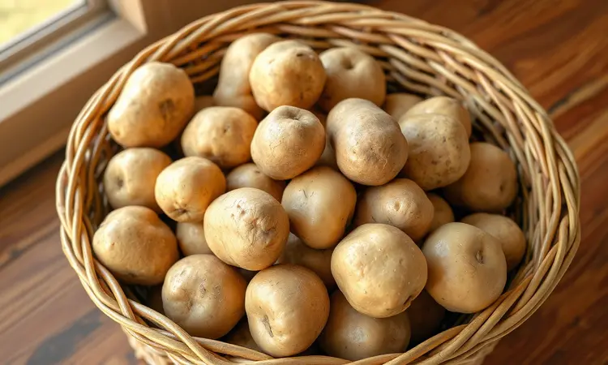
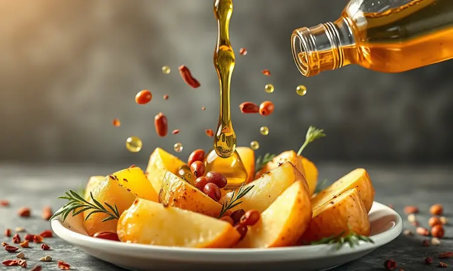
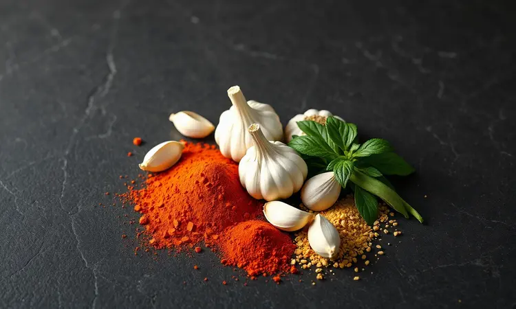
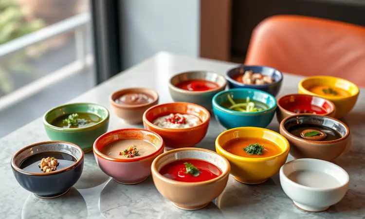

Você já tentou fazer batata rústica em casa e ela acabou ficando murcha ou crua por dentro? Todos concordamos que a batata perfeita precisa ter aquele contraste irresistível: super crocante por fora e macia como um purê por dentro.

A boa notícia é que você não precisa de uma fritadeira profissional para alcançar esse resultado de restaurante.

Neste guia, vou te mostrar o passo a passo definitivo, os melhores temperos e o segredo que ninguém te conta para garantir a crocância máxima usando apenas sua airfryer. Prepare-se para elevar o nível do seu acompanhamento favorito.

<SummaryList products={frontmatter.top_products} />

## O que Define uma Verdadeira Batata Rústica?

Uma verdadeira batata rústica se destaca pela sua textura crocante por fora e macia por dentro. Para atingir esse equilíbrio perfeito, a escolha da batata faz toda a diferença.

Variedades como a inglesa ou a arrozeira são ideais, pois possuem menor teor de água e mais amido, criando aquela casquinha dourada que estala ao morder. O corte em pedaços grandes também ajuda a realçar a crocância, permitindo que uma maior área fique exposta ao calor.

Além disso, temperos simples como sal, pimenta e ervas podem elevar ainda mais o sabor sem mascarar a essência da batata. O segredo está na simplicidade e na escolha correta dos ingredientes.

## A Escolha do Ingrediente: Qual a Melhor Batata para Airfryer?

Quando se trata de preparar batata rústica na airfryer, a escolha do ingrediente é fundamental para garantir crocância e sabor. As batatas mais indicadas são a batata inglesa e a batata doce.

A batata inglesa, conhecida por sua textura firme e alto teor de amido, resulta em uma casca crocante e um interior macio. Já a batata doce traz um toque adocicado, além de ser rica em nutrientes.

É importante cortá-las em tamanhos uniformes para que cozinhem de maneira homogênea, evitando aquela frustração de uns queimarem enquanto outros ainda estão crus.

Independentemente da escolha, sempre lave bem as batatas e considere deixá-las de molho por um tempo para uma textura ainda mais crocante.

## Utensílios Essenciais para Facilitar o Preparo

Com a batata certa em mãos, vamos aos instrumentos que tornam o preparo mais prático e seguro. Você vai precisar basicamente de uma faca afiada, uma tábua de cortar e um bowl para temperar.

Mas se queremos falar de praticidade de verdade, a airfryer é a protagonista dessa história.

### Air Fryer com Cesto Antiaderente

<ProductBox 
  title={frontmatter.top_products[0].title} 
  image={frontmatter.top_products[0].image} 
  link={frontmatter.top_products[0].link} 
/>

Imagine preparar suas batatas sem aquele medo de grudar ou da terrível faxina posterior. As air fryers com cesto antiaderente oferecem exatamente essa liberdade. Modelos como os da Mondial, Philco e Electrolux facilitam a limpeza de forma impressionante.

A Mondial Mega Family AFN-80, com capacidade de 8 litros, por exemplo, é perfeita para famílias maiores e conta com um cesto antiaderente que simplifica a manutenção.

A maioria desses cestos não é apenas antiaderente, mas também removível e compatível com lava-louças, o que significa mais tempo para saborear e menos para lavar.

Sim, a durabilidade do revestimento depende dos cuidados, mas seguindo as recomendações, você terá um aliado que transforma o preparo de batatas rústicas em uma experiência sem estresse.

### Faca de Chef Afiada para Cortes Precisos

<ProductBox 
  title={frontmatter.top_products[1].title} 
  image={frontmatter.top_products[1].image} 
  link={frontmatter.top_products[1].link} 
/>

Uma faca de chef bem afiada é mais do que um utensílio, é sua parceira na conquista da batata rústica perfeita. Essa ferramenta versátil, geralmente com 8 polegadas (cerca de 20 cm), proporciona o equilíbrio ideal entre manobrabilidade e eficiência para cortes precisos.

O material da lâmina faz diferença: modelos em aço inoxidável são duráveis e fáceis de manter, enquanto as de alto carbono mantêm o fio por mais tempo.

Embora exija cuidados regulares de afiação e armazenamento, uma boa faca de chef é um investimento que transforma o preparo dos ingredientes em um momento prazeroso, garantindo pedaços uniformes que cozinham perfeitamente.

## Receita de Batata Rústica na Airfryer: Passo a Passo

Agora que temos tudo em mãos, vamos à prática. Para preparar batatas rústicas na airfryer, comece cortando as batatas em gomos, tempere com azeite, sal e ervas a gosto, e coloque na airfryer a 200ºC por cerca de 20 minutos.

Não se esqueça de mexer na metade do tempo para garantir uma crocância uniforme. Parece simples, certo? Mas os detalhes fazem toda diferença.

### Lista de Ingredientes e Temperos

Para começar, você vai precisar de batatas (inglesa ou doce, conforme sua preferência), azeite de oliva para dar aquele toque especial e ajudar na crocância, sal e pimenta-do-reino a gosto.

As ervas são onde você pode brincar: alecrim ou tomilho para um sabor clássico e sofisticado. Para um toque extra, experimente páprica ou alho em pó.

A combinação desses ingredientes não é apenas uma lista, é a promessa daquela crocância e sabor irresistíveis que fazem todos pedirem mais.

### Higienização e o Corte "Canoa"

A segurança e o sabor começam aqui. Lave as batatas em água corrente, esfregando suavemente para remover qualquer sujeira. Agora vem o corte que faz a diferença: a técnica "canoa".

Fatia a batata ao meio no sentido do comprimento e depois corte essas metades em fatias largas, criando uma forma triangular ou retangular. Esse corte não é apenas estético, ele aumenta a área exposta ao calor, resultando naquela crocância ideal que buscamos.

E mais importante: pedaços cortados de forma similar cozinham de maneira uniforme, evitando surpresas desagradáveis.

### O Truque do Pré-Cozimento: Vale a Pena?

Você já se perguntou por que algumas batatas rústicas têm aquele interior incrivelmente macio enquanto outras ficam apenas crocantes por fora? O segredo pode estar no pré-cozimento.

Cozinhar levemente as batatas antes de colocá-las na airfryer garante que elas fiquem macias por dentro enquanto adiciona um ponto extra de crocância por fora. O vapor ajuda a amolecer o interior, e a fritura rápida na airfryer cria uma crosta dourada e crocante.

Sim, exige um pouco mais de tempo de preparo, mas se você busca a perfeição absoluta na textura, essa técnica compensa cada minuto extra.

## O Segredo da Crocância: Como Temperar e Emulsificar

Aqui está o pulo do gato que transforma batatas boas em extraordinárias. O tempero é apenas o começo: sal, pimenta, alho em pó e ervas como alecrim ou tomilho. Mas o verdadeiro segredo está na emulsificação.

Misturar as batatas com um pouco de azeite não é apenas para untar, é para criar uma crosta dourada que protege a maciez interior. Deixe-as marinando por pelo menos 30 minutos antes de cozinhar, permitindo que absorvam bem os sabores como uma esponja.

E atenção: evite sobrecarregar a cesta da airfryer. O espaço para o ar quente circular é o que garante aquela textura irresistível por fora e macia por dentro que faz os olhos brilharem.

## Tempo e Temperatura: O Ajuste para o Dourado Perfeito

Encontrar o ponto ideal de cozimento é como afinar um instrumento. Geralmente, uma temperatura em torno de 200°C é o sweet spot para garantir que as batatas fiquem crocantes por fora e macias por dentro.

O tempo de cozimento varia entre 20 a 30 minutos, dependendo da espessura das suas fatias. Dê uma sacudida na cesta na metade do tempo, essa simples ação garante que elas assem de maneira uniforme, sem aquelas pontas queimadas.

Lembre-se que cada airfryer tem sua personalidade, então observe atentamente e ajuste conforme necessário para conseguir aquele dourado perfeito que sinaliza a batata rústica ideal.

## 5 Dicas de Especialista para Nunca Mais Errar

Quer garantir que suas batatas rústicas sejam impecáveis toda vez? Siga estas dicas que transformam tentativa em certeza: 1) Comece sempre com batatas frescas e de boa qualidade, elas são a base de tudo.

2) Corte-as em pedaços uniformes para que cozinhem por igual, sem surpresas. 3) Deixe as batatas de molho em água por pelo menos 30 minutos para remover o excesso de amido, esse passo simples faz milagres na crocância.

4) Seque bem antes de temperar, porque a umidade é a inimiga da textura perfeita. 5) Use uma quantidade moderada de óleo e temperos, e nunca sobrecarregue a cesta da airfryer.

Cozinhar em lotes pode parecer mais trabalho, mas garante que o ar circule bem e cada pedaço fique exatamente como você sonhou.

## Variações de Sabor: Vá Além do Alecrim

Por que se limitar ao clássico quando o mundo dos sabores está à sua disposição? Embora o alecrim seja uma escolha maravilhosa, existem infinitas possibilidades para personalizar suas batatas rústicas.

Experimente misturar páprica doce para um toque defumado suave, ou a versão picante para quem gosta de emoção. Que tal adicionar queijo parmesão ralado nos últimos minutos para um sabor umami que derrete na boca?

Alho em pó e cebola em pó criam uma profundidade extra de sabor, enquanto ervas como tomilho ou orégano trazem frescor e aroma. Não tenha medo de experimentar, cada combinação é uma oportunidade de transformar uma receita simples em uma criação única do seu paladar.

## Sugestões de Molhos para Acompanhamento

As batatas rústicas são estrelas por si só, mas os molhos certos podem transformá-las em uma experiência gastronômica completa. Imagine mergulhar aquela batata crocante em um aioli cremoso, onde o alho e o azeite criam uma harmonia perfeita.

Para quem busca um contraste defumado, o molho barbecue é um clássico atemporal. Prefere algo refrescante? O tzatziki, com iogurte grego e pepino, oferece um alívio cremoso à crocância.

E para os corações aventureiros, um molho de pimenta ou chimichurri traz uma explosão de sabor que desperta todos os sentidos. Experimente diferentes combinações, descubra suas favoritas e transforme cada refeição em uma celebração de sabores.

## Erros Comuns: Por que Minha Batata Ficou Murcha?

Aquela frustração de esperar por batatas crocantes e encontrar uma textura murcha é mais comum do que você imagina, mas totalmente evitável. O erro número um? Não secar adequadamente as batatas após a lavagem. A umidade excessiva cria vapor que impede a crocância.

O corte irregular é outra armadilha: pedaços muito pequenos queimam rápido, enquanto os maiores cozinham demais e ficam moles. E atenção ao óleo: quantidade insuficiente resulta em textura menos crocante.

Por último, encher demais a cesta da airfryer é convite para o desastre, pois impede a circulação de ar quente essencial para uma cocção uniforme. Manter estas dicas em mente é seu passaporte para a crocância perfeita.

## Perguntas Frequentes (FAQ)

Na jornada para a batata rústica perfeita, surgem dúvidas naturais. Vamos esclarecer as mais comuns para que você cozinhe com confiança.

### Pode fazer com batata doce?

Absolutamente sim! A batata doce na airfryer não só é possível como é uma alternativa deliciosa e nutritiva. Seu sabor adocicado natural combina maravilhosamente com temperos, criando uma experiência diferente da batata tradicional.

Corte em palitos ou rodelas, tempere a gosto (experimente canela ou noz-moscada para um toque especial) e cozinhe até ficarem crocantes. O tempo pode variar conforme a espessura, então fique de olho.

Além do sabor, você ganha em nutrição: rica em fibras, vitaminas e antioxidantes, a batata doce torna essa opção ainda mais atraente para quem busca equilíbrio sem abrir mão do prazer.

### Como requentar a batata e manter o "crunch"?

Reaquecer batatas rústicas sem perder a crocância parece um desafio, mas com a técnica certa, você revive a textura do primeiro dia. Pré-aqueça sua Airfryer a 180°C, isso é crucial para o sucesso.

Coloque as batatas em uma única camada na cesta, evitando sobreposição como se fossem recém-cortadas. O espaço entre elas permite que o ar quente circule livremente, revitalizando a crocância. Reaqueça por cerca de 5 a 7 minutos, verificando na metade do tempo.

Um toque especial: uma leve pincelada de azeite antes de esquentar pode fazer milagres, devolvendo o brilho e a textura. Seguindo esses passos, você terá batatas tão deliciosas e crocantes quanto na primeira vez.

## Conclusão

A batata rústica na airfryer é muito mais do que um simples acompanhamento. É a prova de que com as técnicas certas, ingredientes cuidadosamente escolhidos e um toque de criatividade, você pode transformar o humilde tubérculo em uma experiência gastronômica memorável.

Desde a escolha da batata perfeita até o truque do pré-cozimento que garante o interior macio, cada passo é uma oportunidade de elevar o sabor e a textura.

O que começou como um guia técnico revelou-se uma jornada de descobertas: a importância do corte uniforme, a magia da emulsificação com azeite, o timing preciso de temperatura e, acima de tudo, a liberdade de personalizar com ervas, especiarias e molhos que refletem seu paladar único.

As dicas para evitar erros comuns e até mesmo requentar sem perder a crocância mostram que essa é uma habilidade que você levará para toda a vida.

Seja como aperitivo crocante para receber amigos, guarnição sofisticada para um jantar especial ou lanche reconfortante para um dia frio, a batata rústica na airfryer se adapta a todos os momentos.

Agora é sua vez: pegue suas batatas, ligue a airfryer e comece a criar memórias saborosas. A cozinha é seu laboratório, e o resultado será sempre uma celebração do sabor feito com suas próprias mãos.