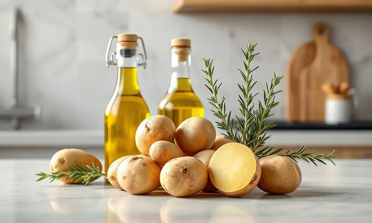
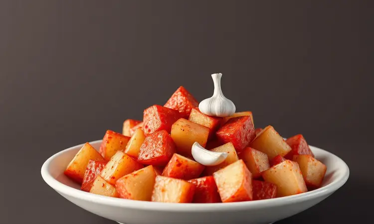
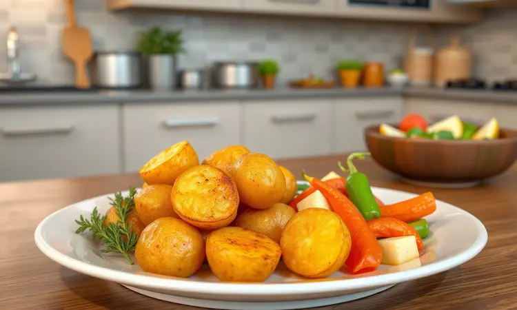

Que batata sauté bem douradinha e macia é o acompanhamento perfeito para qualquer refeição, isso você já sabe. O que talvez ainda não tenha descoberto é como conseguir o mesmo resultado (ou melhor) sem transformar o fogão em um campo de batalha oleoso.

A boa notícia é que a air fryer pode ser sua maior aliada nessa missão, e nós vamos te mostrar exatamente como conquistar a textura crocante e o interior sedoso que todo restaurante caprichado oferece.

<SummaryList products={frontmatter.top_products} />

## O que é Batata Sauté e por que a Air Fryer é a melhor escolha?

Sauté é mais que uma técnica, é uma promessa: pequenos cubos de batata que devem ser macios por dentro com uma casquinha irresistivelmente crocante por fora.

No fogão tradicional, controlar isso é quase uma arte, envolvendo óleo, atenção constante e, claro, uma bagunça considerável.

A air fryer resolve esse quebra-cabeça com elegância. Seu segredo está no calor inteligente que circula rapidamente, envolvendo cada pedacinho por igual. O resultado?

Aquele dourado perfeito em 360 graus, sem que você precise ficar mexendo freneticamente ou usar quantidades generosas de óleo. É praticidade que não rouba o sabor, e saúde que não sacrifica o prazer.

## Ingredientes Essenciais para uma Batata Sauté de Respeito

O sucesso começa com escolhas certas. Prefira batatas com textura firme, como a Asterix ou a Yukon Gold, que garantem a estrutura ideal. Uma generosa pitada de sal e pimenta do reino já forma a base, mas é nas escolhas seguintes que a mágica acontece.

Uma colher de azeite extra virgem carrega o sabor e é a garantia da crocância. Deixe as ervas frescas para o final. Imagine o alecrim soltando seu aroma único no calor dos últimos minutos. Ou o tomilho, que traz um perfume mediterrâneo e sofisticado.

## Melhores Modelos de Air Fryer para Receitas Crocantes

<ProductBox 
  title={frontmatter.top_products[0].title} 
  image={frontmatter.top_products[0].image} 
  link={frontmatter.top_products[0].link} 
/>

Se você quer conquistar aquela crocância digna de aplausos, o equipamento precisa ser seu parceiro.

A Philips Walita Air Fryer XL Digital é uma favorita por um motivo: sua tecnologia Rapid Air e capacidade de 6,2 litros fazem maravilhas com grandes lotes, perfeita para família ou para quem gosta de sobras crocantes.

Para um equilíbrio inteligente entre espaço e funcionalidade, a Mondial AF-30 oferece um painel touch intuitivo em um design compacto de 3,5 litros, ideal para a cozinha moderna.

Já a Oster Flex Air Fryer Oven é a escolha de quem não abre mão de versatilidade, funcionando como forno e air fryer em um único aparelho robusto.

A Electrolux EAF50, com seus 5 litros, garante desempenho consistente. Uma dica secreta: antes de decidir, pense em como será a limpeza. Alguns modelos com muitas peças podem ser desafiantes, então considere a praticidade do dia a dia.

## Passo a Passo: Como fazer Batata Sauté na Air Fryer (Receita Completa)

Vamos transformar teoria em prática. O processo é surpreendentemente simples: cubos uniformes, um banho generoso de temperos e 20 a 25 minutos a 200°C na air fryer, com uma mexida na metade do tempo para garantir aquele dourado homogêneo em todos os lados.

Parece básico, mas os detalhes fazem toda a diferença.

### 1. Preparação: O corte ideal faz a diferença

Cada cubo deve ser companheiro do outro no tamanho. Isso é o que garante que todos terminem a jornada ao mesmo tempo, crocantes por fora e macios por dentro sem exceções. Facilite sua vida: depois de cortar, deixe as batatas mergulhadas em água fria por meia hora.

Esse truque simples remove o excesso de amido, criando um caminho direto para a crocância perfeita. Batatas muito finas viram lascas secas, enquanto pedaços muito grandes podem não alcançar a maciez desejada no centro.

### Utensílios Recomendados: Facas para um Corte Preciso

<ProductBox 
  title={frontmatter.top_products[1].title} 
  image={frontmatter.top_products[1].image} 
  link={frontmatter.top_products[1].link} 
/>

A precisão começa na sua mão. Uma faca de chef afiada é sua melhor amiga nessa missão, sua lâmina longa desliza suavemente pelas batatas, criando cortes limpos e uniformes.

Se você busca ainda mais controle, especialmente para descascar ou trabalhar porções menores, uma faca para legumes responde com precisão cirúrgica.

Para quem quer impressionar com estilo, a faca ondulada cria cortes decorativos que retêm ainda mais o tempero. Independente da escolha, invista em uma lâmina de qualidade.

Uma boa faca não apenas corta melhor, mas respeita seu esforço e transforma o preparo em um ritual agradável e seguro.

### 2. O segredo do Tempero: Manteiga, Azeite e Ervas

Este é o momento da transformação de sabor. A dupla imbatível? Uma colher de manteiga derretida pela riqueza inconfundível e um fio de azeite extra virgem, que carrega os aromas das ervas e garante a casquinha dourada.

Mas o verdadeiro toque de mestre vem das ervas frescas. Imagine o alecrim soltando seu perfume levemente amadeirado no calor ou o tomilho trazendo uma suavidade que lembra o Mediterrâneo.

Espalhe com generosidade, misture com as mãos para que cada pedacinho seja abraçado pelo sabor. Esta etapa não é só técnica, é amor.

### 3. Tempo e Temperatura: O ponto dourado perfeito

200°C é a temperatura do sucesso, o ponto onde a mágica da crocância acontece sem queimar. Em 15 a 20 minutos, você já verá a transformação: os cubos começam a exibir aquele tom dourado que promete textura perfeita.

Aqui entra o único movimento necessário: na metade do tempo, abra a cesta e dê uma leve sacudida. Isso garante que cada lado receba sua dose igual de calor, eliminando os pontos pálidos que ficam escondidos. O resultado?

Uma coreografia de crocância onde cada pedacinho brilha igual.

## 5 Dicas de Ouro para a Batata não Murchar nem Grudar

Conquistar a perfeição da batata sauté na air fryer envolve alguns segredos que vão além da receita. Primeiro, a uniformidade no corte é sua garantia de que nada fique cru ou queimado por acidente. Depois de lavar, seque cada pedacinho com cuidado.

A água é amiga do cozimento, mas inimiga da crocância.

O óleo deve ser seu aliado, não um dilúvio. Uma colher é suficiente para criar a camada protetora que vai transformar em casquinha. Nunca sobrecarregue a cesta. O ar precisa circular livremente como um abraço quente em cada batata.

Por fim, confie em seus sentidos. Se ao final do tempo sugerido elas ainda não estiverem no ponto dourado dos seus sonhos, dê mais alguns minutos. A receita é um guia, mas seus olhos e seu palate são os juízes finais.

## Variações Irresistíveis: Batata Sauté com Alho e Páprica Defumada

Por que parar no clássico quando você pode viajar pelo sabor? Enquanto suas batatas douram na air fryer, prepare a transformação: em uma tigela, misture alho picado finamente com páprica defumada e um fio de azeite. Espere sentir o aroma que se espalha pela cozinha.

Quando as batatas estiverem quase prontas, transfira para a tigela e misture com carinho até que cada cubo seja revestido pelo tempero dourado. Devolva à air fryer por apenas 2 ou 3 minutos finais.

O resultado é uma explosão de sabor onde o toque defumado da páprica dança com a suavidade do alho assado, criando uma experiência que vai muito além do acompanhamento.

## Acessórios Úteis: Tigelas para Temperar com Facilidade

<ProductBox 
  title={frontmatter.top_products[2].title} 
  image={frontmatter.top_products[2].image} 
  link={frontmatter.top_products[2].link} 
/>

O ritual do tempero merece um palco adequado. Tigelas de vidro refratário são suas aliadas perfeitas. Além de resistirem bem ao calor, elas permitem que você veja a mágica acontecer enquanto mistura, garantindo que cada pedaço seja igualmente abençoado pelos temperos.

Para quem valoriza elegância na cozinha, tigelas de cerâmica ou porcelana trazem sofisticação e funcionam perfeitamente no processo. Apenas evite aquelas com decorações metálicas que possam reagir ao calor.

As tigelas de silicone são a escolha prática e moderna: flexíveis, antiaderentes e que facilitam cada movimento de mistura.

Se optar por inox, garanta que seja de qualidade alimentar. O material distribui o calor uniformemente e é quase indestrutível. A tigela certa não é apenas um recipiente, é a extensão das suas mãos no momento de criar sabor.

## Com o que servir? Melhores combinações de acompanhamento

A beleza da batata sauté está em sua versatilidade. Ela pode ser a estrela humilde ao lado de um suculento filé mignon, onde sua crocância contrasta com a maciez da carne. Ou acompanhar um peixe grelhado com limão, onde o toque crocante complementa a textura delicada.

Para uma refeição vegetariana memorável, combine com legumes grelhados como abobrinha e pimentão e uma salada de folhas verdes.

Não subestime seu poder como petisco: com um molho especial de iogurte com ervas ou uma maionese temperada com um toque de mostarda, ela se transforma no centro das atenções.

Cada combinação é uma nova oportunidade de criar uma refeição que vai além do simples ato de se alimentar.

## Perguntas Frequentes (FAQ) sobre Batata Sauté na Air Fryer

É normal surgirem dúvidas quando você está prestes a transformar sua cozinha. Vamos esclarecer as mais comuns para que sua jornada seja tranquila desde o primeiro cubo cortado.

### Precisa cozinhar a batata na água antes de colocar na air fryer?

Este é um atalho que vale a pena considerar. Um breve cozimento prévio na água (apenas alguns minutos até começar a amolecer) garante que o interior fique incrivelmente macio enquanto a air fryer trabalha sua mágica na crocância externa.

O contraste de texturas é mais pronunciado.

Mas se a pressa bater, pode ir direto da tábua para a air fryer. O resultado ainda será delicioso, com uma textura ligeiramente diferente. Experimente as duas versões e descubra qual conquista seu paladar.

### Qual o melhor tipo de batata para esta receita?

Batatas Asterix e Batata Clara são suas melhores amigas nesta missão. A Asterix tem baixo teor de umidade, quase como se fosse projetada para a crocância ideal, resistindo bem ao calor intenso sem desmanchar.

A Batata Clara oferece versatilidade confiável, funcionando bem em praticamente qualquer preparo.

O importante é buscar batatas firmes ao toque, sem pontos verdes ou brotos. A qualidade da matéria-prima é a primeira garantia de sucesso.

### Posso fazer com batatas congeladas?

Absolutamente sim. As batatas congeladas pré-cortadas são uma mão na roda para quem busca praticidade sem abrir mão do sabor. A textura final pode ser ligeiramente diferente da versão fresca, mas a crocância está garantida.

Apenas ajuste o tempo e a temperatura conforme necessário, já que elas podem variar de marca para marca. É o caminho perfeito para quando a fome aperta e a inspiração precisa de um empurrão.

## Conclusão

Ao final dessa jornada, você descobriu que a batata sauté perfeita não é apenas sobre ingredientes e tempo, mas sobre transformar um simples acompanhamento em uma experiência culinária memorável.

A air fryer se revela não como um eletrodoméstico, mas como um parceiro que entende seus desejos: menos bagunça, mais sabor, e aquela crocância dourada que parece um abraço para o paladar.

Cada cubo uniforme, cada fio de azeite, cada erva fresca é um convite para criar refeições que alimentam não apenas o corpo, mas também o prazer de cozinhar. Experimente as variações, confie nas dicas, mas acima de tudo, deixe seu toque pessoal guiar o processo.

Afinal, a melhor batata sauté é aquela que carrega sua assinatura de sabor.