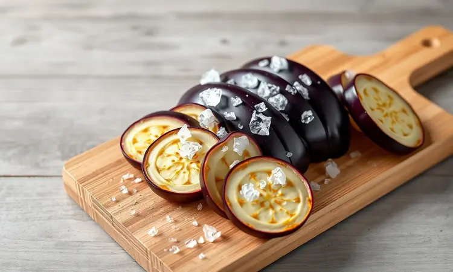
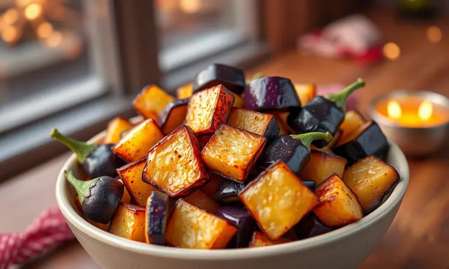
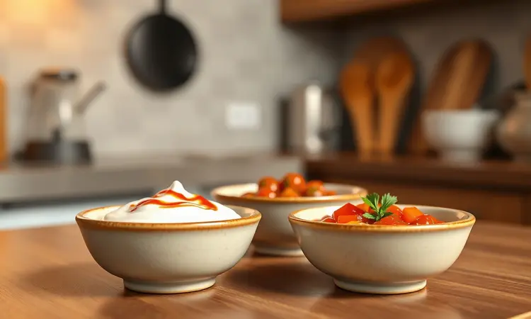

Imagine a frustração de preparar berinjela com todo cuidado, só para ela sair amarga, borrachuda ou encharcada de óleo. Essa decepção te impede de aproveitar toda a versatilidade desse legume incrível.

Mas e se você descobrisse que existe um método que transforma a berinjela numa experiência completamente diferente? Crocante por fora, macia por dentro, sem amargor e com muito menos óleo.

Este guia vai te levar passo a passo por esse processo, revelando desde o segredo milenar de tirar o amargor até as técnicas de empanar que garantem aquele crocante perfeito que todo mundo ama.

<SummaryList products={frontmatter.top_products} />

## Por que preparar berinjela na Air Fryer é a melhor opção?

A resposta está na combinação perfeita entre praticidade e resultados. Enquanto o fogão te deixa preocupado com óleo quente e limpeza trabalhosa, a Air Fryer oferece um caminho mais inteligente.

Ela consegue aquela crocância irresistível usando apenas uma fina camada de azeite, transformando um alimento empanado numa opção que você pode comer sem culpa.

A velocidade é outro diferencial: em minutos, suas berinjelas estão prontas, mantendo o sabor e os nutrientes intactos. E falando em sabor, o método com ar quente circundante diminui naturalmente o amargor, revelando a verdadeira doçura do legume.

É como redescobrir a berinjela pela primeira vez.

## O Segredo Infalível: Como tirar o amargor da berinjela antes de fritar

Tudo começa com um gesto simples que faz toda diferença: salgar. Corte sua berinjela no formato desejado (rodelas para empanar, cubos para aperitivos) e espalhe uma generosa camada de sal por cima.

Espere trinta minutos e testemunhe a mágica: o sal extrai não apenas a umidade excedente, mas também os compostos responsáveis pelo amargor incômodo. Após esse descanso, basta enxaguar bem e secar com papel toalha.

Esse passo não é apenas sobre sabor: ao remover o excesso de água, você cria a base perfeita para a crocância. Pense nesses trinta minutos como um investimento que elimina qualquer chance de decepção no prato final.

## Utensílios Essenciais para Facilitar o Preparo

Ter os utensílios certos transforma o preparo da berinjela de uma tarefa em um ritual prazeroso. Comece com o básico: uma tábua de corte limpa e uma faca bem afiada garantem cortes uniformes, essenciais para um cozimento perfeito.

Uma tigela espaçosa facilita o tempero e a mistura de ingredientes sem bagunça.

### Fritadeira Elétrica (Air Fryer)

<ProductBox 
  title={frontmatter.top_products[0].title} 
  image={frontmatter.top_products[0].image} 
  link={frontmatter.top_products[0].link} 
/>

Essa é a protagonista da nossa história. As Air Fryers ganharam seu espaço por um motivo simples: elas entregam o que prometem. Funcionam circulando ar quente em alta velocidade, criando uma crosta dourada e deliciosa com uma fração do óleo tradicional.

Para escolher a sua, pense no seu cotidiano. Modelos entre 4L e 5L são companheiros perfeitos para casais ou pequenas famílias, enquanto versões de até 12L abraçam almoços de domingo com a família toda.

Marcas como Mondial, Arno e Philips Walita se destacam pela confiabilidade e pela variedade de funções extras, como assar, grelhar e até desidratar.

A única recomendação é observar o espaço interno: sobrecarregar a cesta impede a circulação do ar, resultando em alimentos menos crocantes. Fora isso, é um investimento que se paga em praticidade e saúde.

### Pulverizador de Azeite (Spray)

<ProductBox 
  title={frontmatter.top_products[1].title} 
  image={frontmatter.top_products[1].image} 
  link={frontmatter.top_products[1].link} 
/>

Esse pequeno aliado é um mestre do controle. Enquanto despejar azeite direto da garrafa muitas vezes significa exagero, o pulverizador distribui uma névoa fina e uniforme.

Isso é fundamental para untar a cesta da Air Fryer e para pincelar as berinjelas, garantindo que cada pedaço receba exatamente o necessário para dourar, sem ficar oleoso. Opte por modelos com borrifo ajustável e material resistente, preferencialmente de vidro.

Essa precisão não só entrega um resultado melhor como também faz economia: você usa menos azeite a longo prazo.

### Pincel de Silicone para Cozinha

<ProductBox 
  title={frontmatter.top_products[2].title} 
  image={frontmatter.top_products[2].image} 
  link={frontmatter.top_products[2].link} 
/>

Esqueça os pincéis de cerdas que soltam fiapos e são difíceis de limpar. O pincel de silicone é a evolução que sua cozinha merecia. Sua superfície lisa e não porosa desliza sobre os alimentos, espalhando óleo ou marinadas de forma homogênea.

A verdadeira vantagem vem depois: ele resiste a altas temperaturas sem derreter e, na hora da limpeza, simplesmente não retém resíduos. A maioria é lavável na máquina de louças, tornando o processo pós-preparo rápido e higiênico.

Pode não ter a "sensibilidade" de um pincel natural, mas para untar e pincelar, sua eficiência e durabilidade são incomparáveis.

## Receita Passo a Passo: Berinjela Empanada Super Crocante

Esta é a receita que vai fazer a berinjela empanada entrar para o seu repertório de favoritos. Seguindo cada etapa com carinho, o resultado é garantido.

### Ingredientes Necessários

• 1 berinjela grande, firme e fresca (a qualidade aqui é fundamental)
• Sal grosso para o processo de desamargar
• 2 colheres de sopa de azeite de oliva
• 2 claras de ovo ligeiramente batidas
• 1 xícara de farinha de rosca
• Temperos a gosto: pimenta-do-reino moída na hora, alho em pó, páprica defumada e orégano

### Modo de Preparo Detalhado

1. **Prepare a berinjela:** Lave e seque a berinjela. Corte em rodelas de aproximadamente 1 cm de espessura. Siga o processo de salgar descrito acima: salgue, espere 30 minutos, enxágue e seque muito bem com papel toalha. Esse ponto é crítico para a crocância.

2. **Tempere:** Em uma tigela, misture o azeite com os temperos escolhidos. Pincele essa mistura nas duas faces de cada rodela de berinjela já seca.

3. **Empane:** Monte sua linha de produção. Tenha um prato com as claras batidas e outro com a farinha de rosca misturada com um pouco mais dos mesmos temperos. Passe cada rodela primeiro na clara, escorrendo o excesso, e depois na farinha de rosca, pressionando levemente para aderir.

4. **Cozinhe:** Preaqueça sua Air Fryer a 200°C por 3 minutos. Disponha as rodelas empanadas na cesta, sem sobrepor (faça em lotes se necessário). Cozinhe por 8 minutos, vire com cuidado e cozinhe por mais 7 a 8 minutos, ou até ficarem douradas e crocantes. Sirva imediatamente.

## Variações Deliciosas para Testar

A berinjela na Air Fryer é uma tela em branco para sua criatividade. Experimente adicionar uma pitada de cominho ou um toque de limão siciliano ralado à farinha de rosca. Misture fatias de abobrinha ou pimentão para um mix de vegetais crocantes.

Ou então, transforme-a num cremoso dip: asse pedaços de berinjela com alho, bata no processador com tahine, limão e azeite, e tenha um acompanhamento que rouba a cena.

### Dadinhos de Berinjela (Aperitivo Perfeito)

Esses cubinhos dourados são a prova de que saudável pode ser irresistível.

Após cozinhar a berinjela até ficar macia (na Air Fryer ou no forno), amasse-a bem e misture com alho e cebola refogados, ervas frescas picadas e uma colher de farinha de grão-de-bico para dar liga.

Modele em cubinhos, pincele com azeite e asse na Air Fryer até ficarem com as bordas crocantes. A textura é incrível: exterior dourado que cede a um interior cremoso e cheio de sabor. Prepare uma quantia extra, porque eles desaparecem rápido.

### Chips de Berinjela Low Carb (Sem Farinha)

Para momentos de desejo por algo crocante, esses chips são a resposta. Corte a berinjela em fatias finíssimas com um mandolin ou faca muito afiada. O processo de salgar é opcional aqui, mas ajuda a extrair mais umidade.

Depois de muito bem secas, misture-as com azeite, sal e seus temperos preferidos (páprica defumada e alecrim são uma combinação vencedora). Espalhe numa única camada na Air Fryer e cozinhe a 180°C por 12 a 15 minutos, virando na metade do tempo.

O resultado são chips translúcidos, leves e absurdamente crocantes, perfeitos para mergulhar em um homus ou simplesmente saborear sozinhos.

## 5 Dicas de Especialista para a Berinjela não murchar

1. **Selecione com critério:** Comece por berinjelas firmes, com a casca lisa e brilhante, sem manchas ou partes moles. Uma boa matéria-prima é meio caminho andado.

2. **Corte com precisão:** Fatias ou cubos de espessura uniforme garantem que todos cozinhem no mesmo ritmo, evitando pedaços crus ao lado de outros ressecados.

3. **Não pule a secagem:** Após enxaguar o sal, seque cada pedaço meticulosamente com papel toalha. A água residual é a inimiga da crocância.

4. **Respeite o espaço:** Colocar muitas peças na cesta faz com que elas "cozinhem no vapor" uma das outras, ficando moles. Cozinhe em lotes menores.

5. **Use gordura com sabedoria:** O azeite não é vilão; é o que conduz o calor e promove o douramento. Use o pulverizador para uma aplicação fina e uniforme.

## Melhores Molhos para Acompanhar sua Berinjela na Air Fryer

A crocância da berinjela pede molhos que contrastem e complementem. Um iogurte grego batido com alho fresco picado, suco de limão e um punhado de hortelã ou endro cria uma combinação fresca e leve.

Para um sabor mais terroso e complexo, o molho de tahine (pasta de gergelim) misturado com água, limão e um fio de azeite é pura cremosidade.

Se o seu paladar pede algo com personalidade, um chimichurri caseiro (salsa, orégano, alho, vinagre e pimenta) ou um molho de pimenta suave trazem um toque vibrante que realça o sabor da berinjela sem sobrepujá-lo. Experimente e descubra seu par perfeito.

## Perguntas Frequentes (FAQ)

### Posso fazer berinjela congelada na Air Fryer?

Sim, a Air Fryer é excelente para descongelar e cozinhar vegetais congelados. No caso da berinjela pré-cortada e congelada, não há necessidade de descongelar antes.

Espalhe os pedaços congelados na cesta e ajuste o tempo: normalmente, serão necessários de 18 a 22 minutos a 190°C para ficarem completamente cozidos e com pontos dourados. Apenas lembre-se de sacudir a cesta na metade do tempo para um resultado uniforme.

É a solução ideal para um acompanhamento rápido e saudável em dias corridos.

### Como armazenar e reaquecer para manter a crocância?

Para guardar, deixe a berinjela esfriar completamente à temperatura ambiente, nunca ainda quente. Armazene em um recipiente de vidro ou plástico com tampa, forrando o fundo com uma folha de papel toalha para absorver qualquer vapor residual que possa amolecê-la.

Na geladeira, ela se mantém bem por até 3 dias. O segredo da reaquecimento é evitar o micro-ondas, que deixa tudo borrachudo. Reaqueça diretamente na Air Fryer a 160°C por 3 a 5 minutos.

Esse calor seco e circulante vai reativar a crocância, quase como se estivesse saindo na hora. A textura e o sabor se mantêm incríveis, sem necessidade de óleo extra.

## Conclusão

Preparar berinjela na Air Fryer vai muito além de seguir uma receita: é adotar um método que respeita o ingrediente e valoriza seu tempo na cozinha. Você deixa para trás a preocupação com óleo, o amargor surpresa e a textura desagradável.

Em seu lugar, ganha a confiança de servir um prato consistentemente crocante, saboroso e saudável, que impressiona tanto num jantar especial quanto num lanche rápido.

Das rodelas empanadas perfeitas aos chips low carb que satisfazem qualquer desejo por crocância, a berinjela se revela como um dos legumes mais versáteis que você pode dominar. Agora, com todas as técnicas e dicas em mãos, é sua vez de transformar essa experiência.

Pegue sua Air Fryer, escolha uma berinjela firme e comece a criar. O primeiro mordida naquela crosta dourada vai te provar que a perfeição, afinal, é possível.