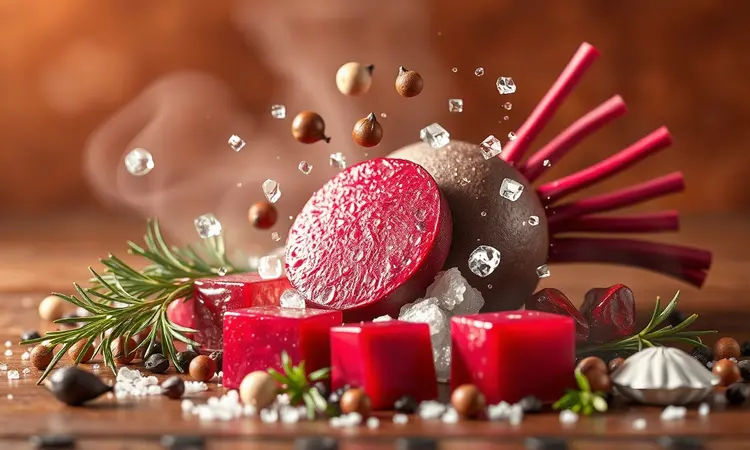
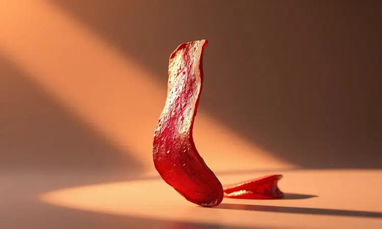

E se te dissesse que a beterraba pode se transformar de um 'alimento trabalhoso' para seu snack crocante favorito em 15 minutos?

A verdade é que muita gente evita esse superalimento por causa do tempo de forno, daquele sujeira inevitável na pia, ou da frustração de não acertar o ponto certo. Mas a airfryer chegou para reescrever essa história.

Aqui, você vai descobrir como pegar um legume aparentemente simples e transformá-lo em chips viciantes, cubos caramelizados ou um acompanhamento gourmet que surpreende qualquer convidado.

Tudo mantendo cada nutriente intacto e com uma praticidade que faz você querer repetir sempre.

<SummaryList products={frontmatter.top_products} />

## Por que Preparar Beterraba na Airfryer é uma Escolha Inteligente?

Imagine conseguir aquele crocante perfeito que você adora em chips industrializados, mas com a consciência tranquila de estar comendo pura nutrição. É exatamente isso que a airfryer oferece.

Ela usa o poder do ar quente para envolver cada pedaço de beterraba, criando uma casquinha dourada e deliciosa com quantidade mínima de óleo. O melhor? Enquanto na panela os nutrientes podem acabar indo pelo ralo com a água, aqui tudo fica concentrado dentro do legume.

Você também ganha tempo precioso: em vez de vigiar o forno por uma hora, consegue resultados superiores em 15-20 minutos. Para quem busca saúde sem abrir mão do prazer, não existe alternativa mais inteligente.

## Principais Benefícios da Beterraba para sua Saúde

Mais do que uma cor vibrante, a beterraba carrega um pacote completo de benefícios.

Ela é uma das maiores fontes naturais de nitratos, compostos que nosso corpo transforma em óxido nítrico, relaxando os vasos sanguíneos e melhorando a circulação - perfeito para quem busca mais energia no dia a dia ou melhor performance nos exercícios.

Sua cor vermelho-púrpura intensa vem da betacianina, um antioxidante poderoso que combate inflamações e protege as células.

E olhe só para a praticidade: suas fibras solúveis tracem a digestão e ajudam a manter aquela sensação de saciedade que evita beliscar fora de hora. É um superalimento completo em um pacote de baixas calorias.

## Vantagens de Usar a Fritadeira Elétrica para Legumes

Quando você coloca esses benefícios da beterraba dentro de uma airfryer, a magia se multiplica. Primeiro pela preservação: como o cozimento é rápido e sem água, vitaminas como o folato e minerais como o potássio não se perdem no processo.

Depois pelo controle: você decide exatamente o nível de crocância que quer, algo impossível de replicar no forno tradicional. A limpeza também vira um detalhe - muitas cestas vão direto para a lava-louças.

É a combinação perfeita para quem quer se alimentar bem sem transformar a cozinha em um projeto de horas.

## Como Escolher e Preparar a Beterraba Antes de Assar

O segredo começa antes mesmo de ligar o aparelho. Procure beterrabas firmes ao toque, com casca lisa e sem partes murchas. As de tamanho médio geralmente têm sabor mais concentrado e textura mais equilibrada do que as gigantes.

Depois de uma boa lavagem (sim, até nas dobras da casca), vem o passo mais importante: o corte uniforme. Fatias com espessura parecida garantem que todas fiquem prontas ao mesmo tempo - nada de pedaços queimados enquanto outros ainda estão crus.

Deixe-as bem secas com um pano de prato ou papel antes de temperar, pois qualquer umidade extra é inimiga da crocância. Agora é só preparar seus temperos favoritos e transformar esse legume simples em algo extraordinário.

## Receita 1: Chips de Beterraba Crocantes (Snack Saudável)

Essa é para quem quer substituir aqueles pacotes de salgadinhos por algo que realmente nutre. Depois de lavar e descascar (ou deixar com casca para mais nutrientes, se preferir), use um fatiador ou faca afiada para criar fatias finas, quase translúcidas.

Uma leve camada de azeite em spray, uma pitada generosa de sal marinho e, para um toque especial, uma polvilhada de cominho ou páprica defumada. Pré-aqueça a airfryer a 160°C por 3 minutos, depois distribua as fatias em uma única camada, sem sobrepor.

Em 15-20 minutos, mexendo na metade do tempo, você terá chips com aquele som crocante ao morder. Deixe esfriar completamente antes de armazenar - é quando ficam ainda mais sequinhos.

## Receita 2: Beterraba em Cubos Assada com Ervas Finas

Para dias que pedem um acompanhamento especial, esta versão em cubos é uma revelação. Corte as beterrabas em cubos de 1,5 cm aproximadamente, mantendo o tamanho consistente.

Numa tigela, misture com azeite, sal, bastante pimenta-do-reino moída na hora e as ervas que fazem seu coração feliz: alecrim fresco picado dá um aroma maravilhoso, tomilho combina perfeitamente, ou um mix italiano se prefere algo mais tradicional.

Quando colocar na cesta a 180°C, você vai sentir logo o perfume tomando conta da cozinha. Os 15-20 minutos de cozimento, com uma mexida cuidadosa na metade, criam um contraste perfeito: exterior levemente caramelizado, interior macio e cremoso.

Serve quente como acompanhamento ou fria em saladas.

## Temperos e Combinações que Realçam o Sabor da Beterraba

A beterraba tem uma doçura terrosa que abraça diferentes sabores. Para explorar essa versatilidade, comece com uma base de azeite de boa qualidade - seu sabor frutado realça a beterraba sem dominá-la. Alho em pó assado traz um toque umami que complementa perfeitamente.

O comínio é um companheiro clássico que destaca as notas terrosas.

Quando quiser algo realmente especial, experimente uma colher de chá de mel ou xarope de bordo misturado ao azeite antes de assar - cria uma caramelização suave que transforma completamente a experiência.

E nunca subestime o poder do acabamento: uma pitada de flocos de sal grosso e raspas de limão siciliano depois de pronto elevam qualquer preparo.

## Utensílios que Facilitam o Preparo na Airfryer

Certos aliados transformam a experiência de usar a airfryer de 'tarefa' para 'prazer culinário'. Uma pinça longa de silicone permite mexer os alimentos com precisão sem queimar os dedos. Mas três utensílios merecem atenção especial quando falamos de beterraba.

### Fatiador de Legumes Mandoline

<ProductBox 
  title={frontmatter.top_products[0].title} 
  image={frontmatter.top_products[0].image} 
  link={frontmatter.top_products[0].link} 
/>

Para chips verdadeiramente perfeitos, consistência é tudo. O mandoline é seu melhor amigo aqui, criando fatias tão uniformes que parecem saídas de uma cozinha profissional.

Com ele, você não apenas economiza tempo precioso como garante que cada fatia cozinhe exatamente no mesmo ritmo.

Os modelos com lâminas intercambiáveis ainda permitem variedade: fatias ultrafinas para chips, cortes mais grossos para outras receitas, ou até julienne para saladas diferentes.

A segurança é prioridade - procure modelos com protetores que seguram o alimento até o último milímetro, evitando acidentes. É um investimento que paga a cada pedaço crocante perfeito que sai da sua airfryer.

### Pulverizador de Azeite (Spray)

<ProductBox 
  title={frontmatter.top_products[1].title} 
  image={frontmatter.top_products[1].image} 
  link={frontmatter.top_products[1].link} 
/>

O controle exato do óleo faz toda diferença entre chips crocantes e chips oleosos. Um bom pulverizador permite você cobrir cada fatia com uma névoa leve e uniforme de azeite, garantindo que o calor circule perfeitamente sem deixar exageros.

Prefira modelos de vidro ou aço inoxidável que não absorvem sabores e são fáceis de limpar. A economia é visível: ao invés de ver metade do óleo escorrer para o fundo da tigela, você aproveita cada gota.

É a ferramenta que separa quem 'experimenta' daqueles que dominam a arte da airfryer.

### Forro de Papel Descartável ou Silicone para Airfryer

<ProductBox 
  title={frontmatter.top_products[2].title} 
  image={frontmatter.top_products[2].image} 
  link={frontmatter.top_products[2].link} 
/>

Essa escolha reflete seu estilo na cozinha. O papel descartável é a praticidade em sua essência: coloca, usa, descarta e a cesta continua limpa. Perfeito para quando a preguiça de lavar fala mais alto.

Mas se você pensa a longo prazo, o forro de silicone reutilizável é um companheiro mais sábio. Ele suporta centenas de usos, é ecológico e, ao contrário do que muitos pensam, os modelos perfurados permitem excelente circulação de ar.

O segredo está em nunca pré-aquecer com ele dentro e garantir que cubra apenas o fundo, sem subir pelas laterais. Ambos garantem que sua beterraba não grude, mas um deles vai acompanhar suas aventuras culinárias por muito mais tempo.

## Dicas de Ouro para a Beterraba não Ficar Murcha

A crocância perfeita não é sorte, é técnica. Comece sempre com a beterraba bem seca - depois de lavar, seque cada pedaço com papel toalha ou um pano limpo. A umidade é o verdadeiro vilão que transforma chips em 'sorovites'.

O pré-aquecimento de 3-5 minutos não é opcional: ele cria o ambiente ideal desde o primeiro segundo. Na hora de temperar, vá com calma no sal - ele puxa a umidade para superfície.

Em vez disso, tempere levemente antes de assar e finalize com uma pitada extra depois de pronto. O movimento é seu aliado: sacudir a cesta na metade do tempo garante que o ar quente abrace cada pedaço igualmente.

Seguindo essas etapas, você garante aquele crocante que faz barulho.

## Erros Comuns ao Cozinhar Beterraba na Airfryer

Alguns deslizes podem transformar uma beterraba promissora em uma decepção. O maior deles é sobrecarregar a cesta: quando as fatias ou cubos ficam amontoados, eles cozinham no vapor um do outro ao invés de no ar quente. Respeite o espaço.

Outro clássico é o corte desigual: se um pedaço tem o dobro da espessura do outro, você terá resultados completamente diferentes. Use o mandoline ou dedique atenção especial a essa etapa.

Esquecer de mexer na metade do tempo cria 'zonas quentes' - algumas partes queimam enquanto outras mal douram. Por fim, paciência: tirar antes da hora porque parece pronto geralmente resulta em algo murcho que endurece depois. Confie no processo.

## FAQ: Perguntas Frequentes sobre Legumes na Airfryer

Posso preparar beterraba na airfryer sem descascar?
Absolutamente! A casca é rica em nutrientes e fica perfeitamente crocante quando bem lavada. Se preferir descascar, faça depois de assada - sai muito mais fácil.

Quantas vezes preciso mexer durante o cozimento?
Para garantia total de uniformidade, uma vez na metade do tempo basta. Se perceber que algumas partes estão dourando mais rápido que outras, uma segunda mexida resolve.

A beterraba mancha a cesta da airfryer?
A coloração intensa pode deixar resíduos, mas nada que uma limpeza normal não resolva. Para evitar preocupação, use os forros mencionados ou lave logo após usar enquanto ainda está morna.

Posso fazer grandes quantidades para armazenar?
Sim! Os chips ficam perfeitos em potes herméticos por até uma semana. Cubos assados duram 3-4 dias na geladeira e podem ser requentados rapidamente na própria airfryer.

Qual a diferença entre preparar no forno e na airfryer?
Tempo e textura. O forno tradicional leva 3-4 vezes mais tempo e nunca alcança o mesmo nível de crocância uniforme que o fluxo de ar intenso proporciona.

## Conclusão

O que parecia difícil - transformar a beterraba em uma verdadeira experiência gastronômica - se revela uma das aventuras mais recompensadoras que você pode ter na cozinha.

Em menos tempo do que leva para pensar no que pedir por delivery, você tem chips que rivalizam com qualquer snack gourmet ou cubos caramelizados que elevam uma refeição simples a outro patamar.

Tudo mantendo cada vitamina, cada antioxidante, cada benefício que torna a beterraba um superalimento. A airfryer não é apenas um eletrodoméstico - é sua porta de entrada para uma relação mais criativa, saudável e prática com a comida.

Comece hoje com uma das receitas, experimente seus temperos favoritos e descubra como esse legume humilde pode se tornar o protagonista de suas melhores refeições. Sua saúde e seu paladar agradecem. O próximo passo é simples: escolha sua beterraba e ligue a airfryer.

A transformação começa agora.