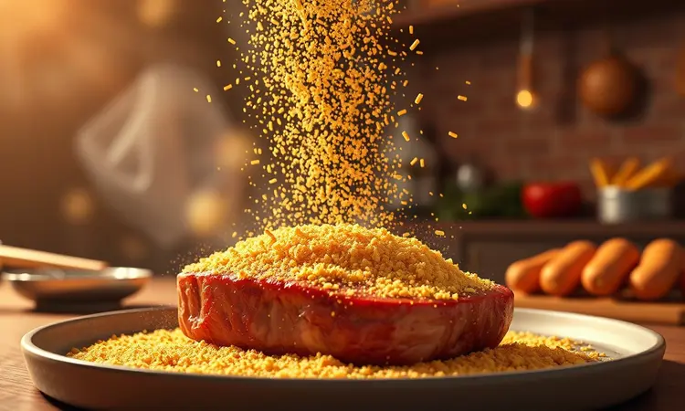
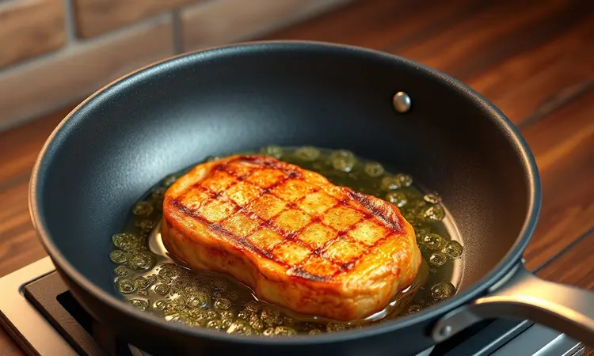

Você já viveu a tristeza de cortar o garfo no bife e ouvir um som seco, revelando uma carne que perdeu todo seu suco? Ou pior, ver toda a camada crocante desgrudar da carne e ficar grudada na frigideira?

Esses pequenos desastres culinários têm uma origem comum: não seguir um caminho claro desde a escolha da carne até o momento da fritura.

Mas hoje vou te mostrar que acertar o ponto dourado por fora e suculento por dentro não é apenas possível, é surpreendentemente simples quando você conhece os atalhos que realmente funcionam.

Da receita tradicional que faz a casa inteira parar para sentir o aroma até a versão prática que te salva nos dias mais corridos, prepare-se para transformar seu domingo em uma experiência memorável.

<SummaryList products={frontmatter.top_products} />

## O Que Torna o Bife à Milanesa Perfeito?

Imagine a cena: você leva o garfo ao bife, corta e ouve aquele CRUNCH satisfatório que ecoa antes mesmo de sentir o sabor. Ao morder, a camada dourada cede perfeitamente, revelando uma carne que mantém cada gota de sabor presa dentro.

Essa harmonia entre crocância exterior e suculência interior não acontece por acaso.

Ela nasce de três pilares: uma carne que sabe receber o empanado, um ritual de preparo quase meditativo e a coragem de entender que o calor certo transforma simples ingredientes em magia.

É sobre respeitar cada etapa como se fosse a única, da escolha cuidadosa do corte até o momento em que você retira o bife do óleo, ou da Air Fryer, e sente que fez mais do que um prato: criou uma memória.

## Escolhendo a Carne Ideal: Melhores Cortes para Milanesa

<ProductBox 
  title={frontmatter.top_products[0].title} 
  image={frontmatter.top_products[0].image} 
  link={frontmatter.top_products[0].link} 
/>

O segredo começa antes mesmo de ligar o fogão. Escolher o corte certo é como selecionar o protagonista de um filme épico, ele precisa ter carisma, profundidade e, acima de tudo, capacidade de brilhar sob os holofotes do preparo.

Nesse elenco culinário, alguns nomes se destacam. O patinho ocupa um lugar especial pela combinação rara de suavidade e resistência, oferecendo uma experiência acessível sem abrir mão do sabor.

Se você busca um custo-benefício que não decepciona, o coxão mole emerge como herói silencioso, entregando maciez surpreendente a cada mordida.

Para os momentos que merecem celebração extra, o filé mignon assume o papel principal, transformando o simples almoço em banquete.

Mesmo cortes como alcatra e contrafilé, quando preparados com respeito, batidos até atingirem a espessura certa, revelam camadas de sabor que justificam seu prestígio. A regra é clara: evite os cortes que precisam de guerras prolongadas para amolecer.

Seu bife deve ser convidativo, não desafiador.

## Ingredientes para um Empanado de Respeito

<ProductBox 
  title={frontmatter.top_products[1].title} 
  image={frontmatter.top_products[1].image} 
  link={frontmatter.top_products[1].link} 
/>

Agora que temos nossa estrela principal definida, chegamos ao elenco de apoio que transforma carne em lenda. Mas atenção: não são apenas ingredientes; são camadas de textura, sabor e história.

Os bifes já escolhidos precisam do toque inicial de sal e pimenta, não como decorrência, mas como diálogo que realça a personalidade da carne. Quando você passa para o ritual do empanado, cada camada tem um papel crucial.

A farinha de trigo não é apenas uma etapa obrigatória; é o alicerce que prepara a superfície para receber o abraço do ovo batido, aquele elemento que une como cola culinária.

A farinha de rosca então finaliza com uma promessa de crocância, e se você quiser elevar esse momento, misturar queijo parmesão ralado transforma a última camada em declaração de amor à boa comida.

O óleo vegetal, por fim, não é vilão; é o palco onde toda essa alquimia acontece. Quando escolhido e aquecido com sabedoria, ele cozinha sem dominar, frita sem invadir.

## Passo a Passo: Como Fazer o Bife à Milanesa Tradicional (Frito)

<ProductBox 
  title={frontmatter.top_products[2].title} 
  image={frontmatter.top_products[2].image} 
  link={frontmatter.top_products[2].link} 
/>

Com nossos ingredientes em mãos, chegamos ao ritual. Não pense nisso como uma sequência de tarefas, mas como uma dança onde cada movimento prepara o próximo.

Comece com os bifes já temperados, deixados para respirar longe da geladeira por alguns minutos, essa pausa não é preguiça, é estratégia para que a carne receba melhor cada camada.

Prepare seus três recipientes como se organizasse uma linha de produção de felicidade: farinha, ovo, farinha de rosca (ou panko, se você quiser explorar texturas diferentes).

Aqui está onde muitos erram o ritmo: ao passar o bife em cada camada, pressione com delicadeza e intenção. Não é apenas cobrir; é fazer cada partícula aderir como se pertencesse ali desde sempre.

Agora, a transformação final: a frigideira com óleo aquecido entre 170°C e 180°C. Esse número não é aleatório, é a zona mágica onde a casquinha sela rapidamente sem que o calor penetre demais e roube a suculência.

Frite no máximo dois bifes por vez; a paciência aqui é recompensada com crocância uniforme. Quando você retira cada bife e o coloca sobre papel toalha, está testemunhando a conclusão de um processo que transforma simplicidade em sofisticação.

O trabalho extra da fritura tradicional? Ele desaparece quando você vê os olhos de quem está prestes a provar.

## Bife à Milanesa na Air Fryer: Crocância com Menos Óleo

<ProductBox 
  title={frontmatter.top_products[3].title} 
  image={frontmatter.top_products[3].image} 
  link={frontmatter.top_products[3].link} 
/>

Se o ritual da frigideira, com seu óleo e vigilância constante, parece um compromisso grande demais para sua rotina, tenho boas notícias: a magia da casquinha dourada também acontece na praticidade da Air Fryer.

Aqui não se trata de versão inferior, mas de filosofia diferente, mesma excelência, caminho alternativo.

Prepare seus bifes exatamente como faria para a fritura tradicional: mesmo tempero, mesma sequência sagrada de empanado. A diferença começa no palco: a Air Fryer pré-aquecida a 200°C aguarda.

Distribua os bifes com espaço para conversa entre eles, nenhum gosta de ficar amontoado. Os 10 a 15 minutos seguintes são sobre confiança: meia jornada, uma virada cuidadosa com pinças (nada de garfos que furariam a carne), e o retorno para finalizar.

Alguns modelos podem ter pontos mais quentes que outros, mas essa peculiaridade se resolve com a simples virada.

Quando o tempo acaba e você abre a gaveta, o aroma que sobe e a cor dourada que vê são a mesma promessa cumprida, só que com menos preocupação e muito mais tempo livre para você.

## Segredos de Chef para a Casca Não Soltar e Ficar Sequinha

<ProductBox 
  title={frontmatter.top_products[4].title} 
  image={frontmatter.top_products[4].image} 
  link={frontmatter.top_products[4].link} 
/>

Os melhores chefs guardam segredos não por egoísmo, mas porque algumas verdades só fazem sentido quando vividas. O primeiro deles: trate a carne como parceira, não como ingrediente.

Deixá-la fora da geladeira por meia hora antes de começar não é mera conveniência; é permitir que ela se aproxime da temperatura ambiente, tornando mais fácil para cada camada do empanado criar vínculo forte.

Quando você passa para a farinha de trigo, pense em dar um aperto de mão firme, não agressivo, mas decidido.

Na etapa do ovo, certifique-se de que toda superfície está coberta, sem excessos que escorreriam. A farinha de rosca então recebe o bife como abraço final: pressione com as mãos, sentindo como os flocos aderem. Essa pressão não é força bruta; é confirmação.

Para quem busca crocância lendária, existe o duplo empanado: após a primeira camada de rosca, volte ao ovo e depois à rosca novamente. O resultado é uma armadura dourada que protege sem sufocar.

Na fritura, use óleo suficiente para cobrir metade do bife, o suficiente para criar a crosta, não para afogar. E quando chegar a hora de virar, abandone o garfo.

As pinças são suas aliadas, permitindo que você eleve o bife sem romper a barreira que trabalhou tanto para construir. Sim, essas técnicas exigem atenção.

Mas quando você corta o primeiro pedaço e vê a casquinha intacta e a carne úmida, entenderá que detalhes não são detalhes: são a diferença entre comida e experiência.

## 5 Erros Comuns que Detonam seu Bife à Milanesa

Agora que os segredos dos mestres estão nas suas mãos, vamos aos inimigos silenciosos que podem sabotar todo o esforço. O primeiro é subestimar o poder do martelo (ou do fundo de uma panela pesada).

Não amaciar a carne adequadamente é enviá-la para batalha sem armadura, ela simplesmente não consegue entregar a maciez prometida. O segundo pecado: esquecer o tempero antes do empanado.

Sal e pimenta não são opcionais; são a voz da carne, que precisa ser ouvida antes de ser coberta.

Terceiro erro, e talvez o mais traiçoeiro: não secar a carne com papel toalha antes de começar. A umidade superficial é barreira invisível que impede a farinha de criar aderência verdadeira. Quarto deslize: deixar o óleo muito frio ou muito quente.

O primeiro encharca, o segundo queima por fora deixando cru por dentro. Use um termômetro ou teste com um pedaço de pão, se doura em 30 segundos, está perfeito.

Finalmente, a tentação de fritar muitos bifes de uma vez. Cada bife adicional reduz a temperatura do óleo, transformando crocância em esponja.

Cozinhar é generosidade, mas nesse momento específico, generosidade significa dar atenção exclusiva a cada bife, um de cada vez.

## Melhores Acompanhamentos para Harmonizar com o Prato

<ProductBox 
  title={frontmatter.top_products[5].title} 
  image={frontmatter.top_products[5].image} 
  link={frontmatter.top_products[5].link} 
/>

Um grande protagonista merece uma plateia à altura. Seu bife à milanesa, com sua personalidade marcante, não quer dominar o prato sozinho, quer conversar com acompanhamentos que complementem sem competir.

Para o clássico que nunca falha, arroz branco soltinho e batatas fritas bem douradas criam o triângulo perfeito: a neutralidade do arroz, a crocância extra das batatas e a suculência do bife em diálogo constante.

Se você busca contraste de texturas, o purê de batatas cremoso funciona como abraço suave que equilibra a crocância. Mas talvez a escolha mais inteligente seja uma salada fresca, não como obrigação dietética, mas como refresco necessário.

Folhas verdes, tomate em rodelas e uma pitada de sal marinho limpam o paladar entre uma mordida e outra, prolongando o prazer.

Para dias que pedem sofisticação discreta, legumes salteados como cenoura e abobrinha em tiras finas trazem doçura natural que conversa bem com o sabor da carne. E para momentos especiais, um risoto suave de parmesão eleva o conjunto sem roubar a cena.

Lembre-se: grandes harmonias não acontecem por acidente. Elas nascem quando cada elemento no prato tem claro por que está ali.

## Perguntas Frequentes (FAQ)

### Posso substituir a farinha de rosca por farinha Panko?

Absolutamente, e essa troca pode abrir portas para novas experiências.

Enquanto a farinha de rosca tradicional oferece crocância familiar e consistente, o panko, com seus flocos maiores e mais irregulares, cria uma textura mais aerada, leve e extraordinariamente crocante.

A diferença está na sensação na boca: a rosca é crocância densa; o panko é crocância que desaba em plumas douradas. A escolha depende da emoção que você quer provocar. Para o clássico reconfortante, fique com a rosca.

Para surpreender com algo que parece mais profissional, abrace o panko. Ambas são caminhos válidos para a perfeição, apenas com personalidades diferentes.

### Como congelar bifes à milanesa já prontos?

A vida prática encontrou solução para sua paixão pelo bife à milanesa. Congelar já fritos é como preservar memórias para dias mais apressados, mas exige cuidado para que a qualidade sobreviva ao freezer.

Após fritar, deixe os bifes esfriarem completamente em temperatura ambiente, pular essa etapa cria condensação que vira gelo depois. Em seguida, o truque: não os empilhe diretamente no saco.

Espalhe-os em uma assadeira forrada com papel manteiga e leve ao freezer por duas horas. Essa pré-congelação individual previne que eles grudem e percam formato.

Só então transfira para sacos de congelamento, removendo todo o ar possível antes de fechar (se tiser bombinha de vácuo, este é seu momento de brilho). Rotule com data, eles mantêm qualidade premium por até três meses.

Na hora de reaproveitar, o forno convencional pré-aquecido é seu melhor amigo: 10-15 minutos a 180°C e eles recuperam a crocância como se tivessem acabado de sair da frigideira. Microndas? Jamais. Ela transformaria seu trabalho em algo triste e mole.

## Conclusão

O verdadeiro segredo do bife à milanesa perfeito não está em técnicas complicadas ou equipamentos caros.

Está na compreensão de que cada etapa, desde a escolha cuidadosa da carne até o momento em que você retira o último bife do óleo, é uma conversa entre você e os ingredientes.

É sobre entender que a espessura certa não é medida aleatória, mas promessa de suculência; que a temperatura do óleo não é número técnico, mas guardião da textura; que o empanado bem pressionado não é ritual vazio, mas construção de camadas de prazer.

Seja seguindo a tradição da frigideira com todo seu charme e aroma inconfundível, seja optando pela praticidade inteligente da Air Fryer, o resultado final será sempre o mesmo: a satisfação profunda de criar algo que alimenta mais do que o corpo.

Alimenta memórias, conversas à mesa, a sensação de ter transformado ingredientes simples em celebração. E essa capacidade, de transformar o ordinário em extraordinário, não é dom de poucos.

É conhecimento que, uma vez aprendido, torna-se parte permanente do seu repertório culinário. Agora, com todas as ferramentas nas mãos e os segredos desvendados, só resta uma questão: qual será o primeiro bife da sua nova jornada?