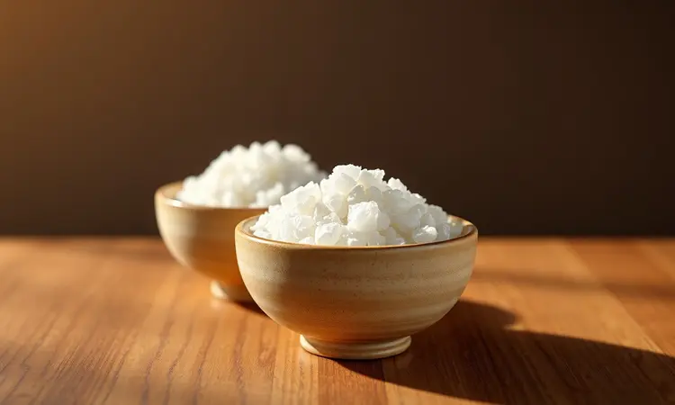
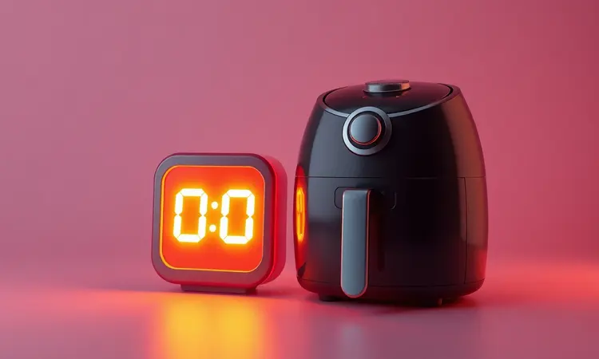

Imagine aquele momento: você abre o pacote de biscoito de polvilho comprado, mas algo nunca parece igual ao caseiro. Ou pior, você até arrisca fritar em casa, mas o cheiro impregna a roupa, a cozinha fica oleada e aquela culpa pós-petisco pesa.

E se eu te disser que existe um jeito de resgatar o sabor da infância com a crocância perfeita, sem sujeira, sem óleo e em minutos?

A air fryer não apenas facilitou nossa vida na cozinha como reinventou receitas clássicas, e o biscoito de polvilho é uma das grandes vencedoras dessa transformação.

Prepare-se para descobrir como transformar ingredientes simples naquele lanche que vai fazer todo mundo perguntar: 'Como você conseguiu fazer isso sem fritar?'

<SummaryList products={frontmatter.top_products} />

## Por que fazer Biscoito de Polvilho na Air Fryer? (Saúde e Praticidade)

A magia começa na liberdade. Você troca aquela dança perigosa com a panela de óleo quente por alguns cliques no painel.

A air fryer usa a força do ar quente circulando em alta velocidade para criar uma casca dourada e crocante por fora, mantendo o interior macio e arejado, tudo sem uma única gota de óleo. A diferença não está só na balança, mas na leveza que você sente ao comer.

E a praticidade? É como ter um ajudante de cozinha silencioso e eficiente. Em vez de ficar limpando respingos de óleo por todos os cantos, você apenas lava a cesta antiaderente.

O tempo de preparo cai pela metade, e o controle preciso da temperatura garante que cada fornada saia exatamente igual, eliminando aquela loteria de 'será que vai queimar desta vez?'. É o fim da desculpa para não fazer biscoito caseiro.

## Polvilho Doce ou Polvilho Azedo: Qual a melhor escolha para a Air Fryer?

Essa pergunta define o caráter do seu biscoito. O polvilho doce é como um bom amigo tranquilo: resulta em uma textura mais leve, sequinha e que desmancha delicadamente na boca.

Perfeito para quem prioriza a crocância clássica e um sabor neutro que combina com qualquer acompanhamento.

O polvilho azedo, por outro lado, é a personalidade marcante da festa. Ele entrega um sabor ligeiramente ácido e único, com uma crocância que tem mais 'personalidade', deixando uma impressão gustativa mais duradoura no paladar.

A verdadeira magia acontece quando você mistura os dois. A combinação equilibra o melhor dos mundos: a textura leve do doce com o sabor característico do azedo. Minha recomendação? Comece com 70% doce e 30% azedo.

Você vai perceber um biscoito que tem corpo, sabor e ainda mantém aquela crocância que estala nos dentes.

## Melhores Modelos de Air Fryer para Receitas Crocantes

<ProductBox 
  title={frontmatter.top_products[0].title} 
  image={frontmatter.top_products[0].image} 
  link={frontmatter.top_products[0].link} 
/>

Se a receita é a alma, a air fryer é o coração da operação. Alguns modelos se destacam por transformar ingredientes simples em obras-primas crocantes.

O Electrolux Family Efficient Rita Lobo (5 litros) é o mestre da consistência.

Sua operação silenciosa é uma cortina de som que permite ouvir sua série favorita enquanto ele trabalha, e a distribuição de calor é tão uniforme que cada biscoito sai igual ao outro, dourado e perfeito.

Para famílias maiores ou quem gosta de versatilidade, a Xiaomi Dual Zone Air Fryer (10 litros) é uma revolução. Com duas cestas independentes, você pode testar duas temperaturas ao mesmo tempo ou, melhor ainda, fazer uma fornada gigante de biscoitos de uma só vez.

A Philips Airfryer 2000 XL ganha pontos pela simplicidade intuitiva (ideal para quem não quer pensar muito) e pela cesta que se lava quase sozinha. Sim, ela tem capacidade menor (cerca de 4 litros), mas para cozinhas pequenas ou casais, é mais do que suficiente.

Modelos como a Cosori CP158-AF e a Philco Air Fryer Oven PFR2200P completam o time com tecnologias que mantêm a crocância sem ressecar. A escolha final depende do espaço na sua bancada e da quantidade de biscoitos que você pretende fazer por sessão.

Mas independente do modelo, o segredo dos biscoitos perfeitos começa muito antes, na escolha dos ingredientes certos.

## Lista de Ingredientes Necessários para a Massa Perfeita

A beleza desta receita está na simplicidade. Com apenas cinco ingredientes principais, você cria mágica:

*   **250g de polvilho doce (ou sua mistura preferida):** A base de tudo. É ele quem vai garantir a estrutura e a crocância que estala.

*   **1 ovo inteiro:** O agente ligador natural que une todos os elementos sem pesar a massa.

*   **100ml de água fervente:** A alquimia começa aqui. A água quente é o segredo para ativar o amido e criar a textura arejada por dentro.

*   **Uma pitada generosa de sal:** Para realçar todos os sabores e tirar a massa da neutralidade.

*   **50g de queijo ralado (opcional, mas altamente recomendado):** O toque de genialidade. O parmesão ou mussarela ralado fininho derrete e cria pequenos bolsões de sabor intenso que surpreendem a cada mordida.

Com esses itens na bancada, você está pronto para o próximo passo, que pode ser a diferença entre um biscoito bom e um biscoito inesquecível: a modelagem.

## Utensílios que Facilitam: O uso do Saco de Confeitar

<ProductBox 
  title={frontmatter.top_products[1].title} 
  image={frontmatter.top_products[1].image} 
  link={frontmatter.top_products[1].link} 
/>

Esqueça a ideia de que saco de confeitar é só para doces gourmet. Ele é o truque profissional para biscoitos uniformes e impecáveis.

Em vez de ficar moldando bolinhas irregulares com as mãos (que sempre resultam em alguns maiores e outros menores), você simplesmente coloca a massa no saco, escolhe um bico de diâmetro médio e pressiona.

Cada biscoito sai do mesmo tamanho, garantindo que todos cozinhem no mesmo tempo e fiquem igualmente crocantes. Sem contar a velocidade: você enche uma assadeira em um minuto.

Prefira os modelos reutilizáveis de silicone ou nylon. Além de serem mais ecológicos, eles são mais resistentes e fáceis de limpar do que os descartáveis. A sensação de controle é muito maior, e você evita aqueles acidentes de a massa vazar pelas costuras.

Mas antes de pensar na forma, existe uma técnica que é o verdadeiro coração da receita, responsável por transformar uma massa simples em uma nuvem crocante.

## Passo a Passo: O Segredo da Técnica de Escaldar a Massa

Esta é a etapa que separa os amadores dos verdadeiros mestres do biscoito de polvilho. Não pule.

1.  Ferva os 100ml de água com a pitada de sal.

2.  Coloque o polvilho em uma tigela grande e faça um buraco no centro, como um vulcão.

3.  Despeje a água fervente **aos poucos** sobre o polvilho, mexendo rapidamente com uma colher de pau. Você verá a mágica acontecer: a farinha absorve a água e forma uma espécie de mingau grudento e quente. É esse choque térmico que 'escalda' o amido, pré-gelatinizando ele.

4.  Deixe esfriar até que você consiga tocar sem se queimar (morno está perfeito).

5.  Só então adicione o ovo e misture vigorosamente até incorporar completamente. A massa ficará pesada e elástica.

O que isso faz? O amido gelatinizado forma uma rede que, ao assar, expande criando bolsas de ar minúsculas. O resultado é aquela textura única: uma casquinha fininha e super crocante por fora, com um interior que parece uma nuvem saborosa.

A massa não pode ficar líquida, tem que ter ponto de enrolar (ou de colocar no saco de confeitar).

Com a massa pronta, é hora de levar à nossa câmara de crocância perfeita.

## Tempo e Temperatura Ideal: Como Ajustar sua Air Fryer para não Queimar

Aqui não tem mistério, mas sim atenção. Cada air fryer tem sua personalidade, então pense nesses números como seu ponto de partida:

*   **Pré-aquecimento é lei:** Ligue por 5 minutos a 180°C. Isso garante que a cesta esteja na temperatura certa quando a massa entrar, criando instantaneamente uma crosta e impedindo que os biscoitos murchem.

*   **Temperatura principal:** 170°C a 180°C. Comece na menor temperatura se sua air fryer for muito potente ou se você está fazendo biscoitos muito pequenos.

*   **Tempo de prova:** 12 a 18 minutos. O segredo? Dê uma espiada pela janela (se tiver) ou puxe delicadamente a cesta aos 10 minutos. Procure por uma cor dourada uniforme. Se ainda estiverem claros, volte por mais 2 minutos e verifique novamente.

A tentação de abrir a tampa a cada minuto é grande, mas resista. Cada vez que você deixa o calor escapar, interrompe o processo de expansão. Confie no temporizador e nas suas configurações iniciais.

O resultado será uma fornada de biscoitos com um bronzeado perfeito e uma crocância audível.

E quando o básico estiver dominado, o mundo das variações se abre.

## Variações de Sabor: Biscoito de Polvilho com Queijo, Ervas ou Parmesão

Agora sim a diversão começa de verdade. Essa massa é uma tela em branco para sua criatividade.

*   **Rei do Queijo:** Incorporar 80g de parmesão ralado finíssimo à massa antes de escaldar. O queijo derrete por dentro, criando pequenas crateras douradas e salgadas que explodem de sabor. É um upgrade clássico que nunca falha.

*   **Jardim nas Ervas:** Para um toque fresco e aromático, amasse 1 colher de sopa de alecrim fresco picado ou orégano seco. O aroma que invade a cozinha enquanto assa é terapêutico, e o sabor fica sofisticado, perfeito para servir com uma taça de vinho.

*   **Explosão Parmesão:** Vá além do ralado e acrescente pequenos cubinhos de parmesão (ou queijo do tipo 'coalho') à massa. Ao assar, esses cubinhos derretem parcialmente, criando bolsões cremosos e salgados que contrastam divinamente com a massa crocante.

Não tenha medo de misturar (parmesão + alecrim é uma dupla imbatível). Cada variação transforma o simples biscoito de polvilho em uma experiência gourmet própria para impressionar visitas.

Mas e se o seu desejo for pelo lado doce da força?

## Como Fazer Biscoito de Polvilho Doce na Air Fryer (Versão Sem Fritura)

A versão doce é a prova de que essa receita é universal. O processo é quase idêntico, mas com um toque final que lembra aqueles biscoitos de festa.

Siga todos os passos da massa básica (escaldar, esfriar, adicionar ovo). A única diferença é que, após pronto e já modelado, antes de levar à air fryer, você faz uma magia simples: passe cada bolinha rapidamente em uma mistura de açúcar e canela (proporção 4:1).

Ao assar, o açúcar carameliza levemente na superfície, criando uma cobertura crocante e adocicada que contrasta perfeitamente com a neutralidade da massa. É menos doce que um biscoito comum, mais sofisticado e viciante.

Ideal para o café da tarde ou para acompanhar uma sobremesa de frutas.

E depois de tanto trabalho, como fazer essa crocância durar?

## Como Armazenar e Manter a Crocância por Muito Mais Tempo

<ProductBox 
  title={frontmatter.top_products[2].title} 
  image={frontmatter.top_products[2].image} 
  link={frontmatter.top_products[2].link} 
/>

O maior inimigo do seu biscoito perfeito não é o tempo, é a umidade. Para mantê-lo crocante por até uma semana, siga esta ritual:

1.  **Resfriamento total é obrigatório:** Deixe os biscoitos esfriarem completamente sobre uma grade, não direto no prato ou tábua. O ar precisa circular por baixo para evaporar qualquer vapor residual. Espere pelo menos 1 hora.

2.  **O caixão do crocante:** Potes herméticos de vidro são os melhores amigos. Evite plásticos que podem reter cheiros. Se você tem aquela lata de biscoito clássica, é perfeita.

3.  **Separação de poderes:** Se fizer mais de um sabor, armazene em potes diferentes. O aroma das ervas pode migrar para os biscoitos de queijo, e a umidade liberada por um pode afetar o outro.

4.  **Local sagrado:** Armário escuro e fresco, longe do fogão ou da janela com sol direto. Calor e luz são convites para a umidade e para que os biscoitos murchem.

Se mesmo assim algo der errado, vamos aos problemas mais comuns e suas soluções.

## Erros Comuns: Por que o biscoito murchou ou não cresceu?

*   **Biscoito murcho:** O culpado quase sempre é a temperatura. Se a air fryer não estiver bem pré-aquecida, ou se a temperatura estiver muito baixa (abaixo de 160°C), a massa não forma a crosta externa rapidamente. Ela 'suando' e depois murcha, em vez de expandir. Solução: Pré-aqueça sempre e confirme a temperatura com um termômetro de forno, se possível.

*   **Não cresceu / Ficou pesado:** Aqui a falha está no 'escaldamento'. Água não fervendo o suficiente (deve estar com bolhas grandes e ativas), ou adicionar o ovo com a massa ainda muito quente (cozinha o ovo e ele perde o poder de crescer). Respeite o tempo de resfriamento.

*   **Crocante por 5 minutos:** Virou uma esponja? É umidade no armazenamento, ou você guardou os biscoitos ainda mornos. Paciência no resfriamento é a chave.

*   **Queimou embaixo e cru em cima:** Talvez a air fryer tenha um ponto quente. Gire a cesta ou bandeja na metade do tempo de cozimento.

E para aquelas dúvidas que sempre surgem no meio do processo...

## FAQ: Dúvidas Frequentes sobre Biscoito de Polvilho Caseiro

Posso congelar a massa? Sim, e é um grande truque! Modele os biscoitos crus, coloque-os em uma assadeira separados e leve ao freezer por 1 hora até endurecerem. Depois, transfira para um saco zip.

Quando quiser biscoitos frescos, coloque-os congelados direto na air fryer, adicionando 2-3 minutos ao tempo de cozimento.

Meus biscoitos não expandiram. A água não estava fervendo o suficiente ou o polvilho pode estar velho (ele perde poder com o tempo). Sempre verifique a data e compre em casas de produtos a granel com rotatividade.

Posso fazer sem ovo? É possível, mas a textura fica mais densa. A função do ovo é dar estrutura e ar. Sem ele, o biscoito pode ficar mais 'pétreo'.

Experimente substituir por 1 colher de sopa de semente de linhaça hidratada em 3 colheres de água (misture e deixe engrossar por 5 minutos).

Por que eles ficam duros no dia seguinte? É o amido retrogradando, um processo natural. Para reviver, coloque-os na air fryer por 2-3 minutos a 150°C. Eles voltarão quase como novos.

## Conclusão

O que começou como uma simples receita de biscoito de polvilho se transformou em uma jornada de autonomia na cozinha. Você descobriu que não precisa depender de pacotes ultraprocessados ou enfrentar a fritura para ter aquele prazer crocante e nostálgico.

A air fryer, com sua tecnologia aparentemente simples, devolveu a nós o controle sobre os ingredientes, o sabor e, principalmente, a saúde do nosso lanche.

Mais do que uma técnica, você aprendeu uma filosofia: que o melhor sabor vem da simplicidade bem executada. Do ritual de escaldar a massa ao prazer de ouvir aquele 'crack' perfeito na primeira mordida, cada etapa tem sua recompensa.

Essa receita prova que comida de verdade, feita em casa, pode ser mais prática, mais gostosa e infinitamente mais satisfatória do que qualquer opção industrializada.

Então, respire fundo, reúna seus ingredientes e dê o primeiro passo. A primeira fornada será um aprendizado, a segunda já terá seu toque pessoal, e a terceira... bem, a terceira já terá seus próprios fãs pedindo a receita.

Sua cozinha está prestes a se tornar o ponto de encontro para o melhor lanche da tarde. Mãos à obra, ou melhor, à massa!