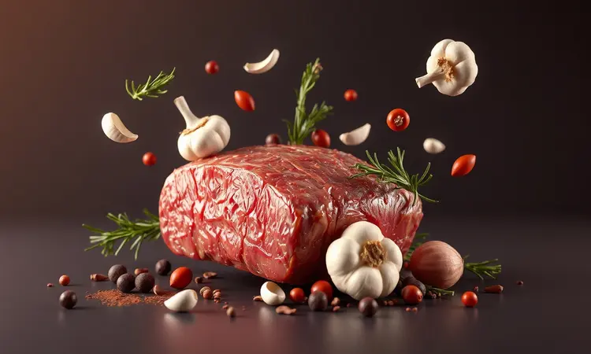
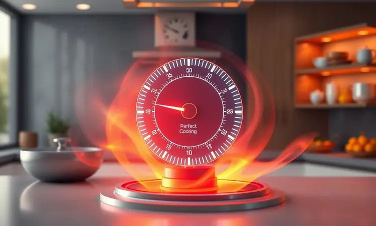
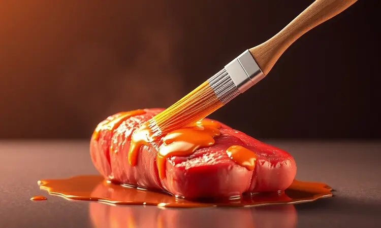
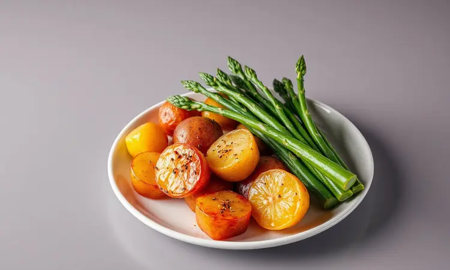

Você já teve aquela experiência frustrante de tirar uma bisteca da airfryer e encontrar uma carne seca, que parece mais couro do que refeição? É um cenário comum, mas que tem solução mais simples do que você imagina.

Neste guia, vou te levar pela mão através da técnica que transforma qualquer bisteca - suína ou bovina - em um prato dourado por fora, suculento por dentro e digno de aplausos.

Descubra o tempo exato, o marinado que faz milagres e como elevar um corte simples ao nível de restaurante usando apenas sua fritadeira elétrica.

<SummaryList products={frontmatter.top_products} />

## Por Que Fazer Bisteca na Airfryer é a Melhor Escolha?

Imagine preparar uma refeição completa sem sujar meia dúzia de panelas, sem precisar ficar virando a carne a cada minuto e ainda assim conseguir aquela crosta perfeita que sela todos os sucos. É isso que a airfryer oferece.

A circulação inteligente de ar quente age como um abraço uniforme em volta da carne, garantindo que cada centímetro fique dourado enquanto mantém a suculência protegida lá dentro. E o melhor? Tudo isso com uma fração do óleo que você usaria na frigideira tradicional.

Quando terminar, a limpeza é tão simples quanto desmontar algumas peças e passar uma esponja - praticamente um sonho para quem detesta ficar horas na pia.

## Bisteca Suína vs. Bisteca Bovina: Qual a Diferença no Preparo?

A escolha entre suína e bovina vai além do sabor, muda completamente a experiência na cozinha.

A bisteca de porco tem uma generosidade natural, com sua gordura entremeada que derrete durante o cozimento, criando uma suculência quase cremosa e um sabor levemente adocicado que casa perfeitamente com alho e ervas.

Para garantir segurança sem sacrificar a textura, aponte para 71°C no termômetro.

Já a bisteca bovina traz aquele sabor robusto e marcante que muitos associam a um bom churrasco.

Cortes como ribeye ou contra-filé ganham vida na airfryer, onde você consegue controlar com precisão se quer um ponto mal passado (com o centro ainda rosado) ou ao ponto (uniformemente cozido).

E independente do corte que escolher, o segredo da suculência está no tempero e na compreensão de que cada um pede tempos ligeiramente diferentes: enquanto a suína pode precisar de 15 a 20 minutos, a bovina muitas vezes fica pronta entre 10 e 15, dependendo da espessura.

## Ingredientes e o Segredo do Tempero para Máxima Suculência

O caminho para uma bisteca memorável começa na escolha certa do corte.

Procure por aquelas peças bem marmorizadas, onde você consegue ver a gordura distribuída entre as fibras musculares - é essa gordura que vai derreter durante o cozimento, banhando a carne por dentro e impedindo que ela resseque.

Mas o verdadeiro truque está no que acontece antes da airfryer ser ligada.

Um marinado simples pode elevar sua bisteca de comum para extraordinária. Pense em uma combinação de azeite de oliva (que ajuda a conduzir os sabores), alho amassado, alecrim fresco e uma pitada generosa de sal marinho.

Deixe a carne descansar com essa mistura por algumas horas na geladeira, e você estará fazendo muito mais do que temperar - estará criando uma experiência gustativa em camadas, onde cada mordida revela novos sabores.

## Passo a Passo: Como Fazer Bisteca na Airfryer (Receita Completa)

1. Prepare sua bisteca retirando o excesso de umidade com papel toalha - isso ajuda a criar aquela crosta dourada que todos amamos.

2. Massageie generosamente seu tempero escolhido por toda a superfície da carne. Se tiver tempo, deixe marinar por 30 minutos a algumas horas.

3. Pré-aqueça sua airfryer a 200°C por cerca de 5 minutos. Essa etapa é crucial para que o cozimento comece imediatamente e de forma uniforme.

4. Arrume as bistecas na cesta sem sobreposição. Pense em dar espaço para o ar circular - é como garantir que cada convidado na festa tenha espaço para dançar.

5. Programe entre 15 e 20 minutos, virando cuidadosamente na metade do tempo. Use um termômetro para verificar se atingiu pelo menos 63°C no centro.

6. O passo mais importante (e mais negligenciado): deixe a bisteca descansar por 5 minutos antes de cortar. É nesse momento que os sucos se redistribuem, garantindo que cada fatia seja úmida e saborosa.

Mas como saber exatamente quando sua bisteca atingiu o ponto ideal? É aí que uma tabela de referência faz toda diferença.

## Tabela de Tempo e Temperatura: Acerte o Ponto da Carne

Pense nessa tabela como seu GPS para o sucesso culinário. Para a maioria das bistecas de espessura média (cerca de 2,5 cm), trabalhe entre 180°C e 200°C.

Em 200°C, espere cerca de 10 a 12 minutos para um ponto mal passado (com centro rosado), 12 a 15 para ao ponto (rosa apenas no centro) e 15 a 18 para bem passado (uniformemente cozido).

A verdadeira magia acontece quando você vira a bisteca na metade do tempo - isso garante que ambos os lados recebam a mesma atenção douradora.

E nunca subestime o poder do descanso final: esses 5 minutos fora da airfryer são quando a carne reabsorve seus próprios sucos, transformando-se de simplesmente cozida para incrivelmente suculenta.

## 5 Truques de Especialista para a Bisteca Não Ficar Seca

1. Corte suas bistecas com espessura uniforme. Quando uma parte é mais fina que outra, a parte fina seca enquanto a grossa ainda está crua. Use uma régua mental: todas com cerca de 2,5 cm.

2. Abuse dos marinados ácidos. Um pouco de suco de limão ou vinagre na marinada não apenas acrescenta sabor, mas ajuda a quebrar levemente as fibras da carne, tornando-a mais macia e retentora de sucos.

3. Respeite o espaço na cesta. Colocar muitas bistecas de uma vez é como tentar respirar em um elevador lotado - o ar não circula direito, e o resultado é um cozimento desigual.

4. Confie, mas verifique. Mesmo com tempos sugeridos, cada airfryer tem sua personalidade. Use um termômetro digital para ter certeza científica de que atingiu a temperatura ideal.

5. A paciência é um ingrediente. Aqueles minutos de descanso pós-cozimento não são sugestão - são mandamento. É quando a carne relaxa e redistribui seus líquidos, garantindo que cada garfada seja uma celebração.

## Melhores Acessórios para Facilitar o Preparo e a Limpeza

Equipar sua cozinha com os acessórios certos é como dar superpoderes à sua airfryer.

Formas antiaderentes que se moldam à cesta, pinças de silicone que não riscam o revestimento e escovas específicas tornam o processo não apenas mais eficiente, mas genuinamente prazeroso.

E quando falamos de acessórios que fazem diferença real, alguns se destacam como verdadeiros aliados.

### Fritadeira Elétrica Airfryer (Modelos de Alta Performance)

<ProductBox 
  title={frontmatter.top_products[0].title} 
  image={frontmatter.top_products[0].image} 
  link={frontmatter.top_products[0].link} 
/>

Se você está levando a sério a arte da bisteca na airfryer, o modelo escolhido importa. A Mondial AFO-12L-BI, com seus 12 litros de capacidade, é a escolha para famílias ou para quem adora preparar porções generosas de uma só vez.

Com 2000W de potência, ela atinge a temperatura rapidamente, garantindo que o cozimento comece no momento certo.

Já a Philips Walita NA130/00, com sua tecnologia Rapid Air, oferece uma circulação de ar tão precisa que praticamente elimina a necessidade de virar os alimentos.

Para quem busca consistência profissional em casa, essa é a ferramenta que entrega crocância perfeita e cozimento uniforme em todos os cantos da cesta.

### Pulverizador de Azeite em Spray

<ProductBox 
  title={frontmatter.top_products[1].title} 
  image={frontmatter.top_products[1].image} 
  link={frontmatter.top_products[1].link} 
/>

Esqueça aquelas garrafas de óleo que despejam muito mais do que o necessário. Um pulverizador de azeite em spray é o controle remoto da gordura na sua cozinha.

Com ele, você cobre a bisteca com uma névoa finíssima de azeite, suficiente para ajudar no douramento mas sem transformar sua refeição saudável em algo pesado. É a diferença entre 'temperado' e 'encharcado'.

### Forro de Papel Antiaderente para Airfryer

<ProductBox 
  title={frontmatter.top_products[2].title} 
  image={frontmatter.top_products[2].image} 
  link={frontmatter.top_products[2].link} 
/>

Imagine terminar de preparar sua bisteca e simplesmente levantar um papel, deixando a cesta praticamente limpa. É isso que o forro antiaderente oferece.

Projetado especificamente para suportar altas temperaturas (até 220°C), ele impede que a carne grude sem interferir significativamente na circulação de ar, especialmente os modelos que já vêm com perfurações estratégicas. O fim da era da esponja e do detergente.

### Termômetro Culinário Digital

<ProductBox 
  title={frontmatter.top_products[3].title} 
  image={frontmatter.top_products[3].image} 
  link={frontmatter.top_products[3].link} 
/>

Este é o dispositivo que separa o 'acho que está pronto' do 'sei que está perfeito'.

Um termômetro digital de espeto permite que você verifique a temperatura exata no coração da bisteca, garantindo que atinja os 63°C necessários para segurança alimentar sem ultrapassar e ressecar.

Modelos com ponteira fina não danificam a carne, e os visores digitais eliminam qualquer dúvida. É o olho mágico que vê através da superfície dourada.

## Sugestões de Acompanhamentos: O que Servir com Bisteca?

Uma bisteca perfeita merece uma plateia à altura. Um purê de batata cremoso, feito com manteiga e um toque de noz-moscada, cria um contraste divino com a crosta da carne.

Para equilibrar a riqueza, uma salada de rúcula com tomates cereja e lascas de parmesão, regada com um molho simples de limão e azeite, traz frescor e textura.

Mas a verdadeira sinergia acontece quando você utiliza a própria airfryer para preparar os acompanhamentos.

Pedaços de abobrinha e cenoura temperados com alecrim e um fio de azeite podem assar na cesta enquanto sua bisteca descansa, maximizando o aparelho e minimizando a louça. São combinações que transformam um simples jantar em uma experiência completa.

## Perguntas Frequentes (FAQ)

### Pode colocar bisteca congelada direto na airfryer?

Sim, a airfryer é generosa com nossos esquecimentos. Você pode colocar a bisteca congelada diretamente, mas prepare-se para um jogo de paciência diferente. O tempo de cozimento aumentará significativamente - pense em acréscimos de 50% a 100% dependendo da espessura.

A dica de ouro? Pré-aqueça bem o aparelho e use um termômetro para evitar o clássico 'por fora queimado, por dentro congelado'. É a solução para aqueles dias em que o planejamento falhou, mas a vontade de uma boa refeição permanece.

### Como evitar que a airfryer faça fumaça com a gordura da bisteca?

A fumaça geralmente surge quando a gordura pinga diretamente no elemento aquecido.

Dois truques simples resolvem 90% dos casos: primeiro, seque bem a bisteca com papel toalha antes de temperar - a água evapora rapidamente e pode criar vapor que carrega partículas de gordura.

Segundo, considere colocar uma colher de água no fundo da cesta (abaixo da grade) para criar um ambiente mais úmido que minimiza a queima da gordura.

E se sua airfryer tem a função de pré-aquecimento, use-a sempre - começando com a carne já em temperatura ambiente ajuda a evitar choques térmicos que liberam gordura abruptamente.

## Conclusão

Dominar a arte da bisteca na airfryer é descobrir que a praticidade não precisa ser inimiga do sabor extraordinário.

O que começa como uma tentativa de economizar tempo e louça se transforma em uma técnica culinária que entrega consistentemente carnes suculentas, douradas e cheias de personalidade.

Cada etapa - da escolha do corte ao marinado, do pré-aquecimento ao descanso final - é um convite a compreender melhor como o calor, o ar e o tempo trabalham em harmonia.

Mais do que seguir uma receita, você estará desenvolvendo um senso intuitivo de como transformar ingredientes simples em memórias gustativas. A próxima vez que você pensar em fazer bisteca, em vez de ligar o fogão e preparar várias panelas, experimente essa abordagem.

Sua airfryer não é apenas um eletrodoméstico, mas um parceiro culinário que pode elevar seu jantar de segunda-feira ao nível de um capricho de fim de semana.

O melhor sabor muitas vezes vem dos caminhos mais simples - basta conhecer os segredos para percorrê-los direito.