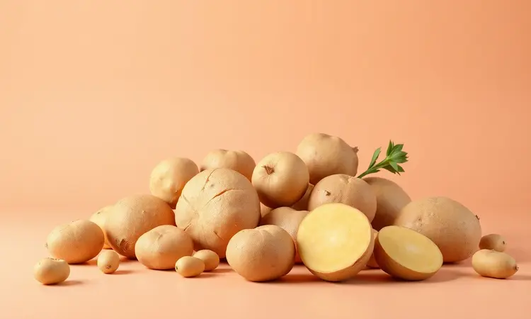
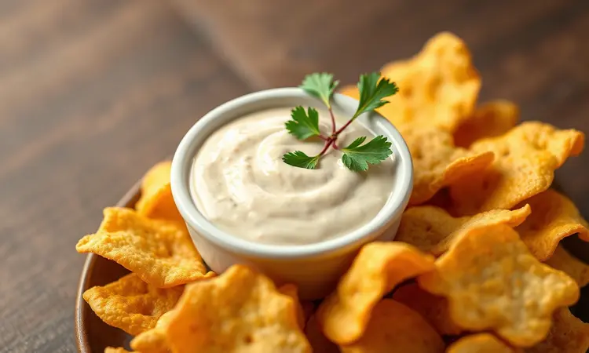

Você já ficou com vontade daqueles bolinhos de bacalhau crocantes de boteco, mas desistiu da ideia só de imaginar a bagunça da fritura ou as calorias que viriam junto? Eu entendo perfeitamente essa luta interior.

Quantas vezes você pensou 'hoje seria perfeito para um petisco', mas a preguiça de limpar o óleo espirrado acabou vencendo?

E se eu te mostrar um caminho que te dá o melhor dos dois mundos: toda a crocância do bolinho dourado por fora, macinho por dentro, mas sem o óleo transbordando na cozinha?

Neste guia, vou te levar pela receita definitiva na Airfryer, revelando cada segredo que transforma você de 'evitador de fritura' para 'mestre dos bolinhos crocantes' em poucos passos.

Prepare-se para descobrir não apenas o 'como fazer', mas o 'porque funciona', desde a escolha da batata certa até a arte de congelar esses tesouros para ter sempre um pedacinho do boteco na sua casa.

<SummaryList products={frontmatter.top_products} />

## Por que Fazer Bolinho de Bacalhau na Airfryer é a Melhor Opção?

Pense na última vez que você comeu um bolinho de bacalhau que era... apenas um bolinho.

Agora imagine desfrutar daquele sabor autêntico que derrete na boca, mas com uma vantagem inesperada: você não precisa lidar com aquele cheiro de óleo que gruda nas paredes da cozinha e nem com aquela sensação de peso no estômago depois.

A mágica da Airfryer está justamente nessa tecnologia de circulação de ar quente que atua como um abraço cuidadoso em cada bolinho.

Em vez de nadar em óleo, seus futuros bolinhos são envolvidos por uma corrente de calor que atinge cada cantinho, garantindo aquela crocância irresistível na casca enquanto o interior permanece macio, úmido e cheio de sabor.

É aquele momento 'ahá' da culinária: você percebe que pode ter tudo - tradição, sabor e praticidade - sem as partes chatas que sempre te fizeram hesitar. E a melhor parte?

A Airfryer te dá controle total: ajuste a temperatura e o tempo com um simples toque, e esqueça o medo de 'será que está quente o suficiente?' que acompanha as frituras tradicionais.

## Ingredientes Selecionados para um Sabor Autêntico

Agora que você entendeu por que essa abordagem transforma a experiência, vamos ao coração do assunto: os ingredientes. Aqui vive um segredo que muitos ignoram: a qualidade dos seus bolinhos começa muito antes da Airfryer ser ligada.

Pense no bacalhau dessalgado e desfiado não apenas como um ingrediente, mas como o protagonista da história que você está prestes a criar. Ele traz o sabor do mar, a tradição portuguesa, a memória de almoços de família.

As batatas cozidas e bem amassadas são as coadjuvantes perfeitas, oferecendo a leveza que equilibra a intensidade do peixe.

Agora, vamos aos personagens de apoio que fazem toda a diferença: a cebola picada que adiciona doçura sutil, o alho que traz profundidade, e a dupla dinâmica de salsinha e coentro (aqui você decide o equilíbrio entre o clássico e o pessoal).

Sal e pimenta-do-reino são a base, mas não subestime o poder de uma pitada de noz-moscada: ela é como aquele ingrediente secreto que ninguém identifica, mas todos sentem que algo é especial.

Esses não são apenas itens em uma lista, são os elementos que, quando combinados com intenção, criam não um petisco, mas uma experiência que evoca memórias e cria novas.

## O Preparo do Bacalhau: Dessalga e a Técnica para Desfiar Corretamente

Vamos dar o primeiro passo físico, e ele é mais ritual do que tarefa. A dessalga do bacalhau é onde o respeito pelo ingrediente começa a se transformar em sabor.

Coloque o peixe em uma tigela com água fria trocada a cada 6 horas, por 24 a 48 horas dependendo da espessura. Esse processo não remove apenas o sal, mas também intensifica o sabor característico do bacalhau, garantindo que ele não seja apenas salgado, mas sim saboroso.

Após essa preparação cuidadosa, chegou a hora do cozimento: cerca de 15 minutos em água fervente até atingir aquele ponto macio que facilita o desfiar. Aqui mora outro segredo: desfiar com garfo ou mãos não é apenas técnica, é atenção.

Você está garantindo que nenhuma espinha passe despercebida, transformando um ingrediente potencialmente problemático em uma base perfeita para seus bolinhos. Esse cuidado não aparece na lista de ingredientes, mas seu paladar certamente o reconhecerá.

## O Segredo da Batata: Qual Tipo Escolher para dar a Liga Perfeita?

Enquanto o bacalhau está tomando forma, vamos dar atenção à sua parceira ideal: a batata. Aqui, a escolha não é sobre variedade, é sobre função.

As batatas Asterix são as favoritas dos chefs que entendem de textura por uma razão simples: elas contêm a proporção exata de amido e água que cria aquela liga secreta.

Imagine uma cola culinária invisível que mantém seus bolinhos unidos durante todo o processo, mas que se dissolve na boca em uma suavidade aveludada. As batatas rosadas são uma excelente alternativa, trazendo resultados similares. O que você deve evitar?

Batatas com alto teor de água, como as comuns de mesa. Elas podem parecer inocentes na hora da compra, mas no preparo elas se revelam como sabotadoras furtivas, tornando sua massa líquida e difícil de moldar.

Escolher a batata certa é como escolher o parceiro de dança perfeito: quando as características se complementam, o resultado é harmonioso e memorável.

## Passo a Passo: Como Moldar e Preparar a Massa Sem Erros

Com seus ingredientes fundamentais prontos, chegamos ao momento da união. Amasse bem as batatas cozidas até obter uma textura uniforme, sem grumos.

Agora, adicione o bacalhau desfiado que você preparou com tanto cuidado, junto com a cebola picada, salsinha, ovos e temperos. Misture tudo com as mãos - sim, literalmente - até sentir que cada componente se integrou perfeitamente.

Você está criando não apenas uma massa, mas uma promessa de sabor. Na hora de moldar, use as mãos levemente umedecidas com água, e sinta a consistência se firmando entre seus dedos.

Modele em formas de croquete ou bolinha, dependendo da preferência da sua memória gustativa. Aqui vem o passo que separa os amadores dos artistas: deixe os bolinhos repousarem na geladeira por cerca de 30 minutos.

Esse intervalo não é tempo perdido, é tempo adquirido - ele permite que as texturas se estabilizem, garantindo que seus bolinhos mantenham a forma durante o cozimento, como pequenas esculturas prontas para se transformarem em delícias douradas.

## O Truque de Ouro: Como Deixar o Bolinho Dourado e Crocante sem Mergulhar no Óleo

<ProductBox 
  title={frontmatter.top_products[0].title} 
  image={frontmatter.top_products[0].image} 
  link={frontmatter.top_products[0].link} 
/>

Agora começamos a mágica da Airfryer. O pré-aquecimento a 180°C por alguns minutos não é apenas uma recomendação, é a preparação do palco onde seus bolinhos se tornarão estrelas. Esse calor inicial cria um ambiente perfeito para a crocância se formar.

Antes de colocá-los, uma leve pincelada de azeite faz dupla função: realça sabor e inicia o processo de douramento.

Ao colocar os bolinhos na Airfryer, mantenha um espaço entre eles para que o ar circule livremente, como convidados em uma festa que precisam de espaço para dançar.

Na metade do tempo, vire-os com cuidado - você está garantindo que o douramento seja uniforme, que cada lado receba sua parcela de atenção.

E aqui está a beleza do processo: ao contrário da fritura tradicional, onde o óleo esconde erros, na Airfryer você vê a transformação acontecer gradualmente, podendo ajustar conforme necessário. É cozinhar com consciência, não com adivinhação.

## Melhores Modelos de Airfryer para Petiscos e Receitas Rápidas

<ProductBox 
  title={frontmatter.top_products[1].title} 
  image={frontmatter.top_products[1].image} 
  link={frontmatter.top_products[1].link} 
/>

À medida que você se apaixona por essa nova forma de cozinhar, pode surgir a curiosidade: qual Airfryer elevaria ainda mais essa experiência?

Modelos como a Philips Walita Série 1000 XL se destacam com sua capacidade generosa, ideal para quem gosta de preparar para a família toda ou tem aqueles dias de visita inesperada.

A Mondial AFON-12L-BI surpreende pela versatilidade, permitindo não apenas fritar, mas também assar e experimentar outras técnicas culinárias.

Se você valoriza design e potência, a Oster OFRT520 combina ambos em um inox elegante, enquanto a Moulinex Easy Fry Grill XXL oferece 6.5 litros de espaço para suas criações mais ambiciosas.

A Britânia BFR50 merece menção por sua tecnologia Air Flow que cozinha de forma tão uniforme que parece que cada bolinho recebe atenção individual.

Alguns modelos podem emitir um som durante o funcionamento, mas esse é o barulho da modernidade substituindo o antigo estalido do óleo - um som que, aliás, não deixa resíduos no ar da sua cozinha.

## Utensílios Essenciais que Facilitam a Sua Vida na Cozinha

<ProductBox 
  title={frontmatter.top_products[2].title} 
  image={frontmatter.top_products[2].image} 
  link={frontmatter.top_products[2].link} 
/>

Embora a Airfryer seja a protagonista deste método, ela não trabalha sozinha. Alguns aliados tornam o processo ainda mais fluido e prazeroso.

Um conjunto de boas facas, por exemplo, transforma o corte da cebola e da salsinha de tarefa em ritual - cada movimento preciso, cada fatia uniforme.

Panela antiaderentes tornam o cozimento das batatas quase infalível, com aquela facilidade de limpeza que faz você querer cozinhar mais vezes. A tábua de corte não é apenas uma superfície, é uma camada de proteção para suas bancadas e para seus dedos.

E a peneira se torna uma peça-chave nas etapas de drenagem, garantindo que suas batatas tenham a textura perfeita.

Esses utensílios não são apenas objetos na sua cozinha, são extensões das suas intenções culinárias, transformando preparos em experiências e receitas em memórias.

## Como Congelar e Preparar Bolinhos Congelados na Airfryer

Aqui mora um dos superpoderes desta abordagem: a capacidade de transformar uma sessão de cozinha em múltiplos momentos de prazer.

Depois de moldar seus bolinhos com todo o cuidado, posicione-os em uma assadeira formando uma única camada e leve ao congelador até que fiquem firmes. Essa etapa inicial evita que eles grudem uns nos outros.

Transfira então para um saco ou recipiente hermético - assim você terá sempre um tesouro pronto para resgate. Quando aquela vontade inesperada surgir em uma tarde chuvosa ou em uma noite de filme, não é necessário descongelar.

Pré-aqueça a Airfryer a 200°C e coloque os bolinhos congelados por 12 a 15 minutos, virando na metade do tempo. O que emerge não tem cara de 'comida congelada', mas sim de 'boteco caseiro recém-feito' - crocante por fora, quente e macio por dentro.

É a combinação perfeita entre planejamento e espontaneidade.

## Sugestões de Molhos e Acompanhamentos para Servir

Um bolinho de bacalhau perfeito é uma obra de arte por si só, mas como toda boa arte, ganha ainda mais significado quando apresentado no contexto certo.

O clássico molho tártaro é mais do que acompanhamento - é um contraponto perfeito, com sua cremosidade equilibrada pela acidez suave que limpa o paladar entre uma mordida e outra.

Para quem busca um toque de ousadia, um molho de pimenta modula o sabor, adicionando camadas de experiência.

Em termos de acompanhamentos, uma salada fresca com folhas verdes e um fio de limão atua como reset gustativo, enquanto uma farofa crocante adiciona textura que conversa diretamente com a crocância do bolinho.

Essas não são apenas adições ao prato, são parceiros que amplificam e completam a experiência que você criou desde a escolha dos ingredientes.

## Perguntas Frequentes (FAQ)

### Por que meu bolinho de bacalhau rachou ou desmanchou?

Se seus bolinhos apresentaram fissuras ou perderam a forma, provavelmente enfrentaram um desafio de equilíbrio de umidade.

Massas com excesso de líquido tendem a ceder durante o cozimento, especialmente se forem levadas diretamente da bancada para o calor intenso sem o período de repouso na geladeira.

A escolha da batata também influencia: variedades com alto teor de água comprometem a consistência.

A solução está na combinação de três fatores: usar a batata ideal (como as Asterix), permitir que a massa descanse para firmar, e moldar com uma pressão consistente que cria estrutura interna.

### Preciso pré-aquecer a Airfryer antes de colocar os bolinhos?

O pré-aquecimento é o diferencial que transforma 'bons' bolinhos em 'excepcionais'.

Esses 3 a 5 minutos iniciais criam um ambiente térmico estável que ataca a crosta externa imediatamente, formando uma barreira protetora que mantém a umidade interna enquanto garante o douramento externo.

Pular essa etapa não impede a cocção, mas certamente diminui a intensidade da crocância que faz os olhos brilharem na primeira mordida.

### Posso usar bacalhau já desfiado de mercado?

Absolutamente. O bacalhau desfiado comprado pronto é uma opção que respeita seu tempo sem necessariamente sacrificar qualidade. O segredo está na seleção: opte por marcas conhecidas e, sempre que possível, verifique a aparência e o aroma antes da compra.

Algumas versões já vêm temperadas - nesses casos, ajuste seus temperos adicionais com moderação.

Essa escolha transforma o processo de 'dessalgar e desfiar' em minutos, permitindo que você foque nas etapas que realmente criam a magia: a mistura, o molde e a transformação na Airfryer.

## Conclusão

Começamos essa jornada com uma dúvida familiar: como conciliar o amor pelos bolinhos de bacalhau crocantes com a aversão à bagunça e às calorias da fritura tradicional. Agora, olhe para trás e veja quantas barreiras você superou.

Você não apenas encontrou uma solução, mas descobriu um universo onde tradição e modernidade se abraçam, onde praticidade não significa comprometer sabor, e onde cada detalhe - desde a escolha da batata até o giro na metade do tempo - é uma oportunidade de criar algo memorável.

A Airfryer não é apenas um eletrodoméstico, é um portal para uma nova forma de se relacionar com a comida: mais consciente, mais criativa, mais conectada com os sabores que realmente importam.

Aqueles bolinhos dourados que agora você sabe fazer são mais do que um petisco; eles são a prova de que você pode sim ter a crocância do boteco, o sabor da tradição e a leveza das escolhas inteligentes, tudo na mesma mordida.

Agora, quando aquela vontade bater, você não precisa escolher entre saudável e gostoso - você pode abraçar ambos e convidar todos ao redor da mesa para compartilhar mais do que comida, mas uma experiência que começa com suas mãos na massa e termina com sorrisos satisfeitos.