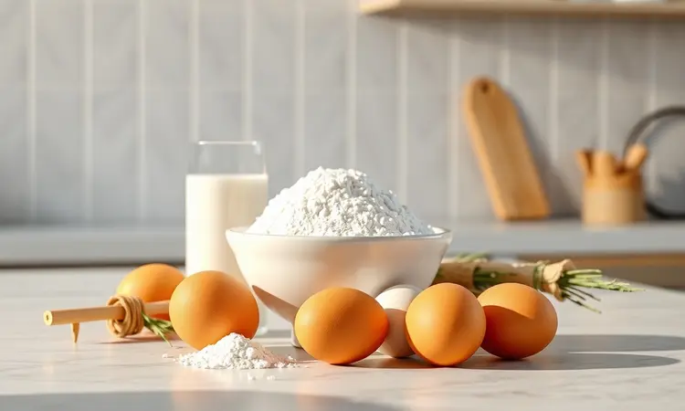
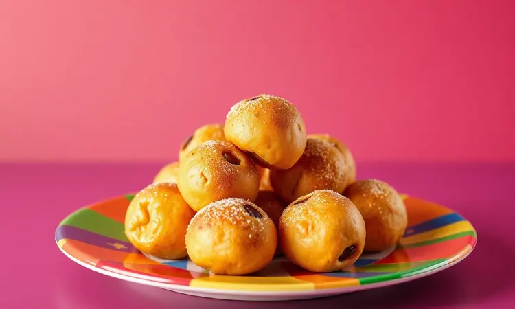
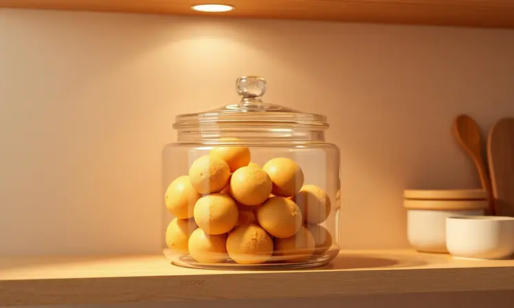

Imagine o aroma de canela e doce se espalhando pela cozinha, aquela lembrança afetiva da infância que parece tão distante quando pensamos na bagunça da fritura.

Você não precisa escolher entre sabor e praticidade: o bolinho de chuva feito na airfryer mantém toda a magia do preparo tradicional, mas elimina o que tornava essa receita complicada.

<SummaryList products={frontmatter.top_products} />

## Por que Preparar Bolinho de Chuva na Airfryer?

Mais do que uma versão saudável, o que você ganha é liberdade. Liberdade para saborear aquela crocância dourada sem se preocupar com o peso de uma fritura gordurosa.

A airfryer oferece uma consistência que parece mágica: cada bolinho sai sequinho por fora, com uma maciez interior que derrete na boca. E o melhor? Quando terminar, você simplesmente limpa a cesta, sem aquela sensação de ter trabalhado horas na cozinha.

É praticidade que transforma um desejo de último momento em realidade.

## Ingredientes Necessários para a Massa Perfeita

A simplicidade é o segredo. Com apenas seis ingredientes que provavelmente já estão na sua despensa, você cria a base perfeira:

* 2 ovos (para dar leveza e estrutura)

* 1 xícara de leite (que traz cremosidade)

* 1 xícara de açúcar (equilibrando a doçura)

* 2 xícaras de farinha de trigo (a base que segura tudo)

* 1 colher de sopa de fermento em pó (o responsável pela fofura)

* Canela em pó a gosto (aquele abraço aromático)

Esses elementos se combinam para criar não apenas uma massa, mas uma experiência que começa no preparo e termina no prazer de cada mordida.

## Utensílios que Facilitam o Preparo e Garantem o Formato

Antes de mergulhar nas mãos na massa, alguns aliados fazem toda diferença. Tigelas para misturar, uma colher de sopa para incorporar os ingredientes e uma espátula para retirar os bolinhos já são suficientes.

Mas se você busca perfeição no formato, dois utensílios podem elevar seu jogo.

### Colher Dosadora: O Segredo para Bolinhos Redondos

<ProductBox 
  title={frontmatter.top_products[1].title} 
  image={frontmatter.top_products[1].image} 
  link={frontmatter.top_products[1].link} 
/>

Imagine conseguir bolinhos tão uniformes que parecem ter saído de uma confeitaria. A colher dosadora faz exatamente isso: ela mede a quantidade exata de massa para cada porção, garantindo que todos cozinhem no mesmo ritmo.

Seus bolinhos não apenas ficam visualmente perfeitos, mas também assam de maneira completamente homogênea, eliminando aquela frustração de encontrar um que ficou cru enquanto outros já estão prontos.

### Formas de Silicone para Massas mais Leves

<ProductBox 
  title={frontmatter.top_products[2].title} 
  image={frontmatter.top_products[2].image} 
  link={frontmatter.top_products[2].link} 
/>

Para quem valoriza praticidade acima de tudo, as formas de silicone são reveladoras. Elas dispensam a etapa de untar e sua flexibilidade torna o desenformar tão suave quanto o movimento de deslizar os bolinhos para o prato.

Resistente a temperaturas extremas, esse material mantém sua integridade enquanto suas criações douram uniformemente. É um daqueles investimentos que você agradece a cada preparo.

### Melhores Modelos de Airfryer para Receitas de Confeitaria

<ProductBox 
  title={frontmatter.top_products[0].title} 
  image={frontmatter.top_products[0].image} 
  link={frontmatter.top_products[0].link} 
/>

Seu equipamento é o palco onde a mágica acontece, e alguns modelos são verdadeiros parceiros culinários. A Mallory Air Oven Unique 30L oferece espaço generoso para preparar grandes quantidades, perfeita para festas em família.

A Eos Oven Pizza Premium Digital 30L se destaca pela distribuição de calor precisa, garantindo que cada centímetro dos seus bolinhos receba a mesma atenção térmica.

Para cozinhas que valorizam versatilidade, a Philco Air Fryer Oven PFR2200 funciona como airfryer, forno e grill em um só aparelho. Já a Oster Forno e Fryer Multifunções 25L oferece excelente custo-benefício para quem está começando.

Modelos compactos como o Mondial Forno Oven 12L são ideais para espaços menores ou preparos mais intimistas, provando que tamanho não é impedimento para resultados extraordinários.

## Passo a Passo: Como Fazer Bolinho de Chuva na Airfryer

Agora vamos transformar ingredientes em memórias. Em uma tigela, combine 1 xícara de farinha de trigo, ½ xícara de açúcar, 1 colher de sopa de fermento em pó e uma pitada de sal.

Acrescente 1 ovo e ½ xícara de leite, misturando até criar uma textura homogênea que convida ao toque. Enquanto isso, pré-aqueça sua airfryer a 180°C, esse passo é crucial para iniciar o cozimento na temperatura perfeita.

Com uma colher ou sua dosadora, forme pequenas porções e distribua na cesta com espaço generoso entre elas, permitindo que o ar circule como um abraço quente em cada bolinho.

Asse por 10 a 15 minutos, virando na metade do tempo para garantir aquela douradura uniforme que sinaliza perfeição.

## 5 Dicas de Ouro para o Bolinho não Ficar Cru por Dentro

Nada decepciona mais do que partir um bolinho e encontrar o interior ainda cru. Evite essa frustração com estas orientações:

1. Tamanho importa: porções menores cozinham de maneira mais uniforme, garantindo que o calor penetre até o centro.

2. Espaço é liberdade: não sobrecarregue a cesta. O ar precisa circular livremente para envolver cada bolinho.

3. Pré-aquecer é essencial: começar na temperatura certa cria uma crosta externa que protege enquanto o interior se cozinha.

4. Gire com cuidado: na metade do tempo, vire os bolinhos suavemente para expor todas as superfícies ao calor.

5. Descanse antes de servir: alguns minutos fora da airfryer permitem que os sabores se estabilizem e a textura se acomode.

## Variações de Sabor: Do Clássico ao Recheado

Por que se limitar ao tradicional quando o universo de sabores espera por você? A receita básica é apenas o ponto de partida para criações que refletem seu paladar pessoal.

### Bolinho de Chuva com Banana e Canela

Bananas maduras amassadas incorporadas à massa trazem uma doçura natural que reduz a necessidade de açúcar. Combinadas com canela, criam um aroma que preenche a casa com promessas de aconchego.

Essa versão é tão nutritiva quanto saborosa, perfeita para quem busca um lanche que alimenta corpo e alma.

### Versão com Gotas de Chocolate ou Doce de Leite

Para momentos que pedem indulgência, gotas de chocolate ou pedacinhos de doce de leite transformam cada mordida em uma surpresa cremosa.

A beleza dessa adaptação está em como esses ingredientes se mantêm intactos durante o preparo, criando pequenos núcleos de prazer que se revelam conforme você saboreia.

## Como Substituir o Leite e a Farinha (Versões Fit e Veganas)

Restrições alimentares não precisam significar privação de sabor. Leites vegetais como amêndoas, soja ou aveia não apenas substituem o leite tradicional, mas acrescentam notas únicas à receita.

Farinhas de aveia ou amêndoas oferecem texturas interessantes enquanto aumentam o valor nutricional. Para um boost proteico, a farinha de grão-de-bico funciona maravilhosamente, provando que saudável e delicioso podem ser sinônimos.

## Erros Comuns que Você Deve Evitar

Algumas armadilhas são fáceis de contornar quando você as conhece. A massa muito líquida resulta em bolinhos que se espalham e perdem forma, enquanto o esquecimento de pré-aquecer leva a tempos de cozimento inconsistentes. E aquele impulso de encher a cesta? Resista.

Espaço entre os bolinhos não é luxo, é necessidade para que o calor trabalhe sua mágica uniformemente.

## Como Armazenar e Reaquecer para Manter a Crocância

A crocância que você conquistou com cuidado pode ser preservada com igual atenção. Após os bolinhos esfriarem completamente, guarde-os em recipiente hermético para protegê-los da umidade ambiente.

Quando a vontade reaparecer, sua airfryer devolve a textura original em minutos a 180°C, sem necessidade de adicionar gordura. É como reviver o momento perfeito do primeiro preparo.

## Perguntas Frequentes (FAQ)

### Qual o tempo ideal de cozimento na Airfryer?

Para bolinhos de chuva, 10 a 15 minutos a 180°C é o ponto ideal. Considere isso como uma faixa de tempo: nos últimos 5 minutos, observe o dourado e a textura.

Cada airfryer tem sua personalidade, e você aprenderá a reconhecer quando os seus bolinhos atingiram a perfeição.

### Posso usar água no lugar do leite na massa?

Sim, mas com um aviso: a água não oferece a cremosidade que o leite proporciona. Se essa substituição for necessária, compensa com um toque extra de açúcar ou uma pitada de essência de baunilha para manter o sabor interessante.

### Por que meu bolinho ficou murcho depois de frio?

A umidade é a grande vilã aqui. Quando armazenados em recipientes fechados enquanto ainda quentes, os bolinhos liberam vapor que se acumula e amolece a crosta. A solução?

Espere esfriar completamente antes de guardar e, se possível, use papel toalha para absorver qualquer excesso de umidade.

## Conclusão

O bolinho de chuva na airfryer representa mais do que uma receita adaptada: é a reconquista de um prazer que parecia perdido na complexidade dos preparos tradicionais.

Você recupera não apenas o sabor da infância, mas também a espontaneidade de poder preparar algo especial sem o peso das limitações.

Cada bolinho dourado é uma prova de que saudabilidade e prazer podem coexistir, que praticidade não precisa sacrificar qualidade, e que as melhores memórias podem ser recriadas com um toque contemporâneo.

Agora é sua vez: reúna os ingredientes, aqueça sua airfryer e transforme um simples lanche em um momento de carinho próprio. Sua versão perfeita do bolinho de chuva está esperando para ser descoberta.