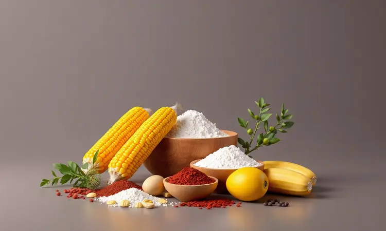
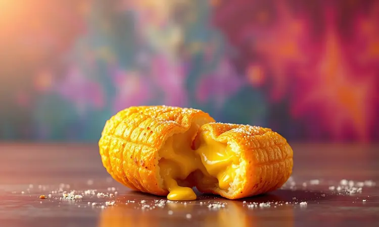
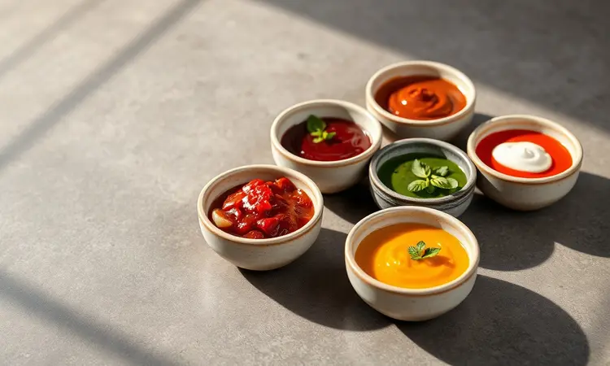

Você adora o sabor caseiro do bolinho de milho, mas foge da sujeira e das calorias da fritura por imersão? Você não está sozinho. A boa notícia é que é perfeitamente possível obter aquele resultado dourado e irresistível usando a tecnologia a seu favor.

Neste guia, prometemos revelar a receita definitiva de bolinho de milho na Air Fryer, garantindo a textura perfeita por fora e a maciez por dentro. Você vai aprender desde a base tradicional até variações gourmet, além de truques de mestre para nunca mais errar o ponto.

<SummaryList products={frontmatter.top_products} />

## Por que Preparar Bolinho de Milho na Air Fryer?

Imagine a crocância perfeita do bolinho frito tradicional, mas sem aquele óleo escorrendo pelo prato ou o cheiro que impregna a cozinha por horas.

A Air Fryer consegue essa mágica utilizando ar quente em circulação intensa, que cria uma camada exterior dourada e crocante enquanto mantém o interior macio e úmido. A diferença? Até 80% menos gordura.

Além do fator saúde, pense na praticidade: em vez de limpar panelas engorduradas e lidar com óleo quente, você apenas coloca os bolinhos na cesta, programa e em minutos tem um lanche perfeito. A limpeza se resume a enxaguar o cesto antiaderente.

É aquele tipo de conveniência que transforma uma receita especial em parte da sua rotina semanal.

## Ingredientes Essenciais para a Receita Tradicional

A base da receita tradicional é simples, mas cada ingrediente tem seu papel crucial. Você precisará de milho verde (3 espigas ou 400g), 1 xícara de farinha de milho, 2 ovos, 1 cebola média picada, sal a gosto, pimenta-do-reino e cheiro-verde picado.

A simplicidade aqui é enganosa, pois essa combinação equilibrada garante tanto o sabor autêntico quanto a textura que faz você querer comer mais um.

### O Papel do Milho: Fresco ou em Lata?

<ProductBox 
  title={frontmatter.top_products[0].title} 
  image={frontmatter.top_products[0].image} 
  link={frontmatter.top_products[0].link} 
/>

O coração do bolinho está no milho, e sua escolha define o caráter do prato. O milho fresco direto da espiga oferece uma experiência sensorial completa: sabor mais doce e intenso, textura mais cremosa devido ao amido natural que age como espessante.

Quando você usa o fresco, percebe uma diferença nítida na cor dourada mais vibrante e na crocância que se mantém por mais tempo.

Se a praticidade pesa mais, o milho em lata funciona bem, especialmente quando você tem pouco tempo. O segredo está em escorrer muito bem a água da conserva, que pode conter açúcares e conservantes que alteram o sabor.

Embora o resultado final possa ser um pouco menos doce que o fresco, ainda oferece fibras e nutrientes importantes.

Para dias especiais, vá de fresco. Para o lanche do dia a dia, a lata salva. O importante é nunca deixar de fazer por falta do ingrediente "ideal".

## Passo a Passo: Como Fazer Bolinho de Milho na Air Fryer

Com os ingredientes escolhidos, chegamos à parte prática onde a magia acontece. A sequência é intuitiva, mas alguns detalhes fazem toda diferença entre um bolinho bom e aquele que faz os convidados pedirem a receita.

### Preparando a Massa e o Ponto Ideal

Comece processando o milho no liquidificador até obter uma textura entre grosseira e cremosa, alguns pedacinhos são bem-vindos para dar personalidade. Transfira para uma tigela e adicione a farinha de milho, ovos, cebola picada e os temperos.

Misture com as mãos ou uma colher até sentir que todos os elementos se incorporaram.

O ponto ideal é quando a massa fica moldável mas não seca demais. Teste: pegue uma porção e tente formar uma bolinha. Se ela mantém a forma sem desmanchar, mas também não está dura como massa de pão, está perfeita. Se parecer muito líquida, adicione farinha aos poucos.

Deixe descansar por 15 minutos, esse tempo permite que a farinha absorva a umidade do milho, resultando em bolinhos mais firmes e crocantes depois.

### Tempo e Temperatura: O Segredo da Crocância Sem Óleo

Aqui está o pulo do gato da Air Fryer. Pré-aqueça o aparelho a 180°C por 5 minutos enquanto modela os bolinhos do tamanho de uma noz. Distribua na cesta em uma única camada, com espaço entre eles para que o ar circule por todos os lados. 

Programe por 15 a 20 minutos, mas não se ausente da cozinha. Na metade do tempo, abra a gaveta e vire cada bolinho com uma pinça ou espátula.

Esse simples movimento garante que todos os lados recebam calor uniforme, criando aquela douradura homogênea que parece ter saído de uma fritura profissional.

A temperatura constante de 180°C é crucial, ela cozinha o interior sem queimar o exterior. Se preferir mais dourado, aumente para 200°C nos últimos 3 minutos.

## Melhores Equipamentos: Air Fryer de Cesto vs. Oven

<ProductBox 
  title={frontmatter.top_products[1].title} 
  image={frontmatter.top_products[1].image} 
  link={frontmatter.top_products[1].link} 
/>

A escolha do equipamento pode transformar sua experiência. A Air Fryer de cesto tradicional é a queridinha para famílias pequenas: aquece rapidamente, cozinha em minutos e os cestos removíveis facilitam a limpeza pós-uso. O limite?

A capacidade, que pode exigir fazer em lotes se for preparar para muitas pessoas.

Já a versão tipo forno oferece espaço generoso para grandes quantidades e funções extras como grelhar e assar. Ideal para quem cozinha para família numerosa ou gosta de versatilidade.

O tempo de aquecimento inicial pode ser um pouco maior, mas a recompensa é poder fazer todos os bolinhos de uma só vez.

Pense no seu dia a dia: se busca praticidade e rapidez, o cesto é seu aliado. Se valoriza capacidade e multifuncionalidade, o forno será seu melhor investimento.

## Variações Irresistíveis: Bolinho de Milho com Queijo e Recheios

Depois de dominar a receita básica, chegou a hora de brincar. Adicionar 100g de queijo ralado (parmesão ou mussarela) à massa transforma o bolinho em uma explosão de sabor que derrete na boca.

Para algo mais sofisticado, faça bolinhos recheados: abra uma porção da massa na mão, coloque um cubinho de queijo coalho ou um pouco de frango desfiado temperado, feche modelando novamente.

Os recheios são território da criatividade: carne seca desfiada, espinafre refogado com alho, ou até mesmo um pedacinho de linguiça calabresa. O segredo é manter os recheios em pequena quantidade para não dificultar o fechamento dos bolinhos.

### Como Usar Formas de Silicone para Bolinhos Mais Macios

<ProductBox 
  title={frontmatter.top_products[2].title} 
  image={frontmatter.top_products[2].image} 
  link={frontmatter.top_products[2].link} 
/>

Se você busca a maciez perfeita com formato impecável, as formas de silicone são sua melhor amiga. Elas dispensam untar, garantem que os bolinhos saiam inteiros sem quebrar e distribuem o calor de maneira uniforme.

O truque para massas mais líquidas é apoiar a forma sobre uma assadeira rígida antes de levar à Air Fryer. Isso evite que ela se curve e derrame a massa.

São reutilizáveis, vão do freezer direto para o aparelho e facilitam a organização quando você quer fazer grandes quantidades para congelar.

## Dicas de Ouro para um Bolinho Perfeito (Nível Skyscraper)

Além das instruções básicas, esses detalhes elevam seus bolinhos ao nível de restaurante especializado.

### Como Deixar o Bolinho Super Dourado e "Caramelizado"

Para alcançar aquele tom dourado intenso que parece caramelizado, aumente a temperatura para 200°C nos últimos minutos de cozimento. Outro segredo profissional: pincele os bolinhos com azeite ou manteiga derretida antes de colocá-los na Air Fryer.

Essa fina camada de gordura interage com o calor intenso, criando uma crosta brilhante e saborosa.

A posição também importa. Coloque os bolinhos mais próximos da fonte de calor (geralmente na parte superior da cesta) durante os últimos minutos. A combinação de temperatura alta, gordura superficial e posicionamento estratégico cria a douradura perfeita.

### Erros Comuns: Por Que meu Bolinho Desmanchou?

Se seus bolinhos se desfizeram durante o cozimento, provavelmente a massa estava com pouca farinha ou excesso de líquido. A proporção ideal é cerca de 1 xícara de farinha para cada 400g de milho processado.

Outro vilão é não pré-aquecer a Air Fryer, o que faz os bolinhos cozinharem lentamente e perderem estrutura antes de firmar.

O espaçamento na cesta é crítico. Bolinhos muito próximos criam vapor entre eles, impedindo a formação da crosta crocante que os mantém unidos. Deixe pelo menos 2cm entre cada um, mesmo que precise fazer em mais de uma leva.

## Sugestões de Acompanhamentos e Molhos Caseiros

Um bom molho transforma o bolinho de milho em experiência completa. Para algo refrescante, misture iogurte natural com hortelã picada, suco de limão e um fio de azeite. O contraste entre o cremoso frio e o quente crocante é divino.

Se prefere picante, faça um molho de pimenta com dedo-de-moça, alho, vinagre e um pouco de mel para equilibrar. Para momentos especiais, um chutney de abacaxi com gengibre traz doçura e acidez que complementam perfeitamente o sabor do milho.

Não subestime o poder da simplicidade: uma salsa fresca de tomate, cebola roxa e coentro com limão é clássica por um motivo.

## Perguntas Frequentes (FAQ)

As dúvidas mais comuns que surgem quando você começa a explorar esta receita.

### Posso congelar os bolinhos antes de assar?

Absolutamente, e esta é uma das maiores vantagens da receita. Depois de modelar os bolinhos, distribua-os em uma assadeira forrada e leve ao freezer até firmarem (cerca de 2 horas). Transfira para um saco ou pote hermético.

Quando a fome bater, tire direto do freezer para a Air Fryer pré-aquecida e adicione 3-5 minutos ao tempo normal. É como ter lanche gourmet congelado que se transforma em minutos.

### Dá para fazer a receita com milho de saquinho?

Sim, e para muitas pessoas essa é a opção mais prática. Escorra muito bem o milho (pressione contra a peneira para remover o excesso de água) e prossiga normalmente. O sabor será um pouco menos doce que o fresco, mas ainda delicioso.

Se quiser compensar, adicione uma colher de chá de açúcar mascavo à massa.

## Conclusão

O bolinho de milho na Air Fryer é mais que uma receita, é uma pequena revolução na cozinha caseira. Ele mantém toda a crocância e sabor que amamos nos fritos tradicionais, mas elimina o óleo excessivo, a sujeira e aquela sensação pesada depois de comer. 

Agora você domina desde a escolha do milho até os truques de douradura perfeita, passando pelas variações que tornam cada preparo uma nova experiência.

Tem as respostas para as dúvidas comuns e sabe como adaptar a receita ao seu estilo de vida, seja congelando para ter sempre à mão ou usando ingredientes práticos quando o tempo é curto.

O próximo passo é colocar a mão na massa. Escolha seu momento, reúna os ingredientes e transforme essa tradição culinária em algo que cabe perfeitamente na sua rotina moderna.

Depois do primeiro bolinho dourado e crocante saindo da sua Air Fryer, você nunca mais vai ver os fritos tradicionais da mesma maneira. É hora de reinventar o prazer sem culpa.