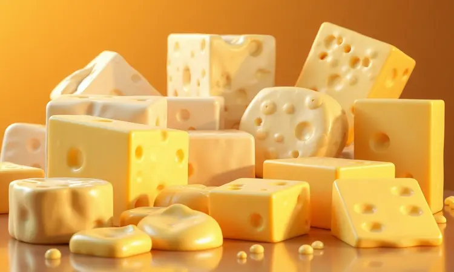
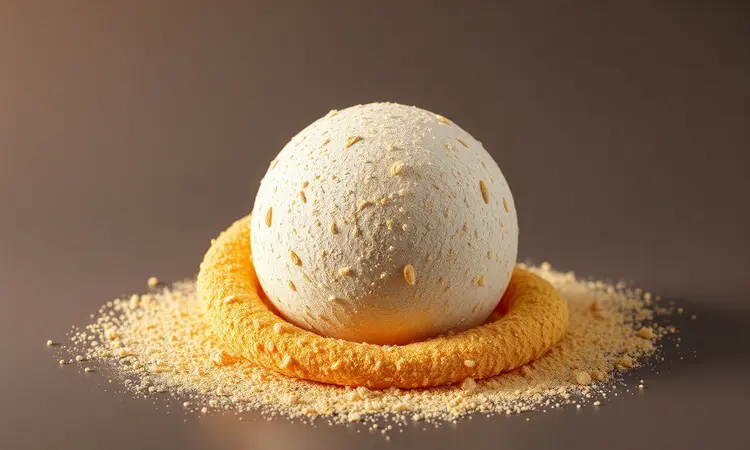
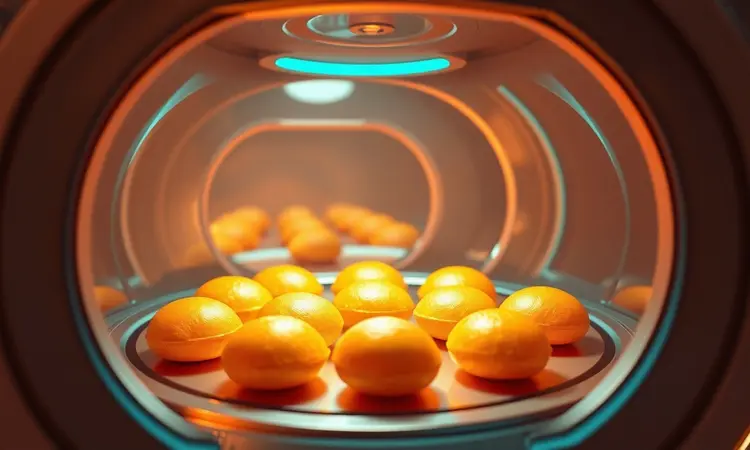
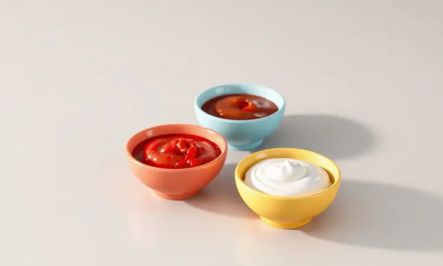

Você já sentiu vontade de comer aquele bolinho de queijo de festa, mas desistiu só de pensar na sujeira da fritura e no óleo espalhado pela cozinha? Você não está sozinho.

A boa notícia é que é totalmente possível conseguir aquele resultado dourado e crocante por fora, com o queijo derretendo por dentro, usando apenas o ar quente.

Neste guia completo, eu vou te ensinar não apenas a receita clássica, mas também uma versão de 3 ingredientes e, o mais importante, o segredo profissional para que seus bolinhos nunca mais estourem dentro da airfryer. Prepare-se para elevar o nível do seu petisco!

<SummaryList products={frontmatter.top_products} />

## Por que Trocar a Fritura pela Airfryer?

Imagine sair da cozinha sem aquela sensação gordurosa nas mãos, sem o cheiro de óleo que gruda nas cortinas, sem precisar lidar com aquele pote de óleo usado que não sabemos bem onde descartar.

Trocar a fritura tradicional pela airfryer não é só uma questão de saúde (embora reduza até 70% da gordura), é uma revolução no seu dia a dia.

A praticidade te conquista: você coloca os alimentos, ajusta o timer, e enquanto arruma a cozinha ou responde uma mensagem, o trabalho acontece sozinho. A limpeza? Uma passadinha de pano na cesta antiaderente e pronto.

Essa combinação de sabor sem culpa, praticidade e facilidade de limpeza transforma a airfryer de um eletrodoméstico em seu aliado secreto para lanches irresistíveis.

## Quais são os Melhores Queijos para o Recheio Perfeito?

O coração do bolinho de queijo está, claro, no queijo. Mas qual escolher para aquele momento em que você morde e encontra aquela cremosidade perfeita, que escorre suavemente sem ser aguada?

A muçarela é sua aliada clássica, derretendo com uma textura puxada que evoca memórias de infância. Já o queijo coalho traz um sabor levemente salgado e uma consistência que segura bem o formato.

Se quer algo com personalidade, o minas curado adiciona profundidade, enquanto o cheddar oferece um sabor marcante e cor vibrante. O segredo está em experimentar combinações: que tal 70% muçarela com 30% parmesão ralado?

A textura fica cremosa com um toque salgado que realça todos os sabores.

## Receita de Bolinho de Queijo de 3 Ingredientes (Versão Ultra Rápida)

Aquela vontade repentina de comer algo gostoso, mas você olha para o relógio e vê que tem apenas 15 minutos? Esta receita é sua salvadora. Você precisa apenas de três amigos: queijo ralado (o coalho ou parmesão funcionam maravilhosamente), polvilho doce e um ovo.

Misture tudo em uma tigela até sentir a massa ficar homogênea e maleável nas mãos.

Modele bolinhas do tamanho que seu coração mandar (eu prefiro as pequenas, que ficam crocantes por inteiro), coloque na airfryer pré-aquecida a 180°C, e em 10 a 12 minutos você tem um lanche que parece mágica. Simples assim, sem desculpas para não fazer.

## Ingredientes da Receita Tradicional: Sabor de Infância

Para aqueles dias em que você quer mais do que praticidade, quer reviver a memória afetiva da receita da vó, os ingredientes tradicionais são sua jornada no tempo. Além do queijo e polvilho, você levará ovos, um fio de leite e seus temperos preferidos.

É nesta receita que o amor pela cozinha se materializa: cada ingrediente adicionado não é apenas um item da lista, mas uma camada de sabor que constrói a experiência completa.

## Passo a Passo: Preparando a Massa Base e Modelagem

Vamos colocar a mão na massa? Em uma vasilha, reúna 250g de queijo minas ou muçarela ralado, 1 xícara de polvilho doce e 1 ovo.

Aqui está seu momento de criatividade: adicione sal a gosto e, se quiser um toque especial, uma pitada generosa de pimenta-do-reino moída na hora.

Amasse com as mãos até sentir todos os ingredientes se abraçando, formando uma massa que não gruda nos dedos mas tem flexibilidade.

Agora, o ritual da modelagem: pegue porções do tamanho de uma colher de sopa e forme bolinhas firmes, pressionando levemente para garantir que não haja bolhas de ar dentro. Esta atenção agora é o que garante que, mais tarde, você terá bolinhos intactos e perfeitos.

## O Truque da Geladeira: O Segredo para a Estrutura Perfeita

Aqui está um segredo que muitos pulam, mas que faz toda a diferença entre um bolinho bom e um excepcional: a paciência. Após moldar suas bolinhas, arrume-as em uma travessa e leve à geladeira por pelo menos 30 minutos. Este tempo não é de espera, é de transformação.

A massa firma, os sabores se integram profundamente, e quando o calor da airfryer encontrar essa estrutura consolidada, o resultado será um bolinho que mantém seu formato impecável, crocante por fora mas com o interior perfeitamente cremoso.

Confie neste processo: ele é o diferencial que transforma cozinheiros em chefs.

## A Técnica de Empanamento Duplo para Máxima Crocância

Se você busca aquela crocância que faz barulho ao morder, esta técnica é seu novo ritual sagrado. Comece passando cada bolinho na farinha de trigo (uma camada leve, apenas para secar a superfície).

Em seguida, dê um mergulho rápido nos ovos batidos, cobrindo uniformemente. Por fim, a estrela do show: a farinha de rosca. Esta terceira camada é o segredo daquela casca dourada e texturizada que todos amam.

Quando o ar quente da airfryer encontra esta preparação meticulosa, ele cria uma crosta que protege o tesouro derretido dentro, entregando experiência sensorial completa em cada mordida.

## Ajustando Tempo e Temperatura: O Guia de Cocção

Cada airfryer tem sua personalidade, e aprender a dançar com ela é parte da diversão. Comece sempre pré-aquecendo a 180°C, este passo inicial garante que os bolinhos comecem a dourar imediatamente, selando a superfície.

O tempo varia entre 10 e 15 minutos, dependendo do tamanho dos seus bolinhos e da potência do aparelho. Meu conselho: aos 10 minutos, dê uma olhada. Eles já estarão dourados? Talvez precisem de mais 2 ou 3 minutos para atingirem a crocância perfeita.

Não se esqueça de agitar a cesta na metade do tempo, este movimento simples garante que cada bolinho receba calor uniforme, resultando em uma fornada onde todos são igualmente perfeitos.

## O Segredo Revelado: Como Evitar que o Bolinho Estoure na Airfryer

Nada mais frustrante do que abrir a airfryer e encontrar queijo vazado por todos os lados, não é? A prevenção começa muito antes do cozimento.

Primeiro, ao modelar, certifique-se de que as bolinhas estão bem compactadas, sem bolhas de ar dentro (essas pequenas bolhas se expandem com o calor e causam estouros).

Segundo, nunca sobrecarregue a cesta, os bolinhos precisam de espaço para que o ar quente circule livremente ao redor de cada um. Terceiro, o pré-aquecimento é não negociável: ele cria um choque térmico que sela a superfície rapidamente.

E quarto, aquela pausa na geladeira que mencionamos? Ela é sua maior aliada, dando tempo para a massa desenvolver a estrutura necessária para resistir ao calor intenso. Seguindo estas quatro etapas, você dirá adeus aos estouros para sempre.

## Acessórios Úteis: Papel Antiaderente e Forros de Silicone

Alguns pequenos ajudantes podem tornar sua experiência ainda mais tranquila.

Os forros de silicone são como tapetes mágicos reutilizáveis: evitam que os bolinhos grudem, facilitam a limpeza e são ecológicos (basta lavar e secar completamente para reutilizar infinitas vezes).

Já o papel antiaderente é o aliado da praticidade extrema, coloque na cesta, asse, e ao final basta enrolar e descartar, sem nenhuma sujeira. Só atenção: se usar papel, coloque algo por cima para evitar que ele levante voo com a força do ar.

Ambas as opções funcionam maravilhas; escolha a que melhor se adapta ao seu estilo de cozinha.

## Variações Gourmet: Adicionando Bacon, Alho e Ervas Finas

Agora que você domina a base, que tal brincar de chef? Adicione bacon picado bem fininho à massa para surpreender com pedacinhos crocantes e sabor defumado em cada mordida. Um dente de alho amassado ou uma pitada de alho em pó realça profundamente os sabores do queijo.

Ervas frescas fazem milagres: salsinha e cebolinha picadas trazem frescor, enquanto um pouco de tomilho ou orégano adicionam complexidade aromática.

Estas não são apenas adições, são conversas entre sabores, cada ingrediente extra fala com o queijo, criando harmonias únicas que transformam um simples petisco em uma experiência gastronômica memorável.

## Como Congelar e Armazenar para Lanches Rápidos

A vida moderna pede praticidade, e congelar bolinhos de queijo é como ter um tesouro escondido para emergências gastronômicas. Após moldar (e antes de empanar, se for usar a técnica dupla), arrume os bolinhos em uma assadeira forrada, sem que se toquem.

Leve ao congelador por 1 hora, este congelamento rápido individual evita que grudem depois. Transfira para um saco ou pote hermético, etiquetando com a data.

Assim, por até 2 meses, você terá à disposição a solução perfeita para visitas surpresa, lanches da tarde ou aquela vontade incontrolável de quarta-feira à noite.

Para assar, não precisa descongelar: direto da freezer para a airfryer, apenas adicione 2-3 minutos ao tempo normal.

## 3 Sugestões de Molhos para Acompanhar seu Petisco

Um bom molho não é apenas acompanhamento, é o coadjuvante que rouba a cena. Para um contraste divino, misture mostarda amarela com mel, a picância e a doçura criam um equilíbrio que realça o queijo.

Para algo reconfortante, um molho de tomate caseiro com manjericão fresco oferece frescor mediterrâneo.

E para uma opção leve e cremosa, iogurte natural batido com ervas finas (salsinha, cebolinha, endro) cria uma sensação refrescante que limpa o paladar entre uma mordida e outra.

Sirva em potinhos separados e deixe cada convidado criar suas próprias combinações, parte da diversão está na descoberta.

## Melhores Airfryers para Resultados Profissionais

Se você está pensando em investir em um equipamento que vai além do básico, alguns modelos se destacam.

A Philco PFR2200 e a Electrolux Airfryer Oven EAF90, ambas com capacidade generosa de 12 litros, são ideais para quem cozinha para família grande ou adora receber amigos.

A tecnologia Rapid Air, presente em muitos modelos premium, garante circulação de calor uniforme que transforma qualquer receita.

Sim, elas ocupam mais espaço na bancada, mas a versatilidade (assar, grelhar, fritar sem óleo) e a capacidade fazem deste espaço um investimento que retorna em praticidade diária.

## Perguntas Frequentes (FAQ) sobre Bolinhas de Queijo na Airfryer

Posso usar queijo prato? Claro! Derrete bem e tem sabor suave. Meus bolinhos estão ficando pálidos, o que fazer? Aumente a temperatura para 190°C nos últimos 2 minutos para dourar. Posso fazer sem ovo?

Sim, substitua por 1 colher de sopa de água ou leite para unir a massa. Quantos bolinhos cabem de uma vez? Depende do tamanho da sua airfryer, mas nunca preencha mais que 70% da cesta. Por que alguns estouram e outros não?

Geralmente é bolha de ar na modelagem ou temperatura muito alta muito rápido. E a farinha de rosca caseira? Faça torrando pão velho no forno e processando, fica ainda mais crocante!

## Conclusão

Lembra daquele medo inicial da sujeira da fritura, do óleo espalhado, da trabalheira toda?

Olhe agora para o que você descobriu: é possível ter bolinhos de queijo dourados, crocantes por fora e com o recheio perfeitamente derretido, tudo com uma limpeza que leva menos de 2 minutos.

Você não apenas aprendeu receitas, mas dominou técnicas que transformam ingredientes simples em experiências memoráveis. A airfryer deixou de ser um eletrodoméstico para se tornar sua aliada na criação de momentos gostosos sem culpa, sem bagunça e com muito sabor.

Agora é sua vez: escolha seu queijo favorito, coloque as mãos na massa e descubra como é bom surpreender a si mesmo e a quem você ama com um petisco que carrega não apenas sabor, mas toda a técnica e carinho que você aprendeu aqui.

Sua próxima fornada de bolinhos não será apenas comida, será sua assinatura culinária.