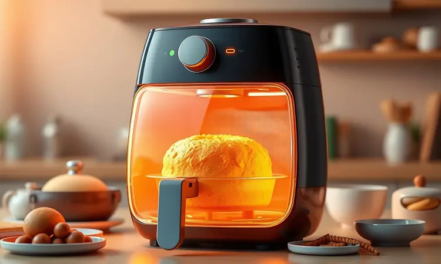
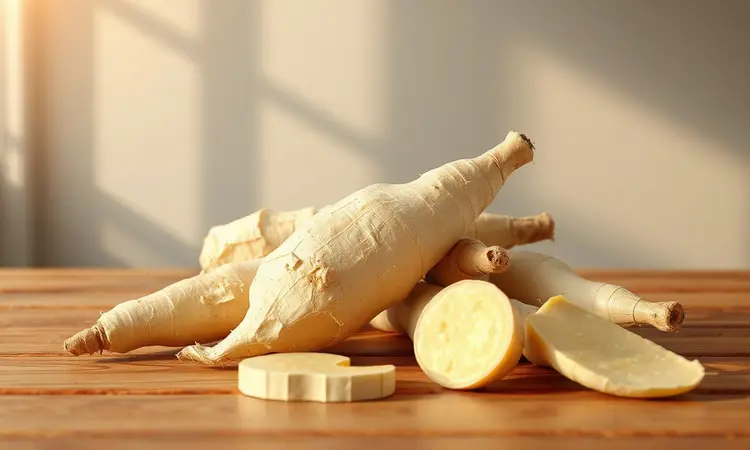
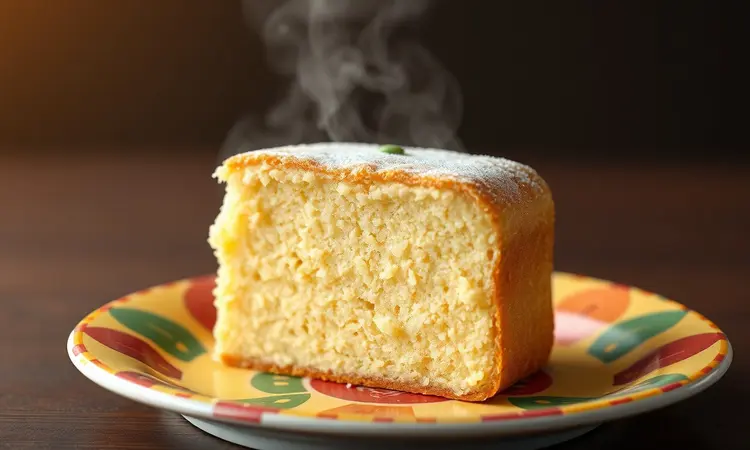

Quem não ama um bolo de mandioca quentinho acompanhado de um café recém-passado? Aquela combinação que nos transporta para as cozinhas de infância parece perfeita... até lembrarmos da espera pelo aquecimento do forno e das longas horas de cozimento.

Mas e se eu te disser que você pode ter essa experiência aconchegante em praticamente metade do tempo, usando uma ferramenta que já está na sua cozinha?

Bem-vindo ao mundo do bolo de mandioca na Air Fryer, onde tradição encontra praticidade para criar uma versão dourada, exuberantemente fofa e que vai conquistar o coração de todos à mesa.

<SummaryList products={frontmatter.top_products} />

## Por que Fazer Bolo de Mandioca na Air Fryer é uma Excelente Ideia?

Você já teve aquela vontade repentina de um bolo caseiro, mas desistiu ao pensar em ligar o forno e esperar quase uma hora? Essa frustração termina aqui.

A Air Fryer transformou a arte de assar bolos em algo quase mágico: ela captura toda a doçura e fofura da mandioca em um processo que respeita seu tempo. Pense na sensação de ter tudo pronto enquanto seu café ainda está sendo preparado.

Mais do que rapidez, você ganha consistência: o ar circulante envolve cada centímetro do bolo, criando uma crosta dourada perfeita ao redor de um interior úmido e macio.

E há um segredo que poucos contam: essa técnica demanda menos óleo, então cada fatia se torna, simultaneamente, uma indulgência e uma escolha consciente.

## Como Escolher a Mandioca Ideal (Aipim ou Macaxeira) para o Bolo Perfeito

Um bolo de mandioca excepcional começa muito antes da Air Fryer: começa na feira ou no mercado, com as raízes certas em suas mãos. Independentemente de você chamar de aipim, macaxeira ou mandioca, o que importa é sua vitalidade.

Procure por raízes firmes, com casca intacta e marrom claro, evitando aquelas com pontos escuros ou amolecimentos suspeitos. As mais grossas costumam ser generosas em polpa e mais pobres em fios, premiando você com uma massa mais homogênea.

E aqui está o conhecimento passado de geração em geração: a mandioca deve ser cozida até ficar macia ao garfo antes de ser processada.

Esse passo libera os amidos naturais, que se transformam no "colante" da receita, garantindo que seu bolo tenha estrutura, mas nunca densidade.

## Receita de Bolo de Mandioca na Air Fryer: Passo a Passo Simples e Rápido

Agora que temos ingredientes de qualidade, chegou o momento que você tanto espera: transformar essa mandioca simples em uma sobremesa memorável.

A beleza deste método está na sua simplicidade honesta: uma mistura sábia de elementos, alguns minutos de preparo e uma espera curta. O resultado é um bolo que parece ter saído de uma padaria artesanal, com sua casca dourada convidando para o primeiro corte.

### Ingredientes Necessários para a Massa Tradicional

Para um bolo que serve aproximadamente 8 pessoas, você precisará reunir:

*   500g de mandioca já cozida e ralada (esse é o coração da receita)

*   2 xícaras de açúcar cristal

*   4 ovos em temperatura ambiente

*   1/2 xícara de leite integral

*   1/2 xícara de óleo vegetal neutro

*   1 colher de sopa bem cheia de fermento em pó

Esta combinação, aparentemente básica, é a alquimia perfeita: a mandioca empresta sua umidade característica, os ovos e o óleo criam a maciez, o açúcar equilibra e o fermento dá aquele crescimento que enche os olhos.

### Modo de Preparo: Do Liquidificador à Fritadeira Sem Óleo

Comece colocando no liquidificador a mandioca ralada, os ovos, o açúcar e o leite. Bata até obter uma mistura lisa, quase cremosa, sem grumos de mandioca. Transfira essa massa para uma tigela maior, então polvilhe o fermento em pó por cima.

Com movimentos de baixo para cima, usando uma espátula, incorpore o fermento suavemente. O segredo aqui é não bater, apenas misturar, para preservar as bolhas de ar que vão garantir a fofura.

Despeje a mistura em sua forma preparada (escolhemos a ideal para você nas seções abaixo) e nivele a superfície.

Leve à Air Fryer preaquecida a 180°C. Deixe assar por 30 minutos, mas faça o teste clássico: insira um palito de dente no centro do bolo. Se sair limpo, está pronto. Caso contrário, dê mais 3 a 5 minutos e teste novamente.

Ao retirar, deixe descansar na forma por 10 minutos antes de desenformar. Essa pausa é crucial: ela permite que a estrutura do bolo se firme, garantindo que ele saia inteiro e lindo.

## 5 Segredos de Especialista para o Bolo de Mandioca Não Ficar Solado na Air Fryer

O fantasma de um bolo pesado e compacto assombra muitos cozinheiros. Mas ele nunca mais vai visitar sua cozinha se você seguir estas orientações:

1.  **Mandioca bem cozida é não negociável:** Ela precisa estar tão macia que um garfo penetre sem resistência. Isso garante que os amidos estejam completamente gelatinizados, criando a liga perfeita na massa.

2.  **O teste do palito é seu melhor amigo:** Resista à tentação de abrir a Air Fryer antes dos 25 minutos. Cada abertura faz a temperatura cair drasticamente, podendo fazer o bolo murchar. Confie no palito após o tempo sugerido.

3.  **Incorpore ar logo no início:** Bata os ovos com o açúcar por 3-4 minutos, até que a mistura fique clara e fofa. Esse ar é o que será expandido pelo fermento, criando a textura de nuvem.

4.  **Peneire até o que parece desnecessário:** Peneire o fermento em pó sobre a massa. Parece um gesto pequeno, mas ele elimina possíveis grumos que poderiam ficar crus no centro do bolo.

5.  **A paciência do desenforme:** Assim que sair do calor, o bolo ainda está em processo de terminar de cozinhar com o calor residual. Aguardar aqueles preciosos 10 minutos na forma faz toda diferença para a textura final.

## Variações que Você Precisa Provar: Bolo de Mandioca com Coco e Queijo

A tradição é maravilhosa, mas as inovações são deliciosamente tentadoras. Imagine o sabor terroso da mandioca encontrando a doçura tropical do coco e o toque salgado de um bom queijo. Para essa jornada, prepare a massa básica como descrito.

Quando for transferi-la para a tigela, adicione 1/2 xícara de coco ralado (se preferir úmido, para mais sabor, ou seco, para mais textura). Mexa para incorporar.

Para o toque genial, escolha um queijo que derreta bem mas não desapareça. O queijo coalho ralado é uma opção clássica e divina, ou experimente um parmesão para um sabor mais intenso. Adicione 1 xícara ao mesmo tempo que o coco.

A mágica acontece no forno: o coco distribui sua umidade por todo o bolo, enquanto o queijo forma pequenos bolsões salgados que contrastam perfeitamente com a doçura. Sirva ainda morno e observe os sorrisos de surpresa.

## Melhores Formas de Silicone para Assar Bolos na Air Fryer

<ProductBox 
  title={frontmatter.top_products[0].title} 
  image={frontmatter.top_products[0].image} 
  link={frontmatter.top_products[0].link} 
/>

A forma certa não é apenas um recipiente, é sua parceira para garantir que o calor circule de maneira uniforme e que o bolo desenforme com elegância.

As formas de silicone se tornaram as favoritas por vários motivos: são naturalmente antiaderentes (reduzindo a necessidade de untar), flexíveis para facilitar a remoção e, geralmente, vêm em tamanhos que se adaptam perfeitamente às dimensões da sua Air Fryer.

Para a maioria dos modelos domésticos, uma forma quadrada de 16cm ou redonda de 18cm de diâmetro funciona como um sonho. Procure sempre por silicone de grau alimentício, que suporte temperaturas de até 220°C sem transferir odores ou sabores.

Alguns modelos, como os da linha LYOR, oferecem até alças laterais que transformam a remoção do cesto quente em uma operação segura e sem sustos.

## Formas de Alumínio com Furo Central Compatíveis com Air Fryer

<ProductBox 
  title={frontmatter.top_products[1].title} 
  image={frontmatter.top_products[1].image} 
  link={frontmatter.top_products[1].link} 
/>

Se você busca um dourado mais tradicional e uniforme, as formas de alumínio com furo central são clássicos que funcionam perfeitamente na Air Fryer.

Esse design inteligente permite que o ar quente passe pelo centro do bolo, cozinhando-o de dentro para fora simultaneamente. Isso minimiza o risco de ter um exterior dourado demais e um interior ainda cru.

Para Air Fryers de 5 litros, uma forma de 20cm de diâmetro é a medida mais segura. Nos modelos de 3.5 litros, opte por 18cm ou 19cm. O alumínio é um excelente condutor de calor, então seu bolo responderá rapidamente às mudanças de temperatura.

Um detalhe importante: nunca coloque a forma diretamente no fundo do cesto. Use sempre o suporte ou cesto que vem com o aparelho para garantir que o ar circule por baixo também.

## Tempo e Temperatura Ideal: Como Ajustar para Diferentes Modelos de Fritadeira

Cada Air Fryer tem sua personalidade, influenciada por potência, sistema de circulação de ar e até pela altitude da sua cidade. Por isso, trate os 180°C por 30 minutos como seu ponto de partida, não como uma lei imutável.

Se você notar que o topo do bolo está ficando marrom muito rápido, mas o palito ainda não sai limpo, reduza a temperatura para 160°C e continue assando, verificando a cada 5 minutos.

Ajustar se torna intuitivo depois da primeira tentativa. Anote o que funcionou para seu modelo específico. Essa personalização é justamente o que transforma uma receita genérica em "a sua receita", aquela que sempre dá certo e que você compartilha com confiança.

## Benefícios Nutricionais da Mandioca para sua Dieta

Enquanto saboreia cada pedaço, é reconfortante saber que você está nutrindo seu corpo com uma raiz genuinamente poderosa. A mandioca é uma fonte de carboidratos complexos, que lhe fornecem energia de liberação gradual, evitando os picos e quedas dos açúcares refinados.

Suas fibras trabalham silenciosamente, promovendo uma digestão saudável e aquela sensação de saciedade que evita beliscar entre refeições.

Ela é naturalmente isenta de glúten, abrindo as portas para celebrações inclusivas onde todos podem participar.

Os minerais presentes, como cálcio para os ossos, ferro para o sangue e magnésio para os nervos, transformam este bolo de simples sobremesa em um alimento que, com moderação, pode fazer parte de uma rotina equilibrada.

## Perguntas Frequentes (FAQ) sobre Bolo na Air Fryer

### Pode colocar forma de vidro ou cerâmica na Air Fryer?

Sim, é possível, mas com o cuidado que qualquer ferramenta de alta temperatura merece. O vidro temperado (como o das formas Pyrex) e a cerâmica de boa qualidade geralmente suportam bem o calor da Air Fryer.

Antes de usar, confirme no fundo da peça ou no manual se há indicação de resistência a pelo menos 200°C. O formato também importa: prefira formas mais baixas e largas do que altas e estreitas, para não bloquear a circulação do ar.

Usar esses materiais pode render um bolo com uma apresentação linda para servir diretamente à mesa.

### Como saber se o bolo está pronto sem murchar a massa?

A dúvida de todo padeiro iniciante: abrir para verificar pode arruinar tudo. A técnica infalível é uma combinação de tempo, observação e uma ferramenta simples. Primeiro, respeite pelo menos 80% do tempo sugerido antes de fazer qualquer verificação.

Em segundo lugar, observe a cor: um dourado uniforme na superfície é um bom indicativo. Por fim, o palito de dente (ou uma faca fina) é seu juiz imparcial. Insira no centro, retire. Se sair com migalhas ou massa úmida, precisa de mais tempo. Limpo? Perfeição alcançada.

Lembre-se: na dúvida, é melhor mais 3 minutos do que um bolo cru no centro.

## Conclusão

O que começou como uma simples receita se transforma em algo maior: a redescoberta de que a tradição pode se encaixar perfeitamente na vida moderna.

A Air Fryer, muitas vezes vista apenas para frituras mais leves, revela-se uma aliada surpreendente para resgatar o prazer de um bolo caseiro, daqueles que aquecem a casa com seu aroma e reúnem as pessoas ao redor da mesa.

Você não precisa mais escolher entre sabor e praticidade.

Com a mandioca como protagonista nutritiva e a Air Fryer como ferramenta inteligente, cada café da manhã, lanche da tarde ou sobremesa especial pode ser embelezado com esse gesto de carinho que é cozinhar para si e para os outros.

As variações estão lá, esperando para serem exploradas. As formas e os ajustes técnicos já não são mistérios, apenas detalhes que você domina.

Então, respire fundo o aroma que em breve tomará conta da sua cozinha, sirva a primeira fatia ainda morna e deixe que esse bolo de mandioca seja mais do que uma sobremesa: seja a prova de que o que é bom pode ser também simples, rápido e profundamente satisfatório.

Sua próxima lembrança deliciosa está a apenas uma massa de distância.