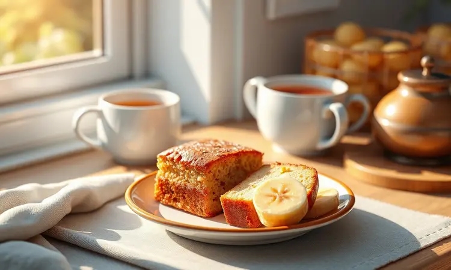
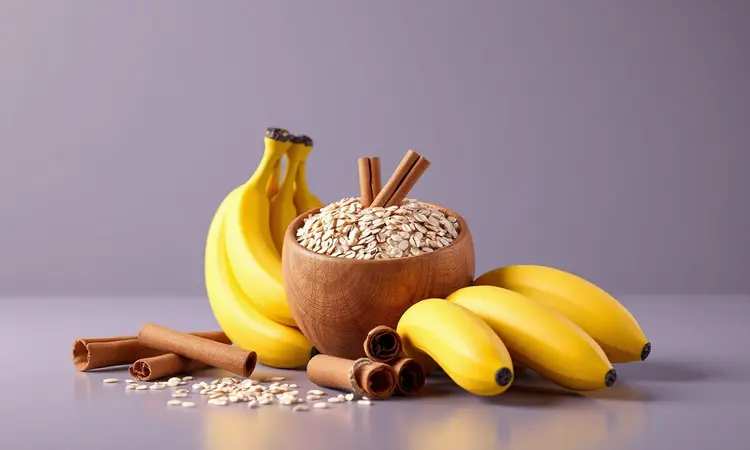
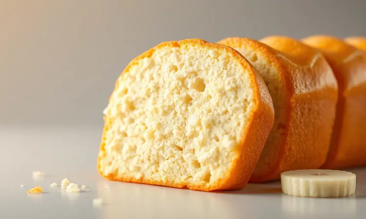

Imagine a cena: você investe em ingredientes saudáveis para fazer um bolo, esperando aquela fofura e umidade, mas o resultado é uma massa seca e solada. A frustração bate, junto com aquela sensação de tempo desperdiçado.

Agora, feche os olhos e visualize um bolo de banana com aveia saindo da airfryer: perfeito por fora, fofinho e úmido por dentro, pronto em metade do tempo que levaria no forno convencional. Como isso seria para sua rotina?

<SummaryList products={frontmatter.top_products} />

## Bolo de Banana com Aveia na Airfryer: Receita Fofinha, Fit e Rápida

A magia começa com ingredientes que provavelmente já estão na sua cozinha: bananas que ganharam aquelas pintinhas escuras perfeitas para adoçar naturalmente, aveia em flocos transformando-se em uma massa acolhedora, ovos dando estrutura e um fio de mel ou adoçante natural para equilibrar tudo.

Misture esses elementos até formar uma textura homogênea que parece prometer algo especial.

Essa mistura vai para uma forma que cabe na sua airfryer e, em apenas 25 a 30 minutos a 160°C, você tem em mãos não apenas um bolo, mas uma solução inteligente para café da manhã ou lanche da tarde. O melhor?

Cada banana madura que ia para o lixo agora vira um investimento em saúde e sabor.

## Por que fazer bolo de banana na Airfryer é a melhor opção para sua rotina?

Pense na sua rotina mais agitada. Agora imagine preparar um bolo saudável sem aquela espera interminável pelo forno esquentar, sem a ansiedade de estar muito seco ou cru por dentro.

A airfryer entrega essa praticidade: cozinha rápido, mantém a temperatura constante e, por ironia do destino, muitas vezes resulta em um bolo mais fofinho que o tradicional. E não para por aí.

Você economiza energia, limpa em minutos e transforma ingredientes simples em algo que nutre de verdade. É o tipo de ferramenta que torna o saudável não apenas possível, mas conveniente.

## Receita Passo a Passo: Bolo de Banana com Aveia Integral

Por ser tão prática, essa receita se torna um ritual simples. Amasse duas bananas maduras até obter uma textura cremosa. Adicione um ovo, uma xícara de aveia integral, uma colher de sopa de mel ou seu adoçante preferido e uma pitada generosa de canela.

Misture com carinho até tudo se transformar em uma massa que promete acolhimento. Transfira para uma forma que caiba na sua airfryer e deixe o aparelho trabalhar por 25 a 30 minutos a 180°C.

O resultado aparece não apenas no paladar, mas na sensação de ter criado algo nutritivo sem complicação.

### Ingredientes selecionados para máxima nutrição

As bananas maduras não são apenas a base doce, são uma fonte de potássio e fibras que conversam direto com seu bem-estar. Já a aveia integral, com seus carboidratos complexos, trabalha para manter a saciedade e dar energia sustentada.

Para o toque doce, o mel traz umidade e profundidade, enquanto opções como eritritol ou stevia mantêm o sabor sem as calorias. E se sua dieta é vegana, saiba que leites vegetais e substitutos de ovos à base de sementes funcionam perfeitamente.

Cada ingrediente foi pensado para nutrir tanto o corpo quanto o momento em que você vai desfrutar desse bolo.

### Modo de preparo simplificado e direto ao ponto

Pegue essas bananas amassadas e misture com o ovo, a aveia, o mel e a canela. Não precisa de batedeira ou técnicas complicadas: uma colher e um pouco de movimento circular bastam.

Quando a massa estiver uniforme, coloque na forma certa para sua airfryer e programe 160°C por 25 minutos. O teste do palito é seu melhor aliado: enfie no centro e, se sair limpo ou com migalhas secas, está pronto.

Aguarde esfriar um pouco antes de desenformar, e prepare-se para um lanche que parece mais carinho do que simplesmente comida.

## 5 Segredos para o seu Bolo de Aveia ficar fofinho e não solar

Segredo número 1: as bananas precisam daquelas pintinhas escuras que parecem dizer 'estou no ponto certo doce'. Segredo 2: escolha aveia em flocos finos, que se incorpora como um abraço à massa.

O terceiro segredo é gentil peneirar os ingredientes secos, criando pequenos bolsões de ar que garantem leveza. Quarto ponto: bata os ingredientes com intenção, incorporando ar que vai se transformar em fofura no forno.

Por fim, respeite a temperatura e o tempo da sua airfryer específica. Cada aparelho tem sua personalidade, e conhecê-la evita que o bolo passe do ponto e perca sua magia.

## Qual a melhor forma para usar na Airfryer? (Tamanhos e Materiais)

<ProductBox 
  title={frontmatter.top_products[0].title} 
  image={frontmatter.top_products[0].image} 
  link={frontmatter.top_products[0].link} 
/>

Depois de dominar os segredos da massa, a forma certa garante que tudo saia perfeito. Materiais como silicone são seus melhores amigos: flexíveis, fáceis de limpar e que liberam o bolo com um simples apertar.

O vidro refratário tem a vantagem de deixar você ver o dourado se formando, enquanto cerâmicas e porcelanas refratárias entregam distribuição uniforme de calor. Evite plásticos comuns, que não entendem o calor intenso da airfryer.

Quanto ao tamanho, pense na circulação de ar. A forma precisa caber na cesta sem sufocar o espaço por onde o calor circula. Se for muito grande, o ar não chega ao centro e seu bolo pode nascer desigual.

Deixe sempre uma margem para que ele cresça, como quem dá espaço para algo bom se desenvolver.

## Substituições Inteligentes: Mel, Açúcar Mascavo ou Adoçante Culinário?

Cada adoçante escreve uma história diferente no seu bolo. O mel traz a doçura ancestral, umidade extra e aquele sabor profundo que lembra florais, mas pede moderação por ser mais calórico.

O açúcar mascavo conta uma história de caramelo suave e menos processamento, mantendo nuances de melaço que branqueamento tiraria. Já os adoçantes culinários (stevia, eritritol) são a escolha de quem busca a doçura sem o impacto no açúcar no sangue.

A decisão não é apenas técnica, mas sobre qual experiência você quer criar a cada fatia.

## Farelo de Aveia vs. Farinha de Aveia: Qual a diferença no resultado final?

Essa escolha define a personalidade do seu bolo. O farelo vem da casca externa do grão, cheio de fibras que dão uma certa crocância e densidade nutritiva. Pense em um bolo que alimenta com cada mordida, com textura mais marcante.

A farinha de aveia, por outro lado, é o grão inteiro moído, criando partículas tão finas que resultam em uma maciez quase etérea. Seu bolo nasce leve, fofinho e suave. Qual dos dois?

Depende se você busca um abraço mais robusto e cheio de fibras ou um carinho leve que derrete na boca.

## Variações Deliciosas: Adicione Nozes, Maçã ou Gotas de Chocolate

<ProductBox 
  title={frontmatter.top_products[1].title} 
  image={frontmatter.top_products[1].image} 
  link={frontmatter.top_products[1].link} 
/>

A base já é maravilhosa, mas que tal personalizar? Nozes picadas trazem aquele contraste crocante e um sabor amadeirado que conversa lindamente com a banana. Maçãs raladas ou em cubos acrescentam doçura natural e uma umidade extra que faz o bolo durar mais.

E as gotas de chocolate... bem, elas transformam qualquer ocasião em um pequeno festim. Combinações são bem-vindas. Imagine nozes, maçã e umas poucas gotas de chocolate juntas. O bolo se torna uma experiência de camadas e surpresas.

Lembre-se apenas de que cada adição pode alterar levemente o tempo de cozimento, mas a recompensa em sabor sempre vale o ajuste.

## Como saber se o bolo está assado por dentro sem deixar murchar?

<ProductBox 
  title={frontmatter.top_products[2].title} 
  image={frontmatter.top_products[2].image} 
  link={frontmatter.top_products[2].link} 
/>

Aquele momento de verdade: será que está pronto? Primeiro, resista à tentação de abrir a airfryer nos primeiros 20 minutos. O choque térmico pode fazer o bolo murchar antes de se firmar. Depois desse tempo, faça o clássico teste do palito.

Insira um palito de dente bem no centro. Se sair limpo ou com algumas migalhas secas, é sinal de que o coração do bolo está perfeito. Se ainda tiver massa grudada, mais alguns minutos são necessários.

Outros sinais te ajudam: o aroma doce que invade a cozinha, o tom dourado que se forma na superfície. Cada airfryer tem seu ritmo, então conheça a sua. Com prática, você desenvolverá um sexto sentido para o ponto exato.

## Dicas de Conservação: Como manter o bolo úmido por mais dias

<ProductBox 
  title={frontmatter.top_products[3].title} 
  image={frontmatter.top_products[3].image} 
  link={frontmatter.top_products[3].link} 
/>

Depois de tanto cuidado no preparo, manter o bolo perfeito é parte da arte. Deixe esfriar completamente antes de guardar, assim evita que a umidade se condense e crie mofo.

Em temperatura ambiente, um recipiente hermético ou um bom envolvimento em filme plástico mantém tudo fresco por até 2 dias. Para estender a vida, a geladeira é seu aliado: até uma semana conservando textura e sabor.

E se quiser ter sempre uma fatia à mão, congele em porções individuais. Assim, quando a vontade bater, você descongela exatamente o que vai consumir.

Corte apenas as fatias necessárias, mantendo o restante protegido do ar, e seu bolo recompensará você com frescor por muito mais tempo.

## FAQ: Dúvidas frequentes sobre bolos saudáveis na Airfryer

Essa ferramenta versátil gera perguntas que merecem respostas claras. Sim, bolos ficam incrivelmente fofinhos na airfryer. A circulação de ar quente envolve a massa uniformemente, criando uma textura que muitas vezes supera a do forno tradicional.

Sobre substituições: a farinha de aveia realmente funciona no lugar da farinha de trigo, trazendo mais fibras e um perfil nutricional mais interessante. E quanto ao tempo? Geralmente entre 20 e 30 minutos, mas sempre confirme com o teste do palito.

Sua airfryer específica vai ditar o ritmo final.

## Conclusão

O bolo de banana com aveia na airfryer é muito mais que uma receita. É uma declaração de que saudável pode ser prático, rápido e profundamente saboroso.

É a prova de que ingredientes simples, quando tratados com respeito, criam momentos especiais sem exigir horas na cozinha.

Desde a escolha da banana certa até o teste do palito que garante a perfeição, cada etapa é um convite a cozinhar com mais consciência e menos complicação. Se você já enfrentou a frustração de bolos secos ou solados, essa receita chega como uma solução elegante.

Ela respeita seu tempo, nutre seu corpo e alegra seu paladar. Por que não experimentar hoje mesmo? A airfryer está aí, as bananas maduras também. O resultado será não apenas um bolo, mas a confiança de que cozinhar saudável pode ser simplesmente delicioso.