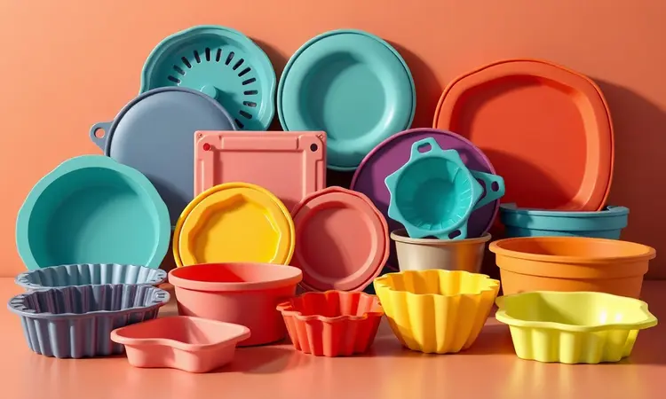
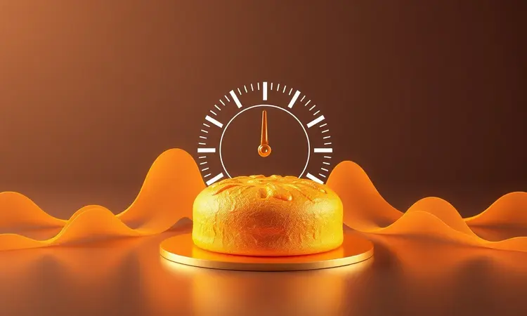
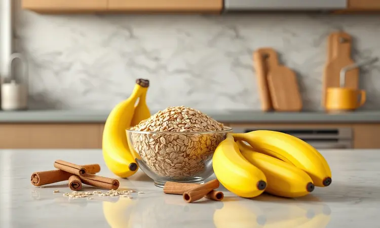

Imagine aquela vontade de um bolo caseiro que surge no meio da tarde, mas a ideia de ligar o forno convencional e esperar o pré-aquecimento te faz desanimar.

O que pouca gente sabe é que existe um caminho mais simples, rápido e surpreendente: transformar sua Air Fryer em uma verdadeira confeitaria.

E quando o ingrediente principal são aquelas bananas que estão amadurecendo mais rápido do que você consegue comer, você tem em mãos a combinação perfeita.

É isso que vou mostrar neste guia: como dominar o bolo de banana na Air Fryer com uma receita que promete fofura, dourado perfeito e praticidade que cabe na sua rotina mais corrida.

<SummaryList products={frontmatter.top_products} />

## Por que Fazer Bolo de Banana na Air Fryer Vale a Pena?

Pense em acordar com o cheiro de bolo fresquinho sem precisar planejar com antecedência. Com a Air Fryer, você pula o passo mais demorado da receita: a espera pelo forno aquecer.

Enquanto o forno convencional pode levar até 20 minutos só para chegar na temperatura certa, sua fritadeira elétrica fica pronta em questão de minutos, como se estivesse ansiosa para começar o trabalho. Mas a magia não para por aí.

O resultado é um bolo que mantém toda a umidade característica da banana, com uma casquinha dourada que se forma graças à circulação inteligente do ar quente.

A redução natural de óleo transforma a experiência em algo mais leve, sem aquele peso no estômago que às vezes vem com as receitas tradicionais. E a melhor parte: a limpeza é tão simples quanto preparar.

Enquanto você saboreia a última fatia, os únicos utensílios que precisam lavar são uma tigela e a forma que usou.

## Utensílios Essenciais: Qual Forma Pode Ir na Air Fryer?

Agora que você já viu os benefícios, vamos ao detalhe que faz toda diferença entre um bolinho perfeito e uma decepção na cozinha: escolher a forma certa.

Pense nela como o parceiro ideal da sua Air Fryer, garantindo que o calor se distribua uniformemente e que o desenforme seja descomplicado.

As formas devem suportar altas temperaturas, por isso materiais como silicone, vidro refratário e cerâmica são suas melhores aliadas. Metais podem interferir no aquecimento e nunca são uma boa ideia. Mas como saber qual escolher? Deixe-me explicar suas opções.

### Kit de Formas de Silicone para Air Fryer

<ProductBox 
  title={frontmatter.top_products[0].title} 
  image={frontmatter.top_products[0].image} 
  link={frontmatter.top_products[0].link} 
/>

Imagine conseguir, com um único investimento, desenformar seu bolo com um simples toque dos dedos, sem lâminas afiadas ou espátulas que podem despedaçar sua criação. É exatamente isso que um bom kit de formas de silicone oferece.

Feitas de silicone antiaderente de grau alimentício, elas não são apenas seguras para altas temperaturas, mas também se tornam uma extensão criativa da sua cozinha.

Kits variam bastante: alguns trazem formatos quadrados ideais para brownies, redondos perfeitos para bolos tradicionais, e até modelos mais profundos para receitas que levam recheio.

Escolher um com variedade significa ter liberdade para experimentar, mas cuidado: nem todos os kits incluem todas as opções que você imaginava.

O verdadeiro benefício emocional vem na hora da limpeza. Em vez de esfregar por minutos, você simplesmente passa água e sabão, e os resíduos soltam quase sozinhos.

Além disso, elas protegem o cesto da sua Air Fryer de respingos que podem encurtar a vida útil do aparelho.

### Formas de Alumínio e Antiaderentes Compatíveis

<ProductBox 
  title={frontmatter.top_products[1].title} 
  image={frontmatter.top_products[1].image} 
  link={frontmatter.top_products[1].link} 
/>

Se você já tem formas em casa e quer testar antes de investir em novas, o alumínio pode ser sua salvação. Elas aquecem rápido e distribuem bem o calor, criando um ambiente ideal para o crescimento do seu bolo de banana.

A maioria se encaixa perfeitamente no cesto, mas aqui vai uma diga preciosa: sempre faça um teste com água antes.

Sim, isso mesmo. Coloque um pouco de água na forma e ligue a Air Fryer em temperatura baixa por alguns minutos. Se a forma não empenar e a água não evaporar instantaneamente, é um bom sinal.

O mesmo cuidado vale para as antiaderentes de metal revestido: elas oferecem praticidade na limpeza, mas verifique se o revestimento está intacto.

Jamais use plástico. A imagem da sua forma derretendo e arruinando não só o bolo, mas possivelmente a Air Fryer, é suficiente para fazer valer cinco minutos de verificação prévia.

## Receita de Bolo de Banana na Air Fryer (Passo a Passo)

Chegou a hora das mãos na massa, literalmente. Esta receita foi pensada para quem quer resultados garantidos na primeira tentativa, com medidas simples que você provavelmente já tem na despensa.

### Lista de Ingredientes Selecionados

O segredo está na simplicidade. Você precisará de:

- 3 bananas bem maduras (aquelas que já estão com pontinhas marrons são as melhores)

- 1 ovo

- 1/3 de xícara de açúcar (pode ser reduzido se suas bananas estiverem bem doces)

- 2 colheres de sopa de óleo

- 1 xícara de farinha de trigo

- 1 colher de sopa de fermento em pó

- Pitada de canela (opcional, mas transforma o sabor)

As bananas maduras não são apenas um ingrediente, elas são sua garantia de doçura natural e textura úmida. Se você alguma vez pensou em jogá-las fora por estarem passadas, saiba que elas estão no ponto perfeito para essa receita.

### Modo de Preparo Detalhado

Primeiro, esquente sua Air Fryer a 180°C. Enquanto ela aquece, que tal aproveitar para preparar o bolinho? Em uma tigela, amasse as bananas até formar um purê quase líquido. Quanto mais homogêneo, mais uniforme será a doçura em cada mordida.

Adicione o ogo e misture vigorosamente. Você pode fazer isso com um garfo, sem necessidade de batedeira. O que queremos aqui é incorporar ar, criar leveza. Em seguida, vá acrescentando a farinha, o açúcar e o óleo, mexendo sempre no mesmo sentido.

O toque final: a canela. Uma pitada parece pouco, mas ela tem o poder de trazer calor e profundidade ao sabor da banana. Misture delicadamente o fermento por último, apenas o suficiente para incorporar.

Despeje a massa na forma que você já testou e conhece. Coloque na Air Fryer e deixe a mágica acontecer por 25 minutos. O teste do palito é seu melhor amigo: insira no centro e, se sair limpo, está pronto. Se ainda houver massa úmida, dê mais 5 minutos.

## O Segredo do Tempo e Temperatura Ideal para Não Solar

Este é o momento onde muitos bolos são perdidos, mas com você será diferente. A palavra 'solar' pode parecer técnica, mas na prática significa aquele fundo queimado enquanto o topo ainda está quase cru.

Na Air Fryer, isso acontece quando o calor vem apenas de uma direção.

A faixa de 160°C a 180°C não é aleatória. Ela representa a zona de conforto onde o calor circula sem agredir a massa. Se fosse mais baixo, o bolo não cresceria direito.

Se fosse mais alto, a casca se formaria rápido demais, aprisionando a umidade e criando o temido solado.

Os 20 a 30 minutos de cozimento não são uma sugestão, mas uma estratégia. Os primeiros 15 minutos são sagrados: não abra a Air Fryer. Esse é o tempo que a estrutura do bolo precisa para se firmar. Depois disso, comece a fazer o teste do palito a cada 5 minutos.

Lembre-se: cada Air Fryer tem sua personalidade. A primeira vez é um teste, da segunda em diante você já será especialista.

## Variação Fit: Bolo de Banana com Aveia e Sem Açúcar na Air Fryer

E se eu dissesse que é possível transformar essa receita em um aliado do seu bem-estar sem abrir mão do sabor? A versão com aveia e sem açúcar é exatamente isso: uma prova de que saudável pode ser delicioso.

Substitua a farinha de trigo por aveia em flocos na mesma proporção. Sim, apenas isso.

As bananas maduras já fornecem toda a doce que você precisa, e a aveia traz uma textura diferente, mais encorpada, e todas as fibras que vão fazer você se sentir satisfeito por mais tempo.

A canela se torna ainda mais importante aqui, pois realça a doçura natural. O resultado é um bolo que parece ser mais denso, mas na verdade é incrivelmente macio por dentro, com uma crosta crocante que se forma graças à circulação do ar.

Sirva com uma colher de iogurte natural e você terá um café da manhã ou lanche da tarde que nutre sem pesar.

## 5 Dicas de Especialista para um Bolo Sempre Fofinho

Depois de anos testando e errando, cheguei a pontos que fazem a diferença entre um bolo bom e um bolo memorável:

1. **Bananas que parecem prestes a virar compostagem** - Quanto mais maduras, mais doces e úmidas. Elas são seu açúcar e seu óleo natural.

2. **O ritual da peneira** - Peneirar farinha com fermento não é frescura. É incorporar ar microscópico que se expandirá sob o calor, criando aquela fofura que você sonha.

3. **Bater líquidos como se estivesse criando nuvens** - Os ovos e óleo merecem atenção. Bata até notar pequenas bolhas subindo à superfície. Isso é aeração em ação.

4. **O segredo do iogurte** - Uma colher de sopa de iogurte natural na massa faz milagres na umidade. É como dar ao bolo uma reserva extra de maciez.

5. **Paciência com a porta** - Nos primeiros 15 minutos, a tentação de checar é grande. Resista. Esse tempo é crucial para a estrutura se formar sem colapsar.

## Erros Comuns que Você Deve Evitar ao Assar na Air Fryer

Vamos falar sobre o que pode dar errado, para que com você só dê certo. O primeiro erro é ignorar o pré-aquecimento. Sua Air Fryer precisa chegar na temperatura certa antes de receber a forma, caso contrário, o bolo começará a cozinhar de forma desigual.

Forma errada é o segundo ponto crítico. O metal funciona bem, mas deve ser testado. O plástico é proibido absoluto. E o tamanho importa: se a forma encostar nas paredes do cesto, o ar não circula e você terá um bolo mal assado nas laterais.

Encher a forma em excesso é um convite para transbordamentos e bagunça. Deixe pelo menos 2cm da borda livre. E por último, considere que cada Air Fryer é única. O tempo que funciona na sua vizinha pode ser diferente na sua.

Faça o teste do palito e confie nele mais do que no relógio.

## Melhores Modelos de Air Fryer para Receitas de Confeitaria

<ProductBox 
  title={frontmatter.top_products[2].title} 
  image={frontmatter.top_products[2].image} 
  link={frontmatter.top_products[2].link} 
/>

Se você está pensando em investir em uma Air Fryer que seja parceira na confeitaria, alguns modelos se destacam. A Philco PFR2200 é uma versátil que faz o trabalho de fritadeira, forno e até desidratador.

Com 12 litros e grades ajustáveis, ela oferece espaço suficiente para bolos maiores e controle preciso de temperatura.

Outra opção interessante é a Oster OFRT780, também com 12 litros, que se destaca pelo controle de temperatura essencial para receitas que precisam de precisão, como os bolos.

Sim, elas ocupam mais espaço na bancada, mas pense na liberdade: uma única máquina que substitui vários aparelhos, sempre pronta para suas criações culinárias.

## Perguntas Frequentes sobre Bolo na Air Fryer (FAQ)

É natural ter dúvidas quando se começa uma nova técnica. A mais comum é sobre o tempo: varia entre 25 e 40 minutos, dependendo mais da quantidade de massa do que da receita em si.

Adaptar receitas tradicionais exige um ajuste na quantidade de líquido. Como a Air Fryer circula ar quente, massas muito líquidas podem não assar por dentro.

Reduza levemente leite, iogurte ou óleos, e faça um teste com uma pequena porção antes de preparar o bolo inteiro.

E sim, cada modelo tem seu jeito. A primeira receita é sempre uma descoberta. Anote o tempo que funcionou para você e, na próxima, já começará com essa vantagem.

## Conclusão

O que começou como curiosidade sobre bananas maduras e um aparelho que muitos usam apenas para fritar, transforma-se em uma habilidade culinária que cabe na rotina mais corrida.

O bolo de banana na Air Fryer é mais do que uma receita: é a prova de que praticidade não precisa sacrificar sabor, que saudável não precisa ser sem graça, e que qualquer pessoa pode se tornar seu próprio confeiteiro.

Imagine as próximas manhãs com o cheiro de bolo fresco sem o trabalho de limpar um forno inteiro. Visualize suas bananas que estão quase passando do ponto ganhando novo propósito.

Sinta a satisfação de dominar uma técnica que impressiona familiares e amigos, mostrando que você descobriu um truque que poucos conhecem.

Da primeira tentativa à centésima, cada bolinho será uma pequena vitória. Uma fatia de autonomia na cozinha, uma prova de que tecnologia e tradição podem andar juntas, criando momentos doces e memoráveis.

Agora é com você: pegue suas bananas, escolha sua forma favorita, e deixe que sua Air Fryer mostre do que é capaz. O primeiro bolo está esperando por você.