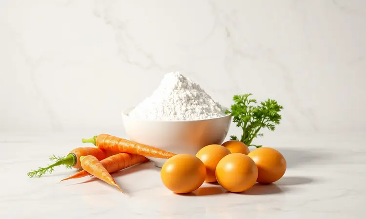
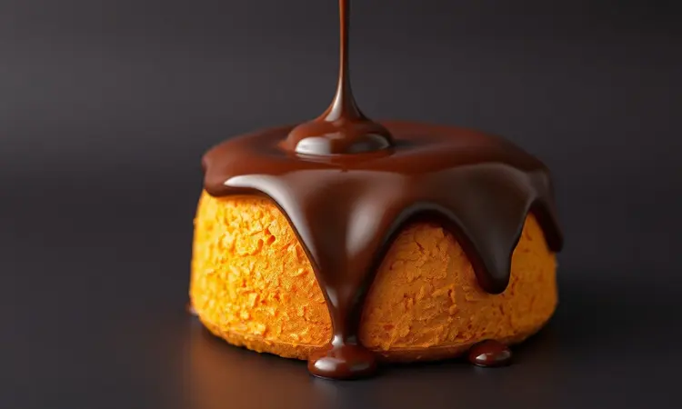
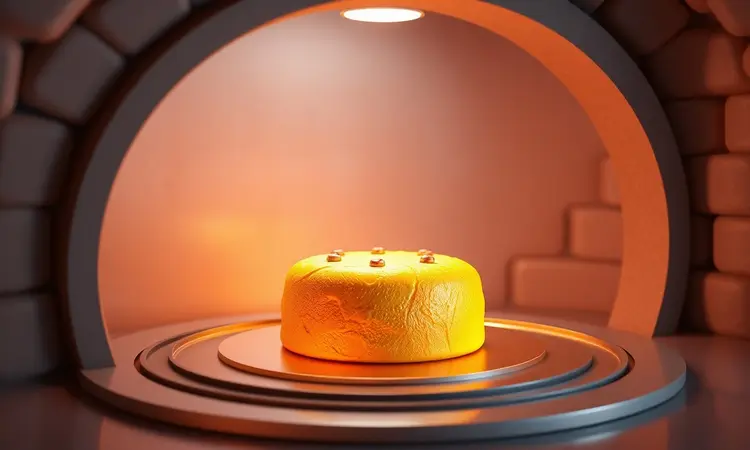

Você adora bolo de cenoura, mas desanima só de pensar em pré-aquecer o forno convencional para uma receita pequena? Fazer bolo de cenoura na Air Fryer é a solução definitiva para quem busca praticidade, economia de energia e um resultado surpreendentemente fofinho.

Neste guia, vamos te mostrar não apenas a receita passo a passo, mas todos os segredos de tempo, temperatura e utensílios para que seu bolo nunca mais saia solado ou queimado. Prepare o café, porque o bolo perfeito está a apenas alguns minutos de distância.

<SummaryList products={frontmatter.top_products} />

## Por que fazer bolo de cenoura na Air Fryer? Vantagens e Praticidade

Imagine conseguir um bolo quentinho enquanto seu forno convencional ainda está na fase de aquecimento. Essa é apenas uma das maravilhas da Air Fryer.

Ela esquenta em minutos, circula o ar quente com perfeição para um cozimento uniforme (adeus, partes secas ou mal passadas) e ainda economiza energia. Sem contar que a maioria das receitas pede menos óleo, tornando seu doce mais leve. O melhor?

Depois de saborear sua criação, a limpeza é quase instantânea, sem aquela pilha de panelas que te faz reconsiderar a próxima leva de cupcakes.

## Ingredientes Necessários para uma Massa Leve e Equilibrada

O segredo de um bolo fofinho está na qualidade e proporção dos ingredientes. Você vai precisar:

- 3 cenouras médias (frescas e bem lavadas)

- 3 ovos

- 1 xícara de açúcar

- 1/2 xícara de óleo

- 2 xícaras de farinha de trigo

- 1 colher de sopa de fermento em pó

Essa combinação garante a umidade perfeita e a leveza que faz você querer repetir a fatia.

### As Melhores Formas para Bolo na Air Fryer: Silicone ou Alumínio?

<ProductBox 
  title={frontmatter.top_products[0].title} 
  image={frontmatter.top_products[0].image} 
  link={frontmatter.top_products[0].link} 
/>

Com os ingredientes separados, vamos ao recipiente que vai moldar sua criação. As formas de silicone são verdadeiras aliadas da praticidade. Flexíveis e super fáceis de limpar, elas praticamente jogam o bolo no seu prato.

Mas atenção: podem reter um pouquinho de umidade, o que pode afetar a crocância da base.

Já as formas de alumínio distribuem o calor com maestria, garantindo aquele dourado uniforme que faz qualquer bolo parecer profissional. Seu revestimento antiaderente também facilita a vida na hora de desenformar. O único cuidado?

Alguns modelos podem esquentar mais nas bordas, então recomendo usar luvas térmicas.

## Passo a Passo: Como Fazer Bolo de Cenoura na Air Fryer Sem Erros

Vamos à parte divertida. Primeiro, rale as cenouras finamente. Coloque no liquidificador com os ovos, o óleo e o açúcar, e bata até formar uma mistura homogênea e cremosa.

Em uma tigela separada, misture a farinha de trigo e o fermento. Despeje o conteúdo do liquidificador aos poucos, mexendo delicadamente com um fouet ou colher. Aqui está o truque: não bata demais! Misturar apenas até incorporar mantém o ar na massa e garante a fofura.

Enquanto você prepara a massa, pré-aqueça sua Air Fryer por 5 minutos a 180°C. Unte sua forma escolhida com manteiga e polvilhe farinha. Despeje a massa, deixando cerca de 2 dedos livres na borda para o crescimento.

Coloque na Air Fryer e ajuste para 160°C por 30 minutos. Faça o teste do palito nos últimos 5 minutos: se sair limpo, seu bolo está pronto!

### Qual a Melhor Air Fryer para Assar Bolos?

<ProductBox 
  title={frontmatter.top_products[1].title} 
  image={frontmatter.top_products[1].image} 
  link={frontmatter.top_products[1].link} 
/>

Se você está procurando um aliado perfeito para suas aventuras na confeitaria, alguns modelos merecem destaque. O Electrolux Air Fryer Oven 12L Digital tem uma função específica para bolos que simplifica tudo.

Seu painel digital elimina adivinhações de tempo e temperatura.

Para quem gosta de compartilhar ou faz receitas maiores, o Mallory Air Oven Unique 30L oferece espaço de sobra.

E mesmo modelos menores, como a Philco Air Fryer Oven 12L, podem entregar resultados incríveis, desde que você monitore o cozimento para evitar que o topo doure antes do interior.

## O Segredo da Calda de Chocolate: Versão Crocante e Versão Ganache

Enquanto seu bolo esfria, chegou a hora do toque final que transforma um simples bolo de cenoura em sobremesa de restaurante.

Para a versão crocante, derreta 200g de chocolate meio amargo em banho-maria e misture com 1/2 xícara de cobertura crocante. O contraste entre a maciez do bolo e a textura crocante é simplesmente viciante.

Prefere algo mais suave e luxuoso? A ganache é sua escolha. Aqueça 1/2 xícara de creme de leite (sem ferver) e despeje sobre 200g de chocolate meio amargo picado. Misture até ficar sedosa e brilhante.

Derrame sobre o bolo ainda morna para obter aquele efeito escorrido perfeito para fotos.

## Tempo e Temperatura: O Ajuste Ideal para Cada Modelo de Fritadeira

Essa é a chave para o sucesso: encontrar o ponto mágico da sua Air Fryer. A maioria funciona bem entre 160°C e 180°C, com tempos de 25 a 35 minutos. Mas cada aparelho tem sua personalidade.

Na primeira tentativa, recomendo começar com 160°C por 30 minutos. Faça o teste do palito aos 25 minutos. Se ainda sair com massa, continue por mais 5 minutos.

Esse pequeno ritual de descoberta vale ouro, porque uma vez que você encontra o ponto perfeito da sua máquina, todo bolo sai igualmente espetacular.

## 5 Erros Comuns que Fazem o Bolo Solar na Air Fryer (e Como Evitá-los)

1. **Pular o pré-aquecimento**: Parece insignificante, mas faz toda diferença na uniformidade do cozimento. Sempre espere aqueles 5 minutinhos mágicos.

2. **Escolher a forma errada**: Uma forma muito grande ou muito pequena altera completamente o resultado. A regra é simples: ocupe no máximo 2/3 da capacidade da Air Fryer.

3. **Excesso de mistura**: Quando você bate demais a massa depois de adicionar a farinha, o glúten se desenvolve excessivamente e o bolo fica borrachudo. Misture apenas até incorporar.

4. **Ignorar as particularidades do seu modelo**: A Air Fryer da sua amiga pode assar em 25 minutos, a sua pode precisar de 35. Conheça sua máquina.

5. **Cenoura mal ralada**: Pedaços grandes criam bolsões úmidos que afetam a textura. Rale finamente para uma distribuição uniforme.

## Dicas de Especialista para um Bolo Sempre Fofinho e Úmido

Ingredientes em temperatura ambiente são seu primeiro segredo. Ovos e manteiga frios não incorporam ar tão bem quanto os em temperatura ambiente.

Adicione uma colher de sopa de iogurte natural ou creme de leite à massa. Essa pequena quantidade de acidez e gordura faz milagres na umidade.

E o truque mais subestimado? Deixe o bolo esfriar completamente na forma antes de desenformar. O calor residual continua o processo de cozimento e estabiliza a estrutura.

## Perguntas Frequentes (FAQ) sobre Bolos na Fritadeira Elétrica

O bolo sempre gruda na forma. O que faço de errado?
Além de untar bem com manteiga ou óleo, polvilhe farinha ou use papel manteiga no fundo. Para formas de silicone, muitas vezes nem precisa untar.

Meu bolo sempre transborda. É muita massa?
Sim! Nunca encha a forma até a borda. Deixe pelo menos 2 dedos de espaço para o crescimento. Lembre-se: é melhor fazer dois bolos menores que um grande desastre.

Como sei se está realmente pronto?
O teste do palito nunca falha. Insira um palito de dente no centro do bolo. Se sair limpo ou com migalhas secas, está pronto. Se sair com massa úmida, precisa de mais tempo.

Posso dobrar a receita?
Depende da capacidade da sua Air Fryer. Em geral, não recomendo. É melhor fazer duas levas. O excesso de massa impede a circulação de ar e o bolo não assa uniformemente.

## Conclusão

Fazer bolo de cenoura na Air Fryer vai muito além de simples praticidade. É redescobrir o prazer de criar algo delicioso sem o estresse do forno tradicional, sem a pilha de louça para lavar e com a garantia de um resultado sempre fofinho e úmido.

Da escolha da forma ao ponto perfeito da calda, cada detalhe que compartilhamos é um convite para você transformar momentos simples em pequenas celebrações.

A Air Fryer democratiza a confeitaria caseira, tornando-a acessível mesmo para quem tem pouco tempo ou espaço na cozinha.

Então da próxima vez que a vontade de um bolo caseiro surgir, lembre-se: você tem tudo o que precisa para criar uma sobremesa que impressiona.

Ligue sua Air Fryer, respire o aroma da cenoura e do chocolate, e saboreie não apenas um bolo, mas a satisfação de ter dominado uma nova habilidade culinária. Sua próxima fatia está esperando.