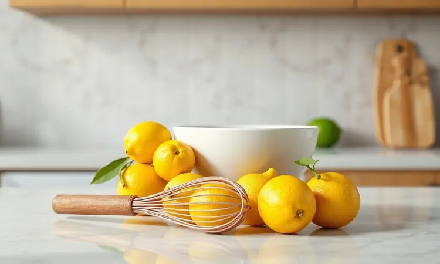

Imagine sair da correria do dia a dia e em menos de 30 minutos ter aquele aroma cítrico e convidativo de bolo de limão fresquinho tomando conta da sua cozinha.

É exatamente essa magia que você vai descobrir aqui: como transformar ingredientes simples em um bolo extremamente fofinho, aerado e com aquela crosta dourada perfeita, tudo feito na praticidade da sua airfryer.

Vamos desvendar juntos todos os segredos, desde a escolha da forma até a cobertura que vai fazer seus convidados pedirem a receita.

<SummaryList products={frontmatter.top_products} />

## Por que fazer Bolo de Limão na Airfryer é a Escolha Perfeita?

Você já ficou naquela ansiedade de esperar o forno convencional aquecer? Com a airfryer, essa espera praticamente desaparece.

Aquele fluxo intenso de ar quente não apenas acelera o processo, mas trabalha de uma forma única: envolve a massa por todos os lados, garantindo um crescimento uniforme e aquela textura incrivelmente fofinha que parece nuvem. E o melhor?

Tudo isso com muito menos óleo, transformando seu momento do café da tarde em uma experiência mais leve sem abrir mão do sabor. A facilidade de limpeza é apenas o bônus que torna todo o processo ainda mais prazeroso.

## Receita de Bolo de Limão na Airfryer: Passo a Passo Completo

Agora que você já conhece os benefícios, vamos colocar a mão na massa. A receita em si é simples, mas os detalhes fazem toda a diferença entre um bolo bom e um bolo memorável. Vamos começar reunindo tudo o que você precisa.

### Lista de Ingredientes para uma Massa Leve

Para criar essa delícia, você vai precisar de:

- 2 xícaras de farinha de trigo

- 1 xícara de açúcar

- 1/2 xícara de manteiga derretida (em temperatura ambiente)

- 1/2 xícara de leite

- 3 ovos

- Raspas e suco de 1 limão (escolha um limão firme para mais sabor)

- 1 colher de sopa de fermento em pó

Percebe como são ingredientes que você provavelmente já tem na despensa? Essa é a beleza da receita: simplicidade que se transforma em algo especial.

### Modo de Preparo: O Segredo da Mistura

Aqui mora o segredo do bolo fofinho. Em uma tigela maior, misture delicadamente a farinha, o açúcar e o fermento. Em outra, bata os ovos até ficarem bem claros e espumosos, depois acrescente o suco de limão, as raspas e a manteiga derretida, misturando até incorporar.

Agora vem o movimento mágico: despeje os ingredientes líquidos sobre os secos e mexa apenas até que não veja mais farinha branca. Pare nesse ponto! Misturar demais é o que deixa o bolo pesado.

Transfira essa massa promissora para a forma preparada e está na hora do passo final.

## Tempo e Temperatura Ideal para Não Errar

Aqui está a combinação que vai garantir sucesso: 160°C por 25 a 30 minutos. Por que essa temperatura mais baixa? Porque na airfryer o calor é mais intenso e direto.

Os 160°C permitem que o bolo cresça completamente por dentro antes que a parte externa fique muito dourada. Passados 25 minutos, faça o teste do palito: espete no centro do bolo e, se sair limpo, está pronto.

Se ainda sair com um pouco de massa, dê mais 3 a 5 minutos e teste novamente. Essa paciência extra garante que você nunca vai abrir a airfryer e encontrar um bolo cru por dentro.

## Melhores Formas e Acessórios para Bolo na Airfryer

<ProductBox 
  title={frontmatter.top_products[0].title} 
  image={frontmatter.top_products[0].image} 
  link={frontmatter.top_products[0].link} 
/>

A forma certa não é apenas uma questão de caber no aparelho, mas de como o ar quente vai circular ao redor da massa.

As formas de silicone são suas maiores aliadas: além de serem antiaderentes naturais (sem precisar untar com tanta gordura), sua flexibilidade faz o bolo sair inteirinho, sem quebrar.

Procure por modelos com 16 a 20 cm de diâmetro, que é o tamanho ideal para a maioria das airfryers.

Se preferir formas de metal, escolha as que têm furo central. Esse pequeno detalhe permite que o ar quente passe pelo meio do bolo, cozinhando de forma mais uniforme.

E para facilitar ainda mais, um spray de óleo aplicado rapidamente na forma vai garantir que nenhum pedacinho fique grudado.

## A Cobertura Perfeita: Calda Especial ou Mousse de Limão?

Enquanto seu bolo esfria (sim, é importante esperar um pouco!), você pode decidir o toque final. Para quem ama a combinação clássica, uma calda feita com açúcar e suco de limão levada ao fogo baixo até ficar brilhante é irresistível.

Ela penetra levemente na massa, criando pedacinhos mais úmidos e aquele contraste doce e ácido.

Agora, se você quer impressionar, a mousse de limão é sua escolha. Cremosa, leve e com um sabor cítrico intenso, ela transforma o bolo em uma sobremesa de restaurante. A melhor parte?

Ambas as opções levam menos de 10 minutos para preparar, então você pode inclusive fazer as duas e deixar cada convidado escolher seu favorito.

## Dicas de Ouro para um Bolo Sempre Fofinho e Molhadinho

Já aconteceu de seguir a receita à risca e o bolo ainda sair um pouco seco? Esses pequenos ajustes mudam tudo. Primeiro, certifique-se de que seus ovos, manteiga e leite estão em temperatura ambiente antes de começar.

Ingredientes frios não se incorporam bem à massa e podem comprometer a textura.

Durante a mistura, lembre-se: menos é mais. Mexa apenas até tudo estar combinado, mesmo que ainda veja algumas bolinhas pequenas na massa. Elas vão desaparecer durante o cozimento.

E aqui vai um segredo profissional: substituir metade do leite por iogurte natural adiciona uma cremosidade e umidade que fazem toda a diferença.

## Variações da Receita: Versão Fit e com Iogurte Natural

Se você está buscando uma opção mais leve, experimente trocar metade da farinha de trigo por farinha de aveia. O resultado é um bolo com textura interessante e um sabor levemente amendoado que combina perfeitamente com o limão.

Para reduzir o açúcar, você pode usar 3/4 de xícara de açúcar mascavo, que além de menos refinado, acrescenta notas de caramelo sutis.

A versão com iogurte natural é especialmente indicada para quem quer garantir aquela umidade que dura dias. O iogurte não apenas mantém o bolo macio por mais tempo, como seu leve azedo realça ainda mais o sabor cítrico do limão, criando um equilíbrio perfeito.

## 5 Erros Comuns que Impedem seu Bolo de Assar Corretamente

1. Pular o pré-aquecimento: Colocar a massa em uma airfryer fria significa que os primeiros minutos de cozimento serão desperdiçados apenas aquecendo o aparelho, não assando o bolo.

2. Forma muito cheia: Encher a forma além de 2/3 de sua capacidade é pedir para o bolo transbordar e fazer aquela sujeira difícil de limpar no cesto da airfryer.

3. Abrir a airfryer antes da hora: Cada vez que você abre para "espiar", perde calor e umidade, comprometendo o crescimento uniforme.

4. Ignorar o teste do palito: Contar apenas com o tempo indicado na receita é arriscado, pois cada airfryer tem pequenas variações. O palito nunca mente.

5. Desenformar quente: A ansiedade de ver o bolo pronto pode fazer você tentar tirá-lo da forma imediatamente. Espere 10 minutos para ele firmar e sair perfeito.

## Perguntas Frequentes (FAQ)

Você já deve ter algumas dúvidas específicas, então vamos direto às respostas mais procuradas.

### Posso usar farinha integral ou substitutos de açúcar?

A farinha integral funciona muito bem, mas vai alterar levemente a textura para algo mais denso e nutritivo. Para melhores resultados, use metade farinha branca e metade integral. Quanto ao açúcar, o mascavo é uma troca excelente que adiciona profundidade ao sabor.

Adoçantes como stevia também funcionam, mas ajuste a quantidade seguindo as instruções da embalagem, já que são muito mais potentes.

### O que fazer se o bolo crescer demais e encostar na resistência?

Se isso acontecer, não entre em pânico. Desligue a airfryer imediatamente e use uma espátula de silicone para afastar cuidadosamente o bolo da resistência. Na próxima vez, use uma forma um pouco maior ou reduza a massa em 1/4.

Lembre-se que o fermento precisa de espaço para trabalhar, e na airfryer o crescimento pode ser mais vigoroso que no forno tradicional.

### Preciso pré-aquecer a airfryer para fazer bolo?

Essa é uma questão que divide opiniões, mas a experiência mostra que o pré-aquecimento faz diferença sim. Apenas 3 a 5 minutos a 160°C são suficientes para criar o ambiente ideal para a massa começar a crescer assim que entrar.

Se você esquecer, não é o fim do mundo, mas o pré-aquecimento garante resultados mais consistentes bolo após bolo.

## Conclusão

O bolo de limão na airfryer é muito mais que uma receita prática: é a descoberta de que você pode criar momentos especiais mesmo nos dias mais corridos.

Em menos de uma hora, você transforma ingredientes básicos em uma experiência sensorial completa: o aroma que invade a casa, a textura que derrete na boca, o sabor que equilibra doce e ácido na medida certa.

Cada etapa, desde a escolha dos ingredientes até o momento de desenformar, é uma oportunidade de conectar-se com o prazer de cozinhar algo realmente bom.

As variações permitem que você adapte a receita ao seu paladar, às suas necessidades e àqueles que vão compartilhar desse momento com você.

Agora é sua vez. Reúna os ingredientes, escolha sua forma favorita e deixe que a airfryer faça a magia acontecer.

Depois, sente-se com uma fatia ainda morna, acompanhada de um café ou chá, e saboreie não apenas o bolo, mas a satisfação de ter criado algo delicioso com suas próprias mãos. Compartilhe sua experiência nos comentários e conte como ficou seu bolo de limão perfeito!