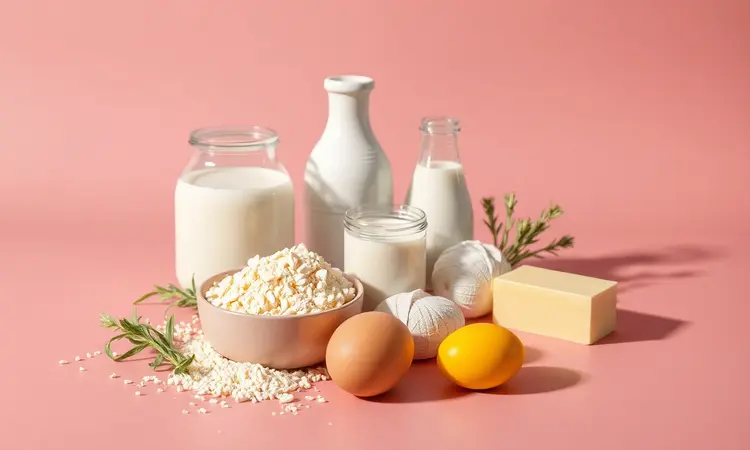
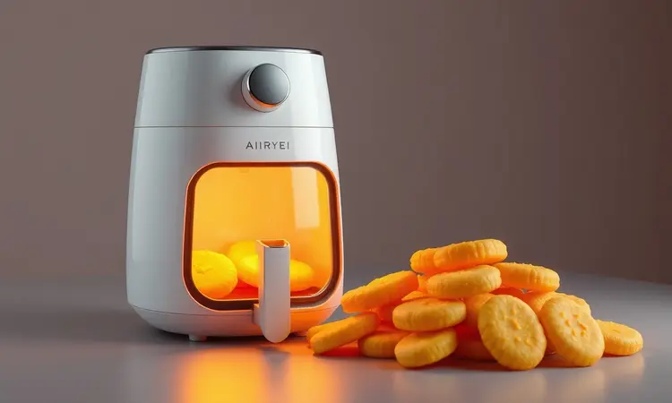
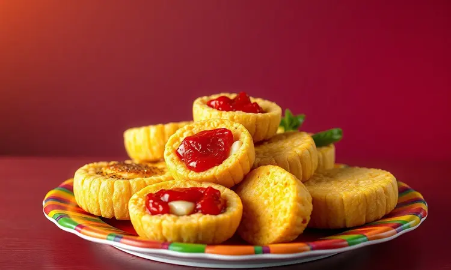

Você adora o sabor nostálgico de uma broa de fubá quentinha, mas não quer ligar o forno e esperar uma eternidade? Saiba que você não está sozinho nessa busca por praticidade sem abrir mão do sabor de infância.

Neste guia, vou te mostrar a receita definitiva de broa de fubá na airfryer que fica pronta em minutos, economiza energia e garante aquela textura fofinha por dentro com uma crosta perfeita por fora.

Você vai descobrir desde a proporção exata dos ingredientes até dicas avançadas de temperatura, além de variações deliciosas com goiabada e os acessórios que facilitam sua vida na cozinha.

<SummaryList products={frontmatter.top_products} />

## A Revolução da Broa de Fubá na Fritadeira Sem Óleo

Imagine unir toda a magia da broa da vovó com a praticidade que a vida moderna exige. Essa é a proposta da broa de fubá na airfryer, uma revolução que transforma horas de espera em minutos de prazer. 

Quando você escolhe essa rota, a receita ganha uma textura dupla encantadora: por fora, uma crocância que estala nos dedos ao quebrar um pedacinho; por dentro, uma maciez que quase derrete na boca. E o melhor?

Cada broa sai uniformemente dourada, sem aquelas partes escuras que às vezes assam mais rápido que outras no forno tradicional.

Na correria do dia a dia, essa praticidade faz toda diferença. Imagine só: você pode sair do trabalho às 18h e estar saboreando uma broa quentinha às 18h20, sem precisar gastar a energia que um forno convencional consome.

## Lista de Ingredientes: O que Você Vai Precisar

Para começar essa jornada saborosa, você vai precisar de ingredientes que provavelmente já tem na sua despensa. O fubá é o protagonista da história, responsável por toda aquela textura única e sabor característico.

Na preparação, junte:

- 2 xícaras de fubá (a base da receita)

- 1 xícara de açúcar (para aquele doce na medida certa)

- 1 xícara de leite (que dá leveza à massa)

- 2 ovos (para unir todos os elementos)

- 1 colher de sopa de fermento em pó (o segredo da fofura)

Se quiser um toque especial, mantenha um punhado de queijo ralado à mão. Vai transformar sua broa em uma experiência ainda mais saborosa.

## Modo de Preparo Detalhado: Passo a Passo

A mágica acontece quando esses ingredientes se encontram. Comece misturando todos os ingredientes secos em uma tigela. Isso cria a base perfeita para receber os líquidos que vêm a seguir. 

Quando adicionar o leite e os ovos, mexa com carinho até formar uma massa lisa. Não precisa exagerar na batida, o segredo está na incorporação gentil. Transfira essa mistura para a airfryer e deixe a tecnologia fazer seu trabalho por cerca de 20 minutos.

### Preparando a Massa Corretamente para não Grudar

Nada mais frustrante do que uma broa que resiste a sair da forma. Para evitar essa cena, comece untando as forminhas com um fio de óleo ou margarina e polvilhe com uma fina camada de fubá. Esse truque simples cria uma barreira invisível entre a massa e o recipiente.

Outra dica valiosa: equilibre a quantidade de líquidos. Uma massa muito úmida tem maior tendência a grudar. E se puder dar alguns minutos de descanso à mistura antes de levá-la à airfryer, melhor ainda.

Esse pequeno intervalo permite que todos os ingredientes se harmonizem completamente.

### Modelando as Broas para um Assamento Uniforme

A parte mais divertida chegou: transformar essa massa em broinhas perfeitas. Divida a preparação em porções de aproximadamente 50 gramas cada, criando uma família de broas que vão assar no mesmo ritmo. 

Ao moldar, forme bolinhas suaves e dê um leve achatamento no centro. Esse gesto simples garante que o calor chegue igualmente a todos os pontos da broa. 

E quando for organizar na cesta da airfryer, lembre-se de deixar um espaço generoso entre cada uma. É como preparar assentos confortáveis para que o ar quente circule por todos os lados, transformando cada broa em uma obra-prima dourada.

## Tempo e Temperatura: O Segredo para Não Deixar a Broa Ressecar

Esses dois elementos são os maestros que regem o sucesso da sua broa. A faixa entre 160°C e 180°C funciona como uma zona dourada de temperatura, onde a massa se desenvolve na medida certa sem perder umidade. 

Quanto ao tempo, programe seu temporizador para 20 a 25 minutos, mas mantenha um olho atento nos minutos finais. É nessa reta final que você controla se quer mais ou menos cor, se prefere uma crosta mais fina ou mais marcante. 

Essa atenção faz ainda mais sentido quando consideramos que cada modelo de airfryer tem sua personalidade. Algumas são mais gentis, outras mais intensas. Conhecer seu aparelho é como conhecer um parceiro de cozinha.

## Melhores Modelos de Airfryer para Fazer Pães e Bolos

<ProductBox 
  title={frontmatter.top_products[0].title} 
  image={frontmatter.top_products[0].image} 
  link={frontmatter.top_products[0].link} 
/>

Se você realmente quer transformar seu café da tarde, escolher o modelo certo pode fazer toda diferença. A Mallory Air Oven Unique 30L é uma verdadeira artista quando o assunto são assados, com uma capacidade que permite preparar várias broas de uma só vez.

Para quem busca uma experiência mais personalizada, a Electrolux por Rita Lobo 12L Digital (EAF85) oferece uma função específica para bolos e pães, além de outras opções que vão desde gratinar até desidratar frutas.

Se o orçamento for uma consideração importante, o Oster Forno e Fryer Multifunções 25L apresenta um equilíbrio admirável entre qualidade e custo-benefício. 

E para quem vive sozinho ou tem pouco espaço, o Mondial Forno Oven 12L funciona perfeitamente, apesar de exigir um ajuste mais cuidadoso nos tempos de cozimento.

Independentemente da sua escolha, duas coisas são fundamentais: a capacidade do aparelho e seu controle preciso de temperatura. São esses detalhes que transformam uma receita simples numa memória saborosa.

## Formas de Silicone e Papel Antiaderente para Facilitar a Limpeza

<ProductBox 
  title={frontmatter.top_products[1].title} 
  image={frontmatter.top_products[1].image} 
  link={frontmatter.top_products[1].link} 
/>

Depois da satisfação de comer uma broa quentinha, ninguém merece passar horas limpando recipientes grudados. As formas de silicone são aliadas silenciosas nessa batalha.

Sua natureza antiaderente reduz drasticamente a necessidade de untar, e sua flexibilidade torna a retirada das broas um gesto suave, quase como desembrulhar um presente.

Já o papel antiaderente funciona como uma espécie de tapete mágico sobre a qual suas broas assam protegidas.

Ele se adapta a qualquer formato de cesta e, quando a festa acaba, basta enrolá-lo e descartá-lo, deixando sua airfryer praticamente pronta para a próxima aventura culinária.

## 3 Dicas de Ouro para uma Broa Sempre Úmida e Saborosa

A primeira verdade sobre uma broa memorável começa na despensa. Ingredientes frescos não são apenas um detalhe são a alma da receita. Um fubá com aroma vivo e um fermento dentro do prazo fazem a diferença entre uma broa boa e uma broa que você vai querer repetir. 

Quando estiver misturando, lembre-se que menos é mais. Basta unir todos os componentes até que desapareçam uns nos outros. A mastigação excessiva desenvolve glúten, mesmo no fubá, resultando numa textura pesada e sem leveza.

Por fim, conheça sua airfryer como quem conhece uma amiga. Cada modelo tem seu ritmo, sua forma de distribuir calor. Comece checando a broa alguns minutos antes do tempo sugerido. Esse momento de observação pode salvar uma fornada inteira.

## Variações Irresistíveis: Goiabada, Erva-doce e Versão com Queijo

A broa de fubá é como uma tela em branco que aceita seus toques pessoais. Que tal surpreender sua família com essas ideias?

A combinação com goiabada é um clássico atemporal imagine morder uma broa quentinha e encontrar no centro aquele doce intenso e reconfortante. É o tipo de surpresa que transforma uma tarde comum num momento especial.

Para um toque mais aromático, um pouco de erva-doce moída na massa acrescenta uma delicadeza floral que conversa perfeitamente com o café. 

E se você quer ir para o lado salgado, acrescente queijo ralado à mistura. O resultado é uma broa que funciona como refeição completa, perfeita para levar ao trabalho ou servir numa reunião descontraída com amigos.

## Erros Comuns que Você Deve Evitar ao Assar na Airfryer

Mesmo os cozinheiros mais experientes podem escorregar em alguns detalhes. O primeiro é esquecer o pré-aquecimento. Esse passo não é apenas formalidade ele prepara o ambiente para receber a massa, garantindo que comece a assar imediatamente na temperatura ideal.

Outro equívoco comum é preencher a cesta além da conta. A airfryer funciona com a circulação do ar, e quando bloqueamos essa passagem, criamos zonas frias e quentes que resultam em broas desiguais.

Ajustar temperatura e tempo é uma arte que requer prática. Uma variação de 10°C ou 5 minutos pode ser a diferença entre o ponto ideal e uma broa ressecada.

E quanto ao óleo? Na airfryer, a regra é simplicidade. Um fio para untar as formas é suficiente. O exagero aqui produz broas oleosas que não entregam aquela crocância característica.

## Como Armazenar e Reaquecer sem Perder a Textura Original

Se por acaso sobrar alguma broa (o que é raro), armazená-la corretamente mantém o sabor vivo por mais tempo. Deixe esfriar completamente antes de embalar em papel alumínio ou guardar num recipiente hermético. 

Essa paciência evita que o vapor acumulado transforme a crosta em algo moles. Para consumo dentro de um ou dois dias, a bancada funciona bem, mas se o prazo for maior, a geladeira é sua melhor amiga.

Chegou a hora do reaquecimento? A própria airfryer pode fazer essa mágica por você. Apenas 3-4 minutos a 180°C são suficientes para reviver aquela crosta perfeita. O forno tradicional também entrega bons resultados, embora demande um pouco mais de tempo.

## Perguntas Frequentes sobre Broa na Airfryer (FAQ)

Algumas dúvidas surgem como convidadas frequentes à mesa de quem começa essa jornada. Veja as mais comuns:

Quanto tempo realmente leva? Geralmente entre 15 e 20 minutos a 180°C, mas seu olho é o melhor juiz quando aquela cor dourada aparece.

Preciso untar mesmo? Não é obrigatório, especialmente se usar formas de silicone ou papel antiaderente, mas um fio de óleo pode ser uma garantia adicional contra o grude.

Fubá comum ou mimoso? Ambos funcionam perfeitamente. O mimoso pode entregar uma textura um pouco mais fina, enquanto o tradicional mantém aquela rusticidade que faz a broa ser broa.

## Conclusão

Preparar uma broa de fubá na airfryer é muito mais do que seguir uma receita. É sobre resgatar memórias com praticidade, sobre transformar uma tradição em algo que cabe perfeitamente no ritmo da sua vida. 

Quando você pega uma broa quentinha daquela, com o aroma que invade a cozinha e enche a casa de aconchego, percebe que conquistou o melhor dos dois mundos: o sabor que aquece a alma e a simplicidade que respeita seu tempo.

Essa receita prova que as melhores coisas da vida podem sim ser simples de fazer. Que você não precisa abrir mão do que é bom em nome da praticidade. 

Então, o que está esperando? Junte os ingredientes, ligue sua airfryer e dê o primeiro passo para transformar suas tardes. Porque café da tarde com broa quentinha não é apenas um lanche. É um abraço em forma de comida. E merece ser parte da sua rotina.