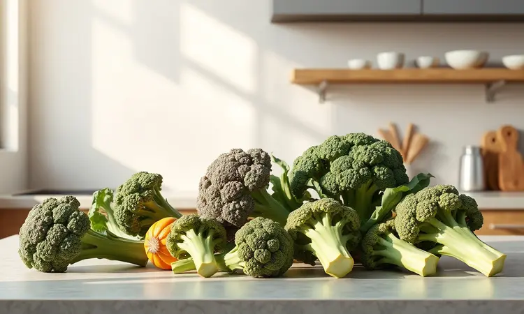
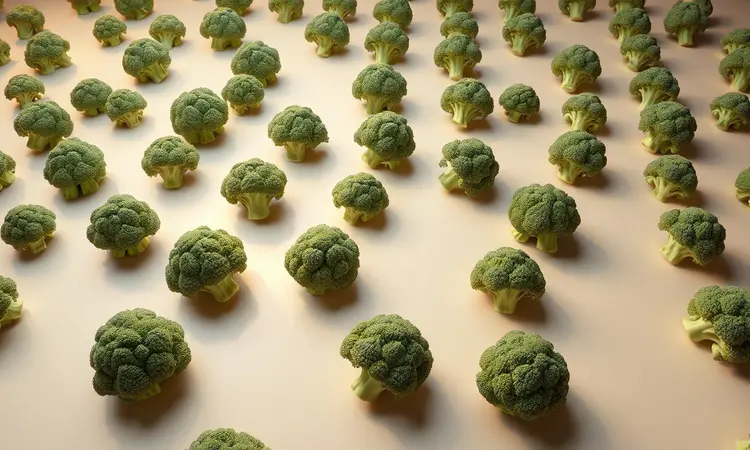
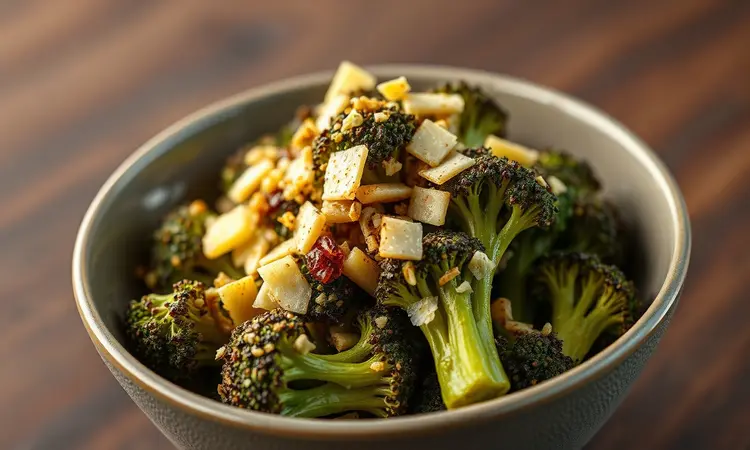
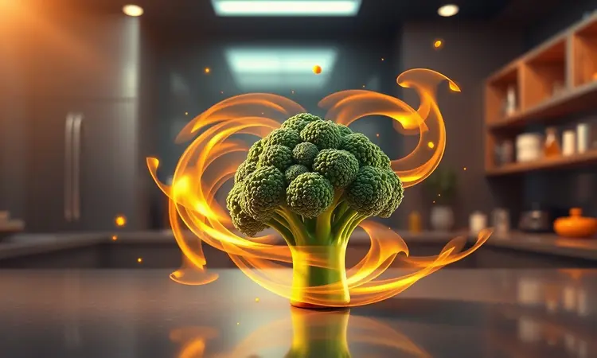

Você já teve aquela frustração de colocar brócolis na airfryer e, minutos depois, se deparar com floretes carbonizados ou, pior ainda, com textura de borracha? O problema raramente está no aparelho.

A verdade é que a maioria de nós pula etapas pequenas que fazem toda a diferença entre o desastre e a crocância dourada que você vê nas receitas da internet.

Eu também já passei por isso, então reuni tudo o que aprendi (e testei) para te entregar um guia que vai transformar o brócolis naquele acompanhamento que você vai querer fazer toda semana.

Vamos além da receita básica: você vai descobrir truques de chef, variações que parecem de restaurante e aprender a ajustar cada detalhe para o seu gosto.

<SummaryList products={frontmatter.top_products} />

## Por que o Brócolis na Airfryer é a Melhor Forma de Consumo?

Imagine conseguir a textura de um restaurante gourmet usando praticamente zero óleo. É isso que a airfryer entrega. A magia acontece porque o ar quente circula em alta velocidade, cozinhando por igual cada florete. O resultado?

Forra crocante que estala nos dentes e interior macio, quase cremoso. E o melhor: como o processo é rápido e a alta temperatura 'sela' o vegetal, boa parte dos nutrientes sensíveis, como a vitamina C, se mantém.

Tudo isso em cerca de 10 minutos, com apenas uma cesta para lavar depois. Convenhamos, é muito melhor do que ficar vigiando uma panela com água fervendo.

## Como Escolher o Brócolis Ideal: Fresco, Ninja ou Congelado?

A escolha é mais sobre o seu momento do que sobre qualidade absoluta. Para aquela refeição especial onde o sabor brilha, opte pelo fresco. Escolha cabeças com cor verde vibrante, firmes ao toque e sem manchas amareladas.

Já pensou em chegar do trabalho e ter vontade de um vegetal crocante? É aqui que o congelado salva. A tecnologia atual faz um ótimo trabalho preservando nutrientes e textura.

E o brócolis ninja, já cortado e lavado, é para quem não quer perder um segundo sequer com preparo. Cada um tem seu lugar na sua rotina, e todos podem ficar incríveis.

### Acessórios que Facilitam o Preparo e Garantem a Crocância

<ProductBox 
  title={frontmatter.top_products[0].title} 
  image={frontmatter.top_products[0].image} 
  link={frontmatter.top_products[0].link} 
/>

Se você já lutou para soltar brócolis grudados na cesta, sabe que alguns acessórios merecem um espaço no seu armário. O herói é o papel de forno específico para airfryer, que elimina aquele trabalho de esfregar depois.

Para quem faz comida para a família toda, uma grelha empilhável é um divisor de águas. Ela permite cozinhar duas camadas de uma vez, com o ar circulando livremente entre elas.

E uma espátula de silicone com ponta fina é perfeita para virar floretes delicados sem esmagá-los. Veja esses itens não como gastos extras, mas como garantia de sucesso e de mais tempo livre depois do jantar.

## O Segredo do Ponto Perfeito: Dicas de Chef que Ninguém Te Conta

Um chef me revelou uma vez que o grande segredo não está no tempo, mas na consistência. Se você quer replicar a perfeição toda vez, comece tratando cada florete com igual respeito. Depois de escolher seu brócolis (fresco, congelado ou ninja).

### O Corte Correto: Por que o Tamanho dos Floretes Importa?

Pegue um florete grande e um pequeno. Coloque os dois na airfryer. Quem você acha que vai ficar pronto primeiro, e quem vai queimar por fora enquanto ainda está cru por dentro? Exatamente. O tamanho uniforme é sua garantia de paz.

Corte os floretes em pedaços de 3 a 5 centímetros. Eles são grandes o suficiente para manter um interior macio, mas pequenos o bastante para que a crosta dourada se forme rápido e por completo.

É um detalhe simples que elimina o clássico 'tem que tirar os menores antes para não queimar'.

### A Importância de Secar Bem o Vegetal Antes de Assar

Água é o inimigo da crocância. Ela cria vapor, e vapor cria um ambiente úmido que deixa tudo borrachudo. Depois de lavar, não basta escorrer. Pressione gentilmente os floretes entre duas camadas de papel toalha.

Você não precisa secar até ficar ressecado, apenas remover o excesso de umidade superficial.

Esse minuto extra na preparação faz uma diferença colossal no resultado final, permitindo que o azeite e os temperos formem uma casquinha saborosa ao invés de escorrerem com a água.

## Receita Passo a Passo: Brócolis na Airfryer Simples e Rápido

Vamos ao básico que funciona sempre. Essa é sua receita de base, sua âncora. A partir dela, você pode voar para todas as variações.

### Ingredientes e Sugestões de Temperos Irresistíveis

Você vai precisar de: 1 cabeça de brócolis (ou 400g de congelado), 1 colher de sopa de azeite de oliva, sal a gosto. Agora, os temperos que transformam: para o clássico, pimenta-do-reino moída na hora. Para um toque mediterrâneo, alho em pó e raspas de limão.

Para algo defumado, páprica doce. A beleza está em começar simples e ir descobrindo suas combinações favoritas.

### Modo de Preparo Detalhado: Do Tempero à Cesta

1.  Lave, seque e corte o brócolis em floretes uniformes, seguindo a dica do tamanho.

2.  Em uma tigela grande, misture os floretes com o azeite. Massageie bem para que cada pedacinho fique levemente revestido.

3.  Adicione o sal e seus temperos escolhidos. Misture novamente.

4.  Pré-aqueça sua airfryer a 200°C por 3 minutos.

5.  Espalhe os brócolis na cesta, em uma única camada, sem amontoar. Se precisar, faça em duas levas.

6.  Cozinhe por 10 a 12 minutos. Na marca dos 5-6 minutos, puxe a cesta e sacuda vigorosamente para virar os floretes.

7.  Sirva imediatamente. A crocância está no auge agora.

## Tempo e Temperatura: O Guia Definitivo para Não Errar o Ponto

200°C por 10-12 minutos não é apenas um número mágico, é a equação do sucesso. A alta temperatura sela rapidamente a superfície, criando a casquinha.

Esse tempo é suficiente para o calor penetrar e cozinhar o interior sem evaporar toda a umidade interna, que é o que garante o miolo macio. Floretes menores ou mais finos? Fique na parte baixa do tempo (8-10 min). Maiores ou mais densos? Vá para os 12-14 minutos.

A regra de ouro é sacudir na metade do cozimento. Isso dá o cozimento uniforme que você busca sem precisar ficar olhando a cada minuto.

## Variações Gourmet para Fugir do Básico

Dominou o básico? Agora a diversão começa. Essas combinações levam seu brócolis de acompanhamento simples para o centro do prato.

### Brócolis com Queijo Parmesão e Alho Crocante

Depois de seguir o modo de preparo básico, adicione 2 colheres de sopa de parmesão ralado fino e 1 dente de alho bem picado na etapa dos temperos. O parmesão derrete e forma uma crosta salgada e dourada. O alho fica crocante e perfuma tudo.

É um clássico que nunca falha e faz qualquer um virar fã de brócolis.

### Versão Asiática: Shoyu, Gergelim e Gengibre

Substitua o sal por 1 colher de sopa de shoyu (molho de soja) na hora de temperar. Adicione 1 colher de chá de gengibre fresco ralado e 1 colher de chá de sementes de gergelim. O shoyu carameliza levemente, dando um sabor umami profundo.

O gengibre acrescenta frescor, e o gergelim, uma crocância a mais. Perfeito para acompanhar um frango grelhado ou salmão.

### Brócolis com Bacon: A Combinação de Sabor Definitiva

Corte 2 fatias de bacon em pedacinhos e refogue em uma frigideira até ficarem crocantes. Escorra a gordura em excesso. No passo de misturar os temperos, adicione o bacon crocante e 1 colher de chá da própria gordura do bacon (em vez de parte do azeite).

O sabor defumado e salgado do bacon permeia cada florete. É a forma mais infalível de fazer crianças (e adultos) comerem vegetais com um sorriso no rosto.

## Como Fazer Brócolis Congelado na Airfryer Sem Ficar Murcho

Aqui está o segredo que poucos contam: nunca descongele. Pegue os floretes congelados diretamente do saquinho, coloque na tigela e tempere com azeite e sal. O azeite vai grudar mesmo no gelo. Pré-aqueça a airfryer a 200°C e espalhe os floretes congelados na cesta.

O tempo será um pouco maior, cerca de 15 a 18 minutos, ainda sacudindo na metade. O choque térmico é o segredo: o exterior congela rapidamente, criando uma crosta, enquanto o interior descongela e cozinha perfeitamente, sem passar pela fase 'murcha'.

## Erros Comuns que Você Deve Evitar ao Usar a Airfryer

Sobrecarregar a cesta é o pecado capital. Quando os alimentos se amontoam, o ar quente não circula. O resultado é vapor, não crocância. Faça em levas se necessário. Outro erro é pular o pré-aquecimento.

Esses 3 minutos garantem que tudo comece a cozinhar na temperatura correta desde o primeiro segundo, essencial para a caramelização perfeita. Por fim, não tenha medo de usar azeite.

Uma colher é suficiente para centenas de floretes e é o que vai levar os temperos e criar aquela textura dourada que buscamos.

## Melhores Modelos de Airfryer para Assar Vegetais Uniformemente

<ProductBox 
  title={frontmatter.top_products[1].title} 
  image={frontmatter.top_products[1].image} 
  link={frontmatter.top_products[1].link} 
/>

Se você está pensando em investir, alguns modelos são parceiros ideais para vegetais. A Mondial AFN-50-BI tem um cesto quadrado. Por que isso importa?

Cantos quadrados significam menos áreas onde o ar fica 'parado', levando a um cozimento mais uniforme sem precisar ficar sacudindo tanto. Para famílias, a Oster OFRT780 e sua capacidade de 12 litros são um alívio.

Você faz uma grande quantidade de uma vez, e o controle preciso de temperatura garante que tudo fique no ponto. Já a Philco PFR2200 com painel digital tira as adivinhações da equação. Você programa e esquece.

Escolha pensando no espaço que tem e na quantidade que costuma preparar.

## Sugestões de Acompanhamento e Molhos Caseiros

O brócolis crocante é um ator versátil. Ele brilha ao lado de um filé de frango grelhado com ervas, equilibrando com sua frescura. Ou sobre um bowl de quinoa com abacate, adicionando a textura que faltava. Para molhos, esqueça os industrializados.

Bata iogurte natural com suco de meio limão, uma pitada de sal e ervas frescas (hortelã ou cebolinha). Ou misture tahine (pasta de gergelim) com água, alho amassado e uma pitada de cominho para um molho cremoso e encorpado.

Mergulhar um florete quente nesses molhos é uma experiência à parte.

## Armazenamento e Como Reaquecer Mantendo a Textura

<ProductBox 
  title={frontmatter.top_products[2].title} 
  image={frontmatter.top_products[2].image} 
  link={frontmatter.top_products[2].link} 
/>

Sobrou? Guarde em um pote fechado na geladeira por até 4 dias. Quando for comer, o micro-ondas é tentador, mas é uma armadilha que destrói toda a crocância. A solução está de volta na sua airfryer. Pré-aqueça a 180°C, espalhe os floretes e aqueça por 3 a 4 minutos.

Eles não apenas esquentam, como recuperam parte da textura crocante original. É como ter um acompanhante gourmet pronto em minutos, sem precisar cozinhar de novo.

## Perguntas Frequentes (FAQ) sobre Brócolis na Airfryer

*   **'Preciso descongelar o brócolis congelado?'** Absolutamente não! Como você viu, cozinhar direto do congelador é o segredo para não ficar murcho.

*   **'Por que o meu brócolis ficou mole e não crocante?'** Provavelmente excesso de umidade (não secou bem) ou a cesta estava muito cheia, impedindo a circulação do ar.

*   **'Posso fazer outras legumes juntos?'** Sim, mas escolha vegetais com tempos de cozimento similares. Batata doce leva mais tempo que brócolis, então comece ela primeiro e adicione o brócolis depois.

*   **'Qual a quantidade ideal de azeite?'** Cerca de 1 colher de sopa para cada 400g de brócolis. É o suficiente para cobrir tudo sem deixar oleoso.

*   **'Posso usar outros óleos?'** Pode, mas o azeite tem um ponto de fumaça bom para 200°C e agrega sabor. Óleo de coco ou de abacate também funcionam bem.

## Conclusão

De florete borrachudo a acompanhamento estrela, a jornada do brócolis na airfryer é sobre dominar detalhes simples. É sobre entender que secar bem, cortar uniformemente e não lotar a cesta são gestos pequenos com impacto gigante.

Mais do que uma receita, você agora tem um método. Um método que se adapta ao seu gosto, ao seu dia a dia, ao seu paladar. Pode ser o parmesão crocante de terça-feira ou a versão asiática do sábado. A airfryer entregou a ferramenta, e este guia entregou o conhecimento.

Agora, a cozinha é sua. Qual vai ser a sua primeira variação?