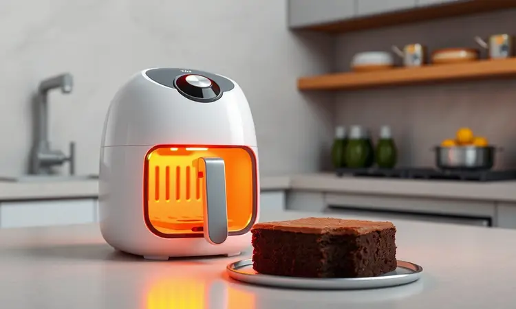
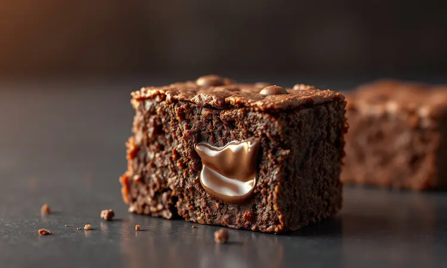
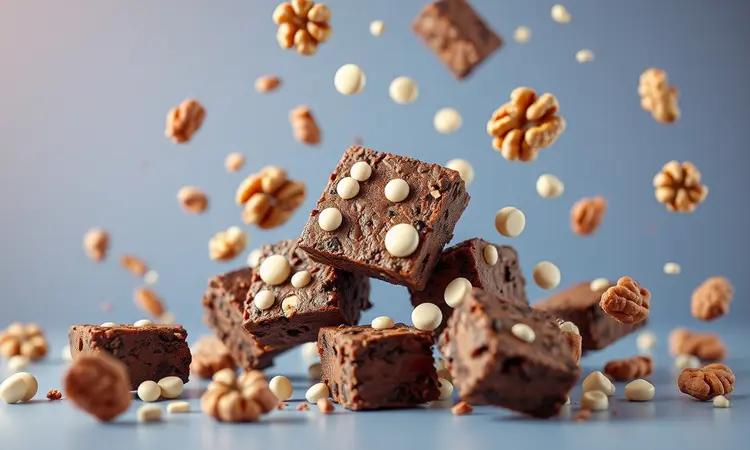

Você adora um brownie bem chocolatudo, mas desanima só de pensar em pré-aquecer o forno e esperar quase uma hora para ficar pronto? Eu entendo perfeitamente, e a boa notícia é que a sua fritadeira elétrica é a solução para esse problema.

Fazer brownie na Air Fryer não é apenas mais rápido, mas é o segredo para conseguir aquela combinação difícil de interior extremamente úmido e uma casquinha craquelada perfeita por cima.

Neste guia completo, você vai aprender a receita definitiva, o tempo exato para não errar o ponto e quais os melhores acessórios para garantir o sucesso da sua sobremesa.

<SummaryList products={frontmatter.top_products} />

## Por que fazer Brownie na Air Fryer é melhor que no forno tradicional?

Imagine sair da reunião às 18h e ter um brownie fresquinho na mesa às 18h20. A Air Fryer entrega essa mágica, aquecendo em minutos enquanto um forno tradicional ainda está se preparando.

Essa velocidade não é apenas conveniência, mas economia real de energia que você sente na próxima conta de luz.

A verdadeira magia, porém, está naquela combinação irresistível de texturas: a circulação de ar quente cria uma casquinha crocante quase instantaneamente, enquanto o interior permanece tão molhadinho que praticamente derrete na boca.

É como se você tivesse um chef especializado em brownies dentro da sua cozinha, com controle de temperatura tão preciso que praticamente elimina o risco de passar do ponto.

E depois que o doce estiver pronto? A limpeza vira brincadeira de criança, com partes removíveis que vão direto para a máquina de lavar enquanto você ainda saboreia as primeiras mordidas.

## Utensílios Necessários: Qual a melhor forma para usar na Air Fryer?

<ProductBox 
  title={frontmatter.top_products[0].title} 
  image={frontmatter.top_products[0].image} 
  link={frontmatter.top_products[0].link} 
/>

Antes de começar, vamos organizar sua bancada. Você precisa apenas de alguns aliados estratégicos que farão toda diferença.

A peça principal é uma forma que se encaixe confortavelmente no cesto da sua Air Fryer. Pense nisso como escolher o vestido perfeito para uma ocasião especial: precisa caber bem, permitir movimento adequado, e ser fácil de tirar depois.

Formas de metal, vidro ou silicone são suas melhores amigas aqui, e se você adora a ideia de porções individuais, aquelas com divisórias se transformam em pequenos presentinhos para servir aos amigos.

Não subestime o poder do papel manteiga. Ele é o seguro contra desastres que garante que sua criação sairá intacta do recipiente, como um tesouro sendo desembrulhado.

Para a mistura, escolha tigelas que permitam movimentos amplos com o batedor ou espátula. Visualize esse momento: você incorporando os ingredients até criar aquela massa lisinha e homogênea que promete um brownie perfeito.

Dois extras que valem ouro: um spray borrifador de óleo para aquela camada protetora invisível, e luvas de silicone para manusear a forma quente sem sustos.

Elas te dão a confiança de trabalhar com segurança, sabendo que seus dedos estão protegidos enquanto ajusta o posicionamento final.

## Ingredientes para o Brownie de Chocolate Perfeito (Versão Clássica e Econômica)

Aqui está a beleza desta receita: ingredientes simples que você provavelmente já tem em casa, mas que juntos criam magia. Pense nisso como um jogo de alquimia doméstica onde cada elemento tem seu papel essencial.

Comece com 200g de chocolate meio amargo. Não é apenas chocolate, é a alma do seu brownie, responsável por aquele sabor profundo que fica ecoando no paladar.

Ele se encontra com 150g de açúcar, o equilíbrio perfeiro entre doce e amargo que faz seus olhos fecharem de prazer.

Adicione 100g de manteiga, que traz não apenas sabor, mas aquela textura rica e amanteigada que derrete na temperatura certa.

Três ovos, batidos levemente, são a estrutura que segura essa delicadeza toda, enquanto 100g de farinha de trigo e uma pitada de sal completam o quadro, realçando cada sabor como um maestro aperfeiçoa sua orquestra.

E se quiser transformar o simples em extraordinário? Nozes ou castanhas picadas não são apenas um acréscimo, são convidados especiais que trazem crocância e complexidade para a festa.

## Passo a Passo: Como fazer Brownie na Air Fryer sem erros

### 1. Preparo da massa: O segredo da textura

Misturar ingredientes parece simples, mas é aqui que nasce a personalidade do seu brownie. Imagine transformar elementos separados em uma única entidade deliciosa.

Comece derretendo chocolate e manteiga juntos. Seja no micro-ondas ou em banho-maria, preste atenção nesse momento de fusão: eles devem se encontrar perfeitamente, criando uma base sedosa e gloriosa.

Agora adicione açúcar, ovos e um toque de essência de baunilha. Misture com carinho, mas sem medo, até tudo se tornar uma única substância homogênea. Você está literalmente criando ligações quânticas de sabor neste momento.

Por último, chega a hora da farinha e do cacau em pó. Incorpore com movimentos suaves e deliberados, como quem acaricia um animal de estimação.

Essa delicadeza não é frescura, é ciência: você quer criar bolhas de ar microscópicas que garantirão a leveza perfeita da massa.

### 2. Tempo e Temperatura: O ajuste fino para não queimar

Aqui mora o pulo do gato, o conhecimento que separa o bom do extraordinário. Lembre-se: estamos lidando com calor concentrado e cirurgicamente preciso.

Pré-aqueça sua Air Fryer a 180°C. Esta é a temperatura doce spot, o ponto ideal onde a mágica acontece sem riscos. Imagine como um atleta se aquece antes da competição.

Agora vem o momento da verdade: 15 a 20 minutos de assamento. Mas não marque o tempo e desapareça. Nos últimos minutos, transforme-se em detetive gastronômico.

Insira um palito no centro e observe: ele deve sair com algumas migalhas úmidas grudadas, não limpo e não encharcado.

Cada modelo de Air Fryer tem sua personalidade. Algumas são mais temperamentais, outras mais consistentes. Conheça a sua, e este teste do palito será sua bússola infalível.

## A Importância da Precisão: Dica de Especialista para Brownies Perfeitos

<ProductBox 
  title={frontmatter.top_products[1].title} 
  image={frontmatter.top_products[1].image} 
  link={frontmatter.top_products[1].link} 
/>

Você já seguiu uma receita à risca e ainda assim o resultado foi diferente do esperado? A resposta pode estar na precisão dos seus movimentos.

Medir farinha parece trivial, mas é uma arte. Muita farinha e seu brownie se transforma em tijolo seco. Pouca farinha e ele vira uma poça doce.

Use uma balança quando possível, ou domine a técnica de colher e nivelar: encha a colher sem compactar, e passe uma faca rente pela borda para remover o excesso.

Mas a precisão vai além dos ingredientes. É sobre conhecer sua máquina como conhece sua própria mão. Algumas Air Fryers são mais assertivas no calor, outras mais comedidas. Faça do primeiro brownie seu teste de personalidade: observe, ajuste, aprenda.

## 5 Dicas de Ouro para a Casquinha Craquelada e Interior Molhadinho

Estas são as joias da coroa, os segredos que transformam tentativas em obras-primas:

1. **Paciência premiada**: Deixe a massa descansar por 30 minutos antes de assar. Não é tempo perdido, é tempo de desenvolvimento onde a casquinha futura está se planejando.

2. **Foco no chocolate**: Chocolate meio amargo derretido não é apenas ingrediente, é a base emocional do sabor. Escolha um bom, e ele responderá com riqueza.

3. **Resistência à curiosidade**: A tentação de abrir a Air Fryer é grande, mas resista. Cada abertura é uma pequena tragédia térmica que pode fazer seu brownie murchar antes da hora.

4. **Temperatura estratégica**: 160°C pode ser sua melhor amiga para alguns modelos. Conheça sua máquina, teste, descubra seu ponto ideal.

5. **A arte da espera**: Deixe esfriar antes de cortar. Difícil? Imensamente. Mas é o que permite que as fatias mantenham sua integridade, com bordas limpas e texturas preservadas.

## Erros Comuns: Por que meu brownie ficou seco ou parecendo bolo?

Todo aprendiz de brownie passa por isso, então respire fundo se aconteceu com você.

O maior vilão é simples: tempo de cozimento excessivo. Lembre-se que o brownie continua cozinhando um pouco mesmo depois de sair do calor. Se o palito saiu limpo demais, já passou do ponto perfeito.

Ingredientes em temperatura ambiente não são frescura de chef. São física básica: manteiga fria não se incorpora bem, ovos gelados podem coagular de forma irregular.

Deixe tudo ajustando à temperatura ambiente por uma hora antes, e você sentirá a diferença na textura final.

## Variações Deliciosas: Brownie de Nescau, Nozes e Chocolate Branco

Dominou o básico? Agora é hora de brincar, de colocar sua personalidade na receita.

Para dias de pressa mas sem abrir mão do sabor, o Nescau é seu aliado secreto. Prático, consistente, e com aquele gosto que lembra infância.

Nozes picadas não são apenas um adicional, são uma experiência sensorial completa. Cada mordida se torna uma pequena aventura de texturas: macio aqui, crocante ali.

E o chocolate branco? Derreta alguns pedaços e incorpore à massa para um perfil completamente diferente, mais doce e cremoso, quase um beijo em forma de sobremesa.

## Facilitando a Limpeza: Como usar papel manteiga ou protetores na fritadeira

<ProductBox 
  title={frontmatter.top_products[2].title} 
  image={frontmatter.top_products[2].image} 
  link={frontmatter.top_products[2].link} 
/>

O momento pós-brownie deveria ser de satisfação, não de trabalho duro de limpeza.

Papel manteiga é seu escudo invisível, mas precisa ser usado com sabedoria. Nunca o coloque solto sobre o elemento de aquecimento, pois ele pode ser sugado e queimar. E sempre confira as recomendações do seu modelo específico.

Para os amantes da praticidade, protetores de silicone reutilizáveis são investimentos que pagam dividendos em tempo salvo. Laváveis na máquina, duráveis, e sempre prontos para a próxima aventura culinária.

Lembre-se sempre: o fluxo de ar é sagrado na Air Fryer. Qualquer proteção deve permitir que esse ar circule livremente, ou você estará assando no vapor, não no ar quente circulante.

## Perguntas Frequentes sobre Brownie na Air Fryer (FAQ)

A textura realmente fica igual à do forno? Sim, e em alguns aspectos, até superior. A concentração de calor e a circulação de ar criam um microclima perfeito para aquela combinação de crocante e úmido que define um brownie de respeito.

Tempo varia muito? Geralmente 15 a 20 minutos, mas considere isso um ponto de partida, não uma lei. Sua Air Fryer, sua receita, suas preferências pessoais criam um triângulo único que você descobrirá com a prática.

Untar ou não untar? Papel manteiga é quase sempre a resposta mais segura, mas se sua forma for de silicone de boa qualidade, ela pode não precisar de nenhuma assistência.

## Conclusão

Em menos tempo do que você leva para decidir qual filme assistir, a Air Fryer transforma ingredientes simples em uma experiência sensorial completa.

Desde o aroma de chocolate que invade sua cozinha nos primeiros minutos, até a satisfação de cortar aquela fatia perfeita com casquinha craquelada e interior que praticamente derrete ao toque do garfo.

Esta não é apenas uma receita, é uma nova forma de relacionamento com sua cozinha. Uma demonstração de que o prazer não precisa ser complicado, demorado ou caro.

Com uma Air Fryer e alguns ingredientes básicos, você detém o poder de criar momentos doces sempre que a vontade bater.

O próximo passo é o mais importante: escolha uma tarde, reúna seus ingredientes, e comece sua primeira tentativa. Aceite que o primeiro pode não ser perfeito, mas será delicioso.

E com cada nova tentativa, você não apenas aperfeiçoa uma receita, mas descobre uma nova faceta do prazer de cozinhar.

Agora pegue sua Air Fryer, seu chocolate, e transforme o próximo desejo por doce em realidade palpável, aromática e inesquecivelmente gostosa.