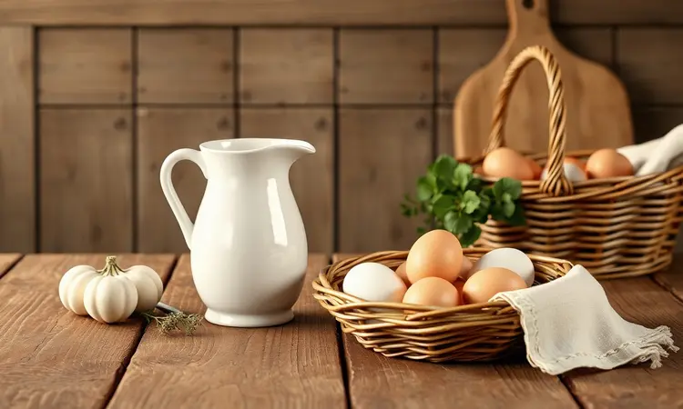
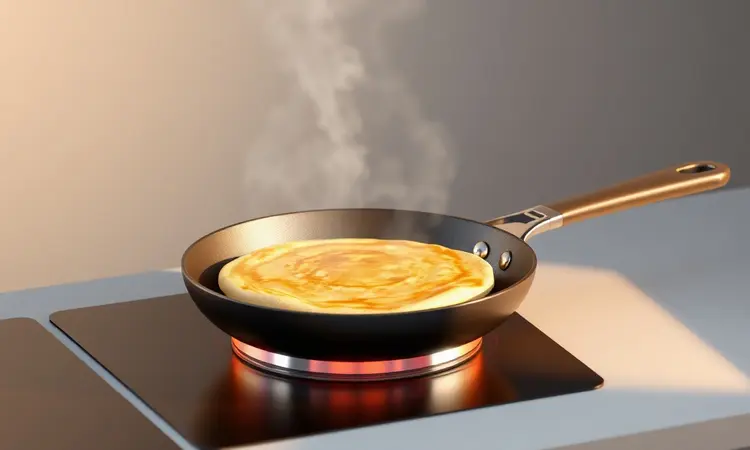

Antes de mergulharmos nas panelas e farinha, vamos entender melhor essa delícia que conquista corações cearenses há gerações.

<SummaryList products={frontmatter.top_products} />

## O que é Bruaca e qual a origem dessa iguaria nordestina?

A bruaca (também conhecida como bruada) é muito mais do que uma simples massa frita: ela representa a alma da cozinha nordestina. Originária do Ceará, sua história se mistura com as tradições dos colonizadores e das comunidades indígenas da região.

O que começou como uma solução prática para refeições rápidas evoluiu para um verdadeiro símbolo de hospitalidade, sempre presente nas festas e celebrações familiares. Cada mordida carrega séculos de história e o calor característico do povo nordestino.

## Ingredientes para a Bruaca Cearense Tradicional

Prepare sua tigela e respire fundo. Para a bruaca autêntica que vai conquistar sua mesa, você precisará de:

- 1 kg de farinha de trigo

- ½ kg de queijo coalho ralado (esse é o segredo do sabor marcante)

- ½ kg de manteiga (deixe em temperatura ambiente para facilitar)

- 1 xícara de açúcar

- 4 ovos

- 1 colher de sopa de fermento em pó

- Uma pitada de sal

- Leite (vamos ajustar conforme o ponto)

Essa combinação formará uma massa macia e maleável que, quando bem preparada, se transforma naquele pãozinho fino, crocante por fora e irresistivelmente fofinho por dentro.

## Passo a Passo: Como Fazer a Bruaca Perfeita no Fogão

Com os ingredientes reunidos, chegou a hora da mágica acontecer:

1. **A união perfeita**: Em uma tigela grande, misture a farinha, o açúcar, o fermento e o sal. Adicione a manteiga e misture até formar uma farofa.

2. **Os ingredientes líquidos**: Abra um buraco no centro e adicione os ovos. Vá incorporando gradualmente, adicionando leite aos poucos até obter uma massa que desgruda das mãos.

3. **O toque especial**: Adicione o queijo coalho ralado e sove por cerca de 10 minutos. Sim, seus braços vão agradecer depois!

4. **A pausa que transforma**: Aqui está um segredo crucial: deixe a massa descansar por 30 minutos, coberta com um pano úmido. É nessa espera que o glúten se desenvolve e a textura mágica se forma.

5. **O momento dourado**: Após o descanso, abra porções finas (como pão sírio) e cozinhe em frigideira bem quente até ficarem douradas dos dois lados.

### Utensílios Indispensáveis: Escolhendo a Melhor Frigideira Antiaderente

<ProductBox 
  title={frontmatter.top_products[0].title} 
  image={frontmatter.top_products[0].image} 
  link={frontmatter.top_products[0].link} 
/>

A frigideira certa é sua melhor aliada. Pense nela como o palco onde sua bruaca vai brilhar. Para aquela douradura perfeita sem grudar, opte por uma antiaderente de qualidade. O tamanho ideal?

Entre 20cm para fazer uma por vez com calma, ou 28cm para alimentar a família toda. Material importa: as de alumínio aquecem rápido e são leves, perfeitas para aquele movimento de virar rápido.

Mas se você busca distribuição de calor impecável (ideal para massas), as de ferro fundido são campeãs, exigindo apenas um cuidado extra contra ferrugem.

## Versão Prática: Como Fazer Bruaca na Airfryer em 10 Minutos

<ProductBox 
  title={frontmatter.top_products[1].title} 
  image={frontmatter.top_products[1].image} 
  link={frontmatter.top_products[1].link} 
/>

E se a correria do dia a dia pedir algo ainda mais prático? A Airfryer é sua resposta. Adapte a receita tradicional: misture 1 ovo, ½ xícara de açúcar, 1 xícara de leite e sal. Adicione 1½ xícara de farinha até obter uma massa ligeiramente mais espessa que panqueca.

Preaqueça a Airfryer a 180°C por 5 minutos. Coloque pequenas porções em forminhas untadas, sem exagerar na altura. Em 8 a 12 minutos, você terá bruacas douradas.

Pode ser necessário virar na metade do tempo para garantir uniformidade, mas essa pequena etapa vale pelo resultado crocante e sem a preocupação de óleo respingando.

## Dicas de Especialista para uma Massa Sempre Fofinha e Dourada

Quer o toque mestre que transforma bom em inesquecível? Primeiro, nunca subestime a temperatura ambiente dos ingredientes. Ovos e manteiga fora da geladeira se incorporam à farinha como abraços, não como estranhos.

Ao adicionar o leite, pense em chuva fina sobre a terra, não em enchente: aos poucos, respeitando o ponto da massa.

Quando sovar, imagine que está dando carinho à massa. E aqueles 30 minutos de descanso? Não são opcionais. São quando a mágica acontece em silêncio, o glúten se organiza, e a massa ganha aquela leveza que vai fazer todos perguntarem seu segredo.

## Melhores Acompanhamentos: O que combina com Bruaca?

Com a bruaca perfeita pronta, chegou a parte divertida: os acompanhamentos. Para uma experiência autêntica cearense, nada supera o queijo coalho grelhado. O contraste do quente com o derretido, do crocante com o cremoso, é pura poesia gastronômica.

Se o palete pede algo mais robusto, a charque desfiada entra em cena, equilibrando o doce da massa com sua presença salgada marcante. Para os ousados, um molho de pimenta caseiro dá aquele toque vibrante que desperta todos os sentidos.

E como final? Uma cocada ou doce de leite transforma a experiência em celebração completa.

## Erros Comuns ao Preparar Bruaca e Como Evitá-los

Alguns tropeços podem transformar a bruaca dos sonhos em decepção. O mais comum? A ansiedade de pular os 30 minutos de descanso da massa. Essa pausa não é sugestão, é lei. A massa sem descanso fica dura, teimosa, resistente.

Outro erro frequente é o dilúvio de líquido. Lembre-se: você pode sempre adicionar, mas nunca subtrair. Comece com menos leite e vá ajustando.

E nunca, jamais, coloque a massa em frigideira fria. Espere até ver aquele leve tremor no ar acima dela, sinal de que está pronta para receber sua criação com o abraço quente que forma a crosta dourada perfeita.

## Informações Nutricionais e Dicas para uma Versão Saudável (Fit)

A bruaca tradicional é uma celebração, mas se o dia a dia pede adaptações, podemos conversar. Trocar a farinha branca pela integral introduz fibras que ajudam na digestão e dão saciedade mais prolongada.

O azeite no lugar da manteiga traz gorduras boas que seu coração agradece.

Para versões assadas (sim, funciona!), reduza a gordura pela metade. E que tal incrementar? Legumes ralados finamente misturados à massa adicionam nutrientes sem alterar drasticamente a textura.

Lembre-se: o equilíbrio está no prazer consciente, não na restrição radical.

## Perguntas Frequentes sobre o Preparo da Bruaca (FAQ)

Preciso realmente deixar a massa descansar 30 minutos?
Absolutamente sim. É durante essa pausa que a massa relaxa, o glúten se organiza, e a textura final fica fofinha. Pense como tempo de investimento, não de espera.

Banha ou manteiga?
A banha de porco dá a autenticidade máxima, aquela crocância característica da receita original. Mas a manteiga oferece um sabor rico e acessível. Ambas funcionam, escolha conforme sua tradição ou paladar.

Como sei que atingi o ponto ideal da massa?
Ela deve estar homogênea, macia, e desgrudar levemente das mãos sem ficar pegajosa. Se grudar muito, um pouquinho de farinha. Se estiver seca e quebradiça, mais líquido aos poucos.

Posso congelar?
Sim! Depois de assadas e totalmente frias, armazene em sacos herméticos. Para descongelar, alguns minutos na frigideira ou forno quente restauram a crocância.

## Conclusão

Da história rica do Ceará à sua cozinha, a bruaca carrega muito mais que ingredientes. Ela transporta tradição, afeto e a capacidade de transformar momentos simples em memórias saborosas.

Seja no fogão com toda a cerimônia tradicional, seja na Airfryer adaptando à rotina moderna, o importante é o abraço que essa massa representa.

Cada douradura perfeita, cada mordida que revela aquela textura fofinha por dentro e crocante por fora, é uma celebração da culinária nordestina. Comece com a receita clássica, experimente as variações, encontre seu jeito pessoal de fazer.

Porque no final, mais importante que seguir rigidamente cada grama, é o prazer de compartilhar algo feito com suas próprias mãos.

Agora é sua vez: reúna os ingredientes, aqueça a frigideira e deixe o cheiro da bruaca tomando sua cozinha contar sua própria história.