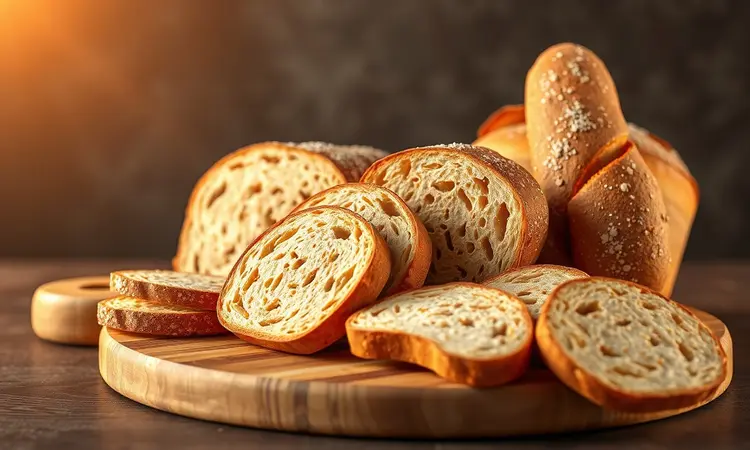
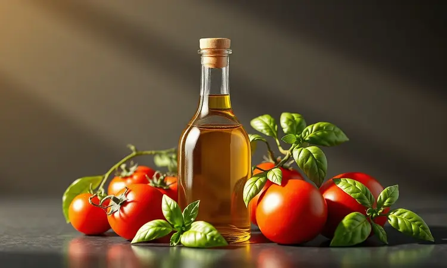
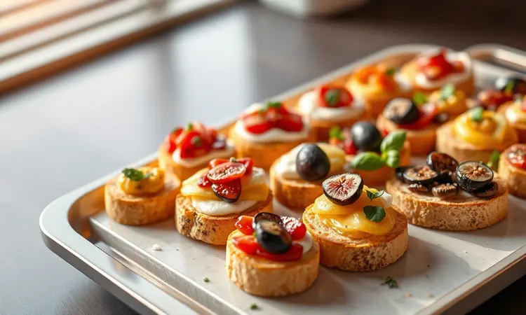
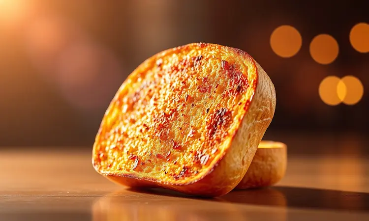

Você adora a sensação de cruzar o limiar de um restaurante italiano autêntico, aquele aroma de alho dourado e tomate fresco no ar, mas sonha em recriar essa magia no conforto da sua cozinha?

A boa notícia é que a combinação perfeita de crocância e sabor está mais próxima do que imagina.

Com sua airfryer ao lado, você está prestes a descobrir como transformar ingredientes simples em pequenas obras de arte gastronômicas que vão impressionar até os paladares mais exigentes.

Prepare-se para uma jornada que vai desde os segredos do pão ideal até variações que vão fazer seus convidados perguntarem: "Onde você aprendeu a fazer isso?"

<SummaryList products={frontmatter.top_products} />

## Por que a Airfryer é a Melhor Aliada da sua Bruschetta?

Imagine conseguir aquela crocância perfeita que ecoa ao primeiro morder, enquanto o interior do pão permanece macio e absorvente, pronto para abraçar os sabores da cobertura.

É isso que a airfryer oferece: uma dança de ar quente que circula em torno de cada fatia, garantindo um dourado uniforme sem pontos queimados. Em apenas cinco minutos, você tem nas mãos uma base perfeita, enquanto métodos tradicionais ainda estariam aquecendo o forno.

E sabe aquela sensação gratificante de saborear algo delicioso sem o peso de ter usado muito óleo? A airfryer entrega exatamente isso.

Ela transforma o preparo da bruschetta de uma tarefa complexa em um ritual simples e prazeroso, onde o resultado final sempre parece saído de uma cozinha profissional.

## Escolhendo a Base: Qual o Melhor Pão para Bruschetta na Airfryer?

O segredo começa antes mesmo de ligar o aparelho. O pão certo não é apenas um veículo para os ingredientes, é o alicerce que sustenta toda a experiência.

A ciabatta, com seus buracos irregulares e crosta resistente, oferece a textura perfeita: arejada por dentro, mas robusta o suficiente para não virar uma massa encharcada sob os tomates suculentos.

A baguete, por sua vez, traz uma crocância mais delicada e um sabor neutro que deixa os ingredientes brilharem. E para quem busca autenticidade italiana, o pão italiano tradicional é como uma passagem direta para as trattorias de Roma.

Evite pães muito macios ou de casca fina, eles simplesmente não têm estrutura para suportar a intensidade da airfryer e a generosidade dos condimentos. Aqui, a regra é simples: quanto mais personalidade tiver a base, mais memorável será a experiência.

## Ingredientes Fundamentais para um Sabor Autêntico Italiano

Fechar os olhos e ser transportado para uma varanda ensolarada na Toscana começa com ingredientes que conversam entre si.

O tomate não é apenas um tomate, precisa ser maduro ao ponto de quase se desmanchar, preferencialmente um San Marzano que traz doçura natural e acidez equilibrada.

O azeite extra virgem é o abraço final, aquele que envolve todos os sabores com notas herbáceas e um toque de amargor característico.

O alho, esfregado diretamente no pão ainda quente, libera seu perfume intenso, criando uma camada sutil de sabor que permanece em cada mordida. E o manjericão fresco? Ele é o suspiro final, a nota verde que corta a riqueza e refresca o paladar.

Juntos, esses elementos não apenas harmonizam, mas contam uma história de simplicidade feita com atenção aos detalhes.

## Passo a Passo: Receita de Bruschetta Tradicional (Tomate e Manjericão)

Cortar, tostar, misturar e espalhar. A simplicidade desta sequência esconde a magia que acontece quando cada etapa é feita com cuidado. O ritual começa com fatias generosas de pão, que vão direto para a airfryer pré-aquecida a 200°C.

Enquanto elas ganham aquela cor dourada perfeita em 5 a 7 minutos, você tem tempo para preparar a mistura que vai coroar sua criação.

Tomates maduros picados em cubos irregulares se juntam a folhas de manjericão rasgadas (nunca cortadas, para preservar seus óleos essenciais), um fio generoso de azeite extra virgem, sal grosso que se dissolve lentamente e pimenta-do-reino recentemente moída.

Quando o pão sai quente e crocante, esfregue levemente com um dente de alho cru antes de receber sua cobertura. Sirva imediatamente e observe os sorrisos surgirem.

### Preparando a Base: O Segredo do Alho e do Azeite

Antes mesmo do tomate entrar em cena, existe um passo que separa uma boa bruschetta de uma inesquecível. Esfregar o pão ainda quente com alho não é apenas uma técnica, é um ato de amor que impregna cada poro da fatia com um aroma que desperta memórias afetivas.

Faça isso com suavidade, permitindo que apenas a superfície seja perfumada sem dominar os outros ingredientes.

Em seguida, um segundo fio de azeite, este já sobre o alho ativado pelo calor, cria uma barreira protetora que mantém a crocância mesmo sob os tomates suculentos.

Esse dueto, quando bem executado, garante que cada mordida comece com uma explosão sutil de alho e termine com a suavidade do azeite, criando uma jornada de sabores em camadas.

### Tempo e Temperatura Ideal: Como Não Deixar o Pão Queimar

A diferença entre o dourado perfeito e a queimadura desastrosa está em alguns minutos de atenção. Sua airfryer, pré-aquecida a 200°C, se torna sua aliada, mas é seu olhar que faz a mágica acontecer.

Em torno do quinto minuto, abra a gaveta e observe: as bordas começam a dourar enquanto o centro mantém sua suavidade? É sinal de que está no ponto ideal. Fatias mais finas podem ficar prontas em cinco minutos, enquanto as mais robustas pedem sete.

Lembre-se, o pão continua a dourar levemente mesmo após retirado, então é melhor errar pelo lado da prudência. Esse breve ritual de verificação evita decepções e garante que cada fatia seja um convite irresistível.

## Utensílios Essenciais: A Importância de uma Boa Faca de Pão

<ProductBox 
  title={frontmatter.top_products[0].title} 
  image={frontmatter.top_products[0].image} 
  link={frontmatter.top_products[0].link} 
/>

Há uma satisfação silenciosa em cortar um pão de qualidade com a ferramenta certa. A faca de pão serrilhada não é apenas um utensílio, é uma extensão da sua intenção de criar algo especial.

Seus dentes afiados deslizam pela crosta resistente sem esmagar o miolo arejado, preservando aquela textura que a airfryer vai transformar em perfeição.

Marcas como Tramontina ou Victorinox oferecem modelos com equilíbrio perfeito entre peso e leveza, tornando o ato de fatiar tão prazeroso quanto o de saborear.

Embora represente um investimento inicial, essa faca se torna uma parceira para inúmeras receitas além da bruschetta, justificando cada centavo com a precisão e o prazer que proporciona a cada uso.

## 5 Variações Gourmet para Elevar o Nível da sua Receita

Depois de dominar a tradição, vem a diversão da reinvenção. O que começou como tomate e manjericão pode se transformar em um playground de sabores onde a criatividade é o único limite.

Essas variações mantêm a alma do prato enquanto oferecem novas experiências para diferentes momentos e paladares.

### 1. Bruschetta de Cogumelos com Queijo Brie

Para noites frias que pedem conforto em forma de comida, essa combinação é um abraço gastronômico. Cogumelos frescos refogados lentamente em azeite e alho liberam seu sabor terroso, que encontra na cremosidade derretida do brie um contraponto perfeito.

A airfryer doura a base enquanto você prepara o recheio, e em minutos você tem um aperitivo que parece saído do cardápio de um bistrô francês. Sirva imediatamente para apreciar o momento em que o queijo encontra o calor do pão.

### 2. Bruschetta de Presunto de Parma com Geleia de Figo

Esta é para os momentos que merecem um toque de celebração. A sofisticação salgada do presunto de Parma encontra a doçura complexa da geleia de figo em uma dança de contrastes que surpreende e encanta.

A crocância simples do pão tostado funciona como tela neutra para essa obra prima de sabores.

É a prova de que a verdadeira elegância muitas vezes reside na simplicidade bem executada, perfeita para abrir um jantar especial ou acompanhar um bom vinho em uma tarde descontraída.

### 3. Opção Fit: Bruschetta de Abacate e Ovo Poché

Para quem busca nutrir o corpo sem abrir mão do prazer, esta versão oferece saciedade e energia em forma de comida reconfortante.

A cremosidade do abacate maduro, levemente temperado com sal e limão, cria uma base luxuosa para o ovo poché perfeito, com sua gema que se torna molho ao primeiro toque. Usar pão integral na airfryer garante uma crocância robusta que sustenta essa combinação generosa.

Cada mordida oferece proteínas, gorduras boas e a satisfação de uma refeição completa que parece indulgente, mas está repleta de nutrientes.

## Dicas de Ouro para uma Bruschetta Sempre Crocante (E Nunca Murcha)

O grande desafio não é fazer uma bruschetta crocante, é mantê-la assim até o último convidado ser servido. O segredo começa com o pão levemente torrado antes de receber qualquer cobertura, criando uma barreira contra a umidade.

Tomates maduros são essenciais, mas retire suas sementes e excesso de líquido com uma colher antes de picar. Monte as bruschettas somente no momento de servir, mantendo os componentes separados até o último instante. E se precisar preparar com antecedência?

Guarde o pão tostado em temperatura ambiente e os ingredientes refrigerados, unindo-os apenas quando o primeiro convidado chegar. Esses pequenos cuidados garantem que cada fatia ofereça a mesma experiência crocante, do primeiro ao último pedaço.

## Melhores Modelos de Airfryer para Receitas de Padaria e Petiscos

<ProductBox 
  title={frontmatter.top_products[1].title} 
  image={frontmatter.top_products[1].image} 
  link={frontmatter.top_products[1].link} 
/>

Escolher a airfryer certa é como encontrar o parceiro ideal para suas aventuras culinárias. A Air Fryer Oven Mondial 12L se destaca para quem adora receber e precisa de capacidade ampla, permitindo preparar várias bruschettas de uma só vez sem precisar rodear.

Para quem valoriza precisão e consistência, a Philips Air Fryer XL Digital com seus 6.2L e painel intuitivo transforma o processo em algo quase científico, garantindo resultados idênticos toda vez.

Já a WAP Barbecue Air Fryer é a escolha dos entusiastas que querem versatilidade além dos petiscos, trazendo opções de churrasco que inspiram novas criações.

Independente do modelo, priorize aqueles acima de 1500W para garantir que o calor circule com vigor suficiente para criar aquela crocância característica sem secar o interior.

## A Importância do Azeite de Oliva de Qualidade na Finalização

<ProductBox 
  title={frontmatter.top_products[2].title} 
  image={frontmatter.top_products[2].image} 
  link={frontmatter.top_products[2].link} 
/>

Aquele último fio de azeite antes de servir não é apenas enfeite, é a assinatura do chef. Um azeite extra virgem de qualidade traz consigo notas de grama recém-cortada, amêndoas verdes e, dependendo da origem, até toques de pimenta na garganta.

Esses aromas complexos se elevam com o calor residual do pão, liberando camadas de sabor que azeites refinados simplesmente não conseguem oferecer.

Além do prazer sensorial, essa escolha traz benefícios: os antioxidantes presentes ajudam a neutralizar radicais livres, enquanto os ácidos graxos monoinsaturados cuidam da saúde cardiovascular.

Investir em uma garrafa boa significa que cada gota conta uma história de oliveiras, terroir e cuidado artesanal, elevando seu prato de doméstico a extraordinário.

## Perguntas Frequentes (FAQ) sobre Bruschetta na Airfryer

Quando a curiosidade surge entre uma fornada e outra, ter respostas claras pode fazer toda a diferença. Cinco a sete minutos a 200°C geralmente são suficientes, mas seu pão específico pode pedir ajustes sutis, então confie em seus olhos tanto quanto no timer.

Quanto ao pão, baguetes e ciabattas são clássicos confiáveis, mas não tenha medo de experimentar com focaccia ou até pão sírio para versões criativas.

O forro da cesta com papel manteiga não apenas facilita a limpeza, mas também protege peças menores de voar com a corrente de ar. E lembre-se, mesmo seguindo todas as dicas, sua bruschetta será única porque carrega seu toque pessoal.

## Conclusão

Do desejo inicial por uma entrada sofisticada ao momento em que você apresenta suas bruschettas douradas e crocantes, toda a jornada se resumiu a uma descoberta: a excelência não está na complexidade, mas na execução perfeita do simples.

Sua airfryer deixou de ser apenas mais um eletrodoméstico para se tornar seu sócio na cozinha, capaz de transformar pão, tomate e algumas ervas em memórias gustativas que permanecem.

Cada dica, desde a escolha da faca certa até o último fio de azeite, não são regras rígidas, mas convites para que você encontre sua própria voz nessa tradição centenária.

O verdadeiro segredo revelado não está em seguir um roteiro à risca, mas em compreender que a melhor bruschetta será sempre aquela que você faz com o desejo genuíno de agradar, seja aos seus convidados ou apenas ao seu próprio paladar.

Agora, com todo esse conhecimento nas mãos, que tal aquecer sua airfryer e transformar essa tarde em uma pequena celebração italiana?