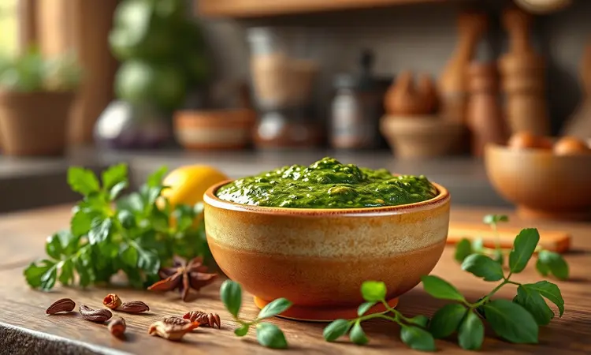
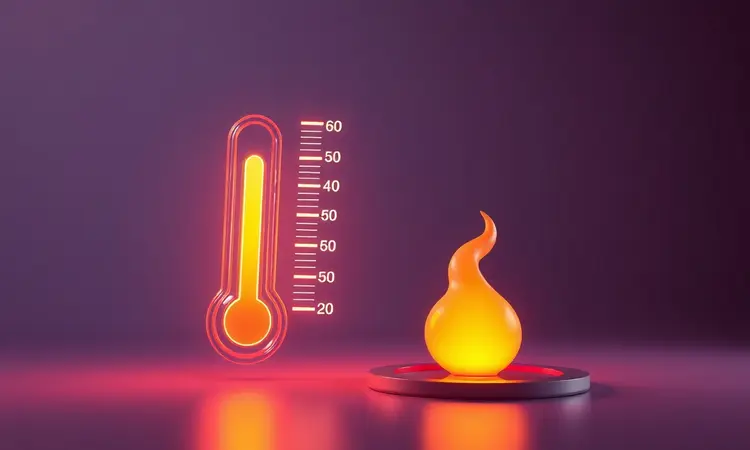

Você está atrás de um petisco rápido, prático e que deixa sua cozinha limpinha? A calabresa na airfryer é o truque que vai transformar seu happy hour ou aquele lanche de última hora. Mas atenção: o segredo não está apenas em colocar a linguiça lá dentro.

Sem as dicas certas, você corre o risco de acabar com um petisco ressecado ou borrachento. Neste guia, vou te ensinar não só a receita clássica de calabresa sequinha, mas também como preparar linguiças de churrasco suculentas e o tempero perfeito.

Prepare-se para elevar seus petiscos com dicas de tempo, temperatura e acessórios que vão facilitar sua vida.

<SummaryList products={frontmatter.top_products} />

## Por que preparar Linguiça e Calabresa na Airfryer?

Imagine tirar da airfryer uma calabresa com aquele dourado perfeito e crocante por fora, enquanto por dentro ela está suculenta e cheia de sabor.

Essa é a mágica da circulação de ar quente: ela garante textura e sabor de maneira muito mais eficiente do que a fritura tradicional.

Para quem tem rotina corrida, a grande vantagem está na praticidade. Você coloca as fatias, programa o tempo e temperatura, e em minutos tem um petisco delicioso pronto, sem precisar ficar vigiando o fogão ou limpando respingos de óleo por toda a bancada.

E tem mais: você reduz drasticamente o óleo, o que significa o sabor da festa sem o peso da culpa depois. Uma opção mais leve e saudável, perfeita para quem quer aproveitar os momentos de descontração sem exageros.

## Tipos de Linguiça: Qual a melhor para a fritadeira elétrica?

A escolha da linguiça faz toda diferença no resultado final. Quando você abre a airfryer, quer encontrar aquela crocância perfeita e um interior que derrete na boca, certo?

A calabresa é a campeã de pedidos. Feita com carne de porco e tempero marcante, ela desenvolve uma casquinha irresistível na airfryer. Já a toscana, mais recheada, oferece uma textura macia que contrasta com o exterior crocante.

Se busca opções mais leves, linguiças de frango funcionam muito bem, assim como as versões vegetais para quem segue dietas específicas.

O importante é lembrar que cada tipo terá um comportamento diferente na airfryer, influenciando diretamente no tempo de cozimento e na crocância final.

## Receita de Calabresa Acebolada e Sequinha na Airfryer (Passo a Passo)

Agora que você já escolheu sua linguiça preferida, vamos para a receita que todo mundo está esperando. Esta versão acebolada é a combinação perfeita: cebola caramelizada com a calabresa crocante.

Comece cortando a calabresa em rodelas finas. Quanto mais finas, mais crocantes ficarão. Em uma tigela, misture as fatias com cebola fatiada, um fio de azeite (que ajuda na crocância sem exagero), sal e pimenta a gosto.

Pré-aqueça sua airfryer a 200°C por cerca de 5 minutos. Esse passo é crucial para garantir que as fatias comecem a dourar imediatamente, evitando que fiquem encharcadas.

Distribua a mistura na cesta com cuidado, sem sobrepor muito as fatias. O ar precisa circular livremente para que cada pedacinho fique douradinho por igual. Cozinhe por 15 a 20 minutos, mexendo na metade do tempo para virar as fatias.

Você saberá que está pronto quando o aroma irresistible tomar conta da cozinha e as fatias estiverem bem douradas. Sirva quente e prepare-se para os elogios!

## Linguiça de Churrasco Suculenta com Molho Chimichurri Caseiro

Se o seu objetivo é recriar aquele sabor de churrasco em casa, a linguiça de churrasco na airfryer é sua aliada.

A grelha virtual da airfryer intensifica os sabores de maneira uniforme, deixando a linguiça suculenta por dentro e com aquelas marquinhas características por fora.

Para levar essa experiência para outro nível, nada melhor que acompanhar com um chimichurri caseiro. O frescor das ervas corta a gordura da linguiça e cria uma combinação que vai fazer você se perguntar por que não fazia isso antes.

### Como preparar o Molho Chimichurri para Acompanhar

A beleza do chimichurri está na simplicidade e no frescor. Pique bem fino um maço generoso de salsinha e adicione orégano fresco (se tiver, mas o seco também funciona).

Em uma tigela, misture as ervas com um dente de alho picado, 100 ml de azeite de oliva e 30 ml de vinagre de vinho tinto. Tempere com sal e pimenta a gosto.

Aqui vai o segredo: deixe o molho descansar por pelo menos 30 minutos antes de servir. Esse tempo permite que os sabores se integrem completamente, criando aquela profundidade que transforma um simples acompanhamento em algo especial.

Sirva fresco ao lado da sua linguiça recém-saída da airfryer.

## Guia de Tempo e Temperatura: O segredo para não errar o ponto

A diferença entre uma calabresa perfeita e uma decepção está no controle de tempo e temperatura. Pense nisso como um ritual: 200°C pré-aquecem sua airfryer e preparam o cenário para o sucesso.

Para fatias padrão, cozinhe por 10 a 12 minutos. Mas atenção: abra a airfryer a cada 5 minutos para mexer as fatias. Esse simples gesto garante que todas tenham contato igual com o calor, evitando aquelas fatias mais escuras de um lado e claras do outro.

A espessura das fatias é sua bússola. Se cortou mais finas, reduza um pouco o tempo. Se preferiu rodelas mais grossas, adicione alguns minutos. Fique de olho e confie em seus sentidos: quando o aroma estiver irresistível e as fatias douradas, é hora de servir!

## Dicas de Especialista para Evitar Fumaça e Sujeira Excessiva

Nada tira mais o prazer de cozinhar do que ter que lidar com fumaça ou uma limpeza complicada depois. Mas com algumas dicas simples, você mantém sua airfryer funcionando perfeitamente e sua cozinha limpa.

Cortar a linguiça em rodelas finas não é só uma questão de crocância. Fatias mais finas liberam gordura de maneira mais controlada, reduzindo a chance de respingos e aquela fumaça que às vezes assusta.

O pré-aquecimento é seu melhor amigo nessa missão. Aqueles 5 minutos a 200°C removem a umidade excessiva da calabresa, impedindo que ela fique encharcada e libere gordura em excesso durante o cozimento.

Mantenha um papel toalha por perto para absorver o excesso de gordura que se acumula na cesta durante o cozimento. E crie o hábito de limpar sua airfryer após cada uso.

Uma cesta limpa cozinha melhor e evita que gorduras antigas queimem e criem fumaça nas próximas receitas.

## Melhores Modelos de Air Fryer para Petiscos Crocantes

<ProductBox 
  title={frontmatter.top_products[0].title} 
  image={frontmatter.top_products[0].image} 
  link={frontmatter.top_products[0].link} 
/>

Se você está pensando em investir em uma airfryer ou quer atualizar a sua, conhecer os melhores modelos de 2023 faz toda diferença. Cada um tem suas características que podem se encaixar perfeitamente na sua rotina.

A Electrolux Family Efficient (EAF50) com seus 5 litros de capacidade é ideal para quem busca praticidade. O painel com 8 receitas pré-sugeridas, incluindo opções para petiscos, te guia passo a passo, perfeito para quem está começando ou quer simplicidade no dia a dia.

Para quem prioriza custo-benefício, a Mondial Family oferece 4 litros de capacidade e controle de temperatura até 200°C, exatamente o que você precisa para calabresas crocantes sem pagar por recursos que não vai usar.

Se tecnologia é sua paixão, a Philips Walita Airfryer Essential XL Conectada permite controle via aplicativo e acesso a receitas online. Imagine ajustar o cozimento da sua linguiça diretamente do celular enquanto prepara os acompanhamentos.

Famílias maiores encontram na Cosori Dual Blaze com 6,4 litros a solução perfeita. O cozimento rápido e uniforme garante que todas as porções fiquem prontas ao mesmo tempo, ideal para happy hours com amigos ou reuniões familiares.

## Acessórios Essenciais para Facilitar o Preparo e a Limpeza

<ProductBox 
  title={frontmatter.top_products[1].title} 
  image={frontmatter.top_products[1].image} 
  link={frontmatter.top_products[1].link} 
/>

Os acessórios certos transformam sua experiência com a airfryer de uma tarefa para um prazer. Eles não são apenas extras, são investimentos que pagam dividendo em praticidade a cada uso.

Formas e bandejas específicas para airfryer são indispensáveis. Elas previnem que os alimentos grudem, distribuem o calor de maneira mais uniforme e, o melhor de tudo, facilitam tremendamente a limpeza.

Sim, podem representar um custo adicional, mas a praticidade que oferecem faz valer cada centavo, especialmente se você usa sua airfryer com frequência.

Grelhas e espetos elevam o nível dos seus assados, permitindo que o ar circule por todos os lados dos alimentos. Moldes de silicone são perfeitos para quem quer expandir o uso da airfryer para bolos e muffins.

Não subestime o poder de um bom spray borrifador de óleo. Com ele, você aplica uma camada fina e uniforme sobre os alimentos, garantindo a crocância sem exagerar na quantidade.

E para proteger sua bancada e facilitar a limpeza de respingos, os tapetes protetores são verdadeiros salvadores.

## O que servir com linguiça na airfryer? Sugestões de Acompanhamento

A linguiça crocante da airfryer merece acompanhamentos à altura. A combinação certa transforma um simples petisco em uma refeição memorável.

Para um contraste refrescante, uma salada com folhas verdes e tomates-cereja corta a gordura e traz leveza ao prato. Se o objetivo é um lanche reconfortante, pão francês ou ciabatta quentinhos criam sanduíches que derretem na boca.

Molhos fazem toda diferença. Uma mostarda de boa qualidade ou uma maionese temperada com ervas complementam os sabores da linguiça sem competir com eles.

Para quem gosta de variedade, prepare dois ou três molhos diferentes e deixe que cada convidado monte sua combinação preferida.

Não esqueça dos acompanhamentos crocantes: batatas fritas na própria airfryer ficam douradas por igual, enquanto legumes grelhados como abobrinha e pimentão trazem cor e nutrientes ao prato. O melhor de tudo?

Tudo pode ser preparado na mesma airfryer, otimizando seu tempo na cozinha.

## Perguntas Frequentes (FAQ) sobre Linguiça na Airfryer

Preparar linguiça na airfryer traz dúvidas comuns, especialmente para quem está começando. Vamos esclarecer as principais para que você possa cozinhar com confiança.

Preciso furar as linguiças antes de colocar na airfryer? Não é essencial, mas fazer pequenos furos com um garfo ajuda a liberar a gordura durante o cozimento, resultando em uma textura ainda mais crocante. É um passo rápido que faz diferença no resultado final.

Qual o tempo ideal de cozimento? A média fica entre 15 e 20 minutos a 200°C, mas ajuste conforme a espessura da linguiça. O truque é virar na metade do tempo para garantir douramento uniforme em todos os lados.

Posso congelar linguiça já preparada na airfryer? Sim, mas para manter a crocância, recongele em forno baixo ou na própria airfryer por alguns minutos. Atenção: o resultado será diferente do fresquinho, mas ainda assim delicioso para emergências.

## Conclusão

Dominar a arte de preparar calabresa e linguiça na airfryer é conquistar liberdade na cozinha. Liberdade para criar petiscos crocantes em minutos, sem sujeira, sem complicação e, o melhor, sem abrir mão do sabor que todos amam.

Você descobre que praticidade e qualidade podem andar juntas, que um happy hour especial não demanda horas de preparo, e que os melhores momentos muitas vezes surgem da combinação mais simples: bons ingredientes, técnica adequada e a vontade de compartilhar.

Cada fatia dourada que sai da sua airfryer carrega mais que sabor, carrega a inteligência de saber fazer mais com menos, de transformar o cotidiano em pequenas celebrações. Comece com a receita básica, experimente os acompanhamentos, descubra seus temperos preferidos.

Em pouco tempo, você não estará apenas fazendo calabresa na airfryer, estará criando memórias saborosas. Então, que tal começar hoje mesmo? Sua próxima lembrança deliciosa está a apenas 200°C e 15 minutos de distância.