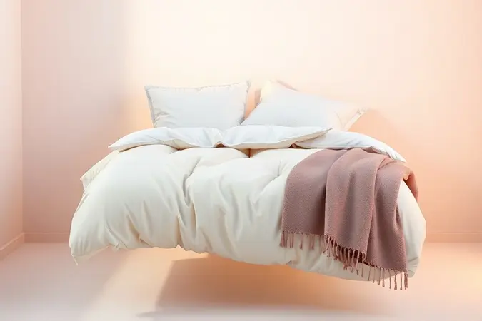

Você já entrou em um quarto de hotel e sentiu um desejo imediato de mergulhar naquela cama impecável? Ter essa mesma sensação de conforto e sofisticação na sua própria casa é mais simples do que parece.

Uma cama posta não é apenas sobre estética; é sobre criar um santuário de descanso que melhora a qualidade do seu sono e o seu bem-estar.

Neste guia completo, vou te mostrar o passo a passo exato, desde a escolha dos fios do lençol até os segredos das camadas e texturas, para você dominar a arte da cama posta e elevar o nível da sua decoração hoje mesmo.

<SummaryList products={frontmatter.top_products} />

## O que é Cama Posta e por que ela transforma o seu dia?

Uma 'cama posta' é muito mais do que apenas arrumar o quarto. É a prática de transformar sua cama em um convite para o descanso, criando um espaço que parece saído das páginas de uma revista de decoração.

Imagine acordar e ser recebido por um ambiente que transmite organização, calma e acolhimento. Essa pequena mudança na sua rotina matinal tem o poder de alterar completamente seu humor e produtividade ao longo do dia.

Mas os benefícios vão além da estética. Organizações como a National Sleep Foundation destacam que quartos bem arrumados reduzem significativamente os níveis de estresse e criam condições ideais para o descanso.

Quando sua cama está caprichosamente posta, sua mente entende que aquele é um espaço dedicado ao relaxamento, preparando seu corpo para um sono mais profundo e reparador. É como se cada dobra no lençol estivesse dizendo: 'Aqui você pode esquecer as preocupações'.

## Os Elementos Essenciais: A Base para uma Cama de Revista

Para criar uma cama que parece ter sido fotografada para um catálogo de hotel cinco estrelas, você precisa começar com os elementos certos.

Um bom colchão e lençóis de qualidade são seus alicerces, enquanto travesseiros variados e um edredom aconchegante acrescentam as camadas de conforto e sofisticação que fazem toda diferença. Vamos desmontar cada peça desse quebra-cabeça para você.

### Pillow Top: O segredo do conforto das nuvens

<ProductBox 
  title={frontmatter.top_products[0].title} 
  image={frontmatter.top_products[0].image} 
  link={frontmatter.top_products[0].link} 
/>

Já se perguntou porque algumas camas de hotel parecem tão macias que você tem vontade de afundar nelas? O segredo pode estar no pillow top.

Essa camada extra, que fica na superfície do colchão, é feita de materiais como espuma memory foam ou fibras especiais que imitam a sensação de deitar em nuvens.

O verdadeiro diferencial do pillow top está na maneira como ele distribui a pressão do seu corpo. Para quem sofre com dores nas costas ou simplesmente quer um upgrade na qualidade do sono, essa camada funciona como um abraço que cede no lugar certo.

E para aqueles que temem que o calor acumule, existem versões com tecnologia de respirabilidade que mantêm você fresco o ano inteiro.

Além do conforto imediato, o pillow top protege a estrutura principal do seu colchão, estendendo sua vida útil e garantindo que seu investimento dure mais. É aquela camada extra que faz você pensar: 'Por que não fiz isso antes?'

### Protetores de Colchão e Travesseiro: Durabilidade e Saúde

<ProductBox 
  title={frontmatter.top_products[1].title} 
  image={frontmatter.top_products[1].image} 
  link={frontmatter.top_products[1].link} 
/>

Os protetores são os guardiões invisíveis do seu sono. Imagine uma barreira que mantém ácaros, poeira e bactérias longe do lugar onde você passa um terço da sua vida. Esses acessórios não são um luxo, são uma necessidade para quem valoriza um ambiente saudável.

Para famílias com crianças ou pessoas que sofrem com alergias respiratórias, os protetores são indispensáveis.

Eles criam uma camada impermeável que bloqueia líquidos, previne manchas e neutraliza odores, tudo enquanto mantêm a respirabilidade para que você não abra mão do conforto.

A escolha certa pode durar anos, protegendo seu investimento no colchão e mantendo seu espaço de descanso livre de agentes que interferem em uma noite tranquila. Pense neles como um seguro para sua saúde e para o seu bolso.

### Jogo de Cama: Como escolher o tecido e a contagem de fios

<ProductBox 
  title={frontmatter.top_products[2].title} 
  image={frontmatter.top_products[2].image} 
  link={frontmatter.top_products[2].link} 
/>

O momento da verdade: escolher o jogo de cama que vai definir a experiência sensorial do seu sono. A contagem de fios é importante, sim, mas não é o único fator. Pense nela como um indicador de densidade do tecido.

Aqueles com 200 a 300 fios oferecem um equilíbrio perfeito entre leveza e durabilidade, ideais para climas tropicais.

Mas e quando você quer aquele toque luxuoso que faz você passar os dedos pelo tecido só pelo prazer da sensação? É aí que entram os jogos com 400 fios ou mais, geralmente em algodão egípcio ou fibras de bambu.

Esses materiais têm uma maciez que melhora com cada lavagem, como um vinho que se aprimora com o tempo.

Lembre-se: mais importante do que o número é a qualidade da fibra. Um algodão pima com 300 fios pode oferecer uma experiência mais agradável do que um tecido sintético com contagem maior. Escolha pelo toque, não apenas pela etiqueta.

## Passo a Passo: Como Montar uma Cama Posta de Luxo

Agora que você tem seus elementos, vamos à montagem. O segredo está nas camadas, como construir um bolo perfeito onde cada nível adiciona algo especial. Comece com um colchão limpo e protegido, e siga esta sequência para transformar seu quarto em um oásis pessoal.

### Camada 1: O Lençol de Elástico bem esticado

O primeiro contato da sua pele com a cama deve ser perfeito. Por isso, comece com um lençol de elástico que parece ter sido costurado por medida para seu colchão. O material faz toda diferença: algodões mais finos para verão, misturas que retêm calor para inverno.

Quando você puxa o lençol e ele se ajusta como uma luva, sem criar aquelas bolhas irritantes durante a noite, você sabe que acertou na escolha. É essa base impecável que define todo o resto da arrumação, criando uma superfície lisa que parece convidar para o descanso.

### Camada 2: O Sobre Lençol e a Dobra Envelope

Esta é a camada que seu hóspede vê quando entra no quarto. O sobre lençol deve ser bem esticado, com as bordas chegando exatamente ao chão. A técnica da dobra envelope é o que separa uma cama arrumada de uma cama posta com classe.

Para fazer a dobra envelope, puxe o sobre lençol sobre o edredom e então dobre-o para trás, criando uma camada definida que mostra tanto o tecido do sobre lençol quanto o edredom abaixo.

É como a lapela de um terno bem cortado: um detalhe pequeno que comunica sofisticação.

### Camada 3: Edredons e Colchas para Volume e Textura

<ProductBox 
  title={frontmatter.top_products[3].title} 
  image={frontmatter.top_products[3].image} 
  link={frontmatter.top_products[3].link} 
/>

É aqui que a magia acontece. Os edredons, especialmente os de penas de ganso, oferecem aquela leveza quente que parece um abraço. As colchas, por sua vez, trazem textura e padrões que definem o estilo do seu quarto.

No inverno, você pode usar o edredom como camada principal e a colcha como elemento decorativo. No verão, inverta: a colcha se torna funcional e o edredom pode ser uma camada mais fina guardada no pé da cama para noites mais frescas.

A combinação certa cria profundidade visual e convida você a se aconchegar.

## O Toque Final: Decoração e Estilo

Uma cama posta sem os toques finais é como um bolo sem cobertura. Use almofadas, mantas e detalhes decorativos para injetar sua personalidade no espaço. Pense nesses elementos como acessórios que completam o visual, assim como um colar ou relógio finalizam um look.

### Travesseiros e Almofadas: A regra do empilhamento ideal

<ProductBox 
  title={frontmatter.top_products[4].title} 
  image={frontmatter.top_products[4].image} 
  link={frontmatter.top_products[4].link} 
/>

Quantos travesseiros são demais? Depende do efeito que você quer criar. Para uma cama de casal, comece com dois travesseiros de dormir grandes no fundo contra a cabeceira.

Na frente, coloque dois travesseiros de tamanho médio, e complete com duas ou três almofadas decorativas menores.

O segredo está na progressão de tamanhos, criando uma pirâmide visual que guia o olhar. Se você prefere algo mais minimalista, reduza para os travesseiros essenciais de dormir e uma única almofada decorativa. É seu espaço: faça-o refletir seu estilo.

### Mantas e Peseiras: Criando contraste e aconchego visual

<ProductBox 
  title={frontmatter.top_products[5].title} 
  image={frontmatter.top_products[5].image} 
  link={frontmatter.top_products[5].link} 
/>

Esses são os elementos que fazem alguém pensar: 'Eu preciso me deitar ali agora'. Uma manta cuidadosamente dobrada no pé da cama não só é funcional para noites frias, mas adiciona uma camada de textura que quebra a monotonia dos tecidos lisos.

As peseiras, aquelas peças decorativas que ficam na parte inferior da cama, são como a assinatura do seu estilo. Escolha uma com um padrão ou cor que complemente, mas não combata, as outras cores do quarto.

Quando bem executada, essa combinação parece ter sido curada por um decorador profissional.

## Dicas de Especialista para uma Experiência Sensorial

Transformar seu quarto em uma experiência para os sentidos vai além do visual. Envolve texturas, aromas e até a qualidade do ar. São esses detalhes que transportam você para um estado de relaxamento profundo assim que cruza a porta.

### Água de Lençol e Aromaterapia: O cheiro de hotel em casa

<ProductBox 
  title={frontmatter.top_products[6].title} 
  image={frontmatter.top_products[6].image} 
  link={frontmatter.top_products[6].link} 
/>

Você já notou como quartos de hotel têm aquele cheiro característico de limpeza e frescor? Você pode recriar isso com uma água de lençol feita com óleos essenciais.

Borrifar uma mistura com lavanda ou camomila nos lençóis antes de dormir prepara sua mente para o relaxamento.

Faça sua própria versão: em uma garrafa spray, misture água destilada com algumas gotas do seu óleo essencial favorito. Aplique a cerca de 30 cm do tecido para evitar manchas.

Em minutos, seu quarto terá aquele aroma calmante que sinaliza para seu cérebro: 'Hora de desligar'.

### Como combinar cores e estampas sem erro

A regra de ouro: escolha uma cor principal, uma secundária e um acento. Se sua colcha tem estampa, mantenha os lençóis em cor sólida que aparece na estampa. Por exemplo, uma colcha floral com rosas em fundo azul combina perfeitamente com lençóis azuis sólidos.

Para quem tem medo de errar, comece com tons neutros (branco, cinza, bege) e adicione cor através de almofadas e mantas. Assim, você pode mudar o visual conforme as estações sem precisar substituir os itens principais. É como ter um guarda-roupa para sua cama.

## Diferenças na Arrumação: Cama de Casal vs. Solteiro

A abordagem muda conforme o tamanho da cama, mas os princípios permanecem. Em uma cama de casal, você tem espaço para criar verdadeiras composições com múltiplos travesseiros e camadas. É uma tela grande onde pode expressar sua criatividade.

Já a cama de solteiro exige precisão maior. Use travesseiros menores e pense em composições verticais em vez de horizontais.

Para quartos multifuncionais (escritório durante o dia, quarto de hóspedes à noite), escolha cores neutras e peças que possam ser facilmente guardadas quando não em uso.

## Erros comuns que detonam o visual da sua Cama Posta

Alguns deslizes podem desfazer todo seu esforço. O primeiro: excesso de padrões. Se sua colcha é estampada, seus lençóis devem ser lisos. O segundo: falta de camadas. Uma cama com apenas lençol e cobertor parece incompleta, como uma frase sem ponto final.

O terceiro erro é esquecer a manutenção diária. Cinco minutos pela manhã para ajustar as camadas mantêm aquele visual de revista durante todo o dia. Lembre-se: consistência é o que transforma um projeto em um hábito.

## Conclusão

Transformar sua cama em um santuário pessoal é um dos atos mais poderosos de autocuidado que você pode praticar. Não se trata apenas de estética, mas de criar um espaço que respeita seu descanso, honra seu bem-estar e reflete o valor que você dá a si mesmo.

Quando você abre a porta do quarto e encontra uma cama perfeitamente posta, está recebendo uma mensagem clara: 'Você merece este cuidado, este conforto, esta beleza'.

Comece simples. Escolha um jogo de cama que faça seus olhos brilharem, dedique cinco minutos pela manhã para o ritual da arrumação, e observe como essa pequena mudança se espalha para outras áreas da sua vida.

A qualidade do seu sono melhora, seu estresse diminui, e você começa cada dia em um espaço que não apenas lhe pertence, mas que foi cuidadosamente preparado para recebê-lo.

Sua cama posta não é apenas um lugar para dormir: é um lembrete diário de que você valoriza seu próprio bem-estar.

## Perguntas Frequentes (FAQ) sobre Cama Posta

Quantos travesseiros devo usar? Para uma cama de casal, 2 a 4 travesseiros oferecem equilíbrio entre conforto e estilo. Comece com dois grandes para dormir e adicione travesseiros decorativos conforme seu gosto.

Qual tecido escolher para climas quentes? Algodão leve com contagem de 200 a 300 filos ou linho são suas melhores opções. Ambos respiram bem e mantêm você fresco durante a noite.

Como manter a cama arrumada com animais de estimação? Invista em protetores impermeáveis e escolha tecidos mais escuros que disfarçam pelos. Uma colcha fácil de lavar que você pode remover rapidamente também ajuda.

A água de lençol mancha? Se aplicada corretamente (a 30 cm de distância), não. Use água destilada e óleos essenciais de qualidade, e sempre teste primeiro em uma área pequena.

Posso ter uma cama posta luxuosa com orçamento limitado? Absolutamente. Invista em um bom jogo de cama de algodão como base e use almofadas e mantas para adicionar camadas visuais. Às vezes, menos é mais quando bem executado.