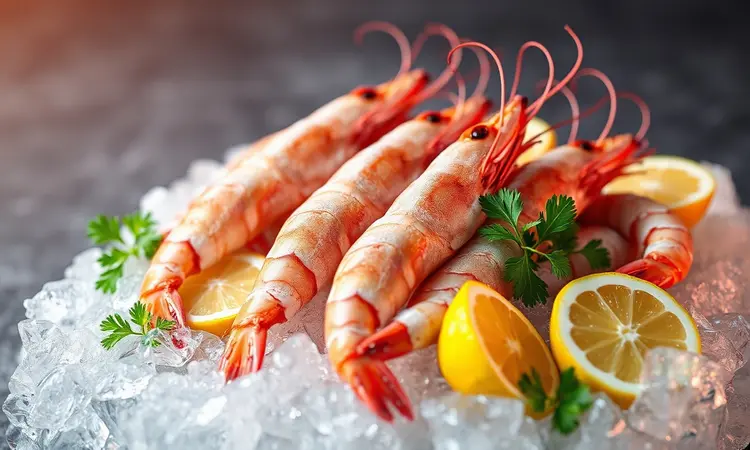
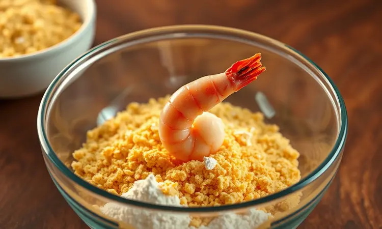
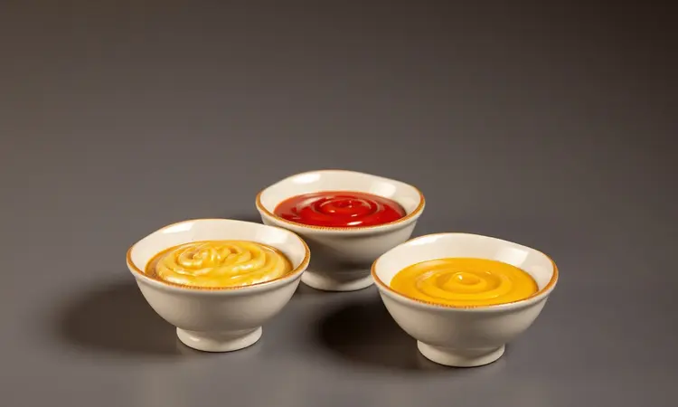

Você já tentou fazer camarão empanado em casa e acabou com um resultado murcho ou, pior, borrachudo? A boa notícia é que você pode sim preparar um camarão digno de restaurante usando a sua fritadeira sem óleo.

Neste guia, eu vou te ensinar o passo a passo definitivo para conseguir aquela casquinha dourada e ultra-crocante por fora, mantendo a suculência do fruto do mar por dentro.

De dicas sobre o tipo de farinha até o tempo exato de cozimento, você vai dominar a arte do camarão na Air Fryer em poucos minutos.

<SummaryList products={frontmatter.top_products} />

## Por que fazer camarão empanado na Air Fryer?

Imagine conseguir aquela crocância de restaurante sem precisar encher sua casa com o aroma de óleo frito, sem aquele trabalho de limpeza pesada depois. A Air Fryer transforma esse sonho em realidade.

Ela circula o calor de forma tão inteligente que cada camarão fica suculento por dentro enquanto desenvolve uma casquinha irresistível. Você reduz drasticamente a gordura, mas mantém todo o prazer.

É perfeito para quando você quer impressionar os amigos com uma entrada rápida ou simplesmente se entregar a um lanche especial sem culpa.

## Como escolher o melhor camarão para empanar (Tamanho e Limpeza)

Depois de entender o poder da sua Air Fryer, o próximo passo é escolher o protagonista. Camarões médios a grandes são seus melhores aliados - eles têm corpo suficiente para não secar durante o processo e oferecem aquela satisfação de um bocado generoso.

Evite os pequenos; eles podem se tornar apenas uma sombra do que você esperava.

Na limpeza, atenção àquele detalhe que faz diferença: retire completamente a casca, a cabeça e a linha escura nas costas (o intestino).

Um enxágue rápido em água corrente seguido de uma secagem cuidadosa com papel toalha é seu ritual para garantir que o tempero e o empanado se agarrem de verdade, criando textura em cada milímetro.

## O Segredo da Crocância: Panko vs. Farinha de Rosca Comum

<ProductBox 
  title={frontmatter.top_products[0].title} 
  image={frontmatter.top_products[0].image} 
  link={frontmatter.top_products[0].link} 
/>

Agora chegamos ao divisor de águas: a escolha da farinha. A panko japonesa é feita de pães sem casca, resultando em flocos maiores e mais aerados.

Essa estrutura cria uma crocância leve, quase como uma textura de restaurante especializado, que mantém sua magia por mais tempo e absorve menos óleo. Você sentirá uma diferença notável no peso final do prato.

A farinha de rosca comum oferece uma camada mais densa e uniforme, com boa aderência. Se você busca um empanado tradicional, ela funciona bem. Uma estratégia inteligente é combinar ambas: use a panko para a leveza e a rosca para uma base consistente.

Essa mistura cria um equilíbrio que satisfaz tanto o paladar quanto a expectativa visual.

## Utensílios que facilitam o preparo na Air Fryer

<ProductBox 
  title={frontmatter.top_products[1].title} 
  image={frontmatter.top_products[1].image} 
  link={frontmatter.top_products[1].link} 
/>

Com sua farinha escolhida, alguns utensílios específicos tornam o processo quase uma brincadeira. Um pulverizador de óleo (spray) é essencial - ele distribui uma fina camada de gordura que garante o dourado uniforme sem exageros.

Pinças resistentes são suas melhores amigas para manusear os camarões sem danificar o empanado delicado. Se sua Air Fryer possui cestos multinível, aproveite para otimizar espaço, mas lembre-se: distribuição é chave para evitar áreas sem cozimento.

## Ingredientes para o Camarão Empanado Perfeito

Para montar seu camarão ideal, você precisa de: camarões limpos e descascados (os grandes, como já discutimos), farinha de trigo, farinha de rosca (ou panko), ovos batidos para servir como "cola" natural, e temperos como sal, pimenta-do-reino e páprica para dar aquela personalidade.

Um fio de azeite final (ou spray) completa o conjunto. Com esses elementos simples, você está armado para criar algo que compete com qualquer restaurante.

## O Truque do Spray de Azeite para um Dourado Uniforme

<ProductBox 
  title={frontmatter.top_products[2].title} 
  image={frontmatter.top_products[2].image} 
  link={frontmatter.top_products[2].link} 
/>

O spray de azeite não é apenas uma questão de saúde, mas de economia e resultado visual. Modelos como o da Bertolli são formulados para altas temperaturas, garantindo que o alimento seja revestido de maneira leve e eficiente.

Versões reutilizáveis, onde você coloca seu próprio óleo, são ainda mais econômicas e sustentáveis.

Evite sprays tradicionais de aerosóis, que podem deixar resíduos difíceis na sua Air Fryer. Optar por sprays sem propelentes ou de refil protege tanto sua saúde quanto a durabilidade do aparelho.

Essa pequena escolha transforma uma simples gota de óleo em uma casca dourada e profissional.

## Passo a Passo: Como empanar camarão de forma prática

Depois de ter tudo organizado, o empanamento em si é um ritual simples de três etapas. Prepare três tigelas: farinha de trigo, ovos batidos e sua farinha de rosca (ou panko).

Passe cada camarão na farinha de trigo primeiro (para secar a superfície), depois no ovo (para criar aderência) e finalmente na farinha de rosca, pressionando gentilmente para garantir cobertura total.

Para um toque extra de sabor, misture ervas ou especiarias diretamente na farinha de rosca antes de começar.

## Tempo e Temperatura: Como evitar que o camarão fique borrachudo

Esta é a fórmula secreta para evitar aquela frustração borrachuda: pré-aqueça sua Air Fryer a 200°C. Coloque os camarões e programe 8 a 10 minutos. Na metade do tempo, vire-os com suas pinças para um dourado uniforme.

Lembre-se da secagem completa antes do empanamento - qualquer umidade residual sabotará sua crocância. Seguindo esses números, você terá um prato perfeito em cerca de 15 minutos total.

## Variação Saudável: Camarão na Air Fryer sem empanar (Low Carb)

Se você quer uma versão ainda mais leve, experimente o camarão direto na Air Fryer sem empanado. Tempere com salsinha, coentro, limão e um toque de alho. Coloque na cesta a 200°C por aproximadamente 10 minutos.

Esta técnica reduz carboidratos drasticamente enquanto preserva a maciez e o sabor natural do fruto do mar. É ideal para dietas low carb ou simplesmente para dias que pedem refeições descomplicadas e saudáveis.

## 3 Molhos caseiros que harmonizam com camarão frito

Um bom molho transforma seu camarão empanado em uma experiência completa. O molho tártaro oferece um cremoso levemente ácido que complementa o sabor do mar. Para quem gosta de adrenalina no paladar, um molho de pimenta ou aioli traz intensidade vibrante.

E se você busca frescor, um molho de iogurte com ervas equilibra a crocância com uma leveza refrescante. Experimente e descubra qual combina melhor com seu momento.

## Erros comuns ao fazer frutos do mar na fritadeira elétrica

Para garantir sucesso constante, evite esses tropeços: não ignore o pré-aquecimento - uma Air Fryer fria resulta em camarões moles. Nunca pule a secagem completa antes do empanamento, ou você terá uma camada encharcada.

Respeite rigorosamente o tempo e temperatura recomendados, pois desvios levam a mal cozimento ou queimados. E nunca sobrecarregue a cesta - o calor precisa circular livremente para criar aquela crocância ideal que você busca.

## Perguntas Frequentes (FAQ) sobre Camarão na Air Fryer

Cozinhar camarão na Air Fryer é intuitivo, mas algumas dúvidas surgem naturalmente. Qual a temperatura ideal? Pré-aqueça a 200°C para a crocância perfeita. Quanto tempo? 8 a 10 minutos geralmente bastam, ajustando conforme o tamanho dos camarões. É necessário óleo?

Um spray leve ajuda, mas não é obrigatório para um resultado saboroso - você pode escolher a versão mais light. Com essas respostas, você tem controle total sobre seu resultado.

## Conclusão

Dominar o camarão empanado na Air Fryer é mais que seguir um passo a passo - é entender os pequenos detalhes que transformam uma tentativa comum em um resultado extraordinário.

Desde a escolha do camarão até o tipo de farinha, desde o spray de azeite até o tempo exato, cada decisão contribui para aquela casquinha dourada que resiste ao toque e mantém a suculência interior.

Você não precisa ser um chef profissional para criar algo que impressiona. Com essas técnicas, sua próxima experiência será tão satisfatória visualmente quanto no paladar.

Agora é hora de colocar tudo em prática e descobrir como seu camarão pode se tornar o protagonista de qualquer mesa. Experimente, ajuste conforme seu gosto e compartilhe esse novo talento com quem você ama.