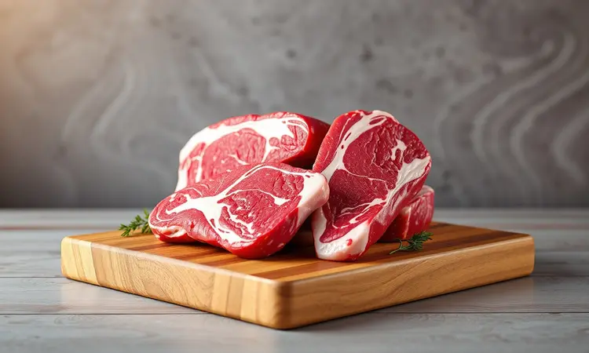
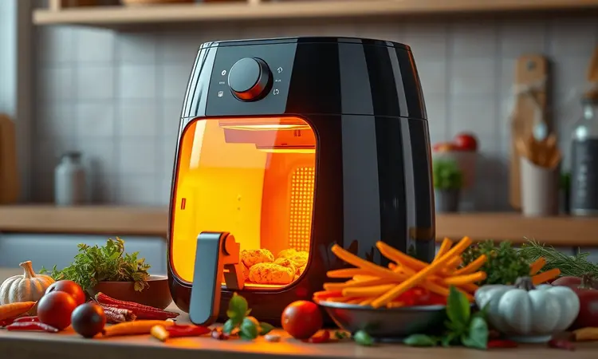
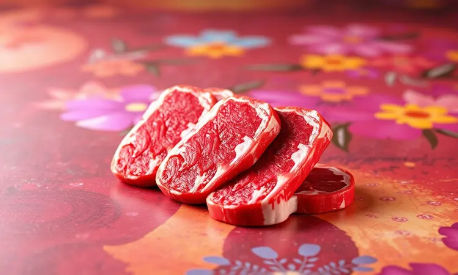

Já aconteceu com você? Você investe em uma bela peça de capa de contrafilé, mas na hora de preparar fica aquela dúvida cruel: será que vai virar um 'chinelo' na airfryer?

A verdade é que esse medo é mais comum do que você imagina, mas também é completamente desnecessário. A capa de contrafilé não só fica espetacular na airfryer como pode se tornar seu corte favorito para dias práticos, quando a churrasqueira fica só na vontade.

Eu vou te guiar, passo a passo, para transformar essa peça em uma experiência digna dos melhores restaurantes - e o melhor, tudo dentro da sua cozinha.

<SummaryList products={frontmatter.top_products} />

## O que é a Capa de Contrafilé e por que prepará-la na Airfryer?

Imagine o contrafilé, aquele corte tradicional que já conquistou seu paladar. Agora pense nele com um colchãozinho extra de gordura que, ao derreter, banha toda a carne com sabor intenso.

Isso é a capa de contrafilé, a parte superior do contrafilé que inclui uma generosa camada gordurosa.

E sim, ela é conhecida por nomes como bife de tira ou picanha, mas a experiência gustativa é única: uma combinação de textura macia com um sabor que te transporta para uma churrascaria.

Prepará-la na Airfryer é como descobrir um atalho para a perfeição. O ar quente circulante atua como um mestre churrasqueiro, selando os sucos para dentro enquanto cria uma crosta dourada que faz seus olhos brilharem antes mesmo da primeira mordida.

E o melhor: sem a necessidade de ficar virando espetos ou lidando com fumaça. É praticidade que não sacrifica sabor.

### Diferença entre o Contrafilé e a Capa de Contrafilé

Enquanto o contrafilé tradicional é adorado por sua versatilidade, servindo bem em grelhados diversos, a capa de contrafilé carrega uma personalidade mais marcante.

Aquela gordura que a envolve não é apenas estética - ela derrete durante o cozimento, permeando cada fibra com sabor e garantindo uma suculência que resiste até mesmo ao cozimento mais intenso.

Se você busca uma experiência mais robusta e memorável, onde cada mordida é uma celebração de texturas, a capa é sua escolha certeira.

## Como Escolher a Melhor Peça no Açougue (O Pulo do Gato)

A jornada para uma capa de contrafilé perfeita começa muito antes da airfryer, no balcão do açougue. Pense nisso como escolher um vinho: você observa a cor, sente o aroma, avalia a textura.

Aqui, a cor vermelho vivo e homogênea é seu primeiro sinal de frescor - manchas escuras são avisos que você não quer ignorar.

Mas o verdadeiro segredo está no marmoreio, aquela rede delicada de gordura entrelaçada entre as fibras que promete maciez e sabor. Peça ao açougueiro para mostrar os cortes e observe: quanto mais intrincado esse desenho branco, mais suculenta sua carne será.

E não tenha medo da gordura externa - ela deve ser clara e consistente, uma capa protetora que se transformará em sabor.

Toque a peça levemente: ela deve oferecer uma resistência firme, mas não dura. Esse simples gesto revela mais sobre a qualidade do que qualquer rótulo.

## Ingredientes e Temperos: Do Básico ao Gourmet

Às vezes, o extraordinário começa com o simples. Sal e pimenta-do-reino já são uma dupla capaz de revelar toda a personalidade da capa de contrafilé. Mas e se você quiser criar uma sinfonia de sabores?

Para um toque que eleva o prato sem complicação, alho e cebola em pó são aliados infalíveis. Eles aderem perfeitamente à carne, criando uma crosta aromática que promete surpreender.

Mas se você está num dia especial, imagine o aroma de alecrim e tomilho frescos dançando com o suco da carne - é um convite ao mediterrâneo que cabe na sua airfryer.

Marinar? Absolutamente. Uma mistura de azeite, suco de limão e uma colher de mostarda não apenas amacia as fibras como abre portas para sabores que penetram profundamente.

A magia dos temperos está justamente nessa liberdade: você pode seguir receitas ou criar suas próprias combinações. A única regra é confiar no seu paladar.

## Guia Passo a Passo: Capa de Contrafilé na Airfryer Perfeita

Respire fundo e imagine o resultado: carne dourada por fora, rosa suculenta por dentro, com aquela crocância na gordura que faz o coração acelerar. Vamos transformar essa imagem em realidade.

### 1. Preparação e a Regra da Temperatura Ambiente

Esqueça carne gelada direto na airfryer. Reserve meia hora antes do cozimento para seu contrafilé respirar fora da geladeira. Esse tempo não é apenas logística - é o momento em que a carne relaxa, permitindo que o calor a atinja de forma uniforme, sem choque térmico.

E enquanto ela descansa, os temperos que você escolheu trabalham silenciosamente, penetrando mais profundamente a cada minuto. Pense nisso como um pré-aquecimento emocional para o que está por vir.

### 2. O Segredo do Pré-aquecimento

Sua airfryer precisa estar tão pronta quanto você. Cinco minutos de pré-aquecimento a 200°C fazem toda a diferença: criam o ambiente perfeito para selar instantaneamente a superfície da carne, aprisionando os sucos como um cofre. O resultado?

Uma crosta dourada que protege a suculência interna enquanto anuncia, pelo aroma que começa a tomar sua cozinha, que algo especial está sendo preparado.

### 3. Posicionamento da Carne: Gordura para Cima ou para Baixo?

Essa decisão define a personalidade do seu prato. Posicionar a gordura para cima é como programar um banho de sabor: conforme derrete, ela escorre sobre toda a peça, garantindo suculência em cada fatia.

Já com a gordura para baixo, você permite que o calor acesse diretamente a fonte do sabor, criando uma crosta tão crocante que parece ter saído de uma churrasqueira profissional.

Qual escolher? A primeira opção garante mais umidade; a segunda, mais textura. Ou você pode experimentar ambas em ocasiões diferentes - afinal, a melhor maneira de descobrir sua preferência é vivendo ambas as experiências.

### 4. Tempo e Virada: Como Acompanhar o Cozimento

Aqui está onde sua pacião encontra ciência. Para uma peça de espessura média, quatorze a dezesseis minutos a 200°C costumam ser o ponto ideal. Mas não coloque tudo no relógio - na metade do tempo, faça a virada cerimonial.

A carne já terá formado uma crosta dourada de um lado, e você está prestes a repetir a magia do outro.

Para quem não gosta de incertezas, um termômetro culinário é seu melhor amigo. Ele transforma adivinhações em certezas, garantindo que o ponto desejado seja alcançado com precisão absoluta.

### 5. O Descanso Obrigatório para Reter os Sucos

Este é o teste final de pacião - e também o mais recompensador. Quando o temporizador apita, a tentação de partir imediatamente para a degustação é quase irresistível. Mas espere.

Cinco a dez minutos de descanso não são uma pausa, são uma transformação vital: os sucos que fugiram para as bordas durante o cozimento agora retornam calmamente, distribuindo-se uniformemente por toda a peça.

Cortar antes desse momento é como abrir uma garrafa de vinho sem deixá-la respirar - você perde parte da experiência. A espera será recompensada com carne mais macia, mais saborosa e, principalmente, mais suculenta.

## Tabela de Tempo e Temperatura por Ponto da Carne

Transforme preferências pessoais em resultados previsíveis:

- **Mal passada (selada por fora, fria por dentro):** 200°C por 6 a 8 minutos

- **Ao ponto para mal passada:** 200°C por 8 a 10 minutos

- **Ao ponto (rosa perfeita):** 200°C por 10 a 12 minutos

- **Bem passada (pouco rosa):** 200°C por 12 a 15 minutos

Lembre-se: cada airfryer tem sua personalidade, e a espessura da carne é sua variável mais importante. Use esses números como ponto de partida, não como destino final.

## Melhores Airfryers para Carnes e Grelhados

<ProductBox 
  title={frontmatter.top_products[0].title} 
  image={frontmatter.top_products[0].image} 
  link={frontmatter.top_products[0].link} 
/>

Se você leva a sério a arte de grelhar sem fogo, alguns modelos se destacam como verdadeiros parceiros de cozinha.

A WAP Air Fryer Barbecue Digital (10L, 1800W) impressiona com suas doze funções especializadas, incluindo grelhado com fumaça controlada - perfeita para quem deseja a experiência completa do churrasco sem sair de casa.

Para famílias que valorizam versatilidade, a Philco Air Fryer Oven de 12L funciona como forno, grill e airfryer em um único aparelho. Já a Oster Forno e Fryer de 15L traz um detalhe encantador: seu espeto giratório promove um cozimento tão uniforme que parece mágica.

Ao escolher, pense na potência (acima de 1700W para carnes) e no espaço que você tem disponível. O modelo ideal é aquele que cabe na sua cozinha e na sua rotina.

## Use um Termômetro Culinário para Nunca Errar o Ponto

<ProductBox 
  title={frontmatter.top_products[1].title} 
  image={frontmatter.top_products[1].image} 
  link={frontmatter.top_products[1].link} 
/>

Conhece aquela insegurança sobre o ponto da carne? Ela desaparece quando você tem dados concretos nas mãos. Um termômetro digital tipo espeto não é apenas um instrumento, é um seguro contra decepções.

Ele mede de -50°C a +300°C, acompanhando em tempo real a transformação interna da sua carne.

Evite os termômetros a laser para essa missão - eles revelam apenas a superfície. Marcas como Tramontina e KitchenAid oferecem opções duráveis e precisas, investimentos pequenos que pagam dividendos enormes em confiança na cozinha.

## 5 Dicas de Especialista para a Carne não Ficar Dura

1. **Escolha inteligente:** Comece com carne de qualidade. O marmoreio entre as fibras não é apenas bonito, é seu garantidor de maciez.

2. **Tempo de namoro:** Temperar com antecedência não é preguiça, é estratégia. Deixe os sabores se conhecerem antes do calor intenso.

3. **Amaciamento natural:** Marinadas com limão ou vinagre são como massagens para as fibras da carne, relaxando-as gentilmente.

4. **Vigilância térmica:** Na airfryer, tempo extra pode ser inimigo. Ajuste conforme a espessura e prefira menos tempo do que arriscar o ressecamento.

5. **Ritual final:** O descanso pós-cozimento não é opcional. É a etapa que transforma carne cozida em experiência memorável.

## Erros Comuns no Preparo da Capa de Contrafilé

Alguns deslizes frequentes podem roubar a glória da sua capa de contrafilé. Ignorar o tempero adequado é o primeiro - sem ele, você está servindo proteína, não uma celebração de sabores.

Pular a etapa de temperatura ambiente é como correr uma maratona sem alongamento: você termina, mas não da melhor forma possível.

Outra armadilha é confiar cegamente no temporizador, sem considerar que cada peça tem sua espessura única. E o erro mais autossabotador? Cortar a carne imediatamente após o cozimento, liberando valiosos sucos que deveriam permanecer dentro.

## Perguntas Frequentes (FAQ)

### Posso fazer com a carne congelada?

Sim, e essa é uma das superpoderes da airfryer! Carne congelada direto para o cozimento não só é possível como pode surpreender. Basta adicionar cinco a oito minutos ao tempo original, mantendo a mesma temperatura.

É a solução perfeita para aqueles dias em que o planejamento falha, mas a vontade de comer bem permanece.

### Como deixar a gordura bem pururucada?

A crocância perfeita começa com cortes superficiais em forma de losangos na gordura. Eles criam canais para a gordura derreter e se espalhar, enquanto permitem que o calor acesse mais superfície.

Posicione a gordura para baixo no pré-aquecimento e prepare-se para aquele som satisfatório na primeira mordida.

### Posso usar papel alumínio dentro da Airfryer?

Sim, com inteligência. O papel alumínio pode ser um aliado para facilitar a limpeza e proteger alimentos muito pequenos. Mas pense nele como um convidado que não pode bloquear a festa: sempre deixe amplo espaço para a circulação de ar nas laterais e na parte superior.

A função da airfryer depende desse fluxo constante.

## Conclusão

E então? Aquele medo inicial de transformar sua valiosa capa de contrafilé em um 'chinelo' já parece distante, não é? O que começou como receio se transformou em um mapa detalhado para a confiança na cozinha.

Você agora sabe que a airfryer não é apenas um eletrodoméstico prático, mas uma ferramenta capaz de revelar sabores que você pensava reservados apenas para churrasqueiras tradicionais.

Cada etapa que exploramos - da escolha no açougue ao descanso final - é um convite para você se reconectar com o prazer de preparar sua própria comida, sem complicações desnecessárias.

A crosta dourada, a suculência preservada, o aroma que toma sua cozinha: tudo isso está ao seu alcance, na velocidade e praticidade que sua rotina exige.

Na próxima vez que aquela vontade de um churrasco surgir, mas o tempo ou o espaço disserem não, lembre-se: sua airfryer e essa receita estão prontas para oferecer uma experiência que vai muito além do convencional.

É hora de provar que o extraordinário vive mesmo nos detalhes - e que sua cozinha pode ser palco de memórias que começam com um simples corte de carne, mas terminam em sorrisos satisfeitos à mesa.