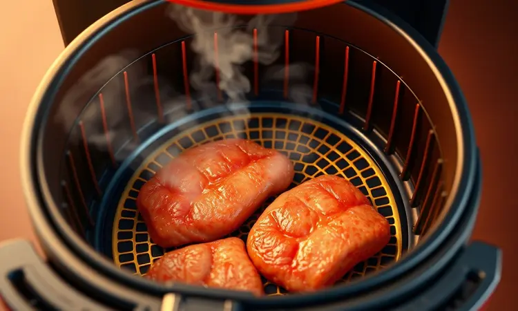
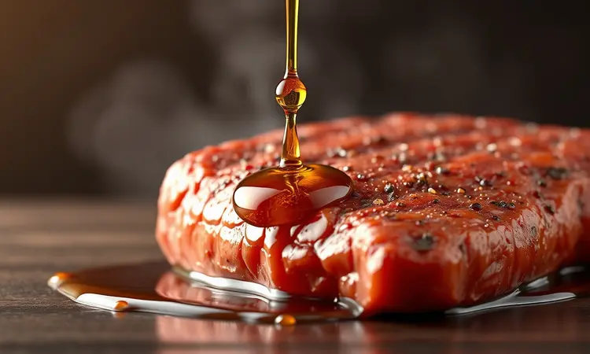

Você adora o sabor de um bom churrasco, mas mora em apartamento ou detesta a sujeira que a brasa faz? Saiba que é totalmente possível obter carnes suculentas e saborosas usando apenas sua fritadeira elétrica.

Neste guia definitivo, você vai descobrir que o churrasco na Airfryer vai muito além de uma simples carne assada.

Vamos te ensinar desde a escolha dos cortes ideais até os segredos profissionais para garantir aquele sabor defumado e a maciez perfeita, sem deixar a carne secar. Prepare-se para dominar a arte do churrasco prático e surpreender a todos no próximo almoço.

<SummaryList products={frontmatter.top_products} />

## Churrasco na Airfryer: É Possível Ter o Sabor do Churrasco de Brasa?

<ProductBox 
  title={frontmatter.top_products[0].title} 
  image={frontmatter.top_products[0].image} 
  link={frontmatter.top_products[0].link} 
/>

Imagine aquele aroma inconfundível de churrasco invadindo sua cozinha, mesmo sem uma única brasa à vista. Parece mágica, mas é pura técnica.

Capturar a essência do churrasco tradicional na sua Airfryer é não apenas possível, como pode se tornar sua nova forma favorita de cozinhar carnes.

O segredo começa com um truque simples que transforma completamente a experiência, coloque um pedaço de carvão incandescente em um recipiente próprio dentro da Airfryer.

Umedeça com um pouco de gordura ou óleo e assista ao sabor defumado se espalhar durante o cozimento, criando aquele toque defumado que você tanto ama.

Para completar a ilusão perfeita, abuse de temperos como páprica defumada e, claro, o clássico sal grosso. E aqui está uma dica que faz toda diferença, escolha cortes com bom marmoreio, como picanha ou contrafilé.

Essa gordura natural se transforma em suculência pura durante o cozimento na Airfryer.

Sim, a textura será diferente da grelha sobre carvão, mas a praticidade, a limpeza e a velocidade de preparo criam uma experiência tão satisfatória que você pode até preferir. E o sabor? Vai te surpreender.

## Os Melhores Cortes de Carne para Fazer na Fritadeira Elétrica

Uma vez que você domina a arte de simular o sabor defumado, a próxima peça do quebra-cabeça é escolher a carne certa.

Alguns cortes parecem feitos sob medida para a circulação rápida de ar quente da sua Airfryer, desenvolvendo texturas crocantes por fora enquanto mantêm a suculência perfeita lá dentro.

### Picanha e Contrafilé: Os Clássicos do Churrasco na Airfryer

Comece com sal grosso, deixando a carne descansar por cerca de 30 minutos para que o sabor penetre. Enquanto isso, sua Airfryer pré-aquece a 200°C.

Em apenas 20 a 25 minutos (virando na metade do tempo), você terá cortes dourados por fora, macios por dentro, prontos para qualquer ocasião, desde um jantar especial até um almoço despretensioso de domingo.

A gordura da picanha se transforma em uma crosta dourada que é um espetáculo à parte.

### Fraldinha e Maminha: Opções Macias e Rápidas

Se o tempo está curto mas o desejo por uma carne suculenta não, esses são seus cortes. A fraldinha oferece aquele sabor robusto que conquista paladares, enquanto a maminha surpreende com sua delicadeza.

Ambos compartilham uma qualidade preciosa, maciez que se mantém mesmo no preparo rápido da Airfryer. Com um bom tempero (falamos mais sobre isso adiante), você tem uma refeição digna de restaurante em minutos, com menos gordura que o churrasco tradicional.

### Frango: Asinhas, Tulipas e Medalhões Suculentos

As asinhas ficam com aquela crocância dourada que todo mundo adora, especialmente se você tiver a paciência de mariná-las por algumas horas antes. As tulipas, com sua carne tenra, são vasos perfeitos para absorver qualquer tempero que você escolher.

Já os medalhões transformam sua refeição em algo especial, suculentos e cheios de sabor com o tempo de cozimento correto. Experimente diferentes combinações, o frango na Airfryer é uma tela em branco para sua criatividade culinária.

## O Segredo do Sabor Defumado: Como Usar Fumaça Líquida e Sal Grosso

<ProductBox 
  title={frontmatter.top_products[1].title} 
  image={frontmatter.top_products[1].image} 
  link={frontmatter.top_products[1].link} 
/>

Aqui está onde o truque de mágica acontece de verdade. A fumaça líquida é sua aliada secreta para conquistar aquele sabor defumado autêntico. Adicione uma pequena quantidade às suas marinadas ou aplique diretamente na carne antes do cozimento.

Cuidado com a mão pesada, o segredo está na sutileza. Diferentes madeiras oferecem nuances distintas, Hickory para um sabor mais forte, Mesquite para algo mais suave.

Já o sal grosso é a alma do churrasco. Um truque profissional, passe uma fina camada de manteiga na carne antes de aplicar o sal. Isso não apenas ajuda na aderência, mas também potencializa o sabor de maneira uniforme.

Após o cozimento, retire o excesso para não salgar demais seu prato.

### O Tempero Ideal: Sal Grosso ou Sal de Parrilla?

<ProductBox 
  title={frontmatter.top_products[2].title} 
  image={frontmatter.top_products[2].image} 
  link={frontmatter.top_products[2].link} 
/>

Decidir entre esses dois é como escolher entre dois amigos igualmente bons. O sal grosso, com seus cristais generosos, cria uma crosta deliciosamente crocante que é pura felicidade para os dentes. Perfeito para cortes mais robustos que podem suportar sua intensidade.

O sal de parrilla, por outro lado, é o diplomata dos temperos. Seus cristais menores oferecem um salgamento equilibrado e uniforme, ideal para cortes que cozinham rapidamente como filés. Quer saber um segredo?

Você pode criar seu próprio sal de parrilla em casa, basta processar sal grosso no liquidificador. A escolha final depende do que você busca, textura marcante ou sabor suave e controlado.

## Passo a Passo: Como Fazer Churrasco na Airfryer Perfeito e Prático

Vamos transformar teoria em prática. Escolha seu corte favorito (já falamos dos melhores) e tempere a gosto. Enquanto isso, sua Airfryer pré-aquece a 200°C por cerca de 5 minutos. Esse passo é crucial, é o que sela os sucos da carne logo no início.

Coloque a carne na cesta com espaço para respirar, o ar precisa circular livremente para criar aquela crosta perfeita. Para uma peça média, conte com 15 a 20 minutos, virando na metade do tempo.

Esse movimento garante que todos os lados recebam o mesmo carinho do ar quente.

O momento final é tão importante quanto o cozimento, deixe a carne descansar por alguns minutos antes de fatiar. É nessa pausa que os sucos se redistribuem, garantindo que cada pedaço seja tão suculento quanto parece.

## Tabela de Tempo e Temperatura para Cada Tipo de Carne

<ProductBox 
  title={frontmatter.top_products[3].title} 
  image={frontmatter.top_products[3].image} 
  link={frontmatter.top_products[3].link} 
/>

Ter um guia de referência elimina o nervosismo do 'será que já está pronto?'. Para carnes bovinas como bifes grossos, 200°C por 8 a 10 minutos entregam o ponto perfeito. Peito de frango pede um pouco mais de paciência, 12 a 15 minutos a 180°C.

As costelinhas suínas são as divas que exigem mais tempo, de 30 a 40 minutos na mesma temperatura de 180°C. Lembre-se, esses são tempos aproximados. Seu modelo de Airfryer e a espessura exata da carne podem pedir ajustes.

Para o frango, segurança primeiro. Use um termômetro para garantir pelo menos 75°C internamente. Com pouca prática, você desenvolverá um sexto sentido para o ponto perfeito.

## 5 Dicas Infalíveis para a Carne Não Ficar Seca na Airfryer

Nada mais frustrante que uma carne seca depois de tanto cuidado. Previna isso com essas estratégias:

1. **Escolha inteligente:** Cortes como contrafilé ou picanha têm gordura natural que se transforma em suculência durante o cozimento.

2. **Marinação estratégica:** Algumas horas marinando não são luxo, são investimento em sabor e umidade.

3. **Tempo sob controle:** Exagerar no cozimento é o maior vilão da suculência. Um termômetro de carne é seu melhor aliado.

4. **Técnica de duas temperaturas:** Comece mais baixo para cozinhar por dentro, finalize mais alto para criar a crosta. O resultado é espetacular.

5. **Respeite o descanso:** Esses minutos finais de repouso são quando a mágica acontece dentro da carne.

## Acompanhamentos Essenciais: Pão de Alho, Queijo Coalho e Vegetais

<ProductBox 
  title={frontmatter.top_products[4].title} 
  image={frontmatter.top_products[4].image} 
  link={frontmatter.top_products[4].link} 
/>

Um bom churrasco não vive só de carne. O pão de alho é tão fácil que você vai se perguntar por que não fazia antes. Fatias generosas, recheio de alho e manteiga, 5 minutos a 180°C. Crocância e sabor garantidos.

O queijo coalho na Airfryer é uma revelação. 200°C transformam sua superfície em uma crosta dourada enquanto o interior derrete em cremosidade. Fique atento para não passar do ponto.

Para equilibrar, vegetais ganham vida nova na Airfryer. Cenouras, abobrinhas e brócolis com azeite e ervas, cerca de 20 minutos, trazem frescor e cor ao seu prato. Saúde e sabor numa combinação perfeita.

## Erros Comuns que Você Deve Evitar ao Fazer Churrasco Elétrico

Alguns deslizes podem transformar sua experiência culinária em decepção. O primeiro e mais comum, pular o pré-aquecimento. Esses 5 minutos iniciais são o que sela os sucos e garante a crocância ideal.

Temperar na pressa é outro erro que rouba sabor. Dê tempo para os temperos casarem com a carne. E falando em pressa, encher demais a cesta é uma armadilha clássica. O ar precisa circular livremente para cozinhar uniformemente.

Por fim, tratar todas as carnes iguais. Cada corte tem suas exigências de temperatura e tempo. Respeitar essa individualidade é o caminho para resultados consistentemente excelentes.

## Dicas de Limpeza: Como Cuidar da sua Airfryer Após o Churrasco

<ProductBox 
  title={frontmatter.top_products[5].title} 
  image={frontmatter.top_products[5].image} 
  link={frontmatter.top_products[5].link} 
/>

A melhor hora para limpar é quando o aparelho ainda está morno. Os resíduos de gordura saem com facilidade usando apenas papel toalha. Para uma limpeza mais profunda, as partes removíveis merecem um banho de 10 minutos em água morna com detergente neutro.

Importante, nunca mergulhe o aparelho completo. A parte elétrica deve permanecer seca. Para aqueles odores persistentes que às vezes ficam, uma solução natural de bicarbonato de sódio com suco de limão funciona como mágica.

Esses cuidados simples garantem que sua Airfryer esteja sempre pronta para o próximo banquete, mantendo o desempenho e a segurança por muito mais tempo.

## Conclusão

O churrasco na Airfryer representa muito mais que uma alternativa prática. É uma reinvenção inteligente de uma tradição brasileira, adaptada à vida moderna sem abrir mão do que realmente importa, o sabor que reúne pessoas à mesa.

Com as técnicas certas, você não está apenas cozinhando carne, está criando memórias.

Aquele sabor defumado que parecia impossível sem brasa agora acontece na sua cozinha, o controle preciso que elimina o nervosismo do ponto, a limpeza que transforma uma tarefa trabalhosa em algo simples.

Cada corte que você dominar, cada tempero que descobrir, cada acompanhamento perfeito que preparar, tudo se soma a uma nova forma de viver o prazer do churrasco. Sem se preocupar com o espaço, com a fumaça ou com a bagunça.

Então, prepare sua Airfryer, escolha seu corte favorito e comece essa jornada. O próximo domingo pode ser o dia em que você surpreende a todos com um churrasco que tem sabor de tradição e a praticidade que a vida moderna pede.

A mesa está posta, a carne está quase pronta, e a experiência vai provar que o melhor churrasco é aquele que você faz do seu jeito.