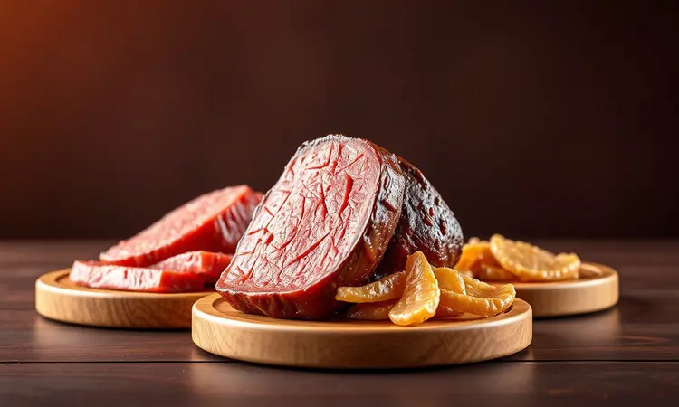
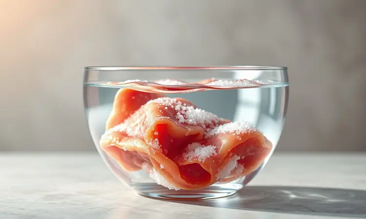
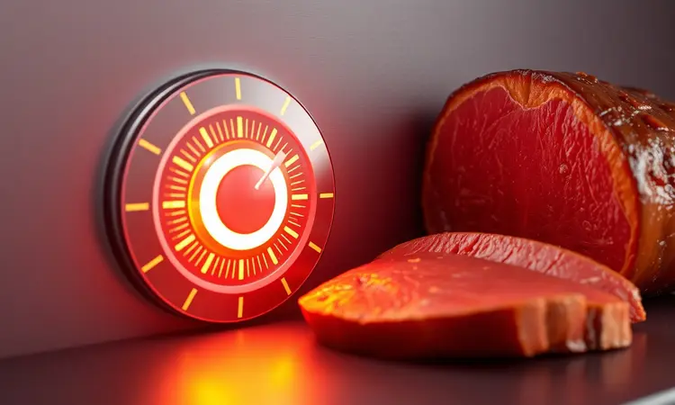
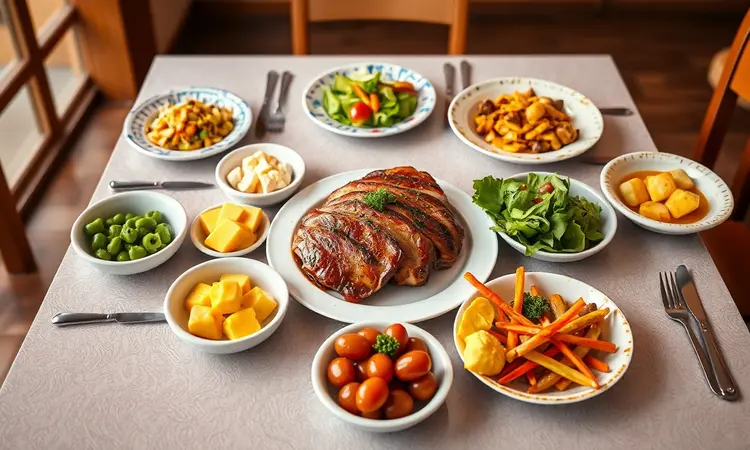

Você já passou por aquela frustração de preparar carne de sol e ela sair dura como sola de sapato? Ou então tão seca que parece que você está mastigando palha?

A ansiedade de ver aquela peça maravilhosa perder toda sua suculência na air fryer é real, o ar quente circulante pode ser traiçoeiro se você não dominar a técnica certa.

Mas imagine o contrário: uma carne de sol com interior tão macio que praticamente derrete na boca, envolta por uma crosta dourada e levemente crocante que realça cada nuance de sabor.

É exatamente isso que você vai conquistar ao seguir este guia, desde o dessalgue estratégico até os segundos exatos que separam o perfeito do ressecado.

<SummaryList products={frontmatter.top_products} />

## Por que Preparar Carne de Sol na Air Fryer?

A resposta está na promessa que a air fryer faz e cumpre: concentração de calor que sela rapidamente os sucos.

Enquanto métodos tradicionais podem ressecar a carne por exposição prolongada ao fogo direto, a circulação de ar quente da air fryer envolve uniformemente cada centímetro da peça, criando uma barreira dourada que protege a umidade interna.

É como ter um chef particular que conhece o ponto exato entre crocância e suculência. Além da textura perfeita, há a praticidade de limpeza fácil e o uso mínimo de óleo, você mantém todo o sabor característico da carne de sol sem o peso da fritura convencional.

Em minutos, você transforma uma preocupação culinária em uma certeza de sucesso.

## Diferença entre Carne de Sol, Charque e Carne Seca

Entender essas diferenças é fundamental para escolher a matéria-prima certa. A carne de sol é a mais gentil das três: passa por uma salga moderada e secagem ao ar livre, mantendo boa parte da umidade natural.

Seu sabor é marcante, porém equilibrado, e sua textura permanece maleável, características que a tornam ideal para a air fryer. Já o charque é a versão mais intensa: curado por mais tempo, perde mais água e ganha concentração de sabor, ficando mais firme.

A carne seca frequentemente passa por cozimento antes da secagem, alterando completamente sua estrutura proteica. Para nosso propósito de suculência na air fryer, a carne de sol é a estrela indiscutível.

## Como Escolher a Melhor Peça de Carne de Sol para Assar

O segredo começa antes mesmo de ligar a air fryer. Procure cortes como contrafilé ou maminha, que naturalmente possuem mais marmoreio, aquela gordura entremeada que se transforma em suculência durante o cozimento.

Observe a cor: um tom avermelhado uniforme indica boa cura. Ao toque, a carne deve ser firme mas não rígida, sinal de que reteve umidade adequada. Preste atenção especial ao nível de sal; peças muito salgadas podem comprometer o equilíbrio final mesmo após o dessalgue.

E nunca subestime a importância da espessura: cortes muito finos tendem a ressecar rapidamente, enquanto os muito grossos podem não cozinhar uniformemente.

## Passo a Passo: Como Fazer Carne de Sol na Air Fryer

Comece liberando a carne do excesso de sal, esse é o primeiro passo para garantir maciez. Depois de dessalgada e bem seca, tempere generosamente com alho, pimenta e suas ervas favoritas.

Pré-aqueça a air fryer a 200°C por 5 minutos, tempo suficiente para criar o ambiente de calor ideal. Coloque a carne no cesto, deixando espaço para a circulação de ar, e programe 15 a 20 minutos, virando na metade do tempo.

Aqui, a paciência é sua aliada: abrir a air fryer constantemente para verificar interrompe o processo de cocção uniforme. Quando terminar, deixe a carne descansar por 5 minutos antes de fatiar, esse simples gesto permite que os sucos se redistribuam por toda a peça.

### 1. O Segredo do Dessalgue Correto

Pular ou fazer mal o dessalgue é o erro mais comum que leva à carne excessivamente salgada. O processo é simples mas requer atenção: depois de lavar brevemente em água corrente, submerja a carne em água fria por 6 a 12 horas, trocando a água a cada 3 ou 4 horas.

Essa troca constante renova o meio, garantindo remoção eficiente do sal. Para cortes mais espessos, estenda o tempo; para os mais finos ou menos salgados, reduza. O teste final é provar um pedacinho antes de temperar.

Esse cuidado preliminar assegura que você controla o sabor, não o contrário.

### 2. O Corte Ideal para Manter a Maciez

Alguns cortes foram feitos para brilhar na air fryer. O contrafilé, com seu equilíbrio perfeito entre carne e gordura, oferece consistência previsível. A alcatra, um pouco mais magra, exige atenção extra ao tempo mas recompensa com textura tenra.

Se optar por peito ou paleta, lembre-se que esses cortes possuem mais tecido conjuntivo, eles se beneficiam de cozimento ligeiramente mais longo em temperatura um pouco mais baixa (180°C).

A regra de ouro: quanto menos naturalmente macio o corte, mais você deve investir no pré-preparo (dessalgue adequado, marinada mais longa) e no controle rigoroso de temperatura.

### 3. Temperos e o Toque da Manteiga de Garrafa

Os temperos não apenas agregam sabor, mas criam uma camada protetora que ajuda a reter umidade. Uma mistura de alho amassado, pimenta-do-reino moída na hora e alecrim fresco forma uma base aromática poderosa.

Massageie bem a carne com essa combinação, deixando agir por pelo menos 30 minutos. Agora, o elemento mágico: a manteiga de garrafa. Nos últimos 3 minutos de cozimento, pincele generosamente sobre a carne.

O calor da air fryer vai caramelizar seus açúcares naturais, criando uma película dourada, crocante e profundamente saborosa que sela definitivamente os sucos internos.

## Tempo e Temperatura: O Guia para não Ressecar a Carne

Essa é a equação que separa o sucesso do fracasso. Para a maioria das air fryers, 200°C por 15 a 20 minutos é a zona ideal. Mas atenção: cada modelo tem sua personalidade.

Air fryers mais potentes (acima de 1400W) podem exigir menos tempo, enquanto as menos potentes podem precisar de alguns minutos extras. A espessura da carne é o segundo fator crucial: para cada centímetro adicional, acrescente 2-3 minutos. O truque infalível?

Comece com 15 minutos, verifique, e adicione tempo em intervalos de 2 minutos até alcançar o ponto desejado. Virar na metade do tempo não é sugestão, é mandamento para douratura uniforme.

## Utensílios que Facilitam o Preparo Perfeito

Assim como um pintor precisa de bons pincéis, você precisa das ferramentas certas para transformar a carne de sol em obra-prima. Esses utensílios não são luxo, são atalhos para a perfeição consistente.

### Fritadeira Elétrica (Air Fryer) de Alta Performance

<ProductBox 
  title={frontmatter.top_products[0].title} 
  image={frontmatter.top_products[0].image} 
  link={frontmatter.top_products[0].link} 
/>

Uma air fryer com potência acima de 1400W faz mais do que esquentar rápido, ela sela os sucos da carne em segundos, criando aquela crosta protetora que mantém a umidade interna.

Modelos como a Philco Jumbo Gourmet ou Mondial AFO oferecem essa performance com capacidades que variam conforme suas necessidades.

O revestimento antiaderente de qualidade é outro detalhe crucial: permite que a carne doure sem grudar, e a limpeza posterior se torna tarefa de minutos. Sim, algumas podem ser um pouco barulhentas durante a operação, mas é o som do calor trabalhando a seu favor.

### Termômetro Culinário Digital para Carnes

<ProductBox 
  title={frontmatter.top_products[1].title} 
  image={frontmatter.top_products[1].image} 
  link={frontmatter.top_products[1].link} 
/>

Esqueça a tentativa de adivinhar o ponto perfurando a carne e perdendo sucos preciosos. Um termômetro digital com ponta de inserção dá a resposta exata em segundos: 63°C para ponto médio, 71°C para bem passado (ainda suculento).

Modelos com Bluetooth levam essa precisão a outro nível, você monitora a temperatura interna do seu smartphone enquanto a carne cozinha, sem abrir a air fryer e interromper o processo. É a tranquilidade de saber, não de supor.

### Pincel de Silicone para Culinária

<ProductBox 
  title={frontmatter.top_products[2].title} 
  image={frontmatter.top_products[2].image} 
  link={frontmatter.top_products[2].link} 
/>

Pode parecer detalhe, mas fazer a diferença entre tempero desigual e cobertura perfeita. As cerdas de silicone suportam até 230°C, permitindo que você aplique manteiga de garrafa ou azeite mesmo durante os últimos minutos de cozimento, quando a temperatura está máxima.

Não absorve odores, lava na lava-louças, e sua flexibilidade alcança cada recorte da carne. É o instrumento que garante que cada centímetro receba o toque dourado que transforma bom em excelente.

## 5 Dicas de Especialista para uma Carne de Sol Irresistível

1. **Secar é tão importante quanto dessalgar**: Depois do molho, seque muito bem a carne com papel toalha. Superfície úmida = vapor = carne cozida, não dourada.

2. **Não sobrecarregue o cesto**: Deixe espaço entre as peças para o ar circular livremente. Cozinhar em lotes pequenos garante resultados consistentes.

3. **Aprenda com sua air fryer**: Anote tempo e temperatura de cada tentativa. Cada aparelho tem suas peculiaridades, e esse diário vira seu guia personalizado.

4. **O descanso final é sagrado**: Aqueles 5 minutos após retirar da air fryer não são opcionais. É quando as fibras relaxam e reabsorvem os sucos que tentariam escapar ao primeiro corte.

5. **Fatie contra a fibra**: Identifique a direção das fibras musculares e corte perpendicularmente. Isso encurta as fibras no prato, garantindo maciez máxima a cada garfada.

## Melhores Acompanhamentos para Servir com Carne de Sol

Os acompanhamentos certos elevam a carne de sol de prato principal para experiência memorável. O arroz de leite cria contraste perfeito: sua cremosidade neutra acalma o sal característico da carne.

Uma farofa crocante de bacon e cheiro-verde oferece textura que complementa a maciez da proteína. Para frescor, salada de tomate, cebola roxa e coentro com vinagrete leve. Purê de batata com nata forma base aveludada que harmoniza com a intensidade da carne.

E para quem busca completude nutricional, abobrinha e berinjela grelhadas na própria air fryer (após a carne) absorvem os sabores residuais, criando sinergia no prato.

## Perguntas Frequentes (FAQ)

Posso congelar carne de sol já dessalgada? Sim, após o dessalgue e bem seca, congele em porções individuais. Descongele na geladeira, nunca em temperatura ambiente.

Minha air fryer não tem controle preciso de temperatura, só níveis (baixo, médio, alto). Como adaptar? Use o nível alto para pré-aquecer e os primeiros 10 minutos, depois reduza para médio-alto até completar o tempo total.

A carne de sol fica melhor com ou sem osso na air fryer? Com osso mantém um pouco mais de suculência, mas exige ajuste no tempo (acrescente 3-5 minutos). Sem osso cozinha mais uniformemente.

Posso reaquecer sem ressecar? Sim, em temperatura mais baixa (160°C) por apenas 3-4 minutos, ou até aquecer. Cubra levemente com papel alumínio se preocupado com secura.

## Conclusão

Preparar carne de sol na air fryer deixa de ser um desafio arriscado quando você entende que cada etapa, do dessalgue cuidadoso ao descanso final, é um degrau em direção à perfeição.

A air fryer não é apenas um eletrodoméstico moderno, mas uma aliada que doma o calor para trabalhar a seu favor, transformando o medo da carne ressecada na certeza da suculência preservada.

Com as técnicas certas, os utensílios adequados e o conhecimento de como seu aparelho específico se comporta, você não apenas reproduz receitas, mas desenvolve seu próprio método infalível.

A próxima vez que você pensar em carne de sol, será com antecipação, não com apreensão, sabendo que dentro daquela air fryer está a promessa de uma refeição que celebra tradição com tecnologia, sabor com técnica, e prazer com praticidade.

Experimente, ajuste, anote suas descobertas, e compartilhe essa conquista à mesa. Bom apetite!